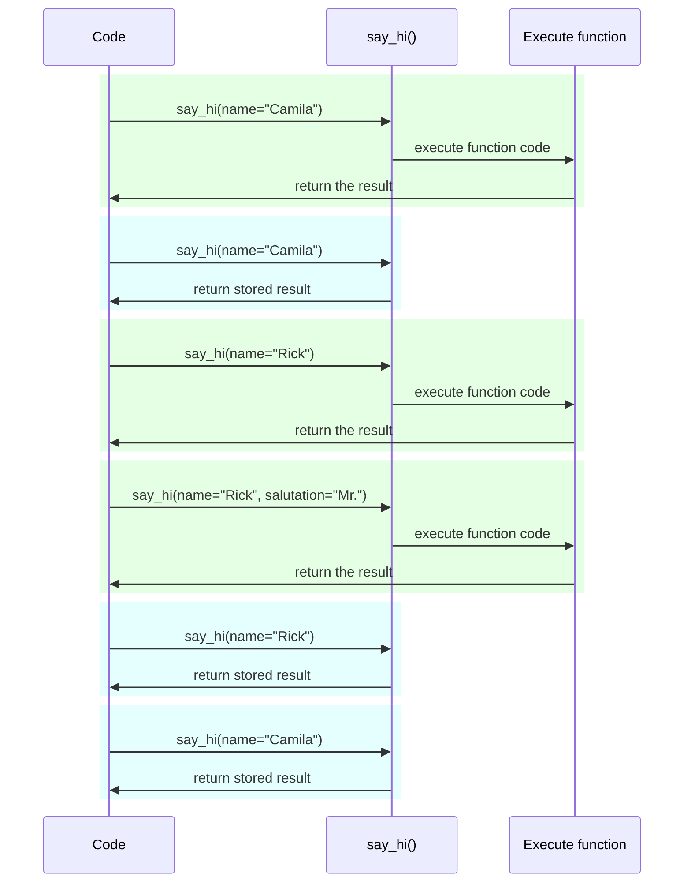

# Настройки и переменные окружения { #settings-and-environment-variables }

Во многих случаях вашему приложению могут понадобиться внешние настройки или конфигурации, например секретные ключи, учетные данные для базы данных, учетные данные для email‑сервисов и т.д.

Большинство таких настроек являются изменяемыми (могут меняться), например URL базы данных. И многие из них могут быть «чувствительными», например секреты.

По этой причине обычно их передают через переменные окружения, которые считываются приложением.

/// tip | Совет

Чтобы понять, что такое переменные окружения, вы можете прочитать [Переменные окружения](../environment-variables.md){.internal-link target=_blank}.

///

## Типы и валидация { #types-and-validation }

Переменные окружения могут содержать только текстовые строки, так как они внешние по отношению к Python и должны быть совместимы с другими программами и остальной системой (и даже с разными операционными системами, такими как Linux, Windows, macOS).

Это означает, что любое значение, прочитанное в Python из переменной окружения, будет `str`, а любые преобразования к другим типам или любая валидация должны выполняться в коде.

## Pydantic `Settings` { #pydantic-settings }

К счастью, Pydantic предоставляет отличную утилиту для работы с этими настройками, поступающими из переменных окружения, — <a href="https://docs.pydantic.dev/latest/concepts/pydantic_settings/" class="external-link" target="_blank">Pydantic: управление настройками</a>.

### Установка `pydantic-settings` { #install-pydantic-settings }

Сначала убедитесь, что вы создали [виртуальное окружение](../virtual-environments.md){.internal-link target=_blank}, активировали его, а затем установили пакет `pydantic-settings`:

<div class="termy">

```console
$ pip install pydantic-settings
---> 100%
```

</div>

Он также включен при установке набора `all` с:

<div class="termy">

```console
$ pip install "fastapi[all]"
---> 100%
```

</div>

/// info | Информация

В Pydantic v1 он входил в основной пакет. Теперь он распространяется как отдельный пакет, чтобы вы могли установить его только при необходимости.

///

### Создание объекта `Settings` { #create-the-settings-object }

Импортируйте `BaseSettings` из Pydantic и создайте подкласс, очень похожий на Pydantic‑модель.

Аналогично Pydantic‑моделям, вы объявляете атрибуты класса с аннотациями типов и, при необходимости, значениями по умолчанию.

Вы можете использовать все те же возможности валидации и инструменты, что и для Pydantic‑моделей, например разные типы данных и дополнительную валидацию через `Field()`.

//// tab | Pydantic v2

{* ../../docs_src/settings/tutorial001.py hl[2,5:8,11] *}

////

//// tab | Pydantic v1

/// info | Информация

В Pydantic v1 вы бы импортировали `BaseSettings` напрямую из `pydantic`, а не из `pydantic_settings`.

///

{* ../../docs_src/settings/tutorial001_pv1.py hl[2,5:8,11] *}

////

/// tip | Совет

Если вам нужно что-то быстро скопировать и вставить, не используйте этот пример — воспользуйтесь последним ниже.

///

Затем, когда вы создаете экземпляр этого класса `Settings` (в нашем случае объект `settings`), Pydantic прочитает переменные окружения регистронезависимо, то есть переменная в верхнем регистре `APP_NAME` будет прочитана для атрибута `app_name`.

Далее он преобразует и провалидирует данные. Поэтому при использовании объекта `settings` вы получите данные тех типов, которые объявили (например, `items_per_user` будет `int`).

### Использование `settings` { #use-the-settings }

Затем вы можете использовать новый объект `settings` в вашем приложении:

{* ../../docs_src/settings/tutorial001.py hl[18:20] *}

### Запуск сервера { #run-the-server }

Далее вы можете запустить сервер, передав конфигурации через переменные окружения. Например, можно задать `ADMIN_EMAIL` и `APP_NAME` так:

<div class="termy">

```console
$ ADMIN_EMAIL="deadpool@example.com" APP_NAME="ChimichangApp" fastapi run main.py

<span style="color: green;">INFO</span>:     Uvicorn running on http://127.0.0.1:8000 (Press CTRL+C to quit)
```

</div>

/// tip | Совет

Чтобы задать несколько переменных окружения для одной команды, просто разделяйте их пробелами и укажите все перед командой.

///

Тогда параметр `admin_email` будет установлен в `"deadpool@example.com"`.

`app_name` будет `"ChimichangApp"`.

А `items_per_user` сохранит значение по умолчанию `50`.

## Настройки в другом модуле { #settings-in-another-module }

Вы можете вынести эти настройки в другой модуль, как показано в разделе [Большие приложения — несколько файлов](../tutorial/bigger-applications.md){.internal-link target=_blank}.

Например, у вас может быть файл `config.py` со следующим содержимым:

{* ../../docs_src/settings/app01/config.py *}

А затем использовать его в файле `main.py`:

{* ../../docs_src/settings/app01/main.py hl[3,11:13] *}

/// tip | Совет

Вам также понадобится файл `__init__.py`, как в разделе [Большие приложения — несколько файлов](../tutorial/bigger-applications.md){.internal-link target=_blank}.

///

## Настройки как зависимость { #settings-in-a-dependency }

Иногда может быть полезно предоставлять настройки через зависимость, вместо глобального объекта `settings`, используемого повсюду.

Это особенно удобно при тестировании, так как очень легко переопределить зависимость своими настройками.

### Файл конфигурации { #the-config-file }

Продолжая предыдущий пример, ваш файл `config.py` может выглядеть так:

{* ../../docs_src/settings/app02/config.py hl[10] *}

Обратите внимание, что теперь мы не создаем экземпляр по умолчанию `settings = Settings()`.

### Основной файл приложения { #the-main-app-file }

Теперь мы создаем зависимость, которая возвращает новый `config.Settings()`.

{* ../../docs_src/settings/app02_an_py39/main.py hl[6,12:13] *}

/// tip | Совет

Скоро мы обсудим `@lru_cache`.

Пока можно считать, что `get_settings()` — это обычная функция.

///

Затем мы можем запросить ее в *функции-обработчике пути* как зависимость и использовать там, где нужно.

{* ../../docs_src/settings/app02_an_py39/main.py hl[17,19:21] *}

### Настройки и тестирование { #settings-and-testing }

Далее будет очень просто предоставить другой объект настроек во время тестирования, создав переопределение зависимости для `get_settings`:

{* ../../docs_src/settings/app02/test_main.py hl[9:10,13,21] *}

В переопределении зависимости мы задаем новое значение `admin_email` при создании нового объекта `Settings`, а затем возвращаем этот новый объект.

После этого можно протестировать, что он используется.

## Чтение файла `.env` { #reading-a-env-file }

Если у вас много настроек, которые могут часто меняться, возможно в разных окружениях, может быть удобно поместить их в файл и читать оттуда как переменные окружения.

Эта практика достаточно распространена и имеет название: такие переменные окружения обычно размещают в файле `.env`, а сам файл называют «dotenv».

/// tip | Совет

Файл, начинающийся с точки (`.`), является скрытым в системах, подобных Unix, таких как Linux и macOS.

Но файл dotenv не обязательно должен иметь именно такое имя.

///

Pydantic поддерживает чтение таких файлов с помощью внешней библиотеки. Подробнее вы можете прочитать здесь: <a href="https://docs.pydantic.dev/latest/concepts/pydantic_settings/#dotenv-env-support" class="external-link" target="_blank">Pydantic Settings: поддержка Dotenv (.env)</a>.

/// tip | Совет

Чтобы это работало, вам нужно `pip install python-dotenv`.

///

### Файл `.env` { #the-env-file }

У вас может быть файл `.env` со следующим содержимым:

```bash
ADMIN_EMAIL="deadpool@example.com"
APP_NAME="ChimichangApp"
```

### Чтение настроек из `.env` { #read-settings-from-env }

Затем обновите ваш `config.py` так:

//// tab | Pydantic v2

{* ../../docs_src/settings/app03_an/config.py hl[9] *}

/// tip | Совет

Атрибут `model_config` используется только для конфигурации Pydantic. Подробнее см. <a href="https://docs.pydantic.dev/latest/concepts/config/" class="external-link" target="_blank">Pydantic: Concepts: Configuration</a>.

///

////

//// tab | Pydantic v1

{* ../../docs_src/settings/app03_an/config_pv1.py hl[9:10] *}

/// tip | Совет

Класс `Config` используется только для конфигурации Pydantic. Подробнее см. <a href="https://docs.pydantic.dev/1.10/usage/model_config/" class="external-link" target="_blank">Pydantic Model Config</a>.

///

////

/// info | Информация

В Pydantic версии 1 конфигурация задавалась во внутреннем классе `Config`, в Pydantic версии 2 — в атрибуте `model_config`. Этот атрибут принимает `dict`, и чтобы получить автозавершение и ошибки «на лету», вы можете импортировать и использовать `SettingsConfigDict` для описания этого `dict`.

///

Здесь мы задаем параметр конфигурации `env_file` внутри вашего класса Pydantic `Settings` и устанавливаем значение равным имени файла dotenv, который хотим использовать.

### Создание `Settings` только один раз с помощью `lru_cache` { #creating-the-settings-only-once-with-lru-cache }

Чтение файла с диска обычно затратная (медленная) операция, поэтому, вероятно, вы захотите сделать это один раз и затем переиспользовать один и тот же объект настроек, а не читать файл при каждом запросе.

Но каждый раз, когда мы делаем:

```Python
Settings()
```

создается новый объект `Settings`, и при создании он снова считывает файл `.env`.

Если бы функция зависимости была такой:

```Python
def get_settings():
    return Settings()
```

мы бы создавали этот объект для каждого запроса и читали файл `.env` на каждый запрос. ⚠️

Но так как мы используем декоратор `@lru_cache` сверху, объект `Settings` будет создан только один раз — при первом вызове. ✔️

{* ../../docs_src/settings/app03_an_py39/main.py hl[1,11] *}

Затем при любых последующих вызовах `get_settings()` в зависимостях для следующих запросов, вместо выполнения внутреннего кода `get_settings()` и создания нового объекта `Settings`, будет возвращаться тот же объект, что был возвращен при первом вызове, снова и снова.

#### Технические детали `lru_cache` { #lru-cache-technical-details }

`@lru_cache` модифицирует декорируемую функцию так, что она возвращает то же значение, что и в первый раз, вместо повторного вычисления, то есть вместо выполнения кода функции каждый раз.

Таким образом, функция под декоратором будет выполнена один раз для каждой комбинации аргументов. Затем значения, возвращенные для каждой из этих комбинаций, будут использоваться снова и снова при вызове функции с точно такой же комбинацией аргументов.

Например, если у вас есть функция:

```Python
@lru_cache
def say_hi(name: str, salutation: str = "Ms."):
    return f"Hello {salutation} {name}"
```

ваша программа может выполняться так:



В случае нашей зависимости `get_settings()` функция вообще не принимает аргументов, поэтому она всегда возвращает одно и то же значение.

Таким образом, она ведет себя почти как глобальная переменная. Но так как используется функция‑зависимость, мы можем легко переопределить ее для тестирования.

`@lru_cache` — часть `functools`, что входит в стандартную библиотеку Python. Подробнее можно прочитать в <a href="https://docs.python.org/3/library/functools.html#functools.lru_cache" class="external-link" target="_blank">документации Python по `@lru_cache`</a>.

## Итоги { #recap }

Вы можете использовать Pydantic Settings для управления настройками и конфигурациями вашего приложения с полной мощью Pydantic‑моделей.

* Используя зависимость, вы упрощаете тестирование.
* Можно использовать файлы `.env`.
* `@lru_cache` позволяет не читать файл dotenv снова и снова для каждого запроса, при этом давая возможность переопределять его во время тестирования.
