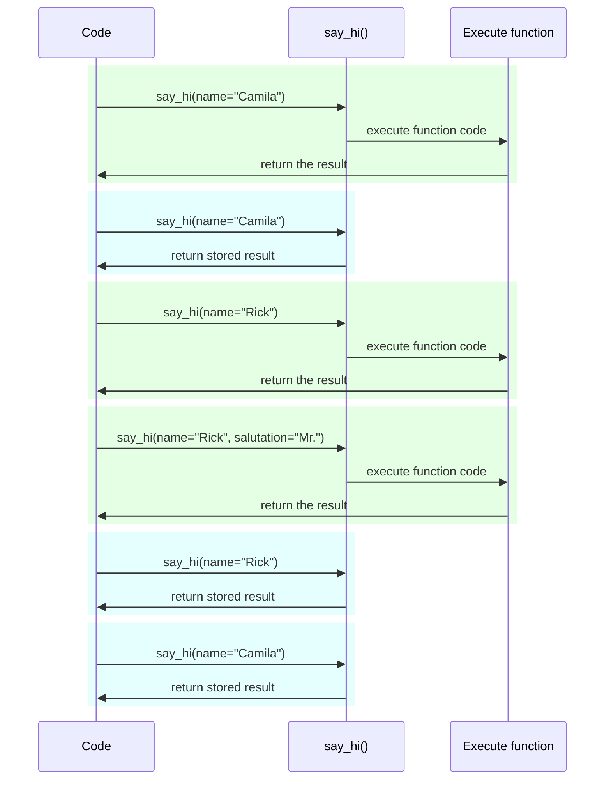

# Настройки и переменные окружения

Во многих случаях вашему приложению могут потребоваться внешние настройки или конфигурации, например, секретные ключи, учетные данные для базы данных, учетные данные для сервисов электронной почты и так далее.

Большинство из этих настроек переменные (могут изменяться), как, например, URL базы данных. И многие могут быть конфиденциальными, как секреты.

По этой причине их обычно предоставляют в переменных окружения, которые считываются приложением.

/// tip | Совет

Чтобы понять переменные окружения, вы можете прочитать [Переменные окружения](../environment-variables.md){.internal-link target=_blank}.

///

## Типы и валидация

Эти переменные окружения могут обрабатывать только текстовые строки, так как они находятся вне Python и должны быть совместимы с другими программами и остальной системой (и даже с различными операционными системами, такими как Linux, Windows, macOS).

Это значит, что любое значение, считанное в Python из переменной окружения, будет `str`, и любая конвертация в другой тип или любая валидация должна выполняться в коде.

## Pydantic `Settings`

К счастью, Pydantic предоставляет отличную утилиту для работы с этими настройками, поступающими из переменных окружения, с помощью <a href="https://docs.pydantic.dev/latest/concepts/pydantic_settings/" class="external-link" target="_blank">Pydantic: Управление настройками</a>.

### Установка `pydantic-settings`

Сначала убедитесь, что вы создали свое [виртуальное окружение](../virtual-environments.md){.internal-link target=_blank}, активировали его, а затем установили пакет `pydantic-settings`:

<div class="termy">

```console
$ pip install pydantic-settings
---> 100%
```

</div>

Он также включен при установке `all`-дополнений с:

<div class="termy">

```console
$ pip install "fastapi[all]"
---> 100%
```

</div>

/// info | Информация

В Pydantic v1 он был включен в основной пакет. Теперь он распространяется как независимый пакет, чтобы вы могли выбрать, устанавливать его или нет, если вам эта функциональность не нужна.

///

### Создание объекта `Settings`

Импортируйте `BaseSettings` из Pydantic и создайте подкласс, аналогично модели Pydantic.

Так же, как с моделями Pydantic, вы объявляете атрибуты класса с аннотациями типов и, возможно, значениями по умолчанию.

Вы можете использовать все те же функции и инструменты валидации, что и для моделей Pydantic, такие как различные типы данных и дополнительные проверки с помощью `Field()`.

//// tab | Pydantic v2

{* ../../docs_src/settings/tutorial001.py hl[2,5:8,11] *}

////

//// tab | Pydantic v1

/// info | Информация

В Pydantic v1 вы бы импортировали `BaseSettings` непосредственно из `pydantic` вместо `pydantic_settings`.

///

{* ../../docs_src/settings/tutorial001_pv1.py hl[2,5:8,11] *}

////

/// tip | Совет

Если вы хотите что-то быстрое для копирования и вставки, не используйте этот пример, воспользуйтесь последним ниже.

///

Затем, когда вы создадите экземпляр этого класса `Settings` (в данном случае в объекте `settings`), Pydantic будет читать переменные окружения без учета регистра, так что переменная в верхнем регистре `APP_NAME` будет прочитана для атрибута `app_name`.

Затем он преобразует и проверит данные. Таким образом, когда вы используете этот объект `settings`, у вас будут данные тех типов, которые вы объявили (например, `items_per_user` будет `int`).

### Использование `settings`

Затем вы можете использовать новый объект `settings` в вашем приложении:

{* ../../docs_src/settings/tutorial001.py hl[18:20] *}

### Запуск сервера

Затем вы бы запустили сервер, передавая конфигурации в качестве переменных окружения, например, вы могли бы установить `ADMIN_EMAIL` и `APP_NAME` с помощью:

<div class="termy">

```console
$ ADMIN_EMAIL="deadpool@example.com" APP_NAME="ChimichangApp" fastapi run main.py

<span style="color: green;">INFO</span>:     Uvicorn running on http://127.0.0.1:8000 (Press CTRL+C to quit)
```

</div>

/// tip | Совет

Чтобы установить несколько переменных окружения для одной команды, просто разделите их пробелом и укажите все перед командой.

///

И затем `admin_email` будет установлен на `"deadpool@example.com"`.

`app_name` будет `"ChimichangApp"`.

А `items_per_user` сохранит свое значение по умолчанию `50`.

## Настройки в другом модуле

Вы можете поместить эти настройки в другом файле модуля, как вы видели в [Большие приложения - Несколько файлов](../tutorial/bigger-applications.md){.internal-link target=_blank}.

Например, у вас может быть файл `config.py` с:

{* ../../docs_src/settings/app01/config.py *}

А затем использовать в файле `main.py`:

{* ../../docs_src/settings/app01/main.py hl[3,11:13] *}

/// tip | Совет

Вам также понадобится файл `__init__.py`, как вы видели в [Большие приложения - Несколько файлов](../tutorial/bigger-applications.md){.internal-link target=_blank}.

///

## Настройки в зависимости

В некоторых случаях может быть полезно предоставлять настройки из зависимости, вместо того, чтобы иметь глобальный объект с `settings`, который используется везде.

Это может быть особенно полезно во время тестирования, поскольку очень легко переопределить зависимость с вашими собственными настраиваемыми настройками.

### Файл конфигурации

Из предыдущего примера, ваш файл `config.py` может выглядеть так:

{* ../../docs_src/settings/app02/config.py hl[10] *}

Обратите внимание, что теперь мы не создаем экземпляр по умолчанию `settings = Settings()`.

### Основной файл приложения

Теперь мы создаем зависимость, которая возвращает новый `config.Settings()`.

{* ../../docs_src/settings/app02_an_py39/main.py hl[6,12:13] *}

/// tip | Совет

Мы обсудим `@lru_cache` немного позже.

Пока что вы можете предположить, что `get_settings()` — это обычная функция.

///

И затем мы можем требовать его из функции обработчика *path operation* в качестве зависимости и использовать его везде, где это необходимо.

{* ../../docs_src/settings/app02_an_py39/main.py hl[17,19:21] *}

### Настройки и тестирование

Затем будет очень легко предоставить другой объект настроек во время тестирования, создав переопределение зависимости для `get_settings`:

{* ../../docs_src/settings/app02/test_main.py hl[9:10,13,21] *}

В переопределении зависимости мы устанавливаем новое значение для `admin_email` при создании нового объекта `Settings`, а затем возвращаем этот новый объект.

Затем мы можем протестировать, что он используется.

## Чтение файла `.env`

Если у вас много настроек, которые, возможно, часто меняются, может быть полезно поместить их в файл и затем считать их как переменные окружения.

Эта практика настолько распространена, что у нее есть название, эти переменные окружения обычно размещаются в файл `.env`, и файл называется "dotenv".

/// tip | Совет

Файл, начинающийся с точки (`.`), является скрытым файлом в системах, подобных Unix, таких как Linux и macOS.

Но на самом деле файл с настройками dotenv не обязательно должен иметь такое имя.

///

Pydantic поддерживает чтение из этих типов файлов с использованием внешней библиотеки. Вы можете узнать больше на <a href="https://docs.pydantic.dev/latest/concepts/pydantic_settings/#dotenv-env-support" class="external-link" target="_blank">Pydantic Settings: Dotenv (.env) support</a>.

/// tip | Совет

Для этого нужно `pip install python-dotenv`.

///

### Файл `.env`

Вы могли бы иметь файл `.env` с:

```bash
ADMIN_EMAIL="deadpool@example.com"
APP_NAME="ChimichangApp"
```

### Чтение настроек из `.env`

А затем обновите ваш `config.py` с:

//// tab | Pydantic v2

{* ../../docs_src/settings/app03_an/config.py hl[9] *}

/// tip | Совет

Атрибут `model_config` используется только для конфигурации Pydantic. Вы можете прочитать больше на <a href="https://docs.pydantic.dev/latest/concepts/config/" class="external-link" target="_blank">Pydantic: Concepts: Configuration</a>.

///

////

//// tab | Pydantic v1

{* ../../docs_src/settings/app03_an/config_pv1.py hl[9:10] *}

/// tip | Совет

Класс `Config` используется только для конфигурации Pydantic. Вы можете прочитать больше на <a href="https://docs.pydantic.dev/1.10/usage/model_config/" class="external-link" target="_blank">Pydantic Model Config</a>.

///

////

/// info | Информация

В версии Pydantic 1 настройка осуществлялась во внутреннем классе `Config`, в версии Pydantic 2 это делается в атрибуте `model_config`. Этот атрибут принимает `dict`, и чтобы получить автозаполнение и inline ошибки, вы можете импортировать и использовать `SettingsConfigDict` для определения этой `dict`.

///

Здесь мы определяем конфигурацию `env_file` внутри класса Pydantic `Settings` и устанавливаем значение на имя файла с файлом dotenv, который мы хотим использовать.

### Создание `Settings` только один раз с помощью `lru_cache`

Чтение файла с диска обычно является затратной (медленной) операцией, поэтому вы, вероятно, захотите делать это только один раз, а затем повторно использовать тот же объект настроек, вместо того, чтобы считывать его для каждого запроса.

Но каждый раз, когда мы делаем:

```Python
Settings()
```

будет создаваться новый объект `Settings`, и при создании он будет снова читать файл `.env`.

Если бы функция зависимости была следующей:

```Python
def get_settings():
    return Settings()
```

мы бы создавали этот объект для каждого запроса и читали бы файл `.env` для каждого запроса. ⚠️

Но поскольку мы используем декоратор `@lru_cache` сверху, объект `Settings` будет создан только один раз, первый раз когда вызывается. ✔️

{* ../../docs_src/settings/app03_an_py39/main.py hl[1,11] *}

Затем для любых последующих вызовов `get_settings()` в зависимостях для следующих запросов, вместо выполнения внутреннего кода `get_settings()` и создания нового объекта `Settings`, он будет возвращать тот же объект, который был возвращен при первом вызове, снова и снова.

#### Технические подробности `lru_cache`

`@lru_cache` модифицирует функцию, которую он декорирует, чтобы возвращать то же значение, которое было возвращено в первый раз, вместо того, чтобы вычислять его заново, выполняя код функции каждый раз.

Таким образом, функция ниже будет выполняться один раз для каждой комбинации аргументов. А затем значения, возвращенные каждой из этих комбинаций аргументов, будут использоваться снова и снова, когда функция вызывается с точно такой же комбинацией аргументов.

Например, если у вас есть функция:

```Python
@lru_cache
def say_hi(name: str, salutation: str = "Ms."):
    return f"Hello {salutation} {name}"
```

ваша программа может выполняться следующим образом:



В случае нашей зависимости `get_settings()`, функция даже не принимает никаких аргументов, поэтому она всегда возвращает одно и то же значение.

Таким образом, она ведет себя почти так, как если бы это была просто глобальная переменная. Но поскольку она использует функцию-зависимость, мы можем легко переопределить ее для тестирования.

`@lru_cache` является частью `functools`, который является частью стандартной библиотеки Python, вы можете прочитать больше об этом в <a href="https://docs.python.org/3/library/functools.html#functools.lru_cache" class="external-link" target="_blank">документации Python для `@lru_cache`</a>.

## Резюме

Вы можете использовать Pydantic Settings для обработки настроек или конфигураций вашего приложения, с всей мощью моделей Pydantic.

* С помощью зависимости вы можете упростить тестирование.
* Вы можете использовать `.env` файлы вместе с ним.
* Использование `@lru_cache` позволяет избежать повторного чтения dotenv файла для каждого запроса, при этом позволяя его переопределение во время тестирования.
