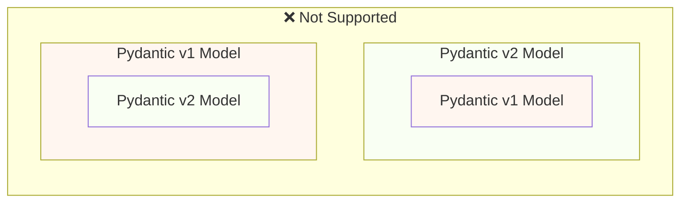
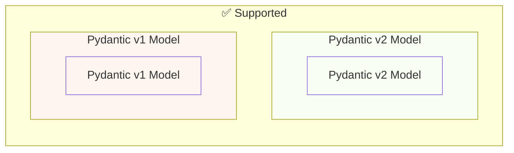

# Миграция с Pydantic v1 на Pydantic v2 { #migrate-from-pydantic-v1-to-pydantic-v2 }

Если у вас старое приложение FastAPI, возможно, вы используете Pydantic версии 1.

FastAPI версии 0.100.0 поддерживал либо Pydantic v1, либо v2. Он использовал ту версию, которая была установлена.

FastAPI версии 0.119.0 добавил частичную поддержку Pydantic v1 изнутри Pydantic v2 (как `pydantic.v1`), чтобы упростить миграцию на v2.

FastAPI 0.126.0 убрал поддержку Pydantic v1, при этом ещё некоторое время продолжал поддерживать `pydantic.v1`.

/// warning | Предупреждение

Команда Pydantic прекратила поддержку Pydantic v1 для последних версий Python, начиная с **Python 3.14**.

Это включает `pydantic.v1`, который больше не поддерживается в Python 3.14 и выше.

Если вы хотите использовать последние возможности Python, вам нужно убедиться, что вы используете Pydantic v2.

///

Если у вас старое приложение FastAPI с Pydantic v1, здесь я покажу, как мигрировать на Pydantic v2, и **возможности FastAPI 0.119.0**, которые помогут выполнить постепенную миграцию.

## Официальное руководство { #official-guide }

У Pydantic есть официальное [руководство по миграции](https://docs.pydantic.dev/latest/migration/) с v1 на v2.

Там также описано, что изменилось, как валидации стали более корректными и строгими, возможные нюансы и т.д.

Прочитайте его, чтобы лучше понять, что изменилось.

## Тесты { #tests }

Убедитесь, что у вас есть [тесты](../tutorial/testing.md) для вашего приложения и что вы запускаете их в системе непрерывной интеграции (CI).

Так вы сможете выполнить обновление и убедиться, что всё работает как ожидается.

## `bump-pydantic` { #bump-pydantic }

Во многих случаях, когда вы используете обычные Pydantic‑модели без пользовательских настроек, вы сможете автоматизировать большую часть процесса миграции с Pydantic v1 на Pydantic v2.

Вы можете использовать [`bump-pydantic`](https://github.com/pydantic/bump-pydantic) от той же команды Pydantic.

Этот инструмент поможет автоматически изменить большую часть кода, который нужно изменить.

После этого вы можете запустить тесты и проверить, что всё работает. Если да — на этом всё. 😎

## Pydantic v1 в v2 { #pydantic-v1-in-v2 }

Pydantic v2 включает всё из Pydantic v1 как подмодуль `pydantic.v1`. Но это больше не поддерживается в версиях Python выше 3.13.

Это означает, что вы можете установить последнюю версию Pydantic v2 и импортировать и использовать старые компоненты Pydantic v1 из этого подмодуля так, как если бы у вас был установлен старый Pydantic v1.

{* ../../docs_src/pydantic_v1_in_v2/tutorial001_an_py310.py hl[1,4] *}

### Поддержка FastAPI для Pydantic v1 внутри v2 { #fastapi-support-for-pydantic-v1-in-v2 }

Начиная с FastAPI 0.119.0, есть также частичная поддержка Pydantic v1 изнутри Pydantic v2, чтобы упростить миграцию на v2.

Таким образом, вы можете обновить Pydantic до последней версии 2 и сменить импорты на подмодуль `pydantic.v1` — во многих случаях всё просто заработает.

{* ../../docs_src/pydantic_v1_in_v2/tutorial002_an_py310.py hl[2,5,15] *}

/// warning | Предупреждение

Имейте в виду, что так как команда Pydantic больше не поддерживает Pydantic v1 в последних версиях Python, начиная с Python 3.14, использование `pydantic.v1` также не поддерживается в Python 3.14 и выше.

///

### Pydantic v1 и v2 в одном приложении { #pydantic-v1-and-v2-on-the-same-app }

В Pydantic **не поддерживается** ситуация, когда в одной модели Pydantic v2 используются поля, определённые как модели Pydantic v1, и наоборот.

…но в одном и том же приложении вы можете иметь отдельные модели на Pydantic v1 и v2.

В некоторых случаях можно использовать и модели Pydantic v1, и v2 в одной и той же **операции пути** (обработчике пути) вашего приложения FastAPI:

{* ../../docs_src/pydantic_v1_in_v2/tutorial003_an_py310.py hl[2:3,6,12,21:22] *}

В примере выше модель входных данных — это модель Pydantic v1, а модель выходных данных (указанная в `response_model=ItemV2`) — это модель Pydantic v2.

### Параметры Pydantic v1 { #pydantic-v1-parameters }

Если вам нужно использовать некоторые специфичные для FastAPI инструменты для параметров, такие как `Body`, `Query`, `Form` и т.п., с моделями Pydantic v1, вы можете импортировать их из `fastapi.temp_pydantic_v1_params`, пока завершаете миграцию на Pydantic v2:

{* ../../docs_src/pydantic_v1_in_v2/tutorial004_an_py310.py hl[4,18] *}

### Мигрируйте по шагам { #migrate-in-steps }

/// tip | Совет

Сначала попробуйте `bump-pydantic`: если тесты проходят и всё работает, вы справились одной командой. ✨

///

Если `bump-pydantic` не подходит для вашего случая, вы можете использовать поддержку одновременной работы моделей Pydantic v1 и v2 в одном приложении, чтобы мигрировать на Pydantic v2 постепенно.

Сначала вы можете обновить Pydantic до последней 2-й версии и изменить импорты так, чтобы все ваши модели использовали `pydantic.v1`.

Затем вы можете начать мигрировать ваши модели с Pydantic v1 на v2 группами, поэтапно. 🚶
