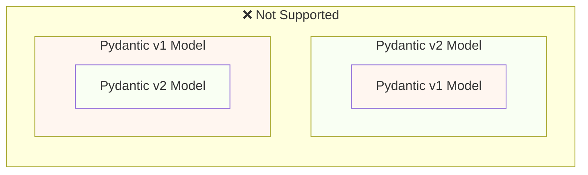
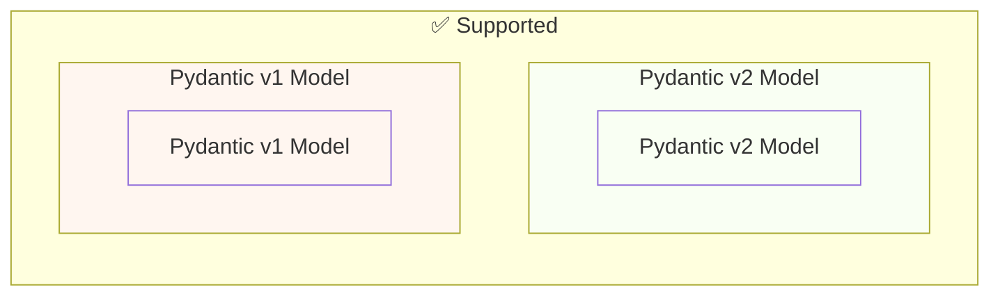

# Миграция с Pydantic v1 на Pydantic v2 { #migrate-from-pydantic-v1-to-pydantic-v2 }

Если у вас старое приложение FastAPI, возможно, вы используете Pydantic версии 1.

FastAPI поддерживает и Pydantic v1, и v2 начиная с версии 0.100.0.

Если у вас был установлен Pydantic v2, использовался он. Если вместо этого был установлен Pydantic v1 — использовался он.

Сейчас Pydantic v1 объявлен устаревшим, и поддержка его будет удалена в следующих версиях FastAPI, поэтому вам следует **перейти на Pydantic v2**. Так вы получите последние возможности, улучшения и исправления.

/// warning | Предупреждение

Кроме того, команда Pydantic прекратила поддержку Pydantic v1 для последних версий Python, начиная с **Python 3.14**.

Если вы хотите использовать последние возможности Python, вам нужно убедиться, что вы используете Pydantic v2.

///

Если у вас старое приложение FastAPI с Pydantic v1, здесь я покажу, как мигрировать на Pydantic v2, и **новые возможности в FastAPI 0.119.0**, которые помогут выполнить постепенную миграцию.

## Официальное руководство { #official-guide }

У Pydantic есть официальное <a href="https://docs.pydantic.dev/latest/migration/" class="external-link" target="_blank">руководство по миграции</a> с v1 на v2.

Там также описано, что изменилось, как валидации стали более корректными и строгими, возможные нюансы и т.д.

Прочитайте его, чтобы лучше понять, что изменилось.

## Тесты { #tests }

Убедитесь, что у вас есть [тесты](../tutorial/testing.md){.internal-link target=_blank} для вашего приложения и что вы запускаете их в системе непрерывной интеграции (CI).

Так вы сможете выполнить обновление и убедиться, что всё работает как ожидается.

## `bump-pydantic` { #bump-pydantic }

Во многих случаях, когда вы используете обычные Pydantic‑модели без пользовательских настроек, вы сможете автоматизировать большую часть процесса миграции с Pydantic v1 на Pydantic v2.

Вы можете использовать <a href="https://github.com/pydantic/bump-pydantic" class="external-link" target="_blank">`bump-pydantic`</a> от той же команды Pydantic.

Этот инструмент поможет автоматически внести большую часть необходимых изменений в код.

После этого запустите тесты и проверьте, что всё работает. Если да — на этом всё. 😎

## Pydantic v1 в v2 { #pydantic-v1-in-v2 }

Pydantic v2 включает всё из Pydantic v1 как подмодуль `pydantic.v1`.

Это означает, что вы можете установить последнюю версию Pydantic v2 и импортировать и использовать старые компоненты Pydantic v1 из этого подмодуля так, как если бы у вас был установлен старый Pydantic v1.

{* ../../docs_src/pydantic_v1_in_v2/tutorial001_an_py310.py hl[1,4] *}

### Поддержка FastAPI для Pydantic v1 внутри v2 { #fastapi-support-for-pydantic-v1-in-v2 }

Начиная с FastAPI 0.119.0, есть также частичная поддержка Pydantic v1 в составе Pydantic v2, чтобы упростить миграцию на v2.

Таким образом, вы можете обновить Pydantic до последней версии 2 и сменить импорты на подмодуль `pydantic.v1` — во многих случаях всё просто заработает.

{* ../../docs_src/pydantic_v1_in_v2/tutorial002_an_py310.py hl[2,5,15] *}

/// warning | Предупреждение

Имейте в виду, что так как команда Pydantic больше не поддерживает Pydantic v1 в последних версиях Python, начиная с Python 3.14, использование `pydantic.v1` также не поддерживается в Python 3.14 и выше.

///

### Pydantic v1 и v2 в одном приложении { #pydantic-v1-and-v2-on-the-same-app }

В Pydantic **не поддерживается** ситуация, когда в одной модели Pydantic v2 используются поля, определённые как модели Pydantic v1, и наоборот.

```mermaid
graph TB
    subgraph "❌ Not Supported"
        direction TB
        subgraph V2["Pydantic v2 Model"]
            V1Field["Pydantic v1 Model"]
        end
        subgraph V1["Pydantic v1 Model"]
            V2Field["Pydantic v2 Model"]
        end
    end

    style V2 fill:#f9fff3
    style V1 fill:#fff6f0
    style V1Field fill:#fff6f0
    style V2Field fill:#f9fff3
```

…но в одном и том же приложении вы можете иметь отдельные модели на Pydantic v1 и v2.

```mermaid
graph TB
    subgraph "✅ Supported"
        direction TB
        subgraph V2["Pydantic v2 Model"]
            V2Field["Pydantic v2 Model"]
        end
        subgraph V1["Pydantic v1 Model"]
            V1Field["Pydantic v1 Model"]
        end
    end

    style V2 fill:#f9fff3
    style V1 fill:#fff6f0
    style V1Field fill:#fff6f0
    style V2Field fill:#f9fff3
```

В некоторых случаях можно использовать и модели Pydantic v1, и v2 в одной и той же операции пути (обработчике пути) вашего приложения FastAPI:

{* ../../docs_src/pydantic_v1_in_v2/tutorial003_an_py310.py hl[2:3,6,12,21:22] *}

В примере выше модель входных данных — это модель Pydantic v1, а модель выходных данных (указанная в `response_model=ItemV2`) — это модель Pydantic v2.

### Параметры Pydantic v1 { #pydantic-v1-parameters }

Если вам нужно использовать некоторые специфичные для FastAPI инструменты для параметров, такие как `Body`, `Query`, `Form` и т.п., с моделями Pydantic v1, вы можете импортировать их из `fastapi.temp_pydantic_v1_params`, пока завершаете миграцию на Pydantic v2:

{* ../../docs_src/pydantic_v1_in_v2/tutorial004_an_py310.py hl[4,18] *}

### Мигрируйте по шагам { #migrate-in-steps }

/// tip | Совет

Сначала попробуйте `bump-pydantic`. Если тесты проходят и всё работает, вы справились одной командой. ✨

///

Если `bump-pydantic` не подходит для вашего случая, вы можете использовать поддержку одновременной работы моделей Pydantic v1 и v2 в одном приложении, чтобы мигрировать на Pydantic v2 постепенно.

Сначала обновите Pydantic до последней 2-й версии и измените импорты так, чтобы все ваши модели использовали `pydantic.v1`.

Затем начните мигрировать ваши модели с Pydantic v1 на v2 группами, поэтапно. 🚶
