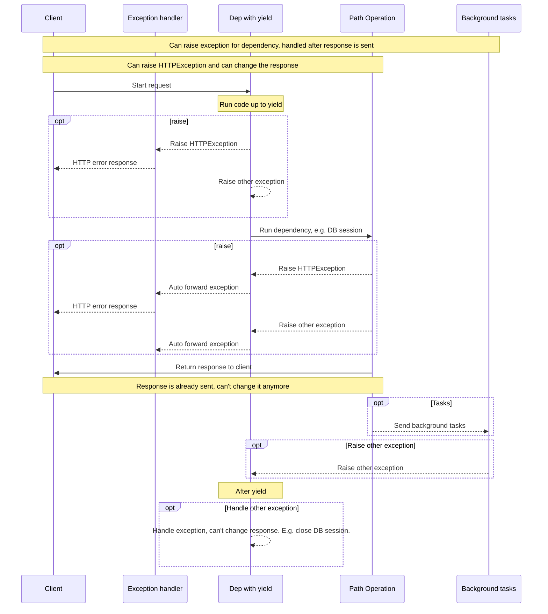

# Зависимости с yield

FastAPI поддерживает зависимости, которые выполняют некоторые <abbr title='также известные как "exit", "cleanup", "teardown", "close", "context managers", ...'>дополнительные действия после завершения работы</abbr>.

Для этого используйте `yield` вместо `return`, а дополнительный код напишите после него.

/// tip | "Подсказка"

Обязательно используйте `yield` один-единственный раз.

///

/// note | "Технические детали"

Любая функция, с которой может работать:

* <a href="https://docs.python.org/3/library/contextlib.html#contextlib.contextmanager" class="external-link" target="_blank">`@contextlib.contextmanager`</a> или
* <a href="https://docs.python.org/3/library/contextlib.html#contextlib.asynccontextmanager" class="external-link" target="_blank">`@contextlib.asynccontextmanager`</a>

будет корректно использоваться в качестве **FastAPI**-зависимости.

На самом деле, FastAPI использует эту пару декораторов "под капотом".

///

## Зависимость базы данных с помощью `yield`

Например, с его помощью можно создать сессию работы с базой данных и закрыть его после завершения.

Перед созданием ответа будет выполнен только код до и включая `yield`.

```Python hl_lines="2-4"
{!../../../docs_src/dependencies/tutorial007.py!}
```

Полученное значение и есть то, что будет внедрено в функцию операции пути и другие зависимости:

```Python hl_lines="4"
{!../../../docs_src/dependencies/tutorial007.py!}
```

Код, следующий за оператором `yield`, выполняется после доставки ответа:

```Python hl_lines="5-6"
{!../../../docs_src/dependencies/tutorial007.py!}
```

/// tip | "Подсказка"

Можно использовать как `async` так и обычные функции.

**FastAPI** это корректно обработает, и в обоих случаях будет делать то же самое, что и с обычными зависимостями.

///

## Зависимость с `yield` и `try` одновременно

Если использовать блок `try` в зависимости с `yield`, то будет получено всякое исключение, которое было выброшено при использовании зависимости.

Например, если какой-то код в какой-то момент в середине, в другой зависимости или в *функции операции пути*, сделал "откат" транзакции базы данных или создал любую другую ошибку, то вы получите исключение в своей зависимости.

Таким образом, можно искать конкретное исключение внутри зависимости с помощью `except SomeException`.

Таким же образом можно использовать `finally`, чтобы убедиться, что обязательные шаги при выходе выполнены, независимо от того, было ли исключение или нет.

```Python hl_lines="3  5"
{!../../../docs_src/dependencies/tutorial007.py!}
```

## Подзависимости с `yield`

Вы можете иметь подзависимости и "деревья" подзависимостей любого размера и формы, и любая из них или все они могут использовать `yield`.

**FastAPI** будет следить за тем, чтобы "код по выходу" в каждой зависимости с `yield` выполнялся в правильном порядке.

Например, `dependency_c` может иметь зависимость от `dependency_b`, а `dependency_b` от `dependency_a`:

//// tab | Python 3.9+

```Python hl_lines="6  14  22"
{!> ../../../docs_src/dependencies/tutorial008_an_py39.py!}
```

////

//// tab | Python 3.6+

```Python hl_lines="5  13  21"
{!> ../../../docs_src/dependencies/tutorial008_an.py!}
```

////

//// tab | Python 3.6+ без Annotated

/// tip | "Подсказка"

Предпочтительнее использовать версию с аннотацией, если это возможно.

///

```Python hl_lines="4  12  20"
{!> ../../../docs_src/dependencies/tutorial008.py!}
```

////

И все они могут использовать `yield`.

В этом случае `dependency_c` для выполнения своего кода выхода нуждается в том, чтобы значение из `dependency_b` (здесь `dep_b`) было еще доступно.

И, в свою очередь, `dependency_b` нуждается в том, чтобы значение из `dependency_a` (здесь `dep_a`) было доступно для ее завершающего кода.

//// tab | Python 3.9+

```Python hl_lines="18-19  26-27"
{!> ../../../docs_src/dependencies/tutorial008_an_py39.py!}
```

////

//// tab | Python 3.6+

```Python hl_lines="17-18  25-26"
{!> ../../../docs_src/dependencies/tutorial008_an.py!}
```

////

//// tab | Python 3.6+ без Annotated

/// tip | "Подсказка"

Предпочтительнее использовать версию с аннотацией, если это возможно.

///

```Python hl_lines="16-17  24-25"
{!> ../../../docs_src/dependencies/tutorial008.py!}
```

////

Точно так же можно иметь часть зависимостей с `yield`, часть с `return`, и какие-то из них могут зависеть друг от друга.

Либо у вас может быть одна зависимость, которая требует несколько других зависимостей с `yield` и т.д.

Комбинации зависимостей могут быть какими вам угодно.

**FastAPI** проследит за тем, чтобы все выполнялось в правильном порядке.

/// note | "Технические детали"

Это работает благодаря <a href="https://docs.python.org/3/library/contextlib.html" class="external-link" target="_blank">Контекстным менеджерам</a> в Python.

///

   **FastAPI** использует их "под капотом" с этой целью.

## Зависимости с `yield` и `HTTPException`

Вы видели, что можно использовать зависимости с `yield` совместно с блоком `try`, отлавливающие исключения.

Таким же образом вы можете поднять исключение `HTTPException` или что-то подобное в завершающем коде, после `yield`.

Код выхода в зависимостях с `yield` выполняется *после* отправки ответа, поэтому [Обработчик исключений](../handling-errors.md#install-custom-exception-handlers){.internal-link target=_blank} уже будет запущен. В коде выхода (после `yield`) нет ничего, перехватывающего исключения, брошенные вашими зависимостями.

Таким образом, если после `yield` возникает `HTTPException`, то стандартный (или любой пользовательский) обработчик исключений, который перехватывает `HTTPException` и возвращает ответ HTTP 400, уже не сможет перехватить это исключение.

Благодаря этому все, что установлено в зависимости (например, сеанс работы с БД), может быть использовано, например, фоновыми задачами.

Фоновые задачи выполняются *после* отправки ответа. Поэтому нет возможности поднять `HTTPException`, так как нет даже возможности изменить уже отправленный ответ.

Но если фоновая задача создает ошибку в БД, то, по крайней мере, можно сделать откат или чисто закрыть сессию в зависимости с помощью `yield`, а также, возможно, занести ошибку в журнал или сообщить о ней в удаленную систему отслеживания.

Если у вас есть код, который, как вы знаете, может вызвать исключение, сделайте самую обычную/"питонячью" вещь и добавьте блок `try` в этот участок кода.

Если у вас есть пользовательские исключения, которые вы хотите обрабатывать *до* возврата ответа и, возможно, модифицировать ответ, даже вызывая `HTTPException`, создайте [Cобственный обработчик исключений](../handling-errors.md#install-custom-exception-handlers){.internal-link target=_blank}.

/// tip | "Подсказка"

Вы все еще можете вызывать исключения, включая `HTTPException`, *до* `yield`. Но не после.

///

Последовательность выполнения примерно такая, как на этой схеме. Время течет сверху вниз. А каждый столбец - это одна из частей, взаимодействующих с кодом или выполняющих код.



/// info | "Дополнительная информация"

Клиенту будет отправлен только **один ответ**. Это может быть один из ответов об ошибке или это будет ответ от *операции пути*.

После отправки одного из этих ответов никакой другой ответ не может быть отправлен.

///

/// tip | "Подсказка"

На этой диаграмме показано "HttpException", но вы также можете вызвать любое другое исключение, для которого вы создаете [Пользовательский обработчик исключений](../handling-errors.md#install-custom-exception-handlers){.internal-link target=_blank}.

Если вы создадите какое-либо исключение, оно будет передано зависимостям с yield, включая `HttpException`, а затем **снова** обработчикам исключений. Если для этого исключения нет обработчика исключений, то оно будет обработано внутренним "ServerErrorMiddleware" по умолчанию, возвращающим код состояния HTTP 500, чтобы уведомить клиента, что на сервере произошла ошибка.

///

## Зависимости с `yield`, `HTTPException` и фоновыми задачами

/// warning | "Внимание"

Скорее всего, вам не нужны эти технические подробности, вы можете пропустить этот раздел и продолжить ниже.

Эти подробности полезны, главным образом, если вы использовали версию FastAPI до 0.106.0 и использовали ресурсы из зависимостей с `yield` в фоновых задачах.

///

До версии FastAPI 0.106.0 вызывать исключения после `yield` было невозможно, код выхода в зависимостях с `yield` выполнялся *после* отправки ответа, поэтому [Обработчик Ошибок](../handling-errors.md#install-custom-exception-handlers){.internal-link target=_blank} уже был бы запущен.

Это было сделано главным образом для того, чтобы позволить использовать те же объекты, "отданные" зависимостями, внутри фоновых задач, поскольку код выхода будет выполняться после завершения фоновых задач.

Тем не менее, поскольку это означало бы ожидание ответа в сети, а также ненужное удержание ресурса в зависимости от доходности (например, соединение с базой данных), это было изменено в FastAPI 0.106.0.

/// tip | "Подсказка"

Кроме того, фоновая задача обычно представляет собой независимый набор логики, который должен обрабатываться отдельно, со своими собственными ресурсами (например, собственным подключением к базе данных).
Таким образом, вы, вероятно, получите более чистый код.

///

Если вы полагались на это поведение, то теперь вам следует создавать ресурсы для фоновых задач внутри самой фоновой задачи, а внутри использовать только те данные, которые не зависят от ресурсов зависимостей с `yield`.

Например, вместо того чтобы использовать ту же сессию базы данных, вы создадите новую сессию базы данных внутри фоновой задачи и будете получать объекты из базы данных с помощью этой новой сессии. А затем, вместо того чтобы передавать объект из базы данных в качестве параметра в функцию фоновой задачи, вы передадите идентификатор этого объекта, а затем снова получите объект в функции фоновой задачи.

## Контекстные менеджеры

### Что такое "контекстные менеджеры"

"Контекстные менеджеры" - это любые объекты Python, которые можно использовать в операторе `with`.

Например, <a href="https://docs.python.org/3/tutorial/inputoutput.html#reading-and-writing-files" class="external-link" target="_blank">можно использовать `with` для чтения файла</a>:

```Python
with open("./somefile.txt") as f:
    contents = f.read()
    print(contents)
```

Под капотом" open("./somefile.txt") создаёт объект называемый "контекстным менеджером".

Когда блок `with` завершается, он обязательно закрывает файл, даже если были исключения.

Когда вы создаете зависимость с помощью `yield`, **FastAPI** внутренне преобразует ее в контекстный менеджер и объединяет с некоторыми другими связанными инструментами.

### Использование менеджеров контекста в зависимостях с помощью `yield`

/// warning | "Внимание"

Это более или менее "продвинутая" идея.

Если вы только начинаете работать с **FastAPI**, то лучше пока пропустить этот пункт.

///

В Python для создания менеджеров контекста можно <a href="https://docs.python.org/3/reference/datamodel.html#context-managers" class="external-link" target="_blank">создать класс с двумя методами: `__enter__()` и `__exit__()`</a>.

Вы также можете использовать их внутри зависимостей **FastAPI** с `yield`, используя операторы
`with` или `async with` внутри функции зависимости:

```Python hl_lines="1-9  13"
{!../../../docs_src/dependencies/tutorial010.py!}
```

/// tip | "Подсказка"

Другой способ создания контекстного менеджера - с помощью:

* <a href="https://docs.python.org/3/library/contextlib.html#contextlib.contextmanager" class="external-link" target="_blank">`@contextlib.contextmanager`</a> или
* <a href="https://docs.python.org/3/library/contextlib.html#contextlib.asynccontextmanager" class="external-link" target="_blank">`@contextlib.asynccontextmanager`</a>

используйте их для оформления функции с одним `yield`.

Это то, что **FastAPI** использует внутри себя для зависимостей с `yield`.

Но использовать декораторы для зависимостей FastAPI не обязательно (да и не стоит).

FastAPI сделает это за вас на внутреннем уровне.

///
