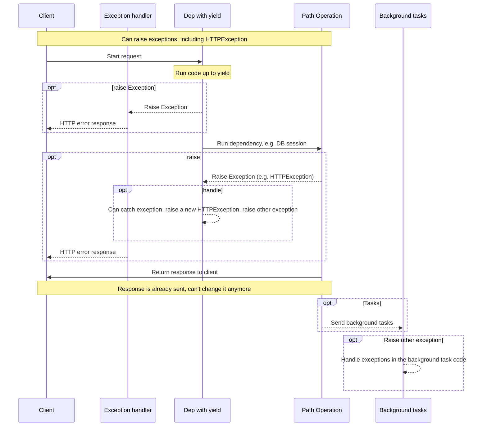
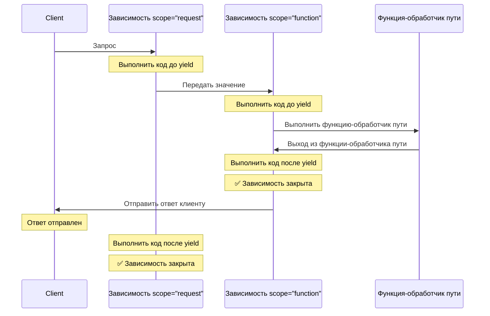

# Зависимости с yield { #dependencies-with-yield }

FastAPI поддерживает зависимости, которые выполняют некоторые <abbr title='иногда также называемые "exit code", "cleanup code", "teardown code", "closing code", "context manager exit code" и т.п.'>дополнительные шаги после завершения</abbr>.

Для этого используйте `yield` вместо `return`, а дополнительные шаги (код) напишите после него.

/// tip | Подсказка

Убедитесь, что используете `yield` только один раз на одну зависимость.

///

/// note | Технические детали

Любая функция, с которой можно корректно использовать:

* <a href="https://docs.python.org/3/library/contextlib.html#contextlib.contextmanager" class="external-link" target="_blank">`@contextlib.contextmanager`</a> или
* <a href="https://docs.python.org/3/library/contextlib.html#contextlib.asynccontextmanager" class="external-link" target="_blank">`@contextlib.asynccontextmanager`</a>

будет корректной для использования в качестве зависимости **FastAPI**.

На самом деле, FastAPI использует эти два декоратора внутренне.

///

## Зависимость базы данных с помощью `yield` { #a-database-dependency-with-yield }

Например, с его помощью можно создать сессию работы с базой данных и закрыть её после завершения.

Перед созданием ответа будет выполнен только код до и включая оператор `yield`:

{* ../../docs_src/dependencies/tutorial007.py hl[2:4] *}

Значение, полученное из `yield`, внедряется в *операции пути* и другие зависимости:

{* ../../docs_src/dependencies/tutorial007.py hl[4] *}

Код, следующий за оператором `yield`, выполняется после ответа:

{* ../../docs_src/dependencies/tutorial007.py hl[5:6] *}

/// tip | Подсказка

Можно использовать как `async`, так и обычные функции.

**FastAPI** корректно обработает каждый вариант, так же как и с обычными зависимостями.

///

## Зависимость с `yield` и `try` { #a-dependency-with-yield-and-try }

Если использовать блок `try` в зависимости с `yield`, то вы получите любое исключение, которое было выброшено при использовании зависимости.

Например, если какой-то код в какой-то момент в середине, в другой зависимости или в *операции пути*, сделал "откат" транзакции базы данных или создал любую другую ошибку, то вы получите это исключение в своей зависимости.

Таким образом, можно искать конкретное исключение внутри зависимости с помощью `except SomeException`.

Точно так же можно использовать `finally`, чтобы убедиться, что обязательные шаги при выходе выполнены независимо от того, было ли исключение или нет.

{* ../../docs_src/dependencies/tutorial007.py hl[3,5] *}

## Подзависимости с `yield` { #sub-dependencies-with-yield }

Вы можете иметь подзависимости и "деревья" подзависимостей любого размера и формы, и любая из них или все они могут использовать `yield`.

**FastAPI** проследит за тем, чтобы «код выхода» в каждой зависимости с `yield` выполнялся в правильном порядке.

Например, `dependency_c` может зависеть от `dependency_b`, а `dependency_b` — от `dependency_a`:

{* ../../docs_src/dependencies/tutorial008_an_py39.py hl[6,14,22] *}

И все они могут использовать `yield`.

В этом случае `dependency_c` для выполнения своего кода выхода нуждается в том, чтобы значение из `dependency_b` (здесь `dep_b`) всё ещё было доступно.

И, в свою очередь, `dependency_b` нуждается в том, чтобы значение из `dependency_a` (здесь `dep_a`) было доступно для её кода выхода.

{* ../../docs_src/dependencies/tutorial008_an_py39.py hl[18:19,26:27] *}

Точно так же можно иметь часть зависимостей с `yield`, часть — с `return`, и какие-то из них могут зависеть друг от друга.

Либо у вас может быть одна зависимость, которая требует несколько других зависимостей с `yield` и т.д.

Комбинации зависимостей могут быть какими угодно.

**FastAPI** проследит за тем, чтобы всё выполнялось в правильном порядке.

/// note | Технические детали

Это работает благодаря <a href="https://docs.python.org/3/library/contextlib.html" class="external-link" target="_blank">менеджерам контекста</a> в Python.

**FastAPI** использует их внутренне для достижения этого.

///

## Зависимости с `yield` и `HTTPException` { #dependencies-with-yield-and-httpexception }

Вы видели, что можно использовать зависимости с `yield` и иметь блоки `try`, которые пытаются выполнить некоторый код, а затем запускают код выхода в `finally`.

Также вы можете использовать `except`, чтобы поймать вызванное исключение и что-то с ним сделать.

Например, вы можете <abbr title="«raise» дословно - «поднять», но «вызвать», «сгенерировать» или «выбросить» употребляется чаще">вызвать</abbr> другое исключение, например `HTTPException`.

/// tip | Подсказка

Это довольно продвинутая техника, и в большинстве случаев она вам не понадобится, так как вы можете вызывать исключения (включая `HTTPException`) в остальном коде вашего приложения, например, в *функции-обработчике пути*.

Но если понадобится — возможность есть. 🤓

///

{* ../../docs_src/dependencies/tutorial008b_an_py39.py hl[18:22,31] *}

Если вы хотите перехватывать исключения и формировать на их основе пользовательский ответ, создайте [Пользовательский обработчик исключений](../handling-errors.md#install-custom-exception-handlers){.internal-link target=_blank}.

## Зависимости с `yield` и `except` { #dependencies-with-yield-and-except }

Если вы ловите исключение с помощью `except` в зависимости с `yield` и не вызываете его снова (или не вызываете новое исключение), FastAPI не сможет заметить, что было исключение — так же, как это происходит в обычном Python:

{* ../../docs_src/dependencies/tutorial008c_an_py39.py hl[15:16] *}

В этом случае клиент получит *HTTP 500 Internal Server Error*, как и должно быть, поскольку мы не вызываем `HTTPException` или что-то подобное, но на сервере **не будет никаких логов** или других указаний на то, какая была ошибка. 😱

### Всегда делайте `raise` в зависимостях с `yield` и `except` { #always-raise-in-dependencies-with-yield-and-except }

Если вы ловите исключение в зависимости с `yield`, то, если вы не вызываете другой `HTTPException` или что-то подобное, вам следует повторно вызвать исходное исключение.

Вы можете повторно вызвать то же самое исключение с помощью `raise`:

{* ../../docs_src/dependencies/tutorial008d_an_py39.py hl[17] *}

Теперь клиент получит тот же *HTTP 500 Internal Server Error*, но на сервере в логах будет наше пользовательское `InternalError`. 😎

## Выполнение зависимостей с `yield` { #execution-of-dependencies-with-yield }

Последовательность выполнения примерно такая, как на этой схеме. Время течёт сверху вниз. А каждый столбец — это одна из частей, взаимодействующих с кодом или выполняющих код.


```mermaid
sequenceDiagram

participant client as Client
participant handler as Exception handler
participant dep as Dep with yield
participant operation as Path Operation
participant tasks as Background tasks

    Note over client,operation: Can raise exceptions, including HTTPException
    client ->> dep: Start request
    Note over dep: Run code up to yield
    opt raise Exception
        dep -->> handler: Raise Exception
        handler -->> client: HTTP error response
    end
    dep ->> operation: Run dependency, e.g. DB session
    opt raise
        operation -->> dep: Raise Exception (e.g. HTTPException)
        opt handle
            dep -->> dep: Can catch exception, raise a new HTTPException, raise other exception
        end
        handler -->> client: HTTP error response
    end

    operation ->> client: Return response to client
    Note over client,operation: Response is already sent, can't change it anymore
    opt Tasks
        operation -->> tasks: Send background tasks
    end
    opt Raise other exception
        tasks -->> tasks: Handle exceptions in the background task code
    end
```

/// info | Дополнительная информация

Клиенту будет отправлен только **один ответ**. Это может быть один из ответов об ошибке или ответ от *операции пути*.

После отправки одного из этих ответов никакой другой ответ отправить нельзя.

///

/// tip | Подсказка

Если вы вызовете какое-либо исключение в коде из *функции-обработчика пути*, оно будет передано зависимостям с `yield`, включая `HTTPException`. В большинстве случаев вы захотите повторно вызвать то же самое исключение или новое из зависимости с `yield`, чтобы убедиться, что оно корректно обработано.

///

## Ранний выход и `scope` { #early-exit-and-scope }

Обычно «код выхода» зависимостей с `yield` выполняется **после того, как ответ** отправлен клиенту.

Но если вы знаете, что не будете использовать зависимость после возврата из *функции-обработчика пути*, вы можете использовать `Depends(scope="function")`, чтобы сообщить FastAPI, что он должен закрыть зависимость после возврата из *функции-обработчика пути*, но **до того**, как **ответ будет отправлен**.

{* ../../docs_src/dependencies/tutorial008e_an_py39.py hl[12,16] *}

`Depends()` принимает параметр `scope`, который может быть:

* `"function"`: начать зависимость до *функции-обработчика пути*, которая обрабатывает запрос, завершить зависимость после окончания *функции-обработчика пути*, но **до того**, как ответ будет отправлен обратно клиенту. То есть функция зависимости будет выполнена **вокруг** *функции-обработчика пути*.
* `"request"`: начать зависимость до *функции-обработчика пути*, которая обрабатывает запрос (как и при использовании `"function"`), но завершить **после** того, как ответ будет отправлен обратно клиенту. То есть функция зависимости будет выполнена **вокруг** цикла запроса (**request**) и ответа.

Если не указано и в зависимости есть `yield`, по умолчанию будет `scope` со значением `"request"`.

### `scope` для подзависимостей { #scope-for-sub-dependencies }

Когда вы объявляете зависимость с `scope="request"` (значение по умолчанию), любая подзависимость также должна иметь `scope` равный `"request"`.

Но зависимость со `scope` равным `"function"` может иметь зависимости со `scope` `"function"` и со `scope` `"request"`.

Это потому, что любая зависимость должна иметь возможность выполнить свой код выхода раньше подзависимостей, так как ей может понадобиться использовать их во время своего кода выхода.


```mermaid
sequenceDiagram

participant client as Client
participant dep_req as Зависимость scope="request"
participant dep_func as Зависимость scope="function"
participant operation as Функция-обработчик пути

    client ->> dep_req: Запрос
    Note over dep_req: Выполнить код до yield
    dep_req ->> dep_func: Передать значение
    Note over dep_func: Выполнить код до yield
    dep_func ->> operation: Выполнить функцию-обработчик пути
    operation ->> dep_func: Выход из функции-обработчика пути
    Note over dep_func: Выполнить код после yield
    Note over dep_func: ✅ Зависимость закрыта
    dep_func ->> client: Отправить ответ клиенту
    Note over client: Ответ отправлен
    Note over dep_req: Выполнить код после yield
    Note over dep_req: ✅ Зависимость закрыта
```

## Зависимости с `yield`, `HTTPException`, `except` и фоновыми задачами { #dependencies-with-yield-httpexception-except-and-background-tasks }

Зависимости с `yield` со временем эволюционировали, чтобы покрыть разные сценарии и исправить некоторые проблемы.

Если вы хотите посмотреть, что менялось в разных версиях FastAPI, вы можете прочитать об этом подробнее в продвинутом руководстве: [Продвинутые зависимости — зависимости с `yield`, `HTTPException`, `except` и фоновыми задачами](../../advanced/advanced-dependencies.md#dependencies-with-yield-httpexception-except-and-background-tasks){.internal-link target=_blank}.
## Контекстные менеджеры { #context-managers }

### Что такое «контекстные менеджеры» { #what-are-context-managers }

«Контекстные менеджеры» — это любые объекты Python, которые можно использовать в операторе `with`.

Например, <a href="https://docs.python.org/3/tutorial/inputoutput.html#reading-and-writing-files" class="external-link" target="_blank">можно использовать `with` для чтения файла</a>:

```Python
with open("./somefile.txt") as f:
    contents = f.read()
    print(contents)
```

Под капотом вызов `open("./somefile.txt")` создаёт объект, называемый «контекстным менеджером».

Когда блок `with` завершается, он обязательно закрывает файл, даже если были исключения.

Когда вы создаёте зависимость с `yield`, **FastAPI** внутренне создаёт для неё менеджер контекста и сочетает его с некоторыми другими связанными инструментами.

### Использование менеджеров контекста в зависимостях с `yield` { #using-context-managers-in-dependencies-with-yield }

/// warning | Внимание

Это, более или менее, «продвинутая» идея.

Если вы только начинаете работать с **FastAPI**, то лучше пока пропустить этот пункт.

///

В Python можно создавать менеджеры контекста, <a href="https://docs.python.org/3/reference/datamodel.html#context-managers" class="external-link" target="_blank">создав класс с двумя методами: `__enter__()` и `__exit__()`</a>.

Их также можно использовать внутри зависимостей **FastAPI** с `yield`, применяя операторы
`with` или `async with` внутри функции зависимости:

{* ../../docs_src/dependencies/tutorial010.py hl[1:9,13] *}

/// tip | Подсказка

Другой способ создания менеджера контекста — с помощью:

* <a href="https://docs.python.org/3/library/contextlib.html#contextlib.contextmanager" class="external-link" target="_blank">`@contextlib.contextmanager`</a> или
* <a href="https://docs.python.org/3/library/contextlib.html#contextlib.asynccontextmanager" class="external-link" target="_blank">`@contextlib.asynccontextmanager`</a>

оформив ими функцию с одним `yield`.

Именно это **FastAPI** использует внутренне для зависимостей с `yield`.

Но использовать эти декораторы для зависимостей FastAPI не обязательно (и не стоит).

FastAPI сделает это за вас на внутреннем уровне.

///
