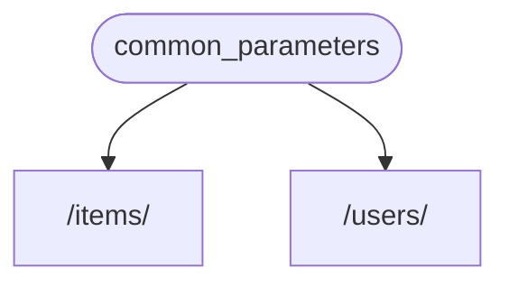

# Зависимости

**FastAPI** имеет очень мощную и интуитивную систему **<abbr title="also known as components, resources, providers, services, injectables">Dependency Injection</abbr>**.

Она проектировалась таким образом, чтобы быть простой в использовании и облегчить любому разработчику интеграцию других компонентов с **FastAPI**.

## Что такое "Dependency Injection" (инъекция зависимости)

**"Dependency Injection"** в программировании означает, что у вашего кода (в данном случае, вашей *функции обработки пути*) есть способы объявить вещи, которые запрашиваются для работы и использования: "зависимости".

И потом эта система (в нашем случае **FastAPI**) организует всё, что требуется, чтобы обеспечить ваш код этой зависимостью (сделать "инъекцию" зависимости).

Это очень полезно, когда вам нужно:

* Обеспечить общую логику (один и тот же алгоритм снова и снова).
* Общее соединение с базой данных.
* Обеспечение безопасности, аутентификации, запроса роли и т.п.
* И многое другое.

Всё это минимизирует повторение кода.

## Первые шаги

Давайте рассмотрим очень простой пример. Он настолько простой, что на данный момент почти бесполезный.

Но таким способом мы можем сфокусироваться на том, как же всё таки работает система **Dependency Injection**.

### Создание зависимости или "зависимого"
Давайте для начала сфокусируемся на зависимостях.

Это просто функция, которая может принимать все те же параметры, что и *функции обработки пути*:
//// tab | Python 3.10+

```Python hl_lines="8-9"
{!> ../../../docs_src/dependencies/tutorial001_an_py310.py!}
```

////

//// tab | Python 3.9+

```Python hl_lines="8-11"
{!> ../../../docs_src/dependencies/tutorial001_an_py39.py!}
```

////

//// tab | Python 3.8+

```Python hl_lines="9-12"
{!> ../../../docs_src/dependencies/tutorial001_an.py!}
```

////

//// tab | Python 3.10+ non-Annotated

/// tip | "Подсказка"

Настоятельно рекомендуем использовать `Annotated` версию насколько это возможно.

///

```Python hl_lines="6-7"
{!> ../../../docs_src/dependencies/tutorial001_py310.py!}
```

////

//// tab | Python 3.8+ non-Annotated

/// tip | "Подсказка"

Настоятельно рекомендуем использовать `Annotated` версию насколько это возможно.

///

```Python hl_lines="8-11"
{!> ../../../docs_src/dependencies/tutorial001.py!}
```

////

**И всё.**

**2 строки.**

И теперь она той же формы и структуры, что и все ваши *функции обработки пути*.

Вы можете думать об *функции обработки пути* как о функции без "декоратора" (без `@app.get("/some-path")`).

И она может возвращать всё, что требуется.

В этом случае, эта зависимость ожидает:

* Необязательный query-параметр `q` с типом `str`
* Необязательный query-параметр `skip` с типом `int`, и значением по умолчанию `0`
* Необязательный query-параметр `limit` с типом `int`, и значением по умолчанию `100`

И в конце она возвращает `dict`, содержащий эти значения.

/// info | "Информация"

**FastAPI** добавил поддержку для `Annotated` (и начал её рекомендовать) в версии 0.95.0.

 Если у вас более старая версия, будут ошибки при попытке использовать `Annotated`.

Убедитесь, что вы [Обновили FastAPI версию](../../deployment/versions.md#fastapi_2){.internal-link target=_blank} до, как минимум 0.95.1, перед тем как использовать `Annotated`.

///

### Import `Depends`

//// tab | Python 3.10+

```Python hl_lines="3"
{!> ../../../docs_src/dependencies/tutorial001_an_py310.py!}
```

////

//// tab | Python 3.9+

```Python hl_lines="3"
{!> ../../../docs_src/dependencies/tutorial001_an_py39.py!}
```

////

//// tab | Python 3.8+

```Python hl_lines="3"
{!> ../../../docs_src/dependencies/tutorial001_an.py!}
```

////

//// tab | Python 3.10+ non-Annotated

/// tip | "Подсказка"

Настоятельно рекомендуем использовать `Annotated` версию насколько это возможно.

///

```Python hl_lines="1"
{!> ../../../docs_src/dependencies/tutorial001_py310.py!}
```

////

//// tab | Python 3.8+ non-Annotated

/// tip | "Подсказка"

Настоятельно рекомендуем использовать `Annotated` версию насколько это возможно.

///

```Python hl_lines="3"
{!> ../../../docs_src/dependencies/tutorial001.py!}
```

////

### Объявите зависимость в "зависимом"

Точно так же, как вы использовали `Body`, `Query` и т.д. с вашей *функцией обработки пути* для параметров, используйте `Depends` с новым параметром:

//// tab | Python 3.10+

```Python hl_lines="13  18"
{!> ../../../docs_src/dependencies/tutorial001_an_py310.py!}
```

////

//// tab | Python 3.9+

```Python hl_lines="15  20"
{!> ../../../docs_src/dependencies/tutorial001_an_py39.py!}
```

////

//// tab | Python 3.8+

```Python hl_lines="16  21"
{!> ../../../docs_src/dependencies/tutorial001_an.py!}
```

////

//// tab | Python 3.10+ non-Annotated

/// tip | "Подсказка"

Настоятельно рекомендуем использовать `Annotated` версию насколько это возможно.

///

```Python hl_lines="11  16"
{!> ../../../docs_src/dependencies/tutorial001_py310.py!}
```

////

//// tab | Python 3.8+ non-Annotated

/// tip | "Подсказка"

Настоятельно рекомендуем использовать `Annotated` версию насколько это возможно.

///

```Python hl_lines="15  20"
{!> ../../../docs_src/dependencies/tutorial001.py!}
```

////

`Depends` работает немного иначе. Вы передаёте в `Depends` одиночный параметр, который будет похож на функцию.

Вы **не вызываете его** на месте (не добавляете скобочки в конце: 👎 *your_best_func()*👎), просто передаёте как параметр в `Depends()`.

И потом функция берёт параметры так же, как *функция обработки пути*.

/// tip | "Подсказка"

В следующей главе вы увидите, какие другие вещи, помимо функций, можно использовать в качестве зависимостей.

///

Каждый раз, когда новый запрос приходит, **FastAPI** позаботится о:

* Вызове вашей зависимости ("зависимого") функции с корректными параметрами.
* Получении результата из вашей функции.
* Назначении результата в параметр в вашей *функции обработки пути*.



Таким образом, вы пишете общий код один раз, и **FastAPI** позаботится о его вызове для ваших *операций с путями*.

/// check | "Проверка"

Обратите внимание, что вы не создаёте специальный класс и не передаёте его куда-то в **FastAPI** для регистрации, или что-то в этом роде.

Вы просто передаёте это в `Depends`, и **FastAPI** знает, что делать дальше.

///

## Объединяем с `Annotated` зависимостями

В приведенном выше примере есть небольшое **повторение кода**.

Когда вам нужно использовать `common_parameters()` зависимость, вы должны написать весь параметр с аннотацией типов и `Depends()`:

```Python
commons: Annotated[dict, Depends(common_parameters)]
```

Но потому что мы используем `Annotated`,  мы можем хранить `Annotated` значение в переменной и использовать его в нескольких местах:

//// tab | Python 3.10+

```Python hl_lines="12  16  21"
{!> ../../../docs_src/dependencies/tutorial001_02_an_py310.py!}
```

////

//// tab | Python 3.9+

```Python hl_lines="14  18  23"
{!> ../../../docs_src/dependencies/tutorial001_02_an_py39.py!}
```

////

//// tab | Python 3.8+

```Python hl_lines="15  19  24"
{!> ../../../docs_src/dependencies/tutorial001_02_an.py!}
```

////

/// tip | "Подсказка"

Это стандартный синтаксис python и называется "type alias", это не особенность **FastAPI**.

Но потому что **FastAPI** базируется на стандартах Python,  включая `Annotated`, вы можете использовать этот трюк в вашем коде. 😎

///

Зависимости продолжат работу как ожидалось, и **лучшая часть** в том, что **информация о типе будет сохранена**. Это означает, что ваш редактор кода будет корректно обрабатывать **автодополнения**, **встроенные ошибки** и так далее. То же самое относится и к инструментам, таким как `mypy`.

Это очень полезно, когда вы интегрируете это в **большую кодовую базу**, используя **одинаковые зависимости** снова и снова во **многих** ***операциях пути***.

## Использовать `async` или не `async`

Для зависимостей, вызванных **FastAPI** (то же самое, что и ваши *функции обработки пути*), те же правила, что приняты для определения ваших функций.

Вы можете использовать `async def` или обычное `def`.

Вы также можете объявить зависимости с `async def` внутри обычной `def` *функции обработки пути*, или `def` зависимости внутри `async def` *функции обработки пути*, и так далее.

Это всё не важно. **FastAPI** знает, что нужно сделать. 😎

/// note | "Информация"

Если вам эта тема не знакома, прочтите [Async: *"In a hurry?"*](../../async.md){.internal-link target=_blank} раздел о `async` и `await` в документации.

///

## Интеграция с OpenAPI

Все заявления о запросах, валидаторы, требования ваших зависимостей (и подзависимостей) будут интегрированы в соответствующую OpenAPI-схему.

В интерактивной документации будет вся информация по этим зависимостям тоже:


## Простое использование

Если вы посмотрите на фото, *функция обработки пути* объявляется каждый раз, когда вычисляется путь, и тогда **FastAPI** позаботится о вызове функции с корректными параметрами, извлекая информацию из запроса.

На самом деле, все (или большинство) веб-фреймворков работают по схожему сценарию.

Вы никогда не вызываете эти функции на месте. Их вызовет ваш фреймворк (в нашем случае, **FastAPI**).

С системой Dependency Injection, вы можете сообщить **FastAPI**, что ваша *функция обработки пути* "зависит" от чего-то ещё, что должно быть извлечено перед вашей *функцией обработки пути*, и **FastAPI** позаботится об извлечении и инъекции результата.

Другие распространённые термины для описания схожей идеи "dependency injection" являются:

- ресурсность
- доставка
- сервисность
- инъекция
- компонентность

## **FastAPI** подключаемые модули

Инъекции и модули могут быть построены с использованием системы **Dependency Injection**. Но на самом деле, **нет необходимости создавать новые модули**, просто используя зависимости, можно объявить бесконечное количество интеграций и взаимодействий, которые доступны вашей *функции обработки пути*.

И зависимости могут быть созданы очень простым и интуитивным способом, что позволяет вам просто импортировать нужные пакеты Python и интегрировать их в API функции за пару строк.

Вы увидите примеры этого в следующих главах о реляционных и NoSQL базах данных, безопасности и т.д.

## Совместимость с **FastAPI**

Простота Dependency Injection делает **FastAPI** совместимым с:

- всеми реляционными базами данных
- NoSQL базами данных
- внешними пакетами
- внешними API
- системами авторизации, аутентификации
- системами мониторинга использования API
- системами ввода данных ответов
- и так далее.

## Просто и сильно

Хотя иерархическая система Dependency Injection очень проста для описания и использования, она по-прежнему очень мощная.

Вы можете описывать зависимости в очередь, и они уже будут вызываться друг за другом.

Когда иерархическое дерево построено, система **Dependency Injection** берет на себя решение всех зависимостей для вас (и их подзависимостей) и обеспечивает (инъектирует) результат на каждом шаге.

Например, у вас есть 4 API-эндпоинта (*операции пути*):

- `/items/public/`
- `/items/private/`
- `/users/{user_id}/activate`
- `/items/pro/`

Тогда вы можете требовать разные права для каждого из них, используя зависимости и подзависимости:


## Интегрировано с **OpenAPI**

Все эти зависимости, объявляя свои требования, также добавляют параметры, проверки и т.д. к вашим операциям *path*.

**FastAPI** позаботится о добавлении всего этого в схему открытого API, чтобы это отображалось в системах интерактивной документации.
