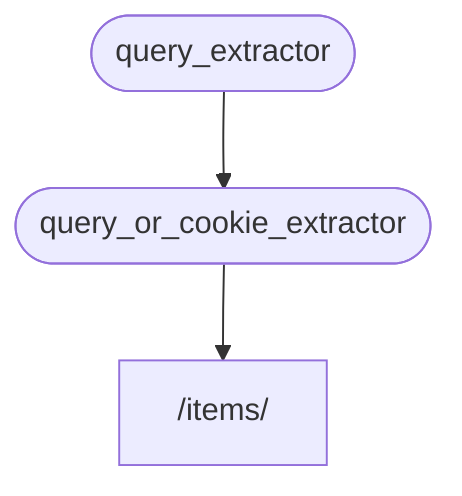

# Подзависимости { #sub-dependencies }

Вы можете создавать зависимости, которые имеют **подзависимости**.

Их **вложенность** может быть любой глубины.

**FastAPI** сам займётся их управлением.

## Первая зависимость { #first-dependency-dependable }

Можно создать первую зависимость следующим образом:

{* ../../docs_src/dependencies/tutorial005_an_py310.py hl[8:9] *}

Она объявляет необязательный параметр запроса `q` как строку, а затем возвращает его.

Это довольно просто (хотя и не очень полезно), но поможет нам сосредоточиться на том, как работают подзависимости.

## Вторая зависимость, «зависимость» и «зависимая» { #second-dependency-dependable-and-dependant }

Затем можно создать еще одну функцию зависимости, которая одновременно объявляет свою собственную зависимость (таким образом, она тоже является «зависимой»):

{* ../../docs_src/dependencies/tutorial005_an_py310.py hl[13] *}

Остановимся на объявленных параметрах:

* Несмотря на то, что эта функция сама является зависимостью, она также является зависимой от чего-то другого.
    * Она зависит от `query_extractor` и присваивает возвращаемое ей значение параметру `q`.
* Она также объявляет необязательный куки-параметр `last_query` в виде строки.
    * Если пользователь не указал параметр `q` в запросе, то мы используем последний использованный запрос, который мы ранее сохранили в куки-параметре `last_query`.

## Использование зависимости { #use-the-dependency }

Затем мы можем использовать зависимость вместе с:

{* ../../docs_src/dependencies/tutorial005_an_py310.py hl[23] *}

/// info | Дополнительная информация

Обратите внимание, что мы объявляем только одну зависимость в *функции операции пути* - `query_or_cookie_extractor`.

Но **FastAPI** будет знать, что сначала он должен выполнить `query_extractor`, чтобы передать результаты этого в `query_or_cookie_extractor` при его вызове.

///



## Использование одной и той же зависимости несколько раз { #using-the-same-dependency-multiple-times }

Если одна из ваших зависимостей объявлена несколько раз для одной и той же *функции операции пути*, например, несколько зависимостей имеют общую подзависимость, **FastAPI** будет знать, что вызывать эту подзависимость нужно только один раз за запрос.

При этом возвращаемое значение будет сохранено в <abbr title="Система для хранения значений, сгенерированных компьютером, для их повторного использования вместо повторного вычисления.">"кэш"</abbr> и будет передано всем "зависимым" функциям, которые нуждаются в нем внутри этого конкретного запроса, вместо того, чтобы вызывать зависимость несколько раз для одного и того же запроса.

В расширенном сценарии, когда вы знаете, что вам нужно, чтобы зависимость вызывалась на каждом шаге (возможно, несколько раз) в одном и том же запросе, вместо использования "кэшированного" значения, вы можете установить параметр `use_cache=False` при использовании `Depends`:

//// tab | Python 3.8+

```Python hl_lines="1"
async def needy_dependency(fresh_value: Annotated[str, Depends(get_value, use_cache=False)]):
    return {"fresh_value": fresh_value}
```

////

//// tab | Python 3.8+ без Annotated

/// tip | Подсказка

Предпочтительнее использовать версию с аннотацией, если это возможно.

///

```Python hl_lines="1"
async def needy_dependency(fresh_value: str = Depends(get_value, use_cache=False)):
    return {"fresh_value": fresh_value}
```

////

## Резюме { #recap }

Помимо всех этих умных слов, используемых здесь, система внедрения зависимостей довольно проста.

Это просто функции, которые выглядят так же, как *функции операций путей*.

Но, тем не менее, эта система очень мощная и позволяет вам объявлять вложенные графы (деревья) зависимостей сколь угодно глубоко.

/// tip | Подсказка

Все это может показаться не столь полезным на этих простых примерах.

Но вы увидите как это пригодится в главах посвященных безопасности.

И вы также увидите, сколько кода это вам сэкономит.

///
