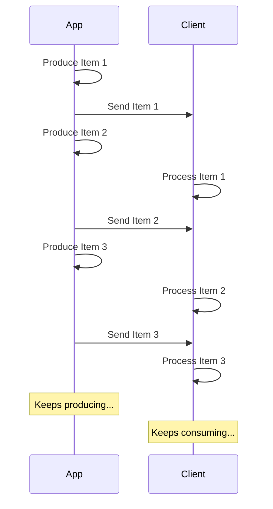

# Стриминг JSON Lines { #stream-json-lines }

У вас может быть последовательность данных, которую вы хотите отправлять в «**потоке**». Это можно сделать с помощью **JSON Lines**.

/// info | Информация

Добавлено в FastAPI 0.134.0.

///

## Что такое поток? { #what-is-a-stream }

«**Стриминг**» данных означает, что ваше приложение начнет отправлять элементы данных клиенту, не дожидаясь готовности всей последовательности.

То есть оно отправит первый элемент, клиент его получит и начнет обрабатывать, а вы в это время можете все еще генерировать следующий элемент.



Это может быть даже бесконечный поток, когда вы продолжаете отправлять данные.

## JSON Lines { #json-lines }

В таких случаях часто отправляют «**JSON Lines**», это формат, в котором отправляется по одному JSON-объекту на строку.

Ответ будет иметь тип содержимого `application/jsonl` (вместо `application/json`), а тело ответа будет примерно таким:

```json
{"name": "Plumbus", "description": "A multi-purpose household device."}
{"name": "Portal Gun", "description": "A portal opening device."}
{"name": "Meeseeks Box", "description": "A box that summons a Meeseeks."}
```

Это очень похоже на JSON-массив (эквивалент списка Python), но вместо того чтобы быть обернутым в `[]` и иметь `,` между элементами, здесь **один JSON-объект на строку**, они разделены символом новой строки.

/// info | Информация

Важный момент в том, что ваше приложение сможет по очереди производить каждую строку, пока клиент потребляет предыдущие строки.

///

/// note | Технические детали

Так как каждый JSON-объект будет разделен новой строкой, в их содержимом не могут быть буквальные символы новой строки, но могут быть экранированные переводы строк (`\n`), что входит в стандарт JSON.

Однако обычно об этом не нужно беспокоиться — всё делается автоматически, читайте дальше. 🤓

///

## Варианты использования { #use-cases }

Вы можете использовать это для стриминга данных из сервиса **AI LLM**, из **логов** или **телеметрии**, или из других типов данных, которые можно структурировать в элементы **JSON**.

/// tip | Совет

Если вы хотите стримить бинарные данные, например видео или аудио, посмотрите расширенное руководство: [Потоковая передача данных](../advanced/stream-data.md).

///

## Стриминг JSON Lines с FastAPI { #stream-json-lines-with-fastapi }

Чтобы стримить JSON Lines с FastAPI, вместо использования `return` в вашей *функции-обработчике пути* используйте `yield`, чтобы по очереди выдавать каждый элемент.

{* ../../docs_src/stream_json_lines/tutorial001_py310.py ln[1:24] hl[24] *}

Если каждый JSON-элемент, который вы хотите отправить обратно, имеет тип `Item` (Pydantic-модель), и это асинхронная функция, вы можете объявить тип возвращаемого значения как `AsyncIterable[Item]`:

{* ../../docs_src/stream_json_lines/tutorial001_py310.py ln[1:24] hl[9:11,22] *}

Если вы объявите тип возвращаемого значения, FastAPI будет использовать его, чтобы **валидировать** данные, **документировать** их в OpenAPI, **фильтровать** и **сериализовать** с помощью Pydantic.

/// tip | Совет

Так как Pydantic будет сериализовывать это на стороне **Rust**, вы получите значительно более высокую **производительность**, чем если бы вы не указывали тип возвращаемого значения.

///

### Неасинхронные функции-обработчики пути { #non-async-path-operation-functions }

Вы также можете использовать обычные функции `def` (без `async`) и использовать `yield` таким же образом.

FastAPI обеспечит корректное выполнение так, чтобы это не блокировало цикл событий.

Поскольку в этом случае функция не асинхронная, подходящим типом возвращаемого значения будет `Iterable[Item]`:

{* ../../docs_src/stream_json_lines/tutorial001_py310.py ln[27:30] hl[28] *}

### Без возвращаемого типа { #no-return-type }

Вы также можете опустить тип возвращаемого значения. Тогда FastAPI использует [`jsonable_encoder`](./encoder.md), чтобы преобразовать данные к виду, который можно сериализовать в JSON, и затем отправит их как JSON Lines.

{* ../../docs_src/stream_json_lines/tutorial001_py310.py ln[33:36] hl[34] *}

## События, отправляемые сервером (SSE) { #server-sent-events-sse }

FastAPI также имеет полноценную поддержку Server-Sent Events (SSE), которые довольно похожи, но с парой дополнительных деталей. Вы можете узнать о них в следующей главе: [События, отправляемые сервером (SSE)](server-sent-events.md). 🤓
