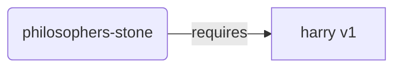
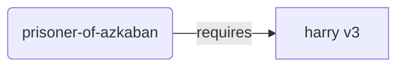
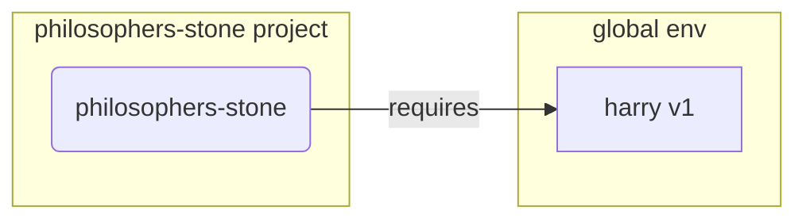
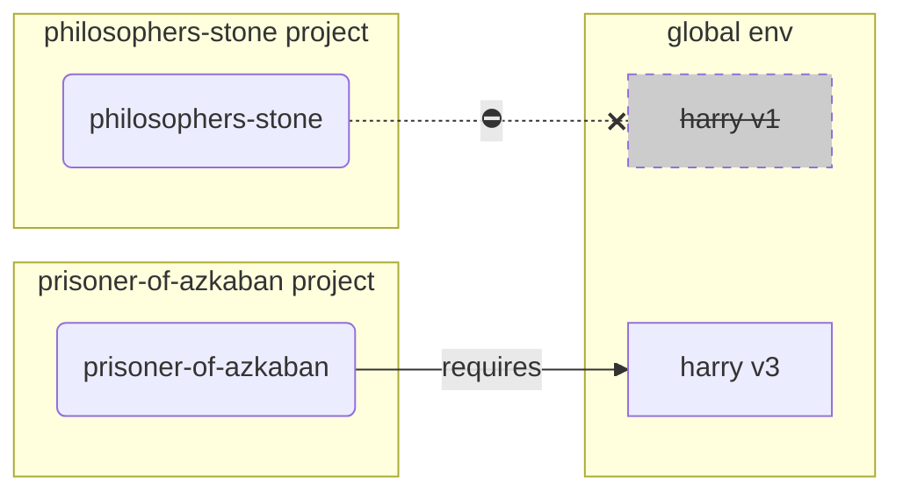
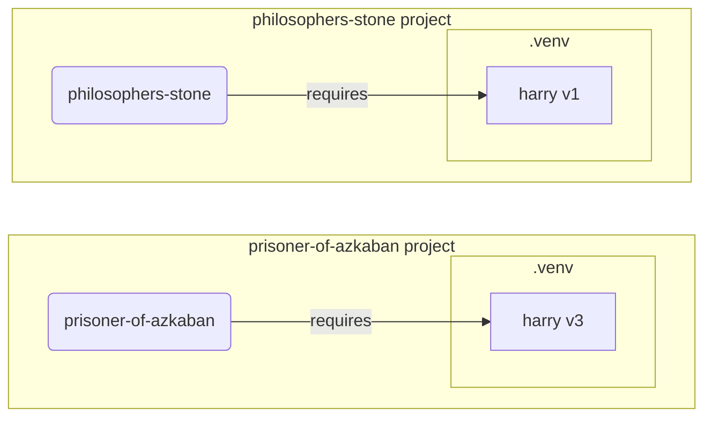

# Виртуальное окружение

Когда вы работаете с проектами на Python, вероятно, вам стоит использовать **виртуальное окружение** (или аналогичный механизм) для изоляции пакетов, которые вы устанавливаете для каждого проекта.

/// info | Информация

Если вы уже знакомы с виртуальными окружениями, знаете, как их создавать и использовать, вы можете пропустить этот раздел. 🤓

///

/// tip | Совет

**Виртуальное окружение** отличается от **переменной окружения**.

**Переменная окружения** — это системная переменная, которую могут использовать программы.

**Виртуальное окружение** — это директория с файлами.

///

/// info | Информация

Этот раздел научит вас использовать **виртуальные окружения** и как они работают.

Если вы готовы начать использовать **инструмент, который управляет всем** за вас (включая установку Python), попробуйте <a href="https://github.com/astral-sh/uv" class="external-link" target="_blank">uv</a>.

///

## Создание проекта

Сначала создайте директорию для вашего проекта.

Обычно я создаю директорию с именем `code` внутри моего домашнего каталога.

И внутри этой директории создаю одну папку для каждого проекта.

<div class="termy">

```console
// Перейти в домашний каталог
$ cd
// Создайте директорию для всех ваших проектов с кодом
$ mkdir code
// Войдите в указанную директорию
$ cd code
// Создайте директорию для этого проекта
$ mkdir awesome-project
// Перейдите в эту директорию проекта
$ cd awesome-project
```

</div>

## Создание виртуального окружения

Когда вы начинаете работать над Python-проектом **в первый раз**, создайте виртуальное окружение **<abbr title="существуют и другие варианты, это простое руководство">внутри вашего проекта</abbr>**.

/// tip | Совет

Вы должны сделать это **один раз на проект**, а не каждый раз, когда работаете.

///

//// tab | `venv`

Чтобы создать виртуальное окружение, вы можете использовать модуль `venv`, который входит в комплект поставки Python.

<div class="termy">

```console
$ python -m venv .venv
```

</div>

/// details | Что делает эта команда

* `python`: использовать программу `python`
* `-m`: вызвать модуль как сценарий, далее укажем, какой модуль использовать
* `venv`: использовать модуль под названием `venv`, который обычно устанавливается вместе с Python
* `.venv`: создать виртуальное окружение в новой директории `.venv`

///

////

//// tab | `uv`

Если у вас установлен <a href="https://github.com/astral-sh/uv" class="external-link" target="_blank">`uv`</a>, вы можете использовать его для создания виртуального окружения.

<div class="termy">

```console
$ uv venv
```

</div>

/// tip | Совет

По умолчанию `uv` создаст виртуальное окружение в директории под названием `.venv`.

Но вы можете изменить это, передав дополнительный аргумент с именем директории.

///

////

Эта команда создаст новое виртуальное окружение в директории `.venv`.

/// details | `.venv` или другое имя

Вы можете создать виртуальное окружение в другой директории, но принято называть его `.venv`.

///

## Активация виртуального окружения

Активируйте новое виртуальное окружение, чтобы любая команда Python, которую вы запускаете, или пакет, который вы устанавливаете, использовала его.

/// tip | Совет

Делайте это **каждый раз**, начиная **новую сессию терминала** для работы над проектом.

///

//// tab | Linux, macOS

<div class="termy">

```console
$ source .venv/bin/activate
```

</div>

////

//// tab | Windows PowerShell

<div class="termy">

```console
$ .venv\Scripts\Activate.ps1
```

</div>

////

//// tab | Windows Bash

Или если вы используете Bash для Windows (например, <a href="https://gitforwindows.org/" class="external-link" target="_blank">Git Bash</a>):

<div class="termy">

```console
$ source .venv/Scripts/activate
```

</div>

////

/// tip | Совет

Каждый раз при установке **нового пакета** в эту среду **активируйте** её снова.

Это гарантирует, что если вы используете **программу терминала (<abbr title="command line interface">CLI</abbr>)**, установленную этим пакетом, вы будете использовать её из вашей виртуальной среды, а не любую другую, установленную глобально, вероятно, с другой версией, чем вам нужно.

///

/// tip | Подсказка

Каждый раз, когда вы устанавливаете **новый пакет** в этой среде, **активируйте** ее снова.

Это гарантирует, что если вы используете программу из **терминала (<abbr title="интерфейс командной строки">CLI</abbr>)**, установленную этим пакетом, вы используете ту, что в вашем виртуальном окружении, а не ту, что может быть установлена глобально, с другой версией, чем вам нужно.

///

## Проверка активации виртуального окружения

Проверьте, что виртуальное окружение активно (предыдущая команда сработала).

/// tip | Совет

Это **необязательно**, но хороший способ **убедиться**, что все работает как надо и вы используете то виртуальное окружение, которое хотели.

///

//// tab | Linux, macOS, Windows Bash

<div class="termy">

```console
$ which python

/home/user/code/awesome-project/.venv/bin/python
```

</div>

Если путь указывает на бинарный файл `python` в `.venv/bin/python`, внутри вашего проекта (в нашем случае это `awesome-project`), значит все сработало. 🎉

////

//// tab | Windows PowerShell

<div class="termy">

```console
$ Get-Command python

C:\Users\user\code\awesome-project\.venv\Scripts\python
```

</div>

Если путь указывает на бинарный файл `python` в `.venv\Scripts\python`, внутри вашего проекта (в нашем случае это `awesome-project`), значит все сработало. 🎉

////

## Обновление `pip`

/// tip | Совет

Если вы используете <a href="https://github.com/astral-sh/uv" class="external-link" target="_blank">`uv`</a> для установки пакетов, вам не нужно обновлять `pip`. 😎

///

Если вы используете `pip` для установки пакетов (он идет по умолчанию вместе с Python), для начала обновите его до последней версии.

Многие экзотические ошибки при установке пакетов решаются простым обновлением `pip`.

/// tip | Совет

Обычно это делается **один раз**, сразу после создания виртуального окружения.

///

Убедитесь, что виртуальное окружение активно (с помощью вышеуказанной команды), и затем запустите:

<div class="termy">

```console
$ python -m pip install --upgrade pip

---> 100%
```

</div>

## Добавление `.gitignore`

Если вы используете **Git** (и вам стоит его использовать), добавьте файл `.gitignore`, чтобы исключить всё из директории `.venv` из Git.

/// tip | Совет

Если вы использовали <a href="https://github.com/astral-sh/uv" class="external-link" target="_blank">`uv`</a> для создания виртуального окружения, оно уже это сделало за вас, вы можете пропустить этот шаг. 😎

///

/// tip | Совет

Сделайте это **один раз**, сразу после создания виртуального окружения.

///

<div class="termy">

```console
$ echo "*" > .venv/.gitignore
```

</div>

/// details | Что значит эта команда

* `echo "*"`: "выведет" текст `*` в терминал (следующая часть немного это изменит)
* `>`: всё, что печатается командой слева от `>`, не должно быть выведено, а записано в файл справа от `>`
* `.gitignore`: имя файла, в который должен быть записан текст

А `*` для Git означает "всё". То есть будут проигнорированы все содержимое директории `.venv`.

Эта команда создаст файл `.gitignore` с содержимым:

```gitignore
*
```

///

## Установка пакетов

После активации окружения вы можете устанавливать в него пакеты.

/// tip | Совет

Сделайте это **один раз** при установке или обновлении пакетов, нужных вашему проекту.

Если вам нужно обновить версию пакета или добавить новый пакет, вам нужно будет **сделать это снова**.

///

### Установка пакетов напрямую

Если вам срочно нужно и вы не хотите использовать файл для объявления зависимостей пакета вашего проекта, вы можете установить их напрямую.

/// tip | Совет

Очень хорошей идеей будет заносить пакеты и версии, которые нужны вашей программе, в файл (например, `requirements.txt` или `pyproject.toml`).

///

//// tab | `pip`

<div class="termy">

```console
$ pip install "fastapi[standard]"

---> 100%
```

</div>

////

//// tab | `uv`

Если у вас установлен <a href="https://github.com/astral-sh/uv" class="external-link" target="_blank">`uv`</a>:

<div class="termy">

```console
$ uv pip install "fastapi[standard]"
---> 100%
```

</div>

////

### Установка из `requirements.txt`

Если у вас есть `requirements.txt`, вы можете использовать его для установки пакетов.

//// tab | `pip`

<div class="termy">

```console
$ pip install -r requirements.txt
---> 100%
```

</div>

////

//// tab | `uv`

Если у вас установлен <a href="https://github.com/astral-sh/uv" class="external-link" target="_blank">`uv`</a>:

<div class="termy">

```console
$ uv pip install -r requirements.txt
---> 100%
```

</div>

////

/// details | `requirements.txt`

`requirements.txt` со списком некоторых пакетов может выглядеть так:

```requirements.txt
fastapi[standard]==0.113.0
pydantic==2.8.0
```

///

## Запуск программы

После активации виртуального окружения вы можете запустить свою программу, и она будет использовать Python из вашего виртуального окружения с установленными там пакетами.

<div class="termy">

```console
$ python main.py

Hello World
```

</div>

## Настройка редактора

Вероятно, вы будете использовать редактор кода; убедитесь, что вы настроили его для использования того же виртуального окружения, которое вы создали (вероятно, он его автоматически обнаружит), чтобы у вас были автозавершение и подсветка ошибок.

Например:

* <a href="https://code.visualstudio.com/docs/python/environments#_select-and-activate-an-environment" class="external-link" target="_blank">VS Code</a>
* <a href="https://www.jetbrains.com/help/pycharm/creating-virtual-environment.html" class="external-link" target="_blank">PyCharm</a>

/// tip | Совет

Обычно это делается **один раз**, при создании виртуального окружения.

///

## Деактивация виртуального окружения

Когда вы завершите работу над проектом, вы можете **деактивировать** виртуальное окружение.

<div class="termy">

```console
$ deactivate
```

</div>

Таким образом, когда вы запускаете `python`, он не будет пытаться запустить его из того виртуального окружения с установленными в нём пакетами.

## Готовность к работе

Теперь вы готовы начать работу над своим проектом.

/// tip | Совет

Хотите понять, что означает все вышеперечисленное?

Продолжайте чтение. 👇🤓

///

## Зачем использовать виртуальные окружения

Для работы с FastAPI вам нужно установить <a href="https://www.python.org/" class="external-link" target="_blank">Python</a>.

После этого вам нужно будет **установить** FastAPI и любые другие **пакеты**, которые вы хотите использовать.

Для установки пакетов обычно используют команду `pip`, которая идёт вместе с Python (или аналогичные альтернативы).

Тем не менее, если вы просто используете `pip` напрямую, то пакеты будут установлены в ваш **глобальный Python** (глобальная установка Python).

### Проблема

Так в чем проблема установки пакетов в глобальную среду Python?

В какой-то момент вам, вероятно, придется писать много разных программ, которые зависят от **разных пакетов**. И некоторые из этих проектов, над которыми вы работаете, будут зависеть от **разных версий** одного и того же пакета. 😱

Например, вы можете создать проект под названием `philosophers-stone`, эта программа зависит от другого пакета под названием **`harry`, используемого версии `1`**. Поэтому вам нужно установить `harry`.



Затем, в какой-то момент позже, вы создаёте другой проект под названием `prisoner-of-azkaban`, и этот проект также зависит от `harry`, но этот проект нуждается в **`harry` версии `3`**.



Но теперь проблема заключается в том, что если пакеты установлены глобально (в глобальной среде), а не в локальной **виртуальной среде**, вам придётся выбирать, какую версию `harry` установить.

Если вы хотите запустить `philosophers-stone`, вам нужно сначала установить `harry` версии `1`, например, с помощью:

<div class="termy">

```console
$ pip install "harry==1"
```

</div>

И тогда у вас будет установлена версия `harry` `1` в вашем глобальном Python.



Но если вы хотите запустить `prisoner-of-azkaban`, вам нужно будет удалить `harry` версии `1` и установить `harry` версии `3` (или просто установка версии `3` автоматически удалит версию `1`).

<div class="termy">

```console
$ pip install "harry==3"
```

</div>

И затем у вас будет установлена версия `harry` `3` в вашем глобальном Python.

И если вы снова попытаетесь запустить `philosophers-stone`, есть вероятность, что он **не будет работать**, потому что ему нужен `harry` версии `1`.



/// tip | Совет

В пакетах Python очень часто стараются изо всех сил избегать внесения критических изменений в новых версиях, но лучше перестраховаться и намеренно устанавливать новые версии, а затем запускать тесты, чтобы проверить, все ли работает правильно.

///

Теперь представьте это с **множеством** других **пакетов**, от которых зависят все ваши **проекты**. Это очень сложно управляемо. И, вероятно, вы будете запускать некоторые проекты с некоторыми **несовместимыми версиями** пакетов и не будете знать, почему что-то не работает.

Кроме того, в зависимости от вашей операционной системы (например, Linux, Windows, macOS), она могла быть поставлена с уже установленным Python. И в этом случае, вероятно, были предустановлены некоторые пакеты с определёнными версиями, **нужными вашей системе**. Если вы устанавливаете пакеты в глобальной среде Python, вы можете **поломать** некоторые из программ, которые поставляются с вашей операционной системой.

## Где устанавливаются пакеты

Когда вы устанавливаете Python, это создаёт некоторые директории с файлами на вашем компьютере.

Некоторые из этих директорий предназначены для хранения всех устанавливаемых вами пакетов.

Когда вы запускаете:

<div class="termy">

```console
// Не запускайте это сейчас, это просто пример 🤓
$ pip install "fastapi[standard]"
---> 100%
```

</div>

Это скачается как сжатый файл с кодом FastAPI, обычно из <a href="https://pypi.org/project/fastapi/" class="external-link" target="_blank">PyPI</a>.

Он также **скачает** файлы для других пакетов, от которых зависит FastAPI.

Затем он **извлечёт** все эти файлы и поместит их в директорию на вашем компьютере.

По умолчанию, он разместит те загруженные и извлечённые файлы в директории, которая идёт с вашей установкой Python, это ваш **глобальный Python**.

## Что такое виртуальные окружения?

Решением проблем того, что все пакеты находятся в глобальной среде, является использование **виртуального окружения для каждого проекта**, над которым вы работаете.

Виртуальное окружение — это **директория**, очень похожая на глобальную, где вы можете устанавливать пакеты для проекта.

Таким образом, каждый проект будет иметь своё собственное виртуальное окружение (директорию `.venv`) со своими пакетами.



## Что означает активация виртуального окружения?

Когда вы активируете виртуальное окружение, например, с помощью:

//// tab | Linux, macOS

<div class="termy">

```console
$ source .venv/bin/activate
```

</div>

////

//// tab | Windows PowerShell

<div class="termy">

```console
$ .venv\Scripts\Activate.ps1
```

</div>

////

//// tab | Windows Bash

Или если вы используете Bash для Windows (например, <a href="https://gitforwindows.org/" class="external-link" target="_blank">Git Bash</a>):

<div class="termy">

```console
$ source .venv/Scripts/activate
```

</div>

////

Эта команда создаст или изменит некоторые [переменные окружения](environment-variables.md){.internal-link target=_blank}, которые будут доступны для следующих команд.

Одна из этих переменных — переменная `PATH`.

/// tip | Совет

Вы можете узнать больше о переменной `PATH` в разделе [Переменные окружения](environment-variables.md#path-environment-variable){.internal-link target=_blank}.

///

Активация виртуального окружения добавляет путь его директории `.venv/bin` (на Linux и macOS) или `.venv\Scripts` (на Windows) в переменную окружения `PATH`.

Скажем, до активации окружения переменная `PATH` выглядела так:

//// tab | Linux, macOS

```plaintext
/usr/bin:/bin:/usr/sbin:/sbin
```

Это означает, что система будет искать программы в:

* `/usr/bin`
* `/bin`
* `/usr/sbin`
* `/sbin`

////

//// tab | Windows

```plaintext
C:\Windows\System32
```

Это означает, что система будет искать программы в:

* `C:\Windows\System32`

////

После активации виртуального окружения переменная `PATH` будет выглядеть примерно так:

//// tab | Linux, macOS

```plaintext
/home/user/code/awesome-project/.venv/bin:/usr/bin:/bin:/usr/sbin:/sbin
```

Это означает, что система теперь начнёт искать программы в:

```plaintext
/home/user/code/awesome-project/.venv/bin
```

прежде чем искать в других директориях.

Таким образом, когда вы вводите `python` в терминале, система обнаружит программу Python в

```plaintext
/home/user/code/awesome-project/.venv/bin/python
```

и будет использовать её.

////

//// tab | Windows

```plaintext
C:\Users\user\code\awesome-project\.venv\Scripts;C:\Windows\System32
```

Это означает, что система теперь начнёт искать программы в:

```plaintext
C:\Users\user\code\awesome-project\.venv\Scripts
```

прежде чем искать в других директориях.

Таким образом, когда вы вводите `python` в терминале, система обнаружит программу Python в

```plaintext
C:\Users\user\code\awesome-project\.venv\Scripts\python
```

и будет использовать её.

////

Важная деталь заключается в том, что он помещает путь виртуального окружения в **начало** переменной `PATH`. Система обнаружит это **раньше**, чем любой другой Python. Таким образом, когда вы запускаете `python`, он будет использовать Python **из виртуального окружения**, а не любой другой `python` (например, `python` из глобального окружения).

Активация виртуального окружения также меняет несколько других вещей, но это одна из самых важных функций.

## Проверка виртуального окружения

Когда вы проверяете, активно ли виртуальное окружение, например, с помощью:

//// tab | Linux, macOS, Windows Bash

<div class="termy">

```console
$ which python

/home/user/code/awesome-project/.venv/bin/python
```

</div>

////

//// tab | Windows PowerShell

<div class="termy">

```console
$ Get-Command python

C:\Users\user\code\awesome-project\.venv\Scripts\python
```

</div>

////

Это означает, что программа `python`, которая будет использоваться, — это программа **из виртуального окружения**.

Вы используете `which` на Linux и macOS и `Get-Command` на Windows PowerShell.

Работа этой команды заключается в том, что она проверяет переменную окружения `PATH`, проходя по **каждому пути по порядку** в поисках программы под названием `python`. Как только она её находит, она **показывает вам путь** к этой программе.

Наиболее важной частью является то, что когда вы вызываете `python`, это тот самый "`python`", который будет запущен.

Таким образом, вы можете убедиться, что находитесь в правильном виртуальном окружении.

/// tip | Совет

Легко активировать одно виртуальное окружение, а затем **перейти к другому проекту**.

И второй проект **не будет работать**, потому что вы используете **неправильный Python**, из виртуального окружения другого проекта.

Полезно уметь проверять, какой `python` используется. 🤓

///

## Зачем деактивировать виртуальное окружение?

Например, вы можете работать над проектом `philosophers-stone`, **активировать это виртуальное окружение**, устанавливать пакеты и работать в этой среде.

А затем вы хотите поработать над **другим проектом** `prisoner-of-azkaban`.

Вы переходите в этот проект:

<div class="termy">

```console
$ cd ~/code/prisoner-of-azkaban
```

</div>

Если вы не деактивируете виртуальное окружение для `philosophers-stone`, когда вы запускаете `python` в терминале, он попытается использовать Python из `philosophers-stone`.

<div class="termy">

```console
$ cd ~/code/prisoner-of-azkaban

$ python main.py

// Ошибка при импорте sirius, он не установлен 😱
Traceback (most recent call last):
    File "main.py", line 1, in <module>
        import sirius
```

</div>

Но если вы деактивируете виртуальное окружение и активируете новое для `prisoner-of-askaban`, то, когда вы запускаете `python`, он будет использовать Python из виртуального окружения в `prisoner-of-azkaban`.

<div class="termy">

```console
$ cd ~/code/prisoner-of-azkaban

// Вам не нужно находиться в старой директории для деактивации, вы можете сделать это, где угодно, даже после перехода к другому проекту 😎
$ deactivate

// Активируйте виртуальное окружение в prisoner-of-azkaban/.venv 🚀
$ source .venv/bin/activate

// Теперь, когда вы запускаете python, он найдёт пакет sirius, установленный в этой виртуальной среде ✨
$ python main.py

Я торжественно клянусь 🐺
```

</div>

## Альтернативы

Это простое руководство, чтобы начать работу и показать, как всё **работает изнутри**.

Существует много **альтернатив** для управления виртуальными окружениями, зависимостями пакетов, проектами.

Когда вы будете готовы и захотите использовать инструмент для **полного управления проектом**, зависимостями пакетов, виртуальными окружениями и т.д., я бы предложил вам попробовать <a href="https://github.com/astral-sh/uv" class="external-link" target="_blank">uv</a>.

`uv` может сделать множество вещей, он может:

* **Установить Python** для вас, включая разные версии
* Управлять **виртуальным окружением** для ваших проектов
* Устанавливать **пакеты**
* Управлять зависимостями пакетов и версиями для вашего проекта
* Гарантировать, что у вас есть **точный** набор пакетов и версий для установки, включая их зависимости, так что вы можете быть уверены, что вы можете запустить ваш проект в продакшн точно так же, как на вашем компьютере во время разработки, это называется **locking**
* И многие другие вещи

## Заключение

Если вы прочли и поняли всё это, теперь **вы знаете гораздо больше** о виртуальных окружениях, чем многие разработчики. 🤓

Понимание этих деталей, вероятно, будет полезно в будущем, когда вы будете отлаживать что-то, кажущееся сложным, но вы будете знать, **как всё работает под капотом**. 😎
