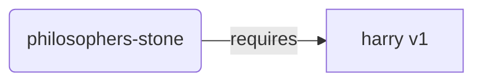
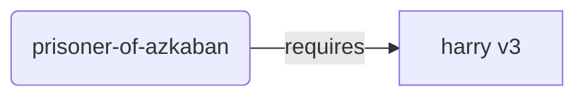
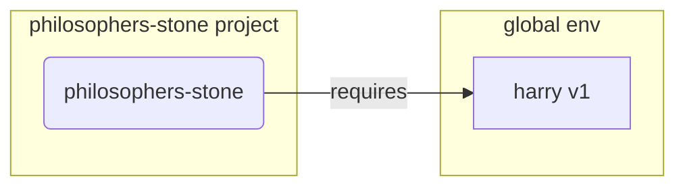
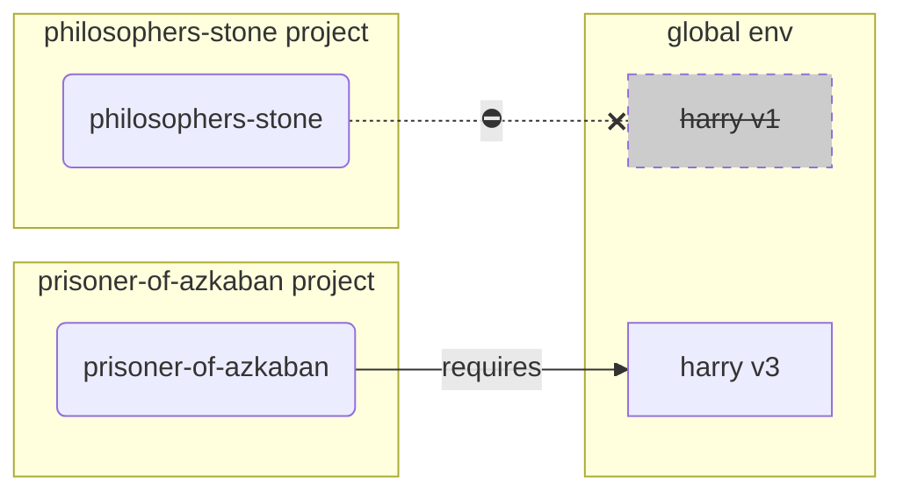
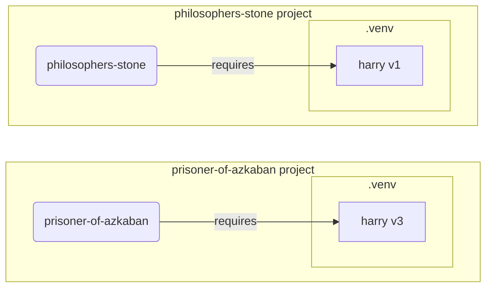

# Виртуальные среды

Когда вы работаете над проектами на Python, рекомендуется использовать **виртуальную среду** (или аналогичный механизм) для изоляции пакетов, которые вы устанавливаете для каждого проекта.

/// info | Информация

Если вы уже знаете о виртуальных средах, как их создавать и использовать, вы можете пропустить этот раздел. 🤓

///

/// tip | Совет

**Виртуальная среда** отличается от **переменной окружения**.

**Переменная окружения** — это системная переменная, которую могут использовать программы.

**Виртуальная среда** — это директория, содержащая некоторые файлы.

///

/// info | Информация

На этой странице вы узнаете, как использовать **виртуальные среды** и как они работают.

Если вы готовы использовать **инструмент, который управляет всем** для вас (включая установку Python), попробуйте <a href="https://github.com/astral-sh/uv" class="external-link" target="_blank">uv</a>.

///

## Создание проекта

Сначала создайте директорию для вашего проекта.

Обычно я создаю директорию с названием `code` внутри своего домашнего каталога.

И внутри этой директории я создаю по одной директории на каждый проект.

<div class="termy">

```console
// Перейти в домашний каталог
$ cd
// Создать директорию для всех проектов
$ mkdir code
// Войти в эту директорию
$ cd code
// Создать директорию для этого проекта
$ mkdir awesome-project
// Войти в директорию проекта
$ cd awesome-project
```

</div>

## Создание виртуальной среды

Когда вы впервые начинаете работу над проектом на Python, создайте виртуальную среду **<abbr title="есть другие варианты, это простая рекомендация">внутри вашего проекта</abbr>**.

/// tip | Совет

Это нужно сделать только **один раз для проекта**, а не каждый раз, когда вы работаете.

///

//// tab | `venv`

Для создания виртуальной среды вы можете использовать модуль `venv`, который поставляется с Python.

<div class="termy">

```console
$ python -m venv .venv
```

</div>

/// details | Что делает эта команда?

* `python`: используется программа под названием `python`
* `-m`: вызывает модуль как скрипт, далее укажем, какой модуль
* `venv`: используется модуль под названием `venv`, который обычно устанавливается вместе с Python
* `.venv`: создаёт виртуальную среду в новой директории `.venv`

///

////

//// tab | `uv`

Если у вас установлен <a href="https://github.com/astral-sh/uv" class="external-link" target="_blank">`uv`</a>, вы можете использовать его для создания виртуальной среды.

<div class="termy">

```console
$ uv venv
```

</div>

/// tip | Совет

По умолчанию `uv` создаёт виртуальную среду в директории, называемой `.venv`.

Но вы можете изменить это, добавив дополнительный аргумент с именем директории.

///

////

Эта команда создаёт новую виртуальную среду в директории, называемой `.venv`.

/// details | `.venv` или другое имя?

Вы можете создать виртуальную среду в другой директории, но существует традиция называть её `.venv`.

///

## Активация виртуальной среды

Активируйте созданную виртуальную среду, чтобы любая выполняемая команда Python или устанавливаемый пакет использовали её.

/// tip | Совет

Делайте это **каждый раз**, когда начинаете **новую сессию терминала** для работы над проектом.

///

//// tab | Linux, macOS

<div class="termy">

```console
$ source .venv/bin/activate
```

</div>

////

//// tab | Windows PowerShell

<div class="termy">

```console
$ .venv\Scripts\Activate.ps1
```

</div>

////

//// tab | Windows Bash

Или, если вы используете Bash для Windows (например, <a href="https://gitforwindows.org/" class="external-link" target="_blank">Git Bash</a>):

<div class="termy">

```console
$ source .venv/Scripts/activate
```

</div>

////

/// tip | Совет

Каждый раз при установке **нового пакета** в эту среду **активируйте** её снова.

Это гарантирует, что если вы используете **программу терминала (<abbr title="command line interface">CLI</abbr>)**, установленную этим пакетом, вы будете использовать её из вашей виртуальной среды, а не любую другую, установленную глобально, вероятно, с другой версией, чем вам нужно.

///

## Проверка активации виртуальной среды

Проверьте, активна ли виртуальная среда (предыдущая команда сработала).

/// tip | Совет

Это **не обязательно**, но это хороший способ **убедиться**, что всё работает как ожидалось, и вы используете именно ту виртуальную среду, которую планировали.

///

//// tab | Linux, macOS, Windows Bash

<div class="termy">

```console
$ which python

/home/user/code/awesome-project/.venv/bin/python
```

</div>

Если показывает, что `python` находится в `.venv/bin/python` внутри вашего проекта (в данном случае `awesome-project`), значит, всё сработало. 🎉

////

//// tab | Windows PowerShell

<div class="termy">

```console
$ Get-Command python

C:\Users\user\code\awesome-project\.venv\Scripts\python
```

</div>

Если показывает, что `python` находится в `.venv\Scripts\python` внутри вашего проекта (в данном случае `awesome-project`), значит, всё сработало. 🎉

////

## Обновление `pip`

/// tip | Совет

Если вы используете <a href="https://github.com/astral-sh/uv" class="external-link" target="_blank">`uv`</a>, то будете использовать его для установки пакетов вместо `pip`, поэтому обновлять `pip` не нужно. 😎

///

Если вы используете `pip` для установки пакетов (он по умолчанию поставляется с Python), стоит **обновить** его до последней версии.

Многие экзотические ошибки при установке пакетов решаются просто обновлением `pip`.

/// tip | Совет

Обычно это делается **один раз**, сразу после создания виртуальной среды.

///

Убедитесь, что виртуальная среда активирована (используя команду выше), и затем выполните:

<div class="termy">

```console
$ python -m pip install --upgrade pip

---> 100%
```

</div>

## Добавление `.gitignore`

Если вы используете **Git** (а вы должны), добавьте файл `.gitignore`, чтобы исключить всё содержимое вашей папки `.venv` из Git.

/// tip | Совет

Если вы использовали <a href="https://github.com/astral-sh/uv" class="external-link" target="_blank">`uv`</a> для создания виртуальной среды, это уже сделано за вас, можете пропустить этот шаг. 😎

///

/// tip | Совет

Это делается **один раз**, сразу после создания виртуальной среды.

///

<div class="termy">

```console
$ echo "*" > .venv/.gitignore
```

</div>

/// details | Что делает эта команда?

* `echo "*"`: выведет текст `*` в терминал (следующий этап слегка изменит это)
* `>`: всё, что выводится в терминал командой слева от `>`, не выводится, а записывается в файл справа от `>`
* `.gitignore`: имя файла, в который следует записать текст

И `*` для Git означает "всё". Таким образом, он будет игнорировать всё содержимое директории `.venv`.

Эта команда создаст файл `.gitignore` с содержимым:

```gitignore
*
```

///

## Установка пакетов

После активации виртуальной среды вы можете устанавливать в неё пакеты.

/// tip | Совет

Делайте это **один раз** во время установки или обновления пакетов, необходимых вашему проекту.

Если вам нужно обновить версию или добавить новый пакет, вы должны будете **сделать это снова**.

///

### Установка пакетов напрямую

Если вы торопитесь и не хотите объявлять зависимости проекта в файле, вы можете установить их напрямую.

/// tip | Совет

Очень желательно объявлять пакеты и их версии, которые ваш проект использует, в отдельном файле (например, `requirements.txt` или `pyproject.toml`).

///

//// tab | `pip`

<div class="termy">

```console
$ pip install "fastapi[standard]"

---> 100%
```

</div>

////

//// tab | `uv`

Если у вас установлен <a href="https://github.com/astral-sh/uv" class="external-link" target="_blank">`uv`</a>:

<div class="termy">

```console
$ uv pip install "fastapi[standard]"
---> 100%
```

</div>

////

### Установка из `requirements.txt`

Если у вас есть `requirements.txt`, вы можете использовать его для установки пакетов.

//// tab | `pip`

<div class="termy">

```console
$ pip install -r requirements.txt
---> 100%
```

</div>

////

//// tab | `uv`

Если у вас установлен <a href="https://github.com/astral-sh/uv" class="external-link" target="_blank">`uv`</a>:

<div class="termy">

```console
$ uv pip install -r requirements.txt
---> 100%
```

</div>

////

/// details | `requirements.txt`

Файл `requirements.txt` с несколькими пакетами может выглядеть так:

```requirements.txt
fastapi[standard]==0.113.0
pydantic==2.8.0
```

///

## Запуск программы

После активации виртуальной среды вы можете запустить свою программу, и она будет использовать Python внутри вашей виртуальной среды с установленными там пакетами.

<div class="termy">

```console
$ python main.py

Hello World
```

</div>

## Настройка редактора

Вы, вероятно, будете использовать редактор, убедитесь, что настроили его на использование той же виртуальной среды, которую вы создали (скорее всего, он её автоматически распознает), чтобы вы могли использовать автозавершение и видеть ошибки в коде.

Например:

* <a href="https://code.visualstudio.com/docs/python/environments#_select-and-activate-an-environment" class="external-link" target="_blank">VS Code</a>
* <a href="https://www.jetbrains.com/help/pycharm/creating-virtual-environment.html" class="external-link" target="_blank">PyCharm</a>

/// tip | Совет

Обычно это делается **один раз**, когда вы создаете виртуальную среду.

///

## Деактивация виртуальной среды

После завершения работы над проектом вы можете **деактивировать** виртуальную среду.

<div class="termy">

```console
$ deactivate
```

</div>

Таким образом, при запуске `python`, он не будет использовать версию из этой виртуальной среды с установленными там пакетами.

## Готовность к работе

Теперь вы готовы приступить к работе над своим проектом.


/// tip | Совет

Хотите понять всё, что написано выше?

Продолжайте чтение. 👇🤓

///

## Зачем виртуальные среды

Для работы с FastAPI вам нужно установить <a href="https://www.python.org/" class="external-link" target="_blank">Python</a>.

После этого вам потребуется установить FastAPI и другие необходимые **пакеты**.

Чтобы установить пакеты, вы обычно используете команду `pip`, которая идет в комплекте с Python (либо аналогичные альтернативы).

Тем не менее, если вы просто используете `pip` напрямую, пакеты будут устанавливаться в ваш **глобальный Python-окружение** (глобальная установка Python).

### Проблема

Так в чём проблема установки пакетов в глобальную среду Python?

В какой-то момент вы вероятно напишете множество различных программ, зависящих от **разных пакетов**. Некоторые из этих проектов будут зависеть от **разных версий** одного и того же пакета. 😱

Например, вы могли бы создать проект, называемый `philosophers-stone`, который зависит от другого пакета **`harry`, используя версию `1`**. По этому вам нужно установить `harry`.



Затем, в какой-то момент позже, вы создаёте другой проект, называемый `prisoner-of-azkaban`, и этот проект тоже зависит от `harry`, но ему нужна версия **`harry` `3`**.



Но теперь проблема в том, если вы устанавливаете пакеты глобально (в глобальной среде) вместо локальной **виртуальной среды**, вы должны выбрать, какую версию `harry` установить.

Если вы хотите запустить `philosophers-stone`, вы должны сначала установить `harry` версии `1`, например, с помощью:

<div class="termy">

```console
$ pip install "harry==1"
```

</div>

И в итоге у вас установлена `harry` версии `1` в глобальной среде Python.



Но затем, если вы хотите запустить `prisoner-of-azkaban`, вы должны удалить `harry` версии `1` и установить `harry` версии `3` (или просто установка версии `3` автоматически удалит версию `1`).

<div class="termy">

```console
$ pip install "harry==3"
```

</div>

И вы получили `harry` версии `3`, установленный в вашей глобальной среде Python.

И если вы попробуете снова запустить `philosophers-stone`, то есть вероятность, что он **не будет работать**, так как зависит от `harry` версии `1`.



/// tip | Совет

В Python-пакетах обычно стараются изо всех сил **избегать критических изменений** в **новых версиях**, но лучше перестраховаться и планово устанавливать новые версии, а затем запускать тесты, чтобы проверить, работает ли всё правильно.

///

Теперь представьте, что это происходит с **многими** другим пакеты, от которых зависят все ваши **проекты**. С этим очень сложно справиться. И вы, вероятно, в конечном итоге запустите некоторые проекты с некоторыми **несовместимыми версиями** пакетов и не будете знать, почему что-то не работает.

Кроме того, в зависимости от вашей операционной системы (например, Linux, Windows, macOS), она могла поставляться с уже установленным Python. И в этом случае она вероятно имела некоторые пакеты, предварительно установленные с определёнными версиями, **необходимыми вашей системой**. Если вы устанавливаете пакеты в глобальную среду Python, вы можете в итоге **сломать** некоторые программы, которые были полностью частью вашей операционной системы.

## Где устанавливаются пакеты

Когда вы устанавливаете Python, это создаёт на вашем компьютере некоторые каталоги с некоторыми файлами.

Некоторые из этих каталогов являются теми, которые хранят все установленные вами пакеты.

Когда вы запускаете:

<div class="termy">

```console
// Не запускайте это сейчас, это лишь пример 🤓
$ pip install "fastapi[standard]"
---> 100%
```

</div>

Это загрузит сжатый файл с кодом FastAPI, обычно с <a href="https://pypi.org/project/fastapi/" class="external-link" target="_blank">PyPI</a>.

Он также **загрузит** файлы для других пакетов, от которых зависит FastAPI.

Затем он **извлечёт** все эти файлы и поместит их в директорию на вашем компьютере.

По умолчанию, он сохранит загруженные и извлечённые файлы в директории, которая идёт в комплекте с вашей установкой Python, то есть в **глобальной среде**.

## Что такое виртуальные среды

Решением проблем использования всех пакетов в глобальной среде является использование **виртуальной среды для каждого проекта**, над которым вы работаете.

Виртуальная среда — это **директория**, очень похожая на глобальную, в которой вы можете устанавливать пакеты для конкретного проекта.

Таким образом, каждый проект будет иметь собственную виртуальную среду (`.venv` директории) со своими пакетами.



## Что означает активация виртуальной среды

Когда вы активируете виртуальную среду, например, используя:

//// tab | Linux, macOS

<div class="termy">

```console
$ source .venv/bin/activate
```

</div>

////

//// tab | Windows PowerShell

<div class="termy">

```console
$ .venv\Scripts\Activate.ps1
```

</div>

////

//// tab | Windows Bash

Или, если вы используете Bash для Windows (например, <a href="https://gitforwindows.org/" class="external-link" target="_blank">Git Bash</a>):

<div class="termy">

```console
$ source .venv/Scripts/activate
```

</div>

////

Эта команда создаст или изменит некоторые [переменные окружения](environment-variables.md){.internal-link target=_blank}, которые будут доступны для последующих команд.

Одна из этих переменных — это переменная `PATH`.

/// tip | Совет

Вы можете узнать больше о переменной окружения `PATH` в разделе [Переменные окружения](environment-variables.md#path-environment-variable){.internal-link target=_blank}.

///

Активация виртуальной среды добавляет её путь `.venv/bin` (на Linux и macOS) или `.venv\Scripts` (на Windows) в переменную окружения `PATH`.

Предположим, что до активации среды переменная `PATH` выглядела так:

//// tab | Linux, macOS

```plaintext
/usr/bin:/bin:/usr/sbin:/sbin
```

Это означает, что система будет искать программы в:

* `/usr/bin`
* `/bin`
* `/usr/sbin`
* `/sbin`

////

//// tab | Windows

```plaintext
C:\Windows\System32
```

Это означает, что система будет искать программы в:

* `C:\Windows\System32`

////

После активации виртуальной среды переменная `PATH` будет выглядеть примерно так:

//// tab | Linux, macOS

```plaintext
/home/user/code/awesome-project/.venv/bin:/usr/bin:/bin:/usr/sbin:/sbin
```

Это означает, что система теперь начнёт искать программы сначала в:

```plaintext
/home/user/code/awesome-project/.venv/bin
```

прежде чем искать в других каталогах.

Таким образом, когда вы вводите в терминале `python`, система найдёт программу Python в

```plaintext
/home/user/code/awesome-project/.venv/bin/python
```

и будет использовать её.

////

//// tab | Windows

```plaintext
C:\Users\user\code\awesome-project\.venv\Scripts;C:\Windows\System32
```

Это означает, что система теперь начнёт искать программы сначала в:

```plaintext
C:\Users\user\code\awesome-project\.venv\Scripts
```

прежде чем искать в других каталогах.

Таким образом, когда вы вводите в терминале `python`, система найдёт программу Python в

```plaintext
C:\Users\user\code\awesome-project\.venv\Scripts\python
```

и будет использовать её.

////

Важной деталью является то, что путь к виртуальной среде будет помещён в **начало** переменной `PATH`. Система найдёт его **до** того, как найдёт какой-либо другой Python. Таким образом, при запуске команды `python` будет использоваться Python **из виртуальной среды**, а не любой другой `python` (например, `python` из глобальной среды).

Активация виртуальной среды также изменяет несколько других вещей, но это одна из самых важных функцией.

## Проверка виртуальной среды

Когда вы проверяете, активна ли виртуальная среда, например, используя:

//// tab | Linux, macOS, Windows Bash

<div class="termy">

```console
$ which python

/home/user/code/awesome-project/.venv/bin/python
```

</div>

////

//// tab | Windows PowerShell

<div class="termy">

```console
$ Get-Command python

C:\Users\user\code\awesome-project\.venv\Scripts\python
```

</div>

////

Это означает, что программа `python`, которая будет использоваться, это та, что находится **в виртуальной среде**.

Вы используете `which` на Linux и macOS и `Get-Command` на Windows PowerShell.

Команда работает следующим образом: она проходит через переменную окружения `PATH`, проходя **каждый путь в порядке** поиска программы под названием `python`. После того, как она найдёт её, она **отобразит путь** к этой программе.

Самая важная часть заключается в том, что когда вы вызываете `python`, это та самая программа "`python`", которая будет выполнена.

Таким образом, вы можете убедиться, что находитесь в правильной виртуальной среде.

/// tip | Совет

Легко активировать одну виртуальную среду, получить один Python, а затем **перейти к другому проекту**.

И второй проект **не будет работать**, потому что вы используете **неправильный Python** из виртуальной среды для другого проекта.

Полезно иметь возможность проверять, какой `python` используется. 🤓

///

## Зачем деактивировать виртуальную среду

Например, вы можете работать над проектом `philosophers-stone`, **активируя эту виртуальную среду**, устанавливая пакеты и работая в этой среде.

А затем вы хотите работать над **другим проектом** `prisoner-of-azkaban`.

Вы переходите к этому проекту:

<div class="termy">

```console
$ cd ~/code/prisoner-of-azkaban
```

</div>

Если вы не деактивируете виртуальную среду для `philosophers-stone`, то когда вы запускаете `python` в терминале, он попытается использовать Python из `philosophers-stone`.

<div class="termy">

```console
$ cd ~/code/prisoner-of-azkaban

$ python main.py

// Ошибка при импорте sirius, он не установлен 😱
Traceback (most recent call last):
    File "main.py", line 1, in <module>
        import sirius
```

</div>

Но если вы деактивируете виртуальную среду и активируете новую для `prisoner-of-askaban`, то когда вы запускаете `python`, он будет использоваться Python из виртуальной среды в проекте `prisoner-of-azkaban`.

<div class="termy">

```console
$ cd ~/code/prisoner-of-azkaban

// Вам не нужно находиться в старой директории для деактивации, вы можете сделать это из любого места, даже после перехода к другому проекту 😎
$ deactivate

// Активируйте виртуальную среду в `prisoner-of-azkaban/.venv` 🚀
$ source .venv/bin/activate

// Теперь, когда вы запускаете python, он найдёт пакет sirius, установленный в этой виртуальной среде ✨
$ python main.py

Я торжественно клянусь 🐺
```

</div>

## Альтернативы

Это простое руководство поможет вам начать работу и научит тому, как всё работает **внутри**.

Существуют также **альтернативные** решения для управления виртуальными средами разработки, зависимостями пакетов (требования), проектами.

Когда вы будете готовы и захотите использовать инструмент для **управления всем проектом**, зависимостями пакетов, виртуальными средами и т.д., я бы рекомендовал вам попробовать <a href="https://github.com/astral-sh/uv" class="external-link" target="_blank">uv</a>.

`uv` может делать много всего, он может:

* **Установить Python** для вас, включая разные версии
* Управлять **виртуальной средой** для ваших проектов
* Устанавливать **пакеты**
* Управлять зависимостями пакетов **и версиями** для вашего проекта
* Обеспечить наличие **точного** набора пакетов и версий для установки, включая их зависимости, так что вы можете быть уверены, что ваш проект будет работать в production точно так же, как и на вашем компьютере во время разработки, это называется *locking*
* И многое другое

## Заключение

Если вы прочитали и поняли всё это, теперь **вы знаете гораздо больше** о виртуальных средах, чем многие другие разработчики. 🤓

Знание этих деталей, скорее всего, будет полезно вам в будущем, когда вы будете отлаживать что-то, что кажется сложным, но вы будете знать, **как всё работает внутри**. 😎
