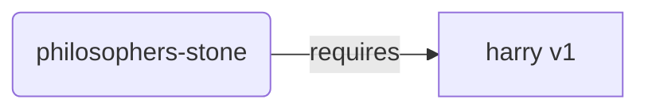
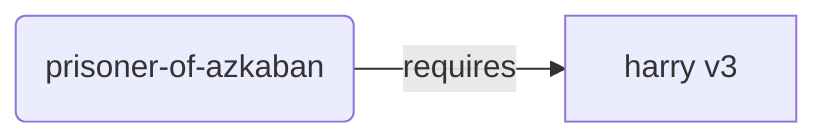
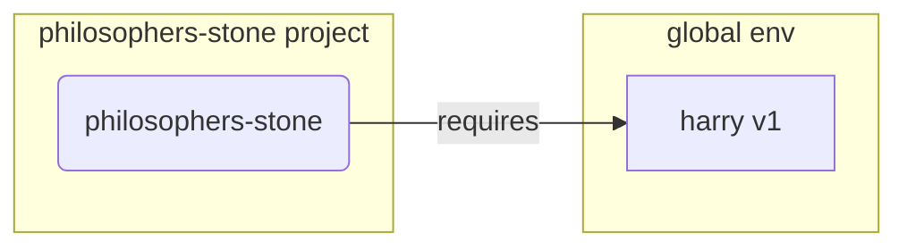
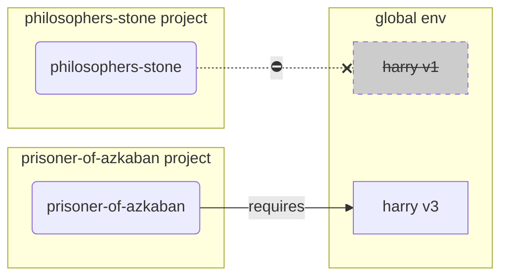
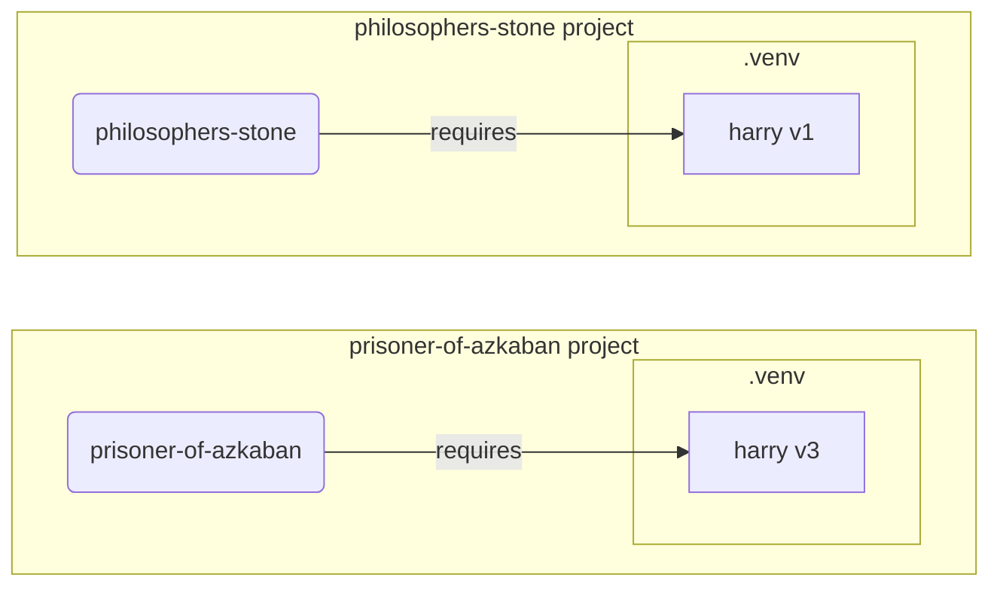

# Виртуальная среда

При работе с проектами в Python рекомендуется использовать **виртуальную среду разработки** (или какой-нибудь другой подобный механизм). Это нужно для того, чтобы изолировать устанавливаемые пакеты для каждого отдельного проекта.

/// info | Дополнительная информация

Если вы уже знакомы с виртуальными средами разработки, знаете как их создавать и использовать, то вы можете свободно пропустить данный раздел. 🤓

///

/// tip | Подсказка

**Виртуальная среда** и **переменная окружения** это две разные вещи.

**Переменная окружения** это системная переменная, которую могут использовать программы.

**Виртуальная среда** это папка, содержащая файлы.

///

/// info | Дополнительная информация

В этом разделе мы научим вас пользоваться виртуальными средами разработки и расскажем, как они работают.

Если же вы готовы воспользоваться инструментом, **который умеет управлять всем, что касается Python-проектов**,
(включая установку Python), то попробуйте <a href="https://github.com/astral-sh/uv" class="external-link" target="_blank">uv</a>.

///

## Создание проекта

В первую очередь, создайте директорию для вашего проекта.

Я обычно создаю папку под названием `code` внутри моего домашнего каталога `/home/user`.

Затем внутри данной папки я создаю отдельную директорию под каждый свой проект.

<div class="termy">

```console
// Перейдите в домашний каталог
$ cd
// Создайте отдельную папку под все будущие программные проекты (code)
$ mkdir code
// Войдите в директорию code
$ cd code
// Создайте директрорию под данный проект (awesome-project)
$ mkdir awesome-project
// Перейдите в созданную директорию проекта
$ cd awesome-project
```

</div>

## Создание виртуальной среды разработки

Начиная работу с Python-проектом, сразу же создавайте виртуальную среду разработки
**<abbr title="есть и другие опции, но мы рассмотрим наиболее простой вариант">внутри вашего проекта</abbr>**.

/// tip | Подсказка

Виртуальная среда разработки создается один раз, и в дальнейшем, работая с проектом, этого больше делать не придется.

///

//// tab | `venv`

Для создания виртуальной среды вы можете воспользоваться модулем `venv`, который является частью встроенной библиотеки Python.

<div class="termy">

```console
$ python -m venv .venv
```

</div>

/// details | Что делает эта команда?

* `python`: использовать программу под именем `python`
* `-m`: вызывать модуль как скрипт, в следующей инструкции мы скажем какой именно модуль вызвать
* `venv`: использовать модуль под названием `venv`, который обычно устанавливается вместе с Python
* `.venv`: создать виртуальную среду разработки в новой директории `.venv`

///

////

//// tab | `uv`

Если вы установили <a href="https://github.com/astral-sh/uv" class="external-link" target="_blank">`uv`</a>, то вы можете им воспользоваться для создания виртуальной среды разработки.

<div class="termy">

```console
$ uv venv
```

</div>

/// tip | Подсказка

По умолчанию `uv` создаст виртуальную среду разработки в папке под названием `.venv`.

Но вы можете это изменить, передав дополнительный аргумент с именем директории.

///

////

Данная команда создаст новую виртуальную среду разработки в папке `.venv`.

/// details | `.venv` или другое имя?

Вы можете поместить виртуальную среду разработки в папку с другим именем, но традиционным (конвенциональным) названием является `.venv` .

///

## Активация виртуальной среды разработки

Активируйте виртуальную среду разработки, и тогда любая запускаемая Python-команда или устанавливаемый пакет будут ее использовать.

/// tip | Подсказка

При работе над проектом делайте это **каждый раз** при запуске **новой сессии в терминале**.

///

//// tab | Linux, macOS

<div class="termy">

```console
$ source .venv/bin/activate
```

</div>

////

//// tab | Windows PowerShell

<div class="termy">

```console
$ .venv\Scripts\Activate.ps1
```

</div>

////

//// tab | Windows Bash

Или при использовании Bash для Windows (напр. <a href="https://gitforwindows.org/" class="external-link" target="_blank">Git Bash</a>):

<div class="termy">

```console
$ source .venv/Scripts/activate
```

</div>

////

## Проверка активации виртуальной среды

Проверьте, активна ли виртуальная среда (удостоверимся, что предыдущая команда сработала).

/// tip | Подсказка

Убедитесь в том, что все работает так, как нужно и вы используете именно ту виртуальную среду разработки, которую нужно. Делать это необязательно, но желательно.

///

//// tab | Linux, macOS, Windows Bash

<div class="termy">

```console
$ which python

/home/user/code/awesome-project/.venv/bin/python
```

</div>

Если данная команда показывает, что исполняемый файл `python` (`.venv\bin\python`), находится внутри виртуальной среды вашего проекта (у нас это `awesome-project`), значит все отработало как нужно. 🎉

////

//// tab | Windows PowerShell

<div class="termy">

```console
$ Get-Command python

C:\Users\user\code\awesome-project\.venv\Scripts\python
```

</div>

Если данная команда показывает, что исполняемый файл `python` (`.venv\Scripts\python`), находится внутри виртуальной среды вашего проекта (у нас это `awesome-project`), значит все отработало как нужно. 🎉

////

## Обновление `pip`

/// tip | Подсказка

Если вы используете <a href="https://github.com/astral-sh/uv" class="external-link" target="_blank">`uv`</a>, то вы должны будете его использовать для установки пакетов вместо `pip`, поэтому обновлять `pip` вам ненужно. 😎

///

Если для установки пакетов вы используете `pip` (он устанавливается по умолчанию вместе с Python), то обновите `pip` до последней версии.

Большинство экзотических ошибок, возникающих при установке пакетов, устраняется предварительным обновлением `pip`.

/// tip | Подсказка

Обычно это делается только один раз, сразу после создания виртуальной среды разработки.

///

Убедитесь в том, что виртуальная среда активирована (с помощью вышеуказанной команды) и запустите следующую команду:

<div class="termy">

```console
$ python -m pip install --upgrade pip

---> 100%
```

</div>

## Добавление `.gitignore`

Если вы используете **Git** (а вы должны его использовать), то добавьте файл `.gitignore` и исключите из Git всё, что находится в папке `.venv`.

/// tip | Подсказка

Если для создания виртуальной среды вы используете <a href="https://github.com/astral-sh/uv" class="external-link" target="_blank">`uv`</a>, то для вас все уже сделано и вы можете пропустить этот шаг. 😎

///

/// tip | Подсказка

Это делается один раз, сразу после создания виртуальной среды разработки.

///

<div class="termy">

```console
$ echo "*" > .venv/.gitignore
```

</div>

/// details | Что делает эта команда?

* `echo "*"`: напечатать `*` в консоли (следующий шаг это слегка изменит)
* `>`: все что находится слева от `>` не печатать в консоль, но записать в файл находящийся справа от `>`
* `.gitignore`: имя файла, в который нужно записать текст.

`*` в Git означает "всё". Т.е. будет проигнорировано всё, что содержится в папке `.venv`.

Данная команда создаст файл `.gitignore` следующего содержания:

```gitignore
*
```

///

## Установка пакетов

После установки виртуальной среды, вы можете устанавливать в нее пакеты.

/// tip | Подсказка

Сделайте это **один раз**, при установке или обновлении пакетов, нужных вашему проекту.

Если вам понадобится обновить версию пакета или добавить новый пакет, то вы должны будете **сделать это снова**.

///

### Установка пакетов напрямую

Если вы торопитесь и не хотите объявлять зависимости проекта в отдельном файле, то вы можете установить их напрямую.

/// tip | Подсказка

Объявление пакетов, которые использует ваш проект, и их версий в отдельном файле (например, в `requirements.txt` или в `pyproject.toml`) - это отличная идея.

///

//// tab | `pip`

<div class="termy">

```console
$ pip install "fastapi[standard]"

---> 100%
```

</div>

////

//// tab | `uv`

Если вы используете <a href="https://github.com/astral-sh/uv" class="external-link" target="_blank">`uv`</a>:

<div class="termy">

```console
$ uv pip install "fastapi[standard]"
---> 100%
```

</div>

////

### Установка из `requirements.txt`

Если у вас есть `requirements.txt`, то вы можете использовать его для установки пакетов.

//// tab | `pip`

<div class="termy">

```console
$ pip install -r requirements.txt
---> 100%
```

</div>

////

//// tab | `uv`

Если вы используете <a href="https://github.com/astral-sh/uv" class="external-link" target="_blank">`uv`</a>:

<div class="termy">

```console
$ uv pip install -r requirements.txt
---> 100%
```

</div>

////

/// details | `requirements.txt`

`requirements.txt` с парочкой пакетов внутри выглядит приблизительно так:

```requirements.txt
fastapi[standard]==0.113.0
pydantic==2.8.0
```

///

## Запуск программы

После активации виртуальной среды разработки вы можете запустить свою программу и она будет использовать версию Python и пакеты, установленные в виртуальной среде.

<div class="termy">

```console
$ python main.py

Hello World
```

</div>

## Настройка редактора

Вероятно, вы захотите воспользоваться редактором. Убедитесь, что вы настроили его на использование той самой виртуальной среды, которую вы создали. (Скорее всего, она автоматически будет обнаружена). Это позволит вам использовать авто-завершение и выделение ошибок в редакторе.

Например:

* <a href="https://code.visualstudio.com/docs/python/environments#_select-and-activate-an-environment" class="external-link" target="_blank">VS Code</a>
* <a href="https://www.jetbrains.com/help/pycharm/creating-virtual-environment.html" class="external-link" target="_blank">PyCharm</a>

/// tip | Подсказка

Обычно это делается один раз, при создании виртуальной среды разработки.

///

## Деактивация виртуальной среды разработки

По окончании работы над проектом вы можете деактивировать виртуальную среду.

<div class="termy">

```console
$ deactivate
```

</div>

Таким образом, при запуске `python`, будет использована версия `python` установленная глобально, а не  из этой виртуальной среды вместе с установленными в ней пакетами.

## Все готово к работе

Теперь вы готовы к тому, чтобы начать работу над своим проектом.


/// tip | Подсказка

Хотите разобраться со всем, что написано выше?

Продолжайте читать. 👇🤓

///

## Зачем использовать виртуальную среду?

Для работы с FastAPI вам потребуется установить <a href="https://www.python.org/" class="external-link" target="_blank">Python</a>.

После этого вам нужно будет **установить** FastAPI и другие **пакеты**, которые вы собираетесь использовать.

Для установки пакетов обычно используют `pip`, который устанавливается вместе с Python (или же используют альтернативные решения).

Тем не менее, если вы просто используете `pip` напрямую, то пакеты будут установлены в **глобальное Python-окружение** (глобально установленный Python).

### Проблема

Так в чем же проблема с установкой пакетов в глобальную среду Python?

В какой-то момент вам, вероятно, придется писать множество разных программ, которые используют различные пакеты. 😱

Например, вы создаете проект `philosophers-stone`, который зависит от пакета под названием **`harry`, версии `1`**. Таким образом, вам нужно установить `harry`.



Затем, в какой-то момент, вы создаете другой проект под названием `prisoner-of-azkaban`, и этот проект тоже зависит от `harry`, но он уже использует **`harry` версии `3`**.



Проблема заключается в том, что при установке в глобальное окружение, а не в локальную виртуальную среду разработки, вам нужно будет выбирать, какую версию пакета `harry` устанавливать.

Если вам нужен `philosophers-stone`, то вам нужно сначала установить `harry` версии `1`:

<div class="termy">

```console
$ pip install "harry==1"
```

</div>

И тогда в вашем глобальном окружении Python будет установлен `harry` версии `1`:



Но если позднее вы захотите запустить `prisoner-of-azkaban`, то вам нужно будет удалить `harry` версии 1, и установить `harry` версии `3` (при установке пакета версии `3` поверх пакета версии `1`, пакет версии `1` удаляется автоматически).

<div class="termy">

```console
$ pip install "harry==3"
```

</div>

И тогда, в вашей глобальной среде окружения Python, будет установлен пакет `harry` версии `3`.

И когда вы снова попытаетесь запустить `philosophers-stone`, то существует вероятность того, что он не будет работать, так как он использует `harry` версии `1`.



/// tip | Подсказка

В пакетах Python очень часто стараются изо всех сил избегать внесения критических изменений в новые версии, но лучше перестраховаться и планово устанавливать новые версии, а затем запускать тесты, чтобы проверить, все ли работает правильно.

///

Теперь представьте, что это происходит со многими другими пакетами, которые используются в ваших проектах. С этим очень сложно справиться. И скорее всего, в конечном итоге вы будете запускать некоторые проекты с некоторыми несовместимыми зависимостями и не будете знать, почему что-то не работает.

Кроме того, в зависимости от вашей операционной системы (напр. Linux, Windows, macOS), она может поставляться с уже установленным Python. Вероятно, что в этом случае в ней уже установлены системные пакеты определенных версий. Если вы устанавливаете пакеты глобально, то вы можете **поломать** программы, являющиеся частью ОС.

## Куда устанавливаются пакеты?

Когда вы устанавливаете Python, то на вашей машине создается некоторое количество директорий, содержащих некоторое количество файлов.

Среди них есть каталоги, отвечающие за хранение всех устанавливаемых вами пакетов.

Когда вы запустите команду:

<div class="termy">

```console
// Не запускайте эту команду, это просто пример 🤓
$ pip install "fastapi[standard]"
---> 100%
```

</div>

То будет скачан сжатый файл, содержащий код FastAPI, обычно скачивание происходит с <a href="https://pypi.org/project/fastapi/" class="external-link" target="_blank">PyPI</a>.

Также будут скачаны файлы, содержащие пакеты, которые использует FastAPI.

Затем все файлы будут извлечены и помещены в директорию на вашем компьютере.

По умолчанию эти файлы будут загружены и извлечены в один из каталогов установки Python, т.е. в глобальную среду.

## Что такое виртуальная среда разработки?

Решением проблемы размещения всех пакетов в глобальной среде будет использование отдельной виртуальной среды под каждый проект, над которым вы работаете.

Виртуальная среда это обычная папка, очень похожая на глобальную, куда вы можете устанавливать пакеты для вашего проекта.

Таким образом, каждый проект будет иметь свою отдельную виртуальную среду разработки (в директории `.venv`) вместе со своими пакетами.



## Что означает активация виртуальной среды?

Когда вы активируете виртуальную среду разработки, например, так:

//// tab | Linux, macOS

<div class="termy">

```console
$ source .venv/bin/activate
```

</div>

////

//// tab | Windows PowerShell

<div class="termy">

```console
$ .venv\Scripts\Activate.ps1
```

</div>

////

//// tab | Windows Bash

Или если вы воспользуетесь Bash под Windows (напр. <a href="https://gitforwindows.org/" class="external-link" target="_blank">Git Bash</a>):

<div class="termy">

```console
$ source .venv/Scripts/activate
```

</div>

////


Эта команда создаст или изменит некоторые [переменные окружения](environment-variables.md){.internal-link target=_blank}, которые будут доступны для последующих команд.

Одной из таких переменных является `PATH`.

/// tip | Подсказка

Вы можете узнать больше о переменной окружения `PATH` в разделе [Переменные окружения](environment-variables.md#path-environment-variable){.internal-link target=_blank}.

///

При активации виртуальной среды путь `.venv/bin` (для Linux и macOS) или `.venv\Scripts` (для Windows) добавляется в переменную окружения `PATH`.

Предположим, что до активации виртуальной среды переменная `PATH` выглядела так:

//// tab | Linux, macOS

```plaintext
/usr/bin:/bin:/usr/sbin:/sbin
```

Это означает, что система ищет программы в следующих каталогах:

* `/usr/bin`
* `/bin`
* `/usr/sbin`
* `/sbin`

////

//// tab | Windows

```plaintext
C:\Windows\System32
```

Это означает, что система ищет программы в:

* `C:\Windows\System32`

////

После активации виртуальной среды переменная окружение `PATH` будет выглядеть примерно так:

//// tab | Linux, macOS

```plaintext
/home/user/code/awesome-project/.venv/bin:/usr/bin:/bin:/usr/sbin:/sbin
```

Это означает, что система теперь будет искать программы в:

```plaintext
/home/user/code/awesome-project/.venv/bin
```

прежде чем начать искать в других каталогах.

Таким образом, когда вы введете в консоль `python`, система будет искать Python в

```plaintext
/home/user/code/awesome-project/.venv/bin/python
```

и будет использовать именно его.

////

//// tab | Windows

```plaintext
C:\Users\user\code\awesome-project\.venv\Scripts;C:\Windows\System32
```

Это означает, что система в первую очередь начнет искать программы в:

```plaintext
C:\Users\user\code\awesome-project\.venv\Scripts
```

прежде чем начать искать в других директориях.

Таким образом, если вы введете в консоль команду `python`, то система найдет Python в:

```plaintext
C:\Users\user\code\awesome-project\.venv\Scripts\python
```

и использует его.

////

Очень важной деталью является то, что путь к виртуальной среде будет помещен в самое начало переменной `PATH`. Система обнаружит данный путь к Python раньше, чем какой-либо другой. Таким образом, при запуске команды `python`, будет использован именно Python из виртуальной среды разработки, а не какой-нибудь другой (например, Python из глобальной среды)

Активация виртуальной среды разработки также меняет и несколько других вещей, но данная функция является основной.

## Проверка виртуальной среды

Когда вы проверяете активна ли виртуальная среда разработки, например, так:

//// tab | Linux, macOS, Windows Bash

<div class="termy">

```console
$ which python

/home/user/code/awesome-project/.venv/bin/python
```

</div>

////

//// tab | Windows PowerShell

<div class="termy">

```console
$ Get-Command python

C:\Users\user\code\awesome-project\.venv\Scripts\python
```

</div>

////

Это означает, что будет использоваться `python` **из виртуальной среды разработки**.

Вы используете `which` для Linux и macOS и `Get-Command` для Windows PowerShell.

Эта команда работает следующим образом: она проверяет переменную окружения `PATH`, проходя по очереди каждый указанный путь в поисках программы под названием `python`. И когда она её находит, то возвращает путь к данной программе.

Основной момент при вызове команды `python` состоит в том, какой именно "`python`" будет запущен.

Таким образом, вы можете убедиться, что используете правильную виртуальную среду разработки.

/// tip | Подсказка

Легко активировать одну виртуальную среду, вызвать один Python и **перейти к следующему проекту**.

И следующий проект не будет работать потому, что вы используете **неправильный Python** из виртуальной среды другого проекта.

Так что, будет нелишним проверить, какой `python` вы используете. 🤓

///

## Зачем деактивируют виртуальную среду?

Предположим, что вы работаете над проектом `philosophers-stone`, **активируете виртуальную среду разработки**, устанавливаете пакеты и работаете с данной средой.

И позже вам понадобилось поработать с **другим проектом** `prisoner-of-azkaban`.

Вы переходите к этому проекту:

<div class="termy">

```console
$ cd ~/code/prisoner-of-azkaban
```

</div>

Если вы не деактивировали виртуальное окружение проекта `philosophers-stone`, то при запуске `python` через консоль будет вызван Python из `philosophers-stone`

<div class="termy">

```console
$ cd ~/code/prisoner-of-azkaban

$ python main.py

// Error importing sirius, it's not installed 😱
Traceback (most recent call last):
    File "main.py", line 1, in <module>
        import sirius
```

</div>

Но если вы деактивируете виртуальную среду разработки и активируете новую среду для `prisoner-of-askaban`, то вы тогда запустите Python из виртуального окружения `prisoner-of-azkaban`.

<div class="termy">

```console
$ cd ~/code/prisoner-of-azkaban

// Вам не требуется находится в старой директории для деактивации среды разработки, вы можете это сделать откуда угодно, даже из каталога другого проекта, в который вы перешли. 😎
$ deactivate

// Активируйте виртуальную среду разработки в prisoner-of-azkaban/.venv 🚀
$ source .venv/bin/activate

// Тепреь, когда вы запустите python, он найдет пакет sirius, установленный в виртуальной среде ✨
$ python main.py

Я торжественно клянусь в этом! 🐺
```

</div>

## Альтернативы

Это простое руководство поможет вам начать работу и научит тому, как всё работает **изнутри**.

Существует много альтернативных решений для работы с виртуальными средами разработки, с программными зависимостями, а также с проектами.

Когда вы будете готовы использовать единый инструмент для управления проектом, программными зависимостями, виртуальными средами разработки и т.д., то я рекомендую вам попробовать <a href="https://github.com/astral-sh/uv" class="external-link" target="_blank">uv</a>.

`uv` может очень многое. Он умеет:

* **Устанавливать Python**, включая установку различных версий
* Управлять средой виртуального окружения вашего проекта
* Устанавливать **пакеты**
* Управлять пакетами и их версиями внутри вашего проекта
* Удостовериться, что вы используете **точный** набор пакетов и версий при установке, включая зависимости. Таким образом, вы можете быть уверенны, что проект, запускается в production, точно также, как и при разработке, этот механизм называется *locking*
* Многие другие вещи

## Заключение

Если вы прочитали и поняли всё это, то теперь вы знаете **гораздо больше** о виртуальных средах разработки, чем многие другие разработчики. 🤓

Скорее всего, знание этих деталей будет полезно вам в будущем. Когда вы будете отлаживать что-то, кажущееся сложным, вы будете знать, **как это работает под капотом**. 😎
