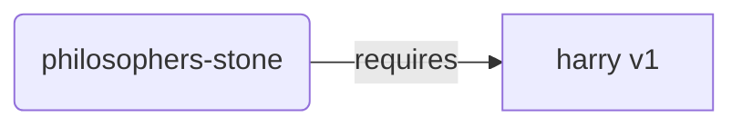
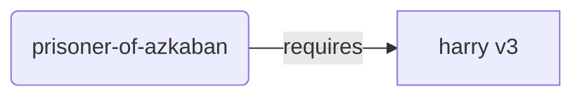
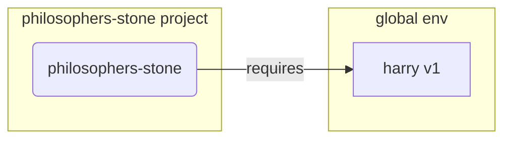
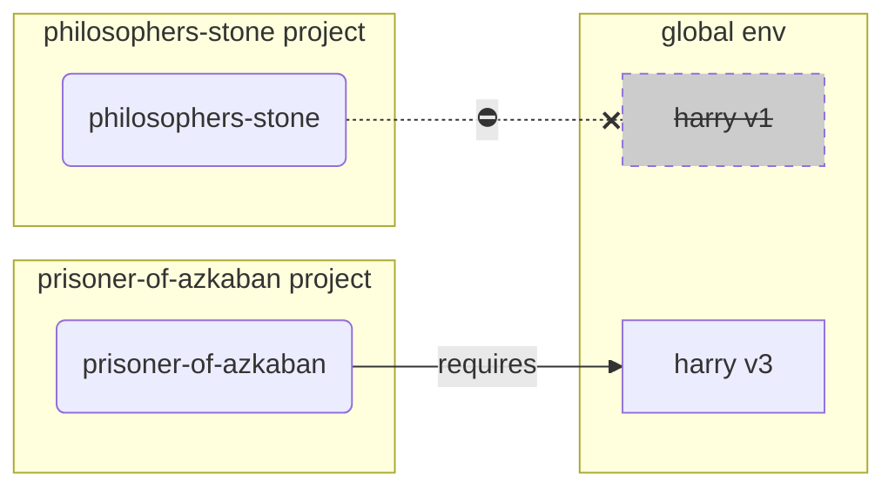
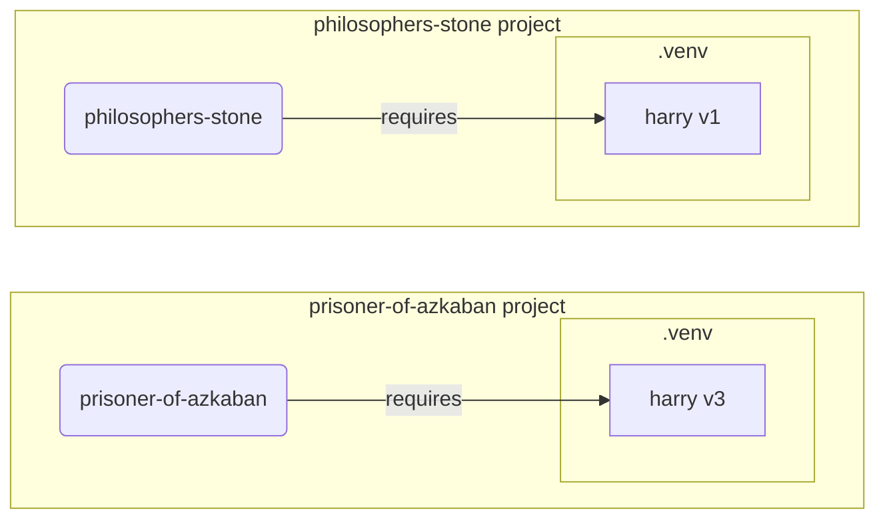

# Виртуальные окружения { #virtual-environments }

При работе с проектами на Python рекомендуется использовать **виртуальное окружение** (или похожий механизм), чтобы изолировать пакеты, которые вы устанавливаете для каждого проекта.

/// info | Дополнительная информация

Если вы уже знакомы с виртуальными окружениями, знаете, как их создавать и использовать, вы можете пропустить этот раздел. 🤓

///

/// tip | Подсказка

**Виртуальное окружение** — это не то же самое, что **переменная окружения**.

**Переменная окружения** — это переменная в системе, которую могут использовать программы.

**Виртуальное окружение** — это директория с файлами внутри.

///

/// info | Дополнительная информация

На этой странице вы узнаете, как пользоваться **виртуальными окружениями** и как они работают.

Если вы готовы начать использовать **инструмент, который управляет всем** за вас (включая установку Python), попробуйте <a href="https://github.com/astral-sh/uv" class="external-link" target="_blank">uv</a>.

///

## Создание проекта { #create-a-project }

Сначала создайте директорию для вашего проекта.

Обычно я создаю папку с именем `code` в моем домашнем каталоге.

А внутри неё создаю отдельную директорию для каждого проекта.

<div class="termy">

```console
// Перейдите в домашний каталог
$ cd
// Создайте директорию для всех ваших проектов с кодом
$ mkdir code
// Перейдите в эту директорию code
$ cd code
// Создайте директорию для этого проекта
$ mkdir awesome-project
// Перейдите в директорию проекта
$ cd awesome-project
```

</div>

## Создание виртуального окружения { #create-a-virtual-environment }

Когда вы начинаете работать над Python‑проектом **впервые**, создайте виртуальное окружение **<abbr title="есть и другие опции, но это простой ориентир">внутри вашего проекта</abbr>**.

/// tip | Подсказка

Делать это нужно **один раз на проект**, не каждый раз, когда вы работаете.

///

//// tab | `venv`

Для создания виртуального окружения вы можете использовать модуль `venv`, который поставляется вместе с Python.

<div class="termy">

```console
$ python -m venv .venv
```

</div>

/// details | Что делает эта команда?

* `python`: использовать программу под названием `python`
* `-m`: вызвать модуль как скрипт, далее мы укажем, какой модуль вызвать
* `venv`: использовать модуль `venv`, который обычно устанавливается вместе с Python
* `.venv`: создать виртуальное окружение в новой директории `.venv`

///

////

//// tab | `uv`

Если у вас установлен <a href="https://github.com/astral-sh/uv" class="external-link" target="_blank">`uv`</a>, вы можете использовать его для создания виртуального окружения.

<div class="termy">

```console
$ uv venv
```

</div>

/// tip | Подсказка

По умолчанию `uv` создаст виртуальное окружение в директории с именем `.venv`.

Но вы можете переопределить это, передав дополнительный аргумент с именем директории.

///

////

Эта команда создаст новое виртуальное окружение в директории `.venv`.

/// details | `.venv` или другое имя?

Вы можете создать виртуальное окружение в другой директории, но по соглашению его называют `.venv`.

///

## Активация виртуального окружения { #activate-the-virtual-environment }

Активируйте новое виртуальное окружение, чтобы все команды Python и устанавливаемые пакеты использовали именно его.

/// tip | Подсказка

Делайте это **каждый раз**, когда вы начинаете **новую сессию терминала** для работы над проектом.

///

//// tab | Linux, macOS

<div class="termy">

```console
$ source .venv/bin/activate
```

</div>

////

//// tab | Windows PowerShell

<div class="termy">

```console
$ .venv\Scripts\Activate.ps1
```

</div>

////

//// tab | Windows Bash

Или если вы используете Bash для Windows (например, <a href="https://gitforwindows.org/" class="external-link" target="_blank">Git Bash</a>):

<div class="termy">

```console
$ source .venv/Scripts/activate
```

</div>

////

/// tip | Подсказка

Каждый раз, когда вы устанавливаете **новый пакет** в это окружение, **активируйте** окружение снова.

Это гарантирует, что если вы используете **программу терминала (<abbr title="command line interface – интерфейс командной строки">CLI</abbr>)**, установленную этим пакетом, вы будете использовать именно ту, что из вашего виртуального окружения, а не какую‑то глобально установленную, возможно другой версии, чем вам нужна.

///

## Проверка, что виртуальное окружение активно { #check-the-virtual-environment-is-active }

Проверьте, что виртуальное окружение активно (предыдущая команда сработала).

/// tip | Подсказка

Это **необязательно**, но это хороший способ **проверить**, что всё работает как ожидается и вы используете запланированное виртуальное окружение.

///

//// tab | Linux, macOS, Windows Bash

<div class="termy">

```console
$ which python

/home/user/code/awesome-project/.venv/bin/python
```

</div>

Если отображается исполняемый файл `python` по пути `.venv/bin/python` внутри вашего проекта (в нашем случае `awesome-project`), значит всё сработало. 🎉

////

//// tab | Windows PowerShell

<div class="termy">

```console
$ Get-Command python

C:\Users\user\code\awesome-project\.venv\Scripts\python
```

</div>

Если отображается исполняемый файл `python` по пути `.venv\Scripts\python` внутри вашего проекта (в нашем случае `awesome-project`), значит всё сработало. 🎉

////

## Обновление `pip` { #upgrade-pip }

/// tip | Подсказка

Если вы используете <a href="https://github.com/astral-sh/uv" class="external-link" target="_blank">`uv`</a>, то для установки вы будете использовать его вместо `pip`, поэтому обновлять `pip` не нужно. 😎

///

Если для установки пакетов вы используете `pip` (он идёт по умолчанию вместе с Python), вам стоит **обновить** его до последней версии.

Многие экзотические ошибки при установке пакетов решаются простым предварительным обновлением `pip`.

/// tip | Подсказка

Обычно это делается **один раз**, сразу после создания виртуального окружения.

///

Убедитесь, что виртуальное окружение активно (см. команду выше) и запустите:

<div class="termy">

```console
$ python -m pip install --upgrade pip

---> 100%
```

</div>

## Добавление `.gitignore` { #add-gitignore }

Если вы используете **Git** (а вам стоит его использовать), добавьте файл `.gitignore`, чтобы исключить из Git всё, что находится в вашей `.venv`.

/// tip | Подсказка

Если вы использовали <a href="https://github.com/astral-sh/uv" class="external-link" target="_blank">`uv`</a> для создания виртуального окружения, он уже сделал это за вас — можно пропустить этот шаг. 😎

///

/// tip | Подсказка

Сделайте это **один раз**, сразу после создания виртуального окружения.

///

<div class="termy">

```console
$ echo "*" > .venv/.gitignore
```

</div>

/// details | Что делает эта команда?

* `echo "*"`: «напечатать» в терминале текст `*` (следующая часть немного меняет поведение)
* `>`: всё, что команда слева от `>` выводит в терминал, вместо печати нужно записать в файл, указанный справа от `>`
* `.gitignore`: имя файла, в который нужно записать текст

А `*` в Git означает «всё». То есть будет игнорироваться всё в директории `.venv`.

Эта команда создаст файл `.gitignore` со следующим содержимым:

```gitignore
*
```

///

## Установка пакетов { #install-packages }

После активации окружения вы можете устанавливать в него пакеты.

/// tip | Подсказка

Сделайте это **один раз** при установке или обновлении пакетов, необходимых вашему проекту.

Если вам нужно обновить версию или добавить новый пакет, вы **сделаете это снова**.

///

### Установка пакетов напрямую { #install-packages-directly }

Если вы торопитесь и не хотите объявлять зависимости проекта в отдельном файле, вы можете установить их напрямую.

/// tip | Подсказка

Очень хорошая идея — указать используемые вашим проектом пакеты и их версии в файле (например, `requirements.txt` или `pyproject.toml`).

///

//// tab | `pip`

<div class="termy">

```console
$ pip install "fastapi[standard]"

---> 100%
```

</div>

////

//// tab | `uv`

Если у вас установлен <a href="https://github.com/astral-sh/uv" class="external-link" target="_blank">`uv`</a>:

<div class="termy">

```console
$ uv pip install "fastapi[standard]"
---> 100%
```

</div>

////

### Установка из `requirements.txt` { #install-from-requirements-txt }

Если у вас есть `requirements.txt`, вы можете использовать его для установки пакетов.

//// tab | `pip`

<div class="termy">

```console
$ pip install -r requirements.txt
---> 100%
```

</div>

////

//// tab | `uv`

Если у вас установлен <a href="https://github.com/astral-sh/uv" class="external-link" target="_blank">`uv`</a>:

<div class="termy">

```console
$ uv pip install -r requirements.txt
---> 100%
```

</div>

////

/// details | `requirements.txt`

`requirements.txt` с некоторыми пакетами может выглядеть так:

```requirements.txt
fastapi[standard]==0.113.0
pydantic==2.8.0
```

///

## Запуск вашей программы { #run-your-program }

После активации виртуального окружения вы можете запустить свою программу, и она будет использовать Python из вашего виртуального окружения вместе с установленными там пакетами.

<div class="termy">

```console
$ python main.py

Hello World
```

</div>

## Настройка вашего редактора кода { #configure-your-editor }

Скорее всего, вы будете использовать редактор кода. Убедитесь, что вы настроили его на использование того же виртуального окружения, которое вы создали (обычно он определяет его автоматически), чтобы получить автозавершение и подсветку ошибок.

Например:

* <a href="https://code.visualstudio.com/docs/python/environments#_select-and-activate-an-environment" class="external-link" target="_blank">VS Code</a>
* <a href="https://www.jetbrains.com/help/pycharm/creating-virtual-environment.html" class="external-link" target="_blank">PyCharm</a>

/// tip | Подсказка

Обычно это нужно сделать только **один раз**, при создании виртуального окружения.

///

## Деактивация виртуального окружения { #deactivate-the-virtual-environment }

Когда закончите работу над проектом, вы можете **деактивировать** виртуальное окружение.

<div class="termy">

```console
$ deactivate
```

</div>

Таким образом, при запуске `python` он не будет пытаться запускаться из этого виртуального окружения с установленными там пакетами.

## Готово к работе { #ready-to-work }

Теперь вы готовы начать работать над своим проектом.


/// tip | Подсказка

Хотите понять, что это всё было выше?

Продолжайте читать. 👇🤓

///

## Зачем нужны виртуальные окружения { #why-virtual-environments }

Чтобы работать с FastAPI, вам нужно установить <a href="https://www.python.org/" class="external-link" target="_blank">Python</a>.

После этого вам нужно будет **установить** FastAPI и другие **пакеты**, которые вы хотите использовать.

Для установки пакетов обычно используют команду `pip`, которая идет вместе с Python (или альтернативные инструменты).

Тем не менее, если просто использовать `pip` напрямую, пакеты будут установлены в **глобальное окружение Python** (глобально установленный Python).

### Проблема { #the-problem }

Так в чём проблема установки пакетов в глобальное окружение Python?

Со временем вы, вероятно, будете писать много разных программ, зависящих от **разных пакетов**. И некоторые из ваших проектов будут зависеть от **разных версий** одного и того же пакета. 😱

Например, вы можете создать проект `philosophers-stone`, который зависит от пакета **`harry` версии `1`**. Значит, нужно установить `harry`.



Затем вы создаёте другой проект `prisoner-of-azkaban`, который тоже зависит от `harry`, но ему нужен **`harry` версии `3`**.



Проблема в том, что если устанавливать пакеты глобально (в глобальное окружение), а не в локальное **виртуальное окружение**, вам придётся выбирать, какую версию `harry` установить.

Если вы хотите запустить `philosophers-stone`, сначала нужно установить `harry` версии `1`, например так:

<div class="termy">

```console
$ pip install "harry==1"
```

</div>

Тогда у вас в глобальном окружении Python будет установлен `harry` версии `1`:



Но если затем вы захотите запустить `prisoner-of-azkaban`, вам нужно будет удалить `harry` версии `1` и установить `harry` версии `3` (или просто установка версии `3` автоматически удалит версию `1`).

<div class="termy">

```console
$ pip install "harry==3"
```

</div>

В итоге у вас будет установлен `harry` версии `3` в глобальном окружении Python.

А если вы снова попробуете запустить `philosophers-stone`, есть шанс, что он **не будет работать**, так как ему нужен `harry` версии `1`.



/// tip | Подсказка

В Python-пакетах часто стараются изо всех сил **избегать ломающих изменений** в **новых версиях**, но лучше действовать осторожно: устанавливать новые версии осознанно и тогда, когда вы можете прогнать тесты и убедиться, что всё работает корректно.

///

Теперь представьте то же самое с **многими** другими **пакетами**, от которых зависят все ваши **проекты**. Этим очень сложно управлять. И вы, скорее всего, в какой‑то момент будете запускать проекты с **несовместимыми версиями** пакетов и не понимать, почему что‑то не работает.

Кроме того, в зависимости от ОС (например, Linux, Windows, macOS), она может поставляться с уже установленным Python. И тогда, вероятно, в системе уже есть предустановленные пакеты определённых версий, **нужные вашей системе**. Если вы устанавливаете пакеты в глобальное окружение Python, вы можете в итоге **сломать** некоторые системные программы.

## Куда устанавливаются пакеты { #where-are-packages-installed }

Когда вы устанавливаете Python, на вашем компьютере создаются некоторые директории с файлами.

Часть этих директорий отвечает за хранение всех устанавливаемых вами пакетов.

Когда вы запускаете:

<div class="termy">

```console
// Не запускайте это сейчас, это просто пример 🤓
$ pip install "fastapi[standard]"
---> 100%
```

</div>

Будет загружен сжатый файл с кодом FastAPI, обычно с <a href="https://pypi.org/project/fastapi/" class="external-link" target="_blank">PyPI</a>.

Также будут **загружены** файлы для других пакетов, от которых зависит FastAPI.

Затем все эти файлы будут **распакованы** и помещены в директорию на вашем компьютере.

По умолчанию они попадут в директорию из вашей установки Python — это **глобальное окружение**.

## Что такое виртуальные окружения { #what-are-virtual-environments }

Решение проблемы с пакетами в глобальном окружении — использовать **виртуальное окружение для каждого проекта**, над которым вы работаете.

Виртуальное окружение — это **директория**, очень похожая на глобальную, куда вы можете устанавливать пакеты для конкретного проекта.

Таким образом, у каждого проекта будет своё виртуальное окружение (директория `.venv`) со своими пакетами.



## Что означает активация виртуального окружения { #what-does-activating-a-virtual-environment-mean }

Когда вы активируете виртуальное окружение, например так:

//// tab | Linux, macOS

<div class="termy">

```console
$ source .venv/bin/activate
```

</div>

////

//// tab | Windows PowerShell

<div class="termy">

```console
$ .venv\Scripts\Activate.ps1
```

</div>

////

//// tab | Windows Bash

Или если вы используете Bash для Windows (например, <a href="https://gitforwindows.org/" class="external-link" target="_blank">Git Bash</a>):

<div class="termy">

```console
$ source .venv/Scripts/activate
```

</div>

////

Эта команда создаст или изменит некоторые [переменные окружения](environment-variables.md){.internal-link target=_blank}, которые будут доступны для следующих команд.

Одна из таких переменных — `PATH`.

/// tip | Подсказка

Вы можете узнать больше о переменной окружения `PATH` в разделе [Переменные окружения](environment-variables.md#path-environment-variable){.internal-link target=_blank}.

///

Активация виртуального окружения добавляет его путь `.venv/bin` (на Linux и macOS) или `.venv\Scripts` (на Windows) в переменную окружения `PATH`.

Предположим, что до активации окружения переменная `PATH` выглядела так:

//// tab | Linux, macOS

```plaintext
/usr/bin:/bin:/usr/sbin:/sbin
```

Это означает, что система будет искать программы в:

* `/usr/bin`
* `/bin`
* `/usr/sbin`
* `/sbin`

////

//// tab | Windows

```plaintext
C:\Windows\System32
```

Это означает, что система будет искать программы в:

* `C:\Windows\System32`

////

После активации виртуального окружения переменная `PATH` будет выглядеть примерно так:

//// tab | Linux, macOS

```plaintext
/home/user/code/awesome-project/.venv/bin:/usr/bin:/bin:/usr/sbin:/sbin
```

Это означает, что теперь система в первую очередь будет искать программы в:

```plaintext
/home/user/code/awesome-project/.venv/bin
```

прежде чем искать в других директориях.

Поэтому, когда вы введёте в терминале `python`, система найдёт программу Python по пути

```plaintext
/home/user/code/awesome-project/.venv/bin/python
```

и использует именно её.

////

//// tab | Windows

```plaintext
C:\Users\user\code\awesome-project\.venv\Scripts;C:\Windows\System32
```

Это означает, что теперь система в первую очередь будет искать программы в:

```plaintext
C:\Users\user\code\awesome-project\.venv\Scripts
```

прежде чем искать в других директориях.

Поэтому, когда вы введёте в терминале `python`, система найдёт программу Python по пути

```plaintext
C:\Users\user\code\awesome-project\.venv\Scripts\python
```

и использует именно её.

////

Важная деталь: путь к виртуальному окружению будет добавлен в самое **начало** переменной `PATH`. Система найдёт его **раньше**, чем любой другой установленный Python. Таким образом, при запуске `python` будет использоваться Python **из виртуального окружения**, а не какой‑то другой `python` (например, из глобального окружения).

Активация виртуального окружения также меняет ещё несколько вещей, но это — одна из важнейших.

## Проверка виртуального окружения { #checking-a-virtual-environment }

Когда вы проверяете, активно ли виртуальное окружение, например, так:

//// tab | Linux, macOS, Windows Bash

<div class="termy">

```console
$ which python

/home/user/code/awesome-project/.venv/bin/python
```

</div>

////

//// tab | Windows PowerShell

<div class="termy">

```console
$ Get-Command python

C:\Users\user\code\awesome-project\.venv\Scripts\python
```

</div>

////

Это означает, что будет использоваться программа `python` **из виртуального окружения**.

На Linux и macOS используется `which`, а в Windows PowerShell — `Get-Command`.

Как работает эта команда: она проходит по переменной окружения `PATH`, идя **по каждому пути по порядку**, и ищет программу с именем `python`. Как только находит — **показывает путь** к этой программе.

Самое важное — при вызове `python` именно этот «`python`» и будет выполняться.

Так вы можете подтвердить, что находитесь в правильном виртуальном окружении.

/// tip | Подсказка

Легко активировать одно виртуальное окружение, получить один Python, а затем **перейти к другому проекту**.

И второй проект **не будет работать**, потому что вы используете **не тот Python**, из виртуального окружения другого проекта.

Полезно уметь проверить, какой именно `python` используется. 🤓

///

## Зачем деактивировать виртуальное окружение { #why-deactivate-a-virtual-environment }

Например, вы работаете над проектом `philosophers-stone`, **активируете виртуальное окружение**, устанавливаете пакеты и работаете с ним.

Затем вы хотите поработать над **другим проектом** `prisoner-of-azkaban`.

Вы переходите в этот проект:

<div class="termy">

```console
$ cd ~/code/prisoner-of-azkaban
```

</div>

Если вы не деактивируете виртуальное окружение `philosophers-stone`, при запуске `python` в терминале он попытается использовать Python из `philosophers-stone`.

<div class="termy">

```console
$ cd ~/code/prisoner-of-azkaban

$ python main.py

// Error importing sirius, it's not installed 😱
Traceback (most recent call last):
    File "main.py", line 1, in <module>
        import sirius
```

</div>

Но если вы деактивируете виртуальное окружение и активируете новое для `prisoner-of-askaban`, тогда при запуске `python` он будет использовать Python из виртуального окружения `prisoner-of-azkaban`.

<div class="termy">

```console
$ cd ~/code/prisoner-of-azkaban

// Вам не нужно находиться в старой директории, чтобы деактивировать окружение, вы можете сделать это где угодно, даже после перехода в другой проект 😎
$ deactivate

// Активируйте виртуальное окружение в prisoner-of-azkaban/.venv 🚀
$ source .venv/bin/activate

// Теперь при запуске python он найдёт пакет sirius, установленный в этом виртуальном окружении ✨
$ python main.py

I solemnly swear 🐺
```

</div>

## Альтернативы { #alternatives }

Это простое руководство, чтобы вы начали и поняли, как всё работает **под капотом**.

Существует много **альтернатив** для управления виртуальными окружениями, зависимостями (requirements), проектами.

Когда вы будете готовы и захотите использовать инструмент для **управления всем проектом** — зависимостями пакетов, виртуальными окружениями и т. п., я бы предложил попробовать <a href="https://github.com/astral-sh/uv" class="external-link" target="_blank">uv</a>.

`uv` может многое:

* **Устанавливать Python**, включая разные версии
* Управлять **виртуальным окружением** ваших проектов
* Устанавливать **пакеты**
* Управлять **зависимостями и версиями** пакетов вашего проекта
* Обеспечивать наличие **точного** набора пакетов и версий к установке, включая их зависимости, чтобы вы были уверены, что сможете запускать проект в продакшне точно так же, как и на компьютере при разработке — это называется **locking**
* И многое другое

## Заключение { #conclusion }

Если вы прочитали и поняли всё это, теперь **вы знаете гораздо больше** о виртуальных окружениях, чем многие разработчики. 🤓

Знание этих деталей, скорее всего, пригодится вам в будущем, когда вы будете отлаживать что‑то сложное: вы будете понимать, **как всё работает под капотом**. 😎
