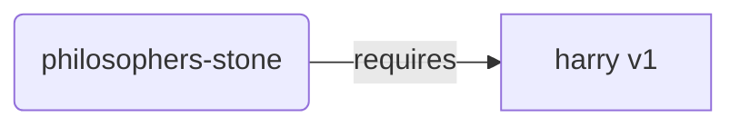
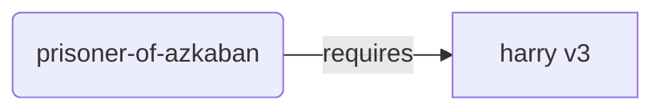
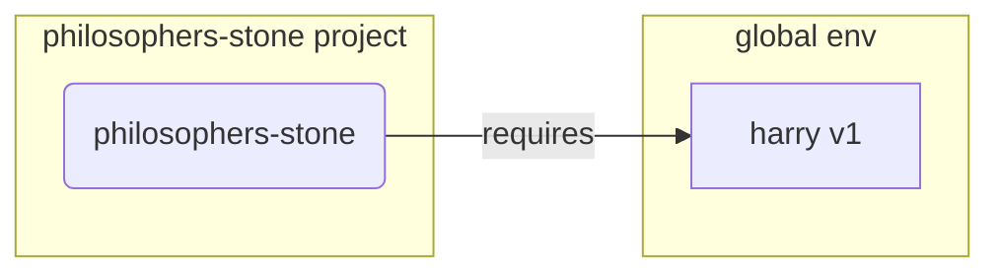
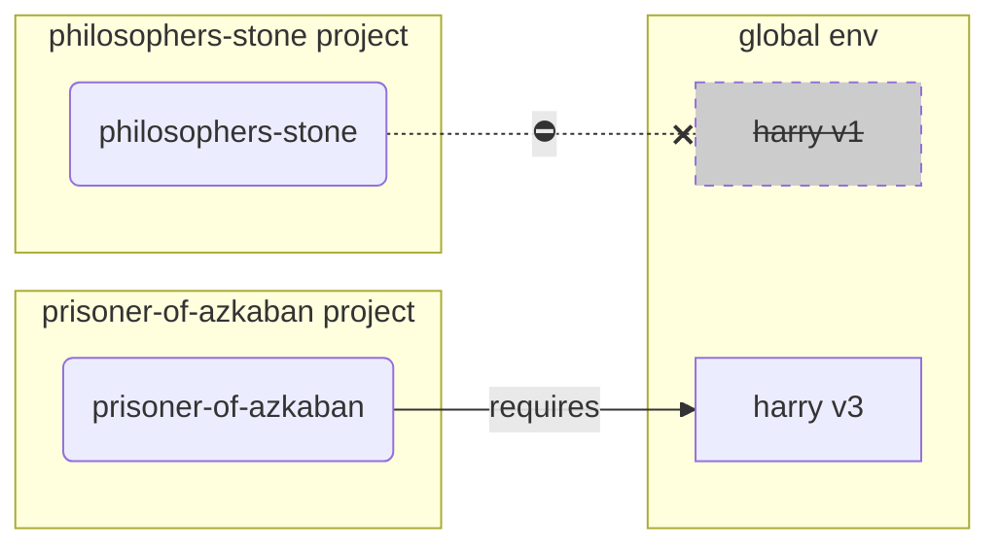
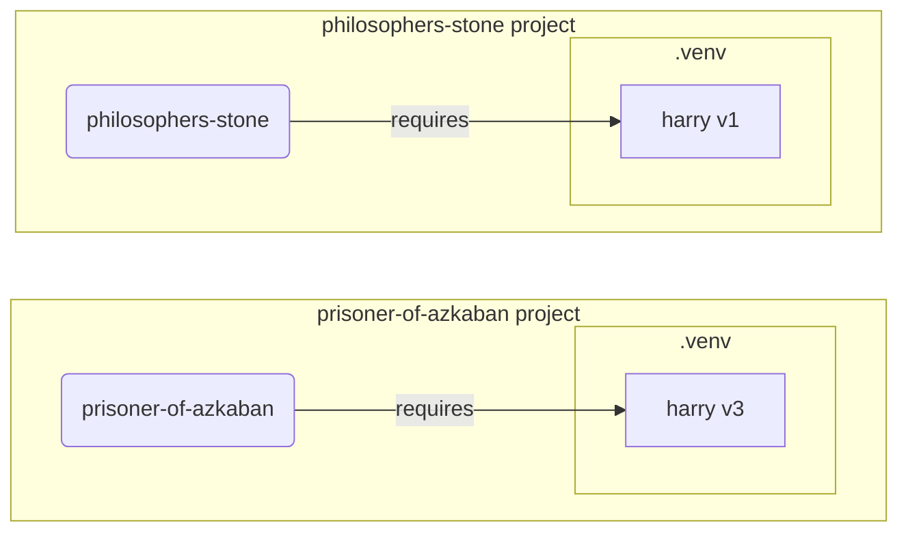

# Виртуальное окружение

Когда вы работаете с проектами на Python, рекомендуется использовать **виртуальное окружение** (или подобный механизм) для изоляции пакетов, которые вы устанавливаете для каждого проекта.

/// info | Дополнительная информация

Если вы уже знакомы с виртуальными окружениями, знаете, как их создавать и использовать, вы можете пропустить этот раздел. 🤓

///

/// tip | Подсказка

**Виртуальное окружение** отличается от **переменной окружения**.

**Переменная окружения** — это переменная в системе, которую могут использовать программы.

**Виртуальное окружение** — это директория с файлами.

///

/// info | Дополнительная информация

Этот раздел научит вас использовать **виртуальные окружения** и как они работают.

Если вы готовы использовать **инструмент, который управляет всем** за вас (включая установку Python), попробуйте <a href="https://github.com/astral-sh/uv" class="external-link" target="_blank">uv</a>.

///

## Создание проекта

Сначала создайте директорию для вашего проекта.

Обычно я создаю директорию, названную `code`, внутри моего домашнего каталога `/home/user`.

Затем, внутри этой директории, я создаю отдельную папку для каждого проекта.

<div class="termy">

```console
// Перейдите в домашний каталог
$ cd
// Создайте отдельную папку под всё ваше программное обеспечение (code)
$ mkdir code
// Войдите в директорию code
$ cd code
// Создайте директорию для данного проекта
$ mkdir awesome-project
// Перейдите в созданную директорию проекта
$ cd awesome-project
```

</div>

## Создание виртуального окружения

Когда вы начинаете работать над Python-проектом **впервые**, создайте виртуальное окружение **<abbr title="существуют и другие опции, это простая инструкция">внутри вашего проекта</abbr>**.

/// tip | Подсказка

Это нужно сделать **один раз для каждого проекта**, а не каждый раз, когда вы начинаете работу.

///

//// tab | `venv`

Для создания виртуального окружения можно использовать модуль `venv`, который встроен в Python.

<div class="termy">

```console
$ python -m venv .venv
```

</div>

/// details | Что делает эта команда?

* `python`: использовать программу под именем `python`
* `-m`: вызывать модуль как скрипт, в следующей инструкции мы укажем, какой модуль вызвать
* `venv`: использовать модуль под названием `venv`, который обычно устанавливается вместе с Python
* `.venv`: создать виртуальное окружение в новой директории `.venv`

///

////

//// tab | `uv`

Если вы установили <a href="https://github.com/astral-sh/uv" class="external-link" target="_blank">`uv`</a>, то вы можете использовать его для создания виртуального окружения.

<div class="termy">

```console
$ uv venv
```

</div>

/// tip | Подсказка

По умолчанию `uv` создаст виртуальное окружение в папке под названием `.venv`.

Но вы можете изменить это, передав дополнительный аргумент с именем директории.

///

////

Эта команда создаст новое виртуальное окружение в папке `.venv`.

/// details | `.venv` или другое имя?

Вы можете создать виртуальное окружение в другой директории, но традиционное (конвенциональное) название — `.venv`.

///

## Активация виртуального окружения

Активируйте виртуальное окружение, чтобы любая запускаемая команда Python или устанавливаемый пакет использовали его.

/// tip | Подсказка

Делайте это **каждый раз**, когда начинаете **новую сессию в терминале**, чтобы работать над проектом.

///

//// tab | Linux, macOS

<div class="termy">

```console
$ source .venv/bin/activate
```

</div>

////

//// tab | Windows PowerShell

<div class="termy">

```console
$ .venv\Scripts\Activate.ps1
```

</div>

////

//// tab | Windows Bash

Если вы используете Bash для Windows (например, <a href="https://gitforwindows.org/" class="external-link" target="_blank">Git Bash</a>):

<div class="termy">

```console
$ source .venv/Scripts/activate
```

</div>

////

## Проверка активации виртуального окружения

Проверьте, активировано ли виртуальное окружение (то есть, что предыдущая команда сработала).

/// tip | Подсказка

Эта проверка **необязательна**, но это хороший способ **убедиться**, что все работает, как ожидается, и вы используете нужное вам виртуальное окружение.

///

//// tab | Linux, macOS, Windows Bash

<div class="termy">

```console
$ which python

/home/user/code/awesome-project/.venv/bin/python
```

</div>

Если показывается бинарный файл `python` в `.venv/bin/python`, внутри вашего проекта (в данном случае `awesome-project`), это значит, что все сработало. 🎉

////

//// tab | Windows PowerShell

<div class="termy">

```console
$ Get-Command python

C:\Users\user\code\awesome-project\.venv\Scripts\python
```

</div>

Если показывается бинарный файл `python` в `.venv\Scripts\python`, внутри вашего проекта (в данном случае `awesome-project`), это значит, что все сработало. 🎉

////

## Обновление `pip`

/// tip | Подсказка

Если вы используете <a href="https://github.com/astral-sh/uv" class="external-link" target="_blank">`uv`</a>, вы должны будете использовать его для установки пакетов вместо `pip`, поэтому обновлять `pip` ненужно. 😎

///

Если вы используете `pip` для установки пакетов (он устанавливается по умолчанию вместе с Python), обновите его до последней версии.

Многие экзотические ошибки при установке пакетов решаются простым обновлением `pip`.

/// tip | Подсказка

Обычно это делается **один раз**, сразу после создания виртуального окружения.

///

Убедитесь, что виртуальное окружение активно (при помощи команды выше) и запустите:

<div class="termy">

```console
$ python -m pip install --upgrade pip

---> 100%
```

</div>

## Добавление `.gitignore`

Если вы используете **Git** (и вам стоит это делать), добавьте файл `.gitignore` и исключите всё в `.venv` из Git.

/// tip | Подсказка

Если вы использовали <a href="https://github.com/astral-sh/uv" class="external-link" target="_blank">`uv`</a> для создания виртуального окружения, то он уже сделал это за вас, и вы можете пропустить этот шаг. 😎

///

/// tip | Подсказка

Делайте это **один раз** после создания виртуального окружения.

///

<div class="termy">

```console
$ echo "*" > .venv/.gitignore
```

</div>

/// details | Что делает эта команда?

* `echo "*"`: напечатает текст `*` в терминале (следующая часть изменит это)
* `>`: всё, что будет напечатано в терминал командой с левой стороны от `>`, не печатать, а вместо этого записать в файл, который указан справа от `>`
* `.gitignore`: имя файла, в который должен быть записан текст

А `*` в Git означает "всё". Следовательно, будет проигнорировано всё, что содержится в директории `.venv`.

Эта команда создаст файл `.gitignore` со следующим содержимым:

```gitignore
*
```

///

## Установка пакетов

После активации окружения вы можете установить в него пакеты.

/// tip | Подсказка

Сделайте это **один раз**, при установке или обновлении пакетов, необходимых вашему проекту.

Если вам нужно обновить версию или добавить новый пакет, вы должны будете **сделать это снова**.

///

### Установка пакетов напрямую

Если вы торопитесь и не хотите объявлять зависимости проекта в отдельном файле, вы можете установить их напрямую.

/// tip | Подсказка

Очень хорошая идея — указать пакеты и версии, которые нужны вашей программе, в отдельном файле (например, `requirements.txt` или `pyproject.toml`).

///

//// tab | `pip`

<div class="termy">

```console
$ pip install "fastapi[standard]"

---> 100%
```

</div>

////

//// tab | `uv`

Если вы используете <a href="https://github.com/astral-sh/uv" class="external-link" target="_blank">`uv`</a>:

<div class="termy">

```console
$ uv pip install "fastapi[standard]"
---> 100%
```

</div>

////

### Установка из `requirements.txt`

Если у вас есть `requirements.txt`, вы можете использовать его для установки пакетов.

//// tab | `pip`

<div class="termy">

```console
$ pip install -r requirements.txt
---> 100%
```

</div>

////

//// tab | `uv`

Если вы используете <a href="https://github.com/astral-sh/uv" class="external-link" target="_blank">`uv`</a>:

<div class="termy">

```console
$ uv pip install -r requirements.txt
---> 100%
```

</div>

////

/// details | `requirements.txt`

Файл `requirements.txt` с некоторыми пакетами может выглядеть так:

```requirements.txt
fastapi[standard]==0.113.0
pydantic==2.8.0
```

///

## Запуск программы

После активации виртуального окружения вы можете запустить свою программу, и она будет использовать версию Python и пакеты, установленные в этом окружении.

<div class="termy">

```console
$ python main.py

Hello World
```

</div>

## Настройка редактора

Вы, вероятно, будете использовать редактор, убедитесь, что вы настроили его на использование того же виртуального окружения, которое вы создали (скорее всего, он обнаружит это автоматически), чтобы получить автозавершение и выделение ошибок в коде.

Например:

* <a href="https://code.visualstudio.com/docs/python/environments#_select-and-activate-an-environment" class="external-link" target="_blank">VS Code</a>
* <a href="https://www.jetbrains.com/help/pycharm/creating-virtual-environment.html" class="external-link" target="_blank">PyCharm</a>

/// tip | Подсказка

Обычно это нужно делать только **один раз**, когда вы создаете виртуальное окружение.

///

## Деактивация виртуального окружения

Когда вы закончите работу над проектом, вы можете **деактивировать** виртуальное окружение.

<div class="termy">

```console
$ deactivate
```

</div>

Итак, при запуске `python` не будет попыток использовать Python из этого виртуального окружения с установленными там пакетами.

## Все готово к работе

Теперь вы готовы начать работу над своим проектом.


/// tip | Подсказка

Хотите понять, что это было выше?

Продолжайте читать. 👇🤓

///

## Зачем нужно виртуальное окружение

Для работы с FastAPI вам нужно установить <a href="https://www.python.org/" class="external-link" target="_blank">Python</a>.

После этого, вам нужно будет **установить** FastAPI и любые другие **пакеты**, которые вы хотите использовать.

Для установки пакетов, как правило, используется команда `pip`, которая поставляется с Python (или альтернативные решения).

Тем не менее, если вы используете `pip` напрямую, пакеты будут установлены в **глобальное Python-окружение** (глобально установленный Python).

### Проблема

Так в чём же проблема с установкой пакетов в глобальное окружение Python?

В какой-то момент вы, вероятно, будете писать множество различных программ, которые зависят от **разных пакетов**. И некоторые из этих проектов, над которыми вы работаете, будут зависеть от **разных версий** одного и того же пакета. 😱

Например, вы можете создать проект, названный `philosophers-stone`, эта программа зависит от другого пакета, называемого **`harry`, использующего версию `1`**. Поэтому вам нужно установить `harry`.



Затем, в какой-то момент позже, вы создаете другой проект, называемый `prisoner-of-azkaban`, и этот проект также зависит от `harry`, но этот проект нуждается в **`harry` версии `3`**.



Но теперь проблема заключается в том, что если вы установите пакеты глобально (в глобальной среде) вместо локального **виртуального окружения**, то вам придется выбирать, какую версию `harry` устанавливать.

Если вы хотите запустить `philosophers-stone`, вам сначала нужно установить `harry` версии `1`, например вот так:

<div class="termy">

```console
$ pip install "harry==1"
```

</div>

И тогда у вас будет установлен `harry` версии `1` в вашем глобальном окружении Python.



Но потом, если вы хотите запустить `prisoner-of-azkaban`, вам придется удалить `harry` версии `1` и установить `harry` версии `3` (или установка версии `3` автоматически удалит версию `1`).

<div class="termy">

```console
$ pip install "harry==3"
```

</div>

И тогда у вас будет установлен `harry` версии `3` в вашем глобальном окружении Python.

И если вы попытаетесь снова запустить `philosophers-stone`, существует вероятность, что он **не будет работать**, потому что ему нужен `harry` версии `1`.



/// tip | Подсказка

В пакетах Python очень часто стараются изо всех сил **избегать внесения критических изменений** в **новые версии**, но лучше перестраховаться и планово устанавливать новые версии, а затем запускать тесты, чтобы проверить, всё ли работает правильно.

///

Теперь представьте, что это происходит с **многими другими** **пакетами**, от которых зависят все ваши **проекты**. Управлять этим очень трудно. И вы, вероятно, в итоге будете запускать некоторые проекты с **несовместимыми версиями** пакетов, и не будете знать, почему что-то не работает.

Кроме того, в зависимости от используемой вами операционной системы (например, Linux, Windows, macOS), она может поставляться уже с установленным Python. И в этом случае, вероятно, были установлены некоторые системные пакеты с определёнными **версиями**, **необходимыми вашей системе**. Если вы установите пакеты в глобальное окружение Python, вы можете **сломать** некоторые из программ, которые поставлялись вместе с вашей операционной системой.

## Куда устанавливаются пакеты

Когда вы устанавливаете Python, он создаёт на вашем компьютере несколько директорий с файлами.

Некоторые из этих директорий ответственны за хранение всех устанавливаемых вами пакетов.

Когда вы запустите:

<div class="termy">

```console
// Не запускайте эту команду сейчас, это просто пример 🤓
$ pip install "fastapi[standard]"
---> 100%
```

</div>

Это скачает сжатый файл с кодом FastAPI, обычно с <a href="https://pypi.org/project/fastapi/" class="external-link" target="_blank">PyPI</a>.

Он также **скачает** файлы для других пакетов, от которых зависит FastAPI.

Затем он **извлечёт** все эти файлы и разместит их в директории на вашем компьютере.

По умолчанию, он поместит эти загруженные и распакованные файлы в директорию установку Python, это и есть **глобальное окружение**.

## Что такое виртуальное окружение

Решением проблемы размещения всех пакетов в глобальной среде является использование **виртуального окружения для каждого проекта**, над которым вы работаете.

Виртуальное окружение — это **директория**, очень похожая на глобальную, в которой вы можете устанавливать пакеты для проекта.

Таким образом, у каждого проекта будет своё виртуальное окружение (директория `.venv`) с собственными пакетами.



## Что означает активация виртуального окружения

Когда вы активируете виртуальное окружение, например:

//// tab | Linux, macOS

<div class="termy">

```console
$ source .venv/bin/activate
```

</div>

////

//// tab | Windows PowerShell

<div class="termy">

```console
$ .venv\Scripts\Activate.ps1
```

</div>

////

//// tab | Windows Bash

Или если вы используете Bash для Windows (например, <a href="https://gitforwindows.org/" class="external-link" target="_blank">Git Bash</a>):

<div class="termy">

```console
$ source .venv/Scripts/activate
```

</div>

////

Эта команда создаст или изменит некоторые [переменные окружения](environment-variables.md){.internal-link target=_blank}, которые будут доступны для последующих команд.

Одна из этих переменных называется `PATH`.

/// tip | Подсказка

Вы можете больше узнать о переменной окружения `PATH` в разделе [Переменные окружения](environment-variables.md#path-environment-variable){.internal-link target=_blank}.

///

Активация виртуального окружения добавляет его путь `.venv/bin` (на Linux и macOS) или `.venv\Scripts` (на Windows) к переменной окружения `PATH`.

Предположим, что до активации окружения переменная `PATH` выглядела так:

//// tab | Linux, macOS

```plaintext
/usr/bin:/bin:/usr/sbin:/sbin
```

Это означает, что система будет искать программы в:

* `/usr/bin`
* `/bin`
* `/usr/sbin`
* `/sbin`

////

//// tab | Windows

```plaintext
C:\Windows\System32
```

Это означает, что система будет искать программы в:

* `C:\Windows\System32`

////

После активации виртуального окружения переменная окружения `PATH` будет выглядеть примерно так:

//// tab | Linux, macOS

```plaintext
/home/user/code/awesome-project/.venv/bin:/usr/bin:/bin:/usr/sbin:/sbin
```

Это означает, что система теперь будет в первую очередь искать программы в:

```plaintext
/home/user/code/awesome-project/.venv/bin
```

прежде чем искать в других директориях.

Так что, когда вы вводите `python` в терминале, система найдет программу Python в

```plaintext
/home/user/code/awesome-project/.venv/bin/python
```

и использует именно её.

////

//// tab | Windows

```plaintext
C:\Users\user\code\awesome-project\.venv\Scripts;C:\Windows\System32
```

Это означает, что система теперь будет в первую очередь искать программы в:

```plaintext
C:\Users\user\code\awesome-project\.venv\Scripts
```

прежде чем искать в других директориях.

Так что, когда вы вводите `python` в терминале, система найдет программу Python в

```plaintext
C:\Users\user\code\awesome-project\.venv\Scripts\python
```

и использует именно её.

////

Важная деталь заключается в том, что путь к виртуальному окружению будет помещён в самое **начало** переменной `PATH`. Система найдет его **до** обнаружения любого другого доступного Python. Таким образом, когда вы запускаете `python`, он будет использовать **Python из виртуального окружения**, а не какой-либо другой `python` (например, `python` из глобального окружения).

Активация виртуального окружения также изменяет несколько других вещей, но это одна из самых важных вещей, которые она делает.

## Проверка виртуального окружения

Когда вы проверяете, активировано ли виртуальное окружение, например:

//// tab | Linux, macOS, Windows Bash

<div class="termy">

```console
$ which python

/home/user/code/awesome-project/.venv/bin/python
```

</div>

////

//// tab | Windows PowerShell

<div class="termy">

```console
$ Get-Command python

C:\Users\user\code\awesome-project\.venv\Scripts\python
```

</div>

////

Это означает, что программа `python`, которая будет использована, — это та, что находится **в виртуальной среде разработки**.

Вы используете `which` на Linux и macOS и `Get-Command` на Windows PowerShell.

Способ работы этой команды заключается в том, что она пойдёт и проверит переменную окружения `PATH`, проходя **каждый путь по порядку**, в поисках программы под названием `python`. Как только она её найдет, она **покажет вам путь** к этой программе.

Самое важное тут в том, что когда вы вызываете `python`, именно этот "`python`" будет выполнен.

Таким образом, вы можете убедиться, что используете верное виртуальное окружение.

/// tip | Подсказка

Легко активировать одно виртуальное окружение, получить одного Python, а затем **перейти к другому проекту**.

И второе проект **не будет работать**, потому что вы используете **неправильный Python** из виртуального окружения для другого проекта.

Это очень полезно уметь проверять, какой `python` используется. 🤓

///

## Почему деактивировать виртуальное окружение

Например, вы можете работать над проектом `philosophers-stone`, **активировать это виртуальное окружение**, установить пакеты и работать с этой средой.

И затем вы хотите работать над **другим проектом** `prisoner-of-azkaban`.

Вы переходите к этому проекту:

<div class="termy">

```console
$ cd ~/code/prisoner-of-azkaban
```

</div>

Если вы не деактивируете виртуальное окружение для `philosophers-stone`, когда вы запускаете `python` в терминале, оно будет пытаться использовать Python из `philosophers-stone`.

<div class="termy">

```console
$ cd ~/code/prisoner-of-azkaban

$ python main.py

// Ошибка импорта sirius, он не установлен 😱
Traceback (most recent call last):
    File "main.py", line 1, in <module>
        import sirius
```

</div>

Но если вы деактивируете виртуальное окружение и активируете новое для `prisoner-of-askaban`, то когда вы запускаете `python`, он будет использовать Python из виртуального окружения в `prisoner-of-azkaban`.

<div class="termy">

```console
$ cd ~/code/prisoner-of-azkaban

// Вам не нужно находиться в старой директории, чтобы деактивировать, вы можете сделать это в любом месте, даже после перехода к другому проекту 😎
$ deactivate

// Активируйте виртуальную среду в prisoner-of-azkaban/.venv 🚀
$ source .venv/bin/activate

// Теперь, когда вы запускаете python, он найдет пакет sirius, установленный в этом виртуальном окружении ✨
$ python main.py

Я торжественно клянусь 🐺
```

</div>

## Альтернативы

Это простое руководство поможет вам начать и научит тому, как все работает **изнутри**.

Существует множество **альтернатив** для управления виртуальными окружениями, зависимостями пакетов (requirements), проектами.

Когда вы будете готовы и захотите использовать инструмент для **управления всей проектом**, зависимостями пакетов, виртуальными окружениями и т.д., я рекомендую попробовать <a href="https://github.com/astral-sh/uv" class="external-link" target="_blank">uv</a>.

`uv` может делать много вещей, может:

* **Устанавливать Python** для вас, включая различные версии
* Управлять **виртуальным окружением** для ваших проектов
* Устанавливать **пакеты**
* Управлять **зависимостями и версиями** пакетов для вашего проекта
* Убедиться, что у вас есть **точный** набор пакетов и версий для установки, включая их зависимости, так что вы можете быть уверены, что вы сможете запустить ваш проект в production точно так же, как на вашем компьютере, когда разрабатываете, это называется **locking**
* И многое другое

## Заключение

Если вы прочитали и поняли все это, то теперь **вы знаете гораздо больше** о виртуальных окружениях, чем многие другие разработчики. 🤓

Знание этих деталей, скорее всего, будет полезно вам в будущем, когда вы будете отлаживать что-то, что кажется сложным, потому что вы будете знать, **как все работает изнутри**. 😎
