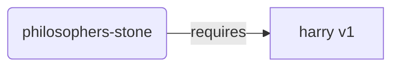
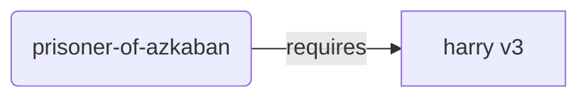
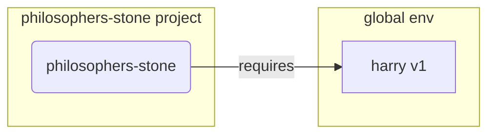
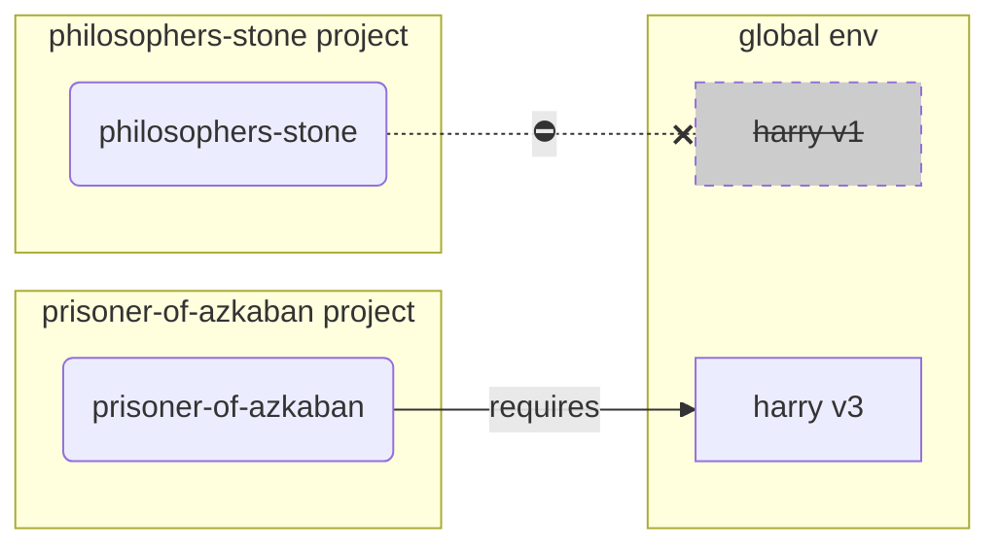
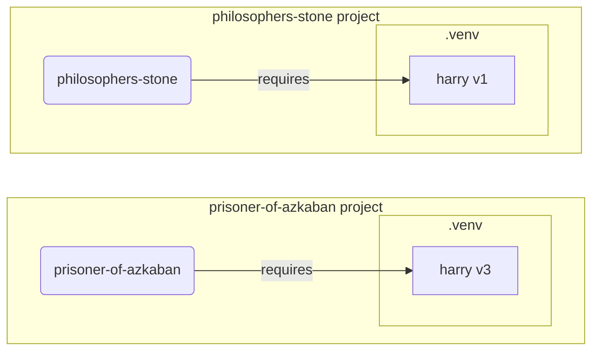

# Виртуальная среда

При работе с проектами в Python рекомендуется использовать **виртуальную среду разработки** (или какой-нибудь другой подобный механизм). Это нужно для того, чтобы изолировать устанавливаемые пакеты для каждого отдельного проекта.

/// info | Дополнительная информация

Если вы уже знакомы с виртуальными средами разработки, знаете как их создавать и использовать, то вы можете свободно пропустить данный раздел. 🤓

///

/// tip | Подсказка

**Виртуальная среда** и **переменная окружения** это две разные вещи.

**Переменная окружения** это системная переменная, которую могут использовать программы.

**Виртуальная среда** это папка, содержащая файлы.

///

/// info | Дополнительная информация

В этом разделе мы научим вас пользоваться виртуальными средами разработки и расскажем, как они работают.

Если же вы готовы воспользоваться инструментом, **который умеет управлять всем, что касается Python-проектов**,
(включая установку Python), то попробуйте <a href="https://github.com/astral-sh/uv" class="external-link" target="_blank">uv</a>.
 
///

## Создание проекта

В первую очередь, создайте директорию для вашего проекта.

Я обычно создаю папку под названием `code` внутри моего домашнего каталога `/home/user`.

Затем внутри данной папки я создаю отдельную директорию под каждый свой проект. 

<div class="termy">

```console
// Перейдите в домашний каталог
$ cd
// Создайте отдельную папку под все будущие программные проекты (code)
$ mkdir code
// Войдите в директорию code
$ cd code
// Создайте директрорию под данный проект (awesome-project)
$ mkdir awesome-project
// Перейдите в созданную директорию проекта
$ cd awesome-project
```

</div>

## Создание виртуальной среды разработки

Начиная работу с Python-проектом, сразу же создавайте виртуальную среду разработки 
**<abbr title="есть и другие опции, но мы рассмотрим наиболее простой вариант">внутри вашего проекта</abbr>**.

/// tip | Подсказка

Виртуальная среда разработки создается один раз, и в дальнейшем, работая с проектом, этого больше делать не придется.

///

//// tab | `venv`

Для создания виртуальной среды вы можете воспользоваться модулем `venv`, который является частью встроенной библиотеки Python.

<div class="termy">

```console
$ python -m venv .venv
```

</div>

/// details | Что делает эта команда?

* `python`: использует программу под именем `python`
* `-m`: вызывает модуль как скрипт, в следующей инструкции мы скажем какой именно модуль вызван
* `venv`: использует модуль под названием `venv`, который обычно устанавливается вместе с Python
* `.venv`: создает виртуальную среду разработки в новой директории `.venv`

///

////

//// tab | `uv`

Если вы установили <a href="https://github.com/astral-sh/uv" class="external-link" target="_blank">`uv`</a>, то вы можете им воспользоваться для создания виртуальной среды разработки.

<div class="termy">

```console
$ uv venv
```

</div>

/// tip | Подсказка

По умолчанию `uv` создаст виртуальную среду разработки в папке под названием `.venv`.

Но вы можете это изменить, передав дополнительный аргумент с именем директории.

///

////

Данная команда создаст новую виртуальную среду разработки в папке `.venv`.

/// details | `.venv` или другое имя?

Вы можете поместить виртуальную среду разработки в папку с другим именем, но традиционным (конвенциональным) названием является `.venv` .

///

## Активация виртуальной среды разработки

Активируйте виртуальную среду разработки, и тогда любая запускаемая Python-команда или устанавливаемый пакет будут ее использовать.

/// tip | Подсказка

При работе над проектом делайте это **каждый раз** при запуске **новой сессии в терминале**.

///

//// tab | Linux, macOS

<div class="termy">

```console
$ source .venv/bin/activate
```

</div>

////

//// tab | Windows PowerShell

<div class="termy">

```console
$ .venv\Scripts\Activate.ps1
```

</div>

////

//// tab | Windows Bash

Или при использовании Bash для Windows (напр. <a href="https://gitforwindows.org/" class="external-link" target="_blank">Git Bash</a>):

<div class="termy">

```console
$ source .venv/Scripts/activate
```

</div>

////

/// tip | Подсказка

Каждый раз при установке **нового пакета** в виртуальное окружение, ре-активируйте виртуальную среду.

Благодаря этому, вы можете быть уверены в том, что при использовании консольного приложения, установленного с помощью данного пакета, было использовано именно приложение из вашей виртуальной среды разработки, а не какое-либо другое, установленное глобально и, возможно, не той версии, что вам нужно.

///

## Проверка активации виртуальной среды

Проверьте, активна ли виртуальная среда (предыдущая команда сработала).

/// tip | Подсказка

Убедитесь в том, что все работает так, как нужно, и вы используете именно ту виртуальную среду разработки, которую нужно. Делать это необязательно, но желательно.

///

//// tab | Linux, macOS, Windows Bash

<div class="termy">

```console
$ which python

/home/user/code/awesome-project/.venv/bin/python
```

</div>

Если данная команда возвращает `python`-бинарник `.venv/bin/python`, находящийся внутри виртуальной среды вашего проекта (у нас это `awesome-project`), значит все отработало как нужно. 🎉

////

//// tab | Windows PowerShell

<div class="termy">

```console
$ Get-Command python

C:\Users\user\code\awesome-project\.venv\Scripts\python
```

</div>

Если данная команда возвращает `python`-бинарник `.venv\Scripts\python`, находящийся внутри виртуальной среды вашего проекта (у нас это `awesome-project`), значит все отработало как нужно. 🎉

////

## Обновление `pip`

/// tip | Подсказка

Если вы используете <a href="https://github.com/astral-sh/uv" class="external-link" target="_blank">`uv`</a>, то вы должны будете его использовать для установки пакетов вместо `pip`, поэтому обновлять `pip` вам ненужно. 😎

///

Если для установки пакетов вы используете `pip` (он устанавливается по умолчанию вместе с Python), то обновите `pip` до последней версии.

Большинство экзотических ошибок, возникающих при установки пакетов, устраняется предварительным обновлением `pip`.

/// tip | Подсказка

Обычно это делается только один раз, сразу после создания виртуальной среды разработки.

///

Убедитесь в том, что виртуальная среда активирована (с помощью вышестоящей команды) и запустите следующую команду:

<div class="termy">

```console
$ python -m pip install --upgrade pip

---> 100%
```

</div>

## Добавление `.gitignore`

Если вы используете **Git** (а вы должны его использовать), то добавьте файл `.gitignore` и исключите из Git всё, что находится в папке `.venv`.

/// tip | Подсказка

Если для создания виртуальной среды вы используете <a href="https://github.com/astral-sh/uv" class="external-link" target="_blank">`uv`</a>, то для вас все уже сделано, и вы можете пропустить этот шаг. 😎

///

/// tip | Подсказка 

Это делается один раз, сразу после создания виртуальной среды разработки.

///

<div class="termy">

```console
$ echo "*" > .venv/.gitignore
```

</div>

/// details | Что делает эта команда?

* `echo "*"`: печатает `*` в консоли (следующий шаг это слегка изменит)
* `>`: все что находится слева от `>` не будет напечатано в консоль, но будет записано в файл находящийся справа от `>`
* `.gitignore`: имя файла, в который будет помещен текст.

`*` в Git означает "всё". Т.е. будет проигнорировано всё, что содержится в папке `.venv`.

Данная команда создаст файл `.gitignore` следующего содержания:

```gitignore
*
```

///

## Установка пакетов

После установки виртуальной среды, вы можете устанавливать в нее пакеты.

/// tip | Подсказка

Делайте это **один раз**, при установке или обновлении пакетов, нужных вашему проекту.

Если вам нужно обновить версию пакета или добавить новый пакет, то вам придется **делать это снова**.

///

### Установка пакетов напрямую

Если вы торопитесь и не хотите объявлять зависимости проекта в отдельном файле, то вы можете установить их напрямую.

/// tip | Подсказка

Объявление пакетов, которые использует ваш проект, и их версий в отдельном файле (например, в `requirements.txt` или в `pyproject.toml`) - это отличная идея.

///

//// tab | `pip`

<div class="termy">

```console
$ pip install "fastapi[standard]"

---> 100%
```

</div>

////

//// tab | `uv`

Если вы используете <a href="https://github.com/astral-sh/uv" class="external-link" target="_blank">`uv`</a>:

<div class="termy">

```console
$ uv pip install "fastapi[standard]"
---> 100%
```

</div>

////

### Установка из `requirements.txt`

Если у вас есть `requirements.txt`, то вы можете его использовать для установки пакетов.

//// tab | `pip`

<div class="termy">

```console
$ pip install -r requirements.txt
---> 100%
```

</div>

////

//// tab | `uv`

Если вы используете <a href="https://github.com/astral-sh/uv" class="external-link" target="_blank">`uv`</a>:

<div class="termy">

```console
$ uv pip install -r requirements.txt
---> 100%
```

</div>

////

/// details | `requirements.txt`

`requirements.txt` с парочкой пакетов внутри выглядит приблизительно так:

```requirements.txt
fastapi[standard]==0.113.0
pydantic==2.8.0
```

///

## Запуск программы

После активации виртуальной среды разработки вы можете запустить свою программу, и она будет использовать версию Python
и пакеты, установленные в виртуальной среде.

<div class="termy">

```console
$ python main.py

Hello World
```

</div>

## Настройка редактора

Вероятно, вы захотите воспользоваться редактором. Убедитесь, что вы настроили его на использование той самой виртуальной среды, которую вы создали. (Скорее всего, она автоматически будет обнаружена). Это позволит вам использовать авто-завершение и выделение ошибок в редакторе.

Например:

* <a href="https://code.visualstudio.com/docs/python/environments#_select-and-activate-an-environment" class="external-link" target="_blank">VS Code</a>
* <a href="https://www.jetbrains.com/help/pycharm/creating-virtual-environment.html" class="external-link" target="_blank">PyCharm</a>

/// tip | Подсказка

Обычно, это делается один раз, при создании виртуальной среды разработки.

///

## Деактивация виртуальной среды разработки

При окончании работы над проектом вы можете деактивировать виртуальную среду.

<div class="termy">

```console
$ deactivate
```

</div>

Таким образом, запущенный `python` больше не будет запускаться из этой виртуальной среды вместе с установленными в ней пакетами.

## Все готово к работе

Теперь вы готовы к тому, чтобы начать работу над своим проектом.


/// tip | Подсказка

Хотите разобраться со всем, что написано выше?

Продолжайте читать. 👇🤓

///

## Why Virtual Environments

To work with FastAPI you need to install <a href="https://www.python.org/" class="external-link" target="_blank">Python</a>.

After that, you would need to **install** FastAPI and any other **packages** you want to use.

To install packages you would normally use the `pip` command that comes with Python (or similar alternatives).

Nevertheless, if you just use `pip` directly, the packages would be installed in your **global Python environment** (the global installation of Python).

### The Problem

So, what's the problem with installing packages in the global Python environment?

At some point, you will probably end up writing many different programs that depend on **different packages**. And some of these projects you work on will depend on **different versions** of the same package. 😱

For example, you could create a project called `philosophers-stone`, this program depends on another package called **`harry`, using the version `1`**. So, you need to install `harry`.



Then, at some point later, you create another project called `prisoner-of-azkaban`, and this project also depends on `harry`, but this project needs **`harry` version `3`**.



But now the problem is, if you install the packages globally (in the global environment) instead of in a local **virtual environment**, you will have to choose which version of `harry` to install.

If you want to run `philosophers-stone` you will need to first install `harry` version `1`, for example with:

<div class="termy">

```console
$ pip install "harry==1"
```

</div>

And then you would end up with `harry` version `1` installed in your global Python environment.



But then if you want to run `prisoner-of-azkaban`, you will need to uninstall `harry` version `1` and install `harry` version `3` (or just installing version `3` would automatically uninstall version `1`).

<div class="termy">

```console
$ pip install "harry==3"
```

</div>

And then you would end up with `harry` version `3` installed in your global Python environment.

And if you try to run `philosophers-stone` again, there's a chance it would **not work** because it needs `harry` version `1`.



/// tip | Подсказка

It's very common in Python packages to try the best to **avoid breaking changes** in **new versions**, but it's better to be safe, and install newer versions intentionally and when you can run the tests to check everything is working correctly.

///

Now, imagine that with **many** other **packages** that all your **projects depend on**. That's very difficult to manage. And you would probably end up running some projects with some **incompatible versions** of the packages, and not knowing why something isn't working.

Also, depending on your operating system (e.g. Linux, Windows, macOS), it could have come with Python already installed. And in that case it probably had some packages pre-installed with some specific versions **needed by your system**. If you install packages in the global Python environment, you could end up **breaking** some of the programs that came with your operating system.

## Where are Packages Installed

When you install Python, it creates some directories with some files in your computer.

Some of these directories are the ones in charge of having all the packages you install.

When you run:

<div class="termy">

```console
// Don't run this now, it's just an example 🤓
$ pip install "fastapi[standard]"
---> 100%
```

</div>

That will download a compressed file with the FastAPI code, normally from <a href="https://pypi.org/project/fastapi/" class="external-link" target="_blank">PyPI</a>.

It will also **download** files for other packages that FastAPI depends on.

Then it will **extract** all those files and put them in a directory in your computer.

By default, it will put those files downloaded and extracted in the directory that comes with your Python installation, that's the **global environment**.

## What are Virtual Environments

The solution to the problems of having all the packages in the global environment is to use a **virtual environment for each project** you work on.

A virtual environment is a **directory**, very similar to the global one, where you can install the packages for a project.

This way, each project will have its own virtual environment (`.venv` directory) with its own packages.



## What Does Activating a Virtual Environment Mean

When you activate a virtual environment, for example with:

//// tab | Linux, macOS

<div class="termy">

```console
$ source .venv/bin/activate
```

</div>

////

//// tab | Windows PowerShell

<div class="termy">

```console
$ .venv\Scripts\Activate.ps1
```

</div>

////

//// tab | Windows Bash

Or if you use Bash for Windows (e.g. <a href="https://gitforwindows.org/" class="external-link" target="_blank">Git Bash</a>):

<div class="termy">

```console
$ source .venv/Scripts/activate
```

</div>

////

That command will create or modify some [environment variables](environment-variables.md){.internal-link target=_blank} that will be available for the next commands.

One of those variables is the `PATH` variable.

/// tip | Подсказка

You can learn more about the `PATH` environment variable in the [Environment Variables](environment-variables.md#path-environment-variable){.internal-link target=_blank} section.

///

Activating a virtual environment adds its path `.venv/bin` (on Linux and macOS) or `.venv\Scripts` (on Windows) to the `PATH` environment variable.

Let's say that before activating the environment, the `PATH` variable looked like this:

//// tab | Linux, macOS

```plaintext
/usr/bin:/bin:/usr/sbin:/sbin
```

That means that the system would look for programs in:

* `/usr/bin`
* `/bin`
* `/usr/sbin`
* `/sbin`

////

//// tab | Windows

```plaintext
C:\Windows\System32
```

That means that the system would look for programs in:

* `C:\Windows\System32`

////

After activating the virtual environment, the `PATH` variable would look something like this:

//// tab | Linux, macOS

```plaintext
/home/user/code/awesome-project/.venv/bin:/usr/bin:/bin:/usr/sbin:/sbin
```

That means that the system will now start looking first look for programs in:

```plaintext
/home/user/code/awesome-project/.venv/bin
```

before looking in the other directories.

So, when you type `python` in the terminal, the system will find the Python program in

```plaintext
/home/user/code/awesome-project/.venv/bin/python
```

and use that one.

////

//// tab | Windows

```plaintext
C:\Users\user\code\awesome-project\.venv\Scripts;C:\Windows\System32
```

That means that the system will now start looking first look for programs in:

```plaintext
C:\Users\user\code\awesome-project\.venv\Scripts
```

before looking in the other directories.

So, when you type `python` in the terminal, the system will find the Python program in

```plaintext
C:\Users\user\code\awesome-project\.venv\Scripts\python
```

and use that one.

////

An important detail is that it will put the virtual environment path at the **beginning** of the `PATH` variable. The system will find it **before** finding any other Python available. This way, when you run `python`, it will use the Python **from the virtual environment** instead of any other `python` (for example, a `python` from a global environment).

Activating a virtual environment also changes a couple of other things, but this is one of the most important things it does.

## Checking a Virtual Environment

When you check if a virtual environment is active, for example with:

//// tab | Linux, macOS, Windows Bash

<div class="termy">

```console
$ which python

/home/user/code/awesome-project/.venv/bin/python
```

</div>

////

//// tab | Windows PowerShell

<div class="termy">

```console
$ Get-Command python

C:\Users\user\code\awesome-project\.venv\Scripts\python
```

</div>

////

That means that the `python` program that will be used is the one **in the virtual environment**.

you use `which` in Linux and macOS and `Get-Command` in Windows PowerShell.

The way that command works is that it will go and check in the `PATH` environment variable, going through **each path in order**, looking for the program called `python`. Once it finds it, it will **show you the path** to that program.

The most important part is that when you call `python`, that is the exact "`python`" that will be executed.

So, you can confirm if you are in the correct virtual environment.

/// tip | Подсказка

It's easy to activate one virtual environment, get one Python, and then **go to another project**.

And the second project **wouldn't work** because you are using the **incorrect Python**, from a virtual environment for another project.

It's useful being able to check what `python` is being used. 🤓

///

## Why Deactivate a Virtual Environment

For example, you could be working on a project `philosophers-stone`, **activate that virtual environment**, install packages and work with that environment.

And then you want to work on **another project** `prisoner-of-azkaban`.

You go to that project:

<div class="termy">

```console
$ cd ~/code/prisoner-of-azkaban
```

</div>

If you don't deactivate the virtual environment for `philosophers-stone`, when you run `python` in the terminal, it will try to use the Python from `philosophers-stone`.

<div class="termy">

```console
$ cd ~/code/prisoner-of-azkaban

$ python main.py

// Error importing sirius, it's not installed 😱
Traceback (most recent call last):
    File "main.py", line 1, in <module>
        import sirius
```

</div>

But if you deactivate the virtual environment and activate the new one for `prisoner-of-askaban` then when you run `python` it will use the Python from the virtual environment in `prisoner-of-azkaban`.

<div class="termy">

```console
$ cd ~/code/prisoner-of-azkaban

// You don't need to be in the old directory to deactivate, you can do it wherever you are, even after going to the other project 😎
$ deactivate

// Activate the virtual environment in prisoner-of-azkaban/.venv 🚀
$ source .venv/bin/activate

// Now when you run python, it will find the package sirius installed in this virtual environment ✨
$ python main.py

I solemnly swear 🐺
```

</div>

## Alternatives

This is a simple guide to get you started and teach you how everything works **underneath**.

There are many **alternatives** to managing virtual environments, package dependencies (requirements), projects.

Once you are ready and want to use a tool to **manage the entire project**, packages dependencies, virtual environments, etc. I would suggest you try <a href="https://github.com/astral-sh/uv" class="external-link" target="_blank">uv</a>.

`uv` can do a lot of things, it can:

* **Install Python** for you, including different versions
* Manage the **virtual environment** for your projects
* Install **packages**
* Manage package **dependencies and versions** for your project
* Make sure you have an **exact** set of packages and versions to install, including their dependencies, so that you can be sure that you can run your project in production exactly the same as in your computer while developing, this is called **locking**
* And many other things

## Заключение

Если вы прочитали и поняли всё это, то теперь вы знаете **гораздо больше** о виртуальных средах разработки, чем многие другие разработчики. 🤓

Скорее всего, знание этих деталей будет полезно вам в будущем. Когда вы будете отлаживать что-то, кажущееся сложным, вы будете знать, **как это работает под капотом**. 😎
