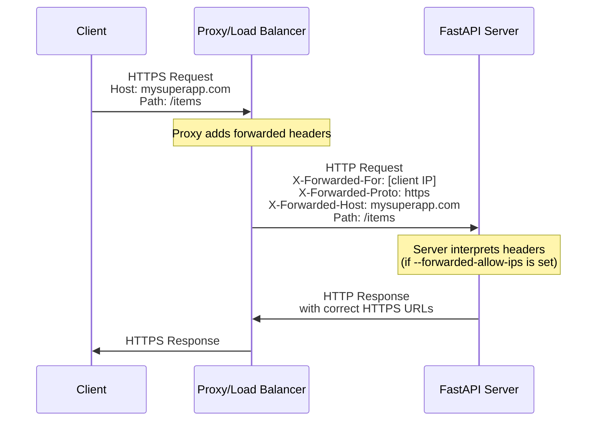
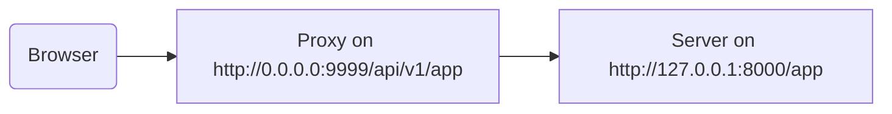

# Proxy Arkasında Çalıştırma { #behind-a-proxy }

Birçok durumda, FastAPI uygulamanızın önünde Traefik veya Nginx gibi bir **proxy** kullanırsınız.

Bu proxy'ler HTTPS sertifikalarını ve diğer bazı işleri üstlenebilir.

## Proxy Forwarded Header'ları { #proxy-forwarded-headers }

Uygulamanızın önündeki bir **proxy**, request'leri **server**'ınıza göndermeden önce genelde bazı header'ları dinamik olarak ayarlar. Böylece server, request'in proxy tarafından **forward** edildiğini; domain dahil orijinal (public) URL'yi, HTTPS kullanıldığını vb. bilgileri anlayabilir.

**Server** programı (örneğin **FastAPI CLI** üzerinden **Uvicorn**) bu header'ları yorumlayabilir ve ardından bu bilgiyi uygulamanıza aktarabilir.

Ancak güvenlik nedeniyle, server güvenilir bir proxy arkasında olduğunu bilmediği için bu header'ları yorumlamaz.

/// note | Teknik Detaylar

Proxy header'ları şunlardır:

* <a href="https://developer.mozilla.org/en-US/docs/Web/HTTP/Reference/Headers/X-Forwarded-For" class="external-link" target="_blank">X-Forwarded-For</a>
* <a href="https://developer.mozilla.org/en-US/docs/Web/HTTP/Reference/Headers/X-Forwarded-Proto" class="external-link" target="_blank">X-Forwarded-Proto</a>
* <a href="https://developer.mozilla.org/en-US/docs/Web/HTTP/Reference/Headers/X-Forwarded-Host" class="external-link" target="_blank">X-Forwarded-Host</a>

///

### Proxy Forwarded Header'larını Etkinleştirme { #enable-proxy-forwarded-headers }

FastAPI CLI'yi `--forwarded-allow-ips` *CLI Option*'ı ile başlatıp, bu forwarded header'ları okumada güvenilecek IP adreslerini verebilirsiniz.

Bunu `--forwarded-allow-ips="*"` olarak ayarlarsanız, gelen tüm IP'lere güvenir.

**Server**'ınız güvenilir bir **proxy** arkasındaysa ve onunla sadece proxy konuşuyorsa, bu ayar server'ın o **proxy**'nin IP'si her neyse onu kabul etmesini sağlar.

<div class="termy">

```console
$ fastapi run --forwarded-allow-ips="*"

<span style="color: green;">INFO</span>:     Uvicorn running on http://127.0.0.1:8000 (Press CTRL+C to quit)
```

</div>

### HTTPS ile Redirect'ler { #redirects-with-https }

Örneğin `/items/` adında bir *path operation* tanımladığınızı düşünelim:

{* ../../docs_src/behind_a_proxy/tutorial001_01_py310.py hl[6] *}

Client `/items`'a gitmeye çalışırsa, varsayılan olarak `/items/`'a redirect edilir.

Ancak *CLI Option* `--forwarded-allow-ips` ayarlanmadan önce, `http://localhost:8000/items/`'a redirect edebilir.

Oysa uygulamanız `https://mysuperapp.com` üzerinde host ediliyor olabilir ve redirect'in `https://mysuperapp.com/items/` olması gerekir.

Artık `--proxy-headers` ayarını yaparak FastAPI'nin doğru adrese redirect edebilmesini sağlarsınız. 😎

```
https://mysuperapp.com/items/
```

/// tip | İpucu

HTTPS hakkında daha fazla bilgi için [HTTPS Hakkında](../deployment/https.md){.internal-link target=_blank} rehberine bakın.

///

### Proxy Forwarded Header'ları Nasıl Çalışır { #how-proxy-forwarded-headers-work }

**Proxy**'nin, client ile **application server** arasında forwarded header'ları nasıl eklediğini gösteren görsel bir temsil:



**Proxy**, orijinal client request'ini araya girerek (intercept) alır ve request'i **application server**'a iletmeden önce özel *forwarded* header'ları (`X-Forwarded-*`) ekler.

Bu header'lar, aksi halde kaybolacak olan orijinal request bilgilerini korur:

* **X-Forwarded-For**: Orijinal client'ın IP adresi
* **X-Forwarded-Proto**: Orijinal protokol (`https`)
* **X-Forwarded-Host**: Orijinal host (`mysuperapp.com`)

**FastAPI CLI** `--forwarded-allow-ips` ile yapılandırıldığında bu header'lara güvenir ve örneğin redirect'lerde doğru URL'leri üretmek için bunları kullanır.

## Path Prefix'i Kırpılan (Stripped) Bir Proxy { #proxy-with-a-stripped-path-prefix }

Uygulamanıza bir path prefix ekleyen bir proxy'niz olabilir.

Bu durumlarda uygulamanızı yapılandırmak için `root_path` kullanabilirsiniz.

`root_path`, FastAPI'nin (Starlette üzerinden) üzerine kurulduğu ASGI spesifikasyonunun sağladığı bir mekanizmadır.

`root_path` bu özel senaryoları yönetmek için kullanılır.

Ayrıca sub-application mount ederken de içeride kullanılır.

Path prefix'i kırpılan bir proxy kullanmak, şu anlama gelir: Kodunuzda `/app` altında bir path tanımlarsınız; ancak üstte bir katman (proxy) ekleyip **FastAPI** uygulamanızı `/api/v1` gibi bir path'in altına koyarsınız.

Bu durumda, orijinal `/app` path'i aslında `/api/v1/app` altında servis edilir.

Kodunuzun tamamı sadece `/app` varmış gibi yazılmış olsa bile.

{* ../../docs_src/behind_a_proxy/tutorial001_py310.py hl[6] *}

Proxy, request'i app server'a (muhtemelen FastAPI CLI üzerinden Uvicorn) iletmeden önce **path prefix**'i anlık olarak **"kırpar"** (strip). Böylece uygulamanız hâlâ `/app` altında servis ediliyormuş gibi davranır ve tüm kodunuzu `/api/v1` prefix'ini içerecek şekilde güncellemeniz gerekmez.

Buraya kadar her şey normal çalışır.

Ancak entegre doküman arayüzünü (frontend) açtığınızda, OpenAPI şemasını `/api/v1/openapi.json` yerine `/openapi.json` üzerinden almayı bekler.

Dolayısıyla tarayıcıda çalışan frontend `/openapi.json`'a erişmeye çalışır ve OpenAPI şemasını alamaz.

Çünkü uygulamamız proxy arkasında `/api/v1` path prefix'i ile çalışmaktadır; frontend'in OpenAPI şemasını `/api/v1/openapi.json` üzerinden çekmesi gerekir.



/// tip | İpucu

`0.0.0.0` IP'si, genelde programın ilgili makine/server üzerindeki tüm kullanılabilir IP'lerde dinlediği anlamına gelir.

///

Docs UI'nin, bu API `server`'ının (proxy arkasında) `/api/v1` altında bulunduğunu belirtmek için OpenAPI şemasına da ihtiyacı olur. Örneğin:

```JSON hl_lines="4-8"
{
    "openapi": "3.1.0",
    // Burada daha fazla şey var
    "servers": [
        {
            "url": "/api/v1"
        }
    ],
    "paths": {
            // Burada daha fazla şey var
    }
}
```

Bu örnekte "Proxy", **Traefik** gibi bir şey olabilir. Server da FastAPI uygulamanızı çalıştıran (Uvicorn'lu) FastAPI CLI olabilir.

### `root_path` Sağlama { #providing-the-root-path }

Bunu yapmak için `--root-path` komut satırı seçeneğini şöyle kullanabilirsiniz:

<div class="termy">

```console
$ fastapi run main.py --forwarded-allow-ips="*" --root-path /api/v1

<span style="color: green;">INFO</span>:     Uvicorn running on http://127.0.0.1:8000 (Press CTRL+C to quit)
```

</div>

Hypercorn kullanıyorsanız, onda da `--root-path` seçeneği vardır.

/// note | Teknik Detaylar

ASGI spesifikasyonu bu kullanım senaryosu için bir `root_path` tanımlar.

`--root-path` komut satırı seçeneği de bu `root_path`'i sağlar.

///

### Mevcut `root_path`'i Kontrol Etme { #checking-the-current-root-path }

Uygulamanızın her request için kullandığı mevcut `root_path` değerini alabilirsiniz; bu değer ASGI spesifikasyonunun bir parçası olan `scope` dict'inin içindedir.

Burada sadece göstermek için bunu mesaja dahil ediyoruz.

{* ../../docs_src/behind_a_proxy/tutorial001_py310.py hl[8] *}

Ardından Uvicorn'u şu şekilde başlatırsanız:

<div class="termy">

```console
$ fastapi run main.py --forwarded-allow-ips="*" --root-path /api/v1

<span style="color: green;">INFO</span>:     Uvicorn running on http://127.0.0.1:8000 (Press CTRL+C to quit)
```

</div>

Response şöyle bir şey olur:

```JSON
{
    "message": "Hello World",
    "root_path": "/api/v1"
}
```

### FastAPI Uygulamasında `root_path` Ayarlama { #setting-the-root-path-in-the-fastapi-app }

Alternatif olarak, `--root-path` gibi bir komut satırı seçeneği (veya muadili) sağlayamıyorsanız, FastAPI uygulamanızı oluştururken `root_path` parametresini ayarlayabilirsiniz:

{* ../../docs_src/behind_a_proxy/tutorial002_py310.py hl[3] *}

`FastAPI`'ye `root_path` vermek, Uvicorn veya Hypercorn'a `--root-path` komut satırı seçeneğini vermekle eşdeğerdir.

### `root_path` Hakkında { #about-root-path }

Şunu unutmayın: Server (Uvicorn) bu `root_path`'i, uygulamaya iletmek dışında başka bir amaçla kullanmaz.

Ancak tarayıcınızla <a href="http://127.0.0.1:8000/app" class="external-link" target="_blank">http://127.0.0.1:8000/app</a> adresine giderseniz normal response'u görürsünüz:

```JSON
{
    "message": "Hello World",
    "root_path": "/api/v1"
}
```

Yani `http://127.0.0.1:8000/api/v1/app` üzerinden erişilmeyi beklemez.

Uvicorn, proxy'nin Uvicorn'a `http://127.0.0.1:8000/app` üzerinden erişmesini bekler; bunun üstüne ekstra `/api/v1` prefix'ini eklemek proxy'nin sorumluluğudur.

## Stripped Path Prefix Kullanan Proxy'ler Hakkında { #about-proxies-with-a-stripped-path-prefix }

Stripped path prefix kullanan bir proxy, yapılandırma yöntemlerinden yalnızca biridir.

Birçok durumda varsayılan davranış, proxy'nin stripped path prefix kullanmaması olacaktır.

Böyle bir durumda (stripped path prefix olmadan), proxy `https://myawesomeapp.com` gibi bir yerde dinler; tarayıcı `https://myawesomeapp.com/api/v1/app`'e giderse ve sizin server'ınız (ör. Uvicorn) `http://127.0.0.1:8000` üzerinde dinliyorsa, proxy (stripped path prefix olmadan) Uvicorn'a aynı path ile erişir: `http://127.0.0.1:8000/api/v1/app`.

## Traefik ile Local Olarak Test Etme { #testing-locally-with-traefik }

<a href="https://docs.traefik.io/" class="external-link" target="_blank">Traefik</a> kullanarak, stripped path prefix'li deneyi local'de kolayca çalıştırabilirsiniz.

<a href="https://github.com/containous/traefik/releases" class="external-link" target="_blank">Traefik'i indirin</a>; tek bir binary'dir, sıkıştırılmış dosyayı çıkarıp doğrudan terminalden çalıştırabilirsiniz.

Ardından `traefik.toml` adında bir dosya oluşturup şunu yazın:

```TOML hl_lines="3"
[entryPoints]
  [entryPoints.http]
    address = ":9999"

[providers]
  [providers.file]
    filename = "routes.toml"
```

Bu, Traefik'e 9999 portunda dinlemesini ve `routes.toml` adlı başka bir dosyayı kullanmasını söyler.

/// tip | İpucu

Standart HTTP portu 80 yerine 9999 portunu kullanıyoruz; böylece admin (`sudo`) yetkileriyle çalıştırmanız gerekmez.

///

Şimdi diğer dosyayı, `routes.toml`'u oluşturun:

```TOML hl_lines="5  12  20"
[http]
  [http.middlewares]

    [http.middlewares.api-stripprefix.stripPrefix]
      prefixes = ["/api/v1"]

  [http.routers]

    [http.routers.app-http]
      entryPoints = ["http"]
      service = "app"
      rule = "PathPrefix(`/api/v1`)"
      middlewares = ["api-stripprefix"]

  [http.services]

    [http.services.app]
      [http.services.app.loadBalancer]
        [[http.services.app.loadBalancer.servers]]
          url = "http://127.0.0.1:8000"
```

Bu dosya, Traefik'i `/api/v1` path prefix'ini kullanacak şekilde yapılandırır.

Ardından Traefik, request'leri `http://127.0.0.1:8000` üzerinde çalışan Uvicorn'unuza yönlendirir.

Şimdi Traefik'i başlatın:

<div class="termy">

```console
$ ./traefik --configFile=traefik.toml

INFO[0000] Configuration loaded from file: /home/user/awesomeapi/traefik.toml
```

</div>

Ve şimdi uygulamanızı `--root-path` seçeneğiyle başlatın:

<div class="termy">

```console
$ fastapi run main.py --forwarded-allow-ips="*" --root-path /api/v1

<span style="color: green;">INFO</span>:     Uvicorn running on http://127.0.0.1:8000 (Press CTRL+C to quit)
```

</div>

### Response'ları Kontrol Edin { #check-the-responses }

Şimdi Uvicorn'un portundaki URL'ye giderseniz: <a href="http://127.0.0.1:8000/app" class="external-link" target="_blank">http://127.0.0.1:8000/app</a>, normal response'u görürsünüz:

```JSON
{
    "message": "Hello World",
    "root_path": "/api/v1"
}
```

/// tip | İpucu

`http://127.0.0.1:8000/app` üzerinden erişiyor olsanız bile, `root_path` değerinin `--root-path` seçeneğinden alınıp `/api/v1` olarak gösterildiğine dikkat edin.

///

Şimdi de Traefik'in portundaki URL'yi, path prefix ile birlikte açın: <a href="http://127.0.0.1:9999/api/v1/app" class="external-link" target="_blank">http://127.0.0.1:9999/api/v1/app</a>.

Aynı response'u alırız:

```JSON
{
    "message": "Hello World",
    "root_path": "/api/v1"
}
```

ama bu sefer proxy'nin sağladığı prefix path olan `/api/v1` ile gelen URL'de.

Elbette buradaki fikir, herkesin uygulamaya proxy üzerinden erişmesidir; dolayısıyla `/api/v1` path prefix'li sürüm "doğru" olandır.

Uvicorn'un doğrudan sunduğu, path prefix olmayan sürüm (`http://127.0.0.1:8000/app`) ise sadece _proxy_'nin (Traefik) erişmesi için kullanılmalıdır.

Bu da Proxy'nin (Traefik) path prefix'i nasıl kullandığını ve server'ın (Uvicorn) `--root-path` seçeneğinden gelen `root_path`'i nasıl kullandığını gösterir.

### Docs UI'yi Kontrol Edin { #check-the-docs-ui }

Şimdi işin eğlenceli kısmı. ✨

Uygulamaya erişmenin "resmi" yolu, tanımladığımız path prefix ile proxy üzerinden erişmektir. Bu yüzden beklendiği gibi, Uvicorn'un doğrudan servis ettiği docs UI'yi URL'de path prefix olmadan açarsanız çalışmaz; çünkü proxy üzerinden erişileceğini varsayar.

Şuradan kontrol edebilirsiniz: <a href="http://127.0.0.1:8000/docs" class="external-link" target="_blank">http://127.0.0.1:8000/docs</a>:


Ancak docs UI'yi proxy üzerinden, `9999` portuyla, `/api/v1/docs` altında "resmi" URL'den açarsak doğru çalışır! 🎉

Şuradan kontrol edebilirsiniz: <a href="http://127.0.0.1:9999/api/v1/docs" class="external-link" target="_blank">http://127.0.0.1:9999/api/v1/docs</a>:


Tam istediğimiz gibi. ✔️

Bunun nedeni, FastAPI'nin OpenAPI içinde varsayılan `server`'ı, `root_path` tarafından verilen URL ile oluşturmak için bu `root_path`'i kullanmasıdır.

## Ek `server`'lar { #additional-servers }

/// warning | Uyarı

Bu daha ileri seviye bir kullanım senaryosudur. İsterseniz atlayabilirsiniz.

///

Varsayılan olarak **FastAPI**, OpenAPI şemasında `root_path` için bir `server` oluşturur.

Ancak başka alternatif `servers` da sağlayabilirsiniz; örneğin *aynı* docs UI'nin hem staging hem de production ortamıyla etkileşime girmesini istiyorsanız.

Özel bir `servers` listesi verirseniz ve bir `root_path` varsa (çünkü API'niz proxy arkasındadır), **FastAPI** bu `root_path` ile bir "server"ı listenin başına ekler.

Örneğin:

{* ../../docs_src/behind_a_proxy/tutorial003_py310.py hl[4:7] *}

Şöyle bir OpenAPI şeması üretir:

```JSON hl_lines="5-7"
{
    "openapi": "3.1.0",
    // Burada daha fazla şey var
    "servers": [
        {
            "url": "/api/v1"
        },
        {
            "url": "https://stag.example.com",
            "description": "Staging environment"
        },
        {
            "url": "https://prod.example.com",
            "description": "Production environment"
        }
    ],
    "paths": {
            // Burada daha fazla şey var
    }
}
```

/// tip | İpucu

`url` değeri `/api/v1` olan, `root_path`'ten alınmış otomatik üretilen server'a dikkat edin.

///

Docs UI'de, <a href="http://127.0.0.1:9999/api/v1/docs" class="external-link" target="_blank">http://127.0.0.1:9999/api/v1/docs</a> adresinde şöyle görünür:


/// tip | İpucu

Docs UI, seçtiğiniz server ile etkileşime girer.

///

/// note | Teknik Detaylar

OpenAPI spesifikasyonunda `servers` özelliği opsiyoneldir.

`servers` parametresini belirtmezseniz ve `root_path` `/` ile aynıysa, üretilen OpenAPI şemasında `servers` özelliği varsayılan olarak tamamen çıkarılır; bu da `url` değeri `/` olan tek bir server ile eşdeğerdir.

///

### `root_path`'ten Otomatik `server` Eklenmesini Kapatma { #disable-automatic-server-from-root-path }

**FastAPI**'nin `root_path` kullanarak otomatik bir server eklemesini istemiyorsanız, `root_path_in_servers=False` parametresini kullanabilirsiniz:

{* ../../docs_src/behind_a_proxy/tutorial004_py310.py hl[9] *}

Böylece OpenAPI şemasına dahil etmez.

## Bir Sub-Application Mount Etme { #mounting-a-sub-application }

Bir sub-application'ı ( [Sub Applications - Mounts](sub-applications.md){.internal-link target=_blank} bölümünde anlatıldığı gibi) mount etmeniz gerekiyorsa ve aynı zamanda `root_path` ile bir proxy kullanıyorsanız, bunu beklendiği gibi normal şekilde yapabilirsiniz.

FastAPI içeride `root_path`'i akıllıca kullanır; dolayısıyla doğrudan çalışır. ✨
