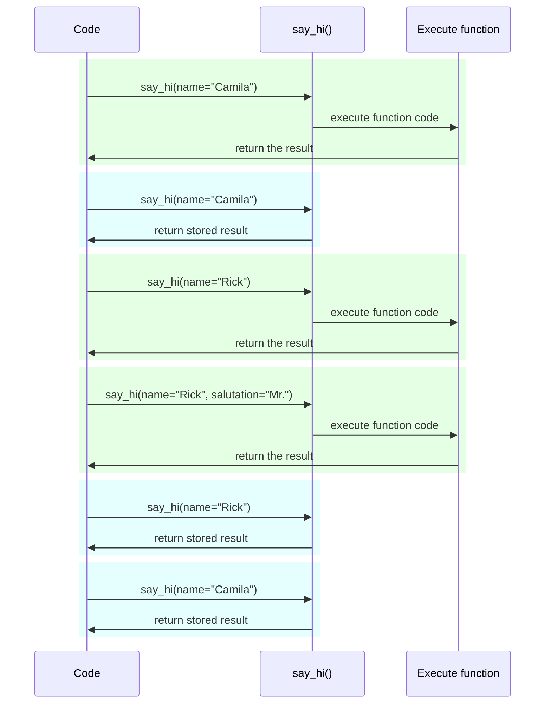

# Ayarlar ve Ortam Değişkenleri { #settings-and-environment-variables }

Birçok durumda uygulamanızın bazı harici ayarlara veya konfigürasyonlara ihtiyacı olabilir; örneğin secret key'ler, veritabanı kimlik bilgileri, e-posta servisleri için kimlik bilgileri vb.

Bu ayarların çoğu değişkendir (değişebilir); örneğin veritabanı URL'leri. Ayrıca birçoğu hassas olabilir; örneğin secret'lar.

Bu nedenle bunları, uygulama tarafından okunan environment variable'lar ile sağlamak yaygındır.

/// tip | İpucu

Environment variable'ları anlamak için [Environment Variables](../environment-variables.md){.internal-link target=_blank} dokümanını okuyabilirsiniz.

///

## Tipler ve doğrulama { #types-and-validation }

Bu environment variable'lar yalnızca metin (string) taşıyabilir; çünkü Python'ın dışındadırlar ve diğer programlarla ve sistemin geri kalanıyla uyumlu olmaları gerekir (hatta Linux, Windows, macOS gibi farklı işletim sistemleriyle de).

Bu da, Python içinde bir environment variable'dan okunan herhangi bir değerin `str` olacağı anlamına gelir; farklı bir tipe dönüştürme veya herhangi bir doğrulama işlemi kod içinde yapılmalıdır.

## Pydantic `Settings` { #pydantic-settings }

Neyse ki Pydantic, environment variable'lardan gelen bu ayarları yönetmek için <a href="https://docs.pydantic.dev/latest/concepts/pydantic_settings/" class="external-link" target="_blank">Pydantic: Settings management</a> ile çok iyi bir yardımcı araç sunar.

### `pydantic-settings`'i kurun { #install-pydantic-settings }

Önce, [virtual environment](../virtual-environments.md){.internal-link target=_blank} oluşturduğunuzdan, aktive ettiğinizden emin olun ve ardından `pydantic-settings` paketini kurun:

<div class="termy">

```console
$ pip install pydantic-settings
---> 100%
```

</div>

Ayrıca `all` extras'ını şu şekilde kurduğunuzda da dahil gelir:

<div class="termy">

```console
$ pip install "fastapi[all]"
---> 100%
```

</div>

### `Settings` nesnesini oluşturun { #create-the-settings-object }

Pydantic'ten `BaseSettings` import edin ve bir alt sınıf (sub-class) oluşturun; tıpkı bir Pydantic model'inde olduğu gibi.

Pydantic model'lerinde olduğu gibi, type annotation'larla (ve gerekirse default değerlerle) class attribute'ları tanımlarsınız.

Pydantic model'lerinde kullandığınız aynı doğrulama özelliklerini ve araçlarını burada da kullanabilirsiniz; örneğin farklı veri tipleri ve `Field()` ile ek doğrulamalar.

{* ../../docs_src/settings/tutorial001_py310.py hl[2,5:8,11] *}

/// tip | İpucu

Hızlıca kopyalayıp yapıştırmak istiyorsanız bu örneği kullanmayın; aşağıdaki son örneği kullanın.

///

Ardından, bu `Settings` sınıfının bir instance'ını oluşturduğunuzda (bu örnekte `settings` nesnesi), Pydantic environment variable'ları büyük/küçük harfe duyarsız şekilde okur; yani büyük harfli `APP_NAME` değişkeni, yine de `app_name` attribute'u için okunur.

Sonrasında veriyi dönüştürür ve doğrular. Böylece `settings` nesnesini kullandığınızda, tanımladığınız tiplerde verilere sahip olursunuz (örn. `items_per_user` bir `int` olur).

### `settings`'i kullanın { #use-the-settings }

Daha sonra uygulamanızda yeni `settings` nesnesini kullanabilirsiniz:

{* ../../docs_src/settings/tutorial001_py310.py hl[18:20] *}

### Server'ı çalıştırın { #run-the-server }

Sonraki adımda server'ı çalıştırırken konfigürasyonları environment variable olarak geçersiniz; örneğin `ADMIN_EMAIL` ve `APP_NAME` şu şekilde ayarlanabilir:

<div class="termy">

```console
$ ADMIN_EMAIL="deadpool@example.com" APP_NAME="ChimichangApp" fastapi run main.py

<span style="color: green;">INFO</span>:     Uvicorn running on http://127.0.0.1:8000 (Press CTRL+C to quit)
```

</div>

/// tip | İpucu

Tek bir komut için birden fazla env var ayarlamak istiyorsanız aralarına boşluk koyun ve hepsini komuttan önce yazın.

///

Böylece `admin_email` ayarı `"deadpool@example.com"` olur.

`app_name` `"ChimichangApp"` olur.

`items_per_user` ise default değeri olan `50` olarak kalır.

## Ayarları başka bir module'de tutma { #settings-in-another-module }

[Bigger Applications - Multiple Files](../tutorial/bigger-applications.md){.internal-link target=_blank} bölümünde gördüğünüz gibi, bu ayarları başka bir module dosyasına koyabilirsiniz.

Örneğin `config.py` adında bir dosyanız şu şekilde olabilir:

{* ../../docs_src/settings/app01_py310/config.py *}

Ve ardından bunu `main.py` dosyasında kullanabilirsiniz:

{* ../../docs_src/settings/app01_py310/main.py hl[3,11:13] *}

/// tip | İpucu

[Bigger Applications - Multiple Files](../tutorial/bigger-applications.md){.internal-link target=_blank} bölümünde gördüğünüz gibi, ayrıca bir `__init__.py` dosyasına da ihtiyacınız olacak.

///

## Dependency içinde ayarlar { #settings-in-a-dependency }

Bazı durumlarda, her yerde kullanılan global bir `settings` nesnesi yerine ayarları bir dependency üzerinden sağlamak faydalı olabilir.

Bu özellikle test sırasında çok işe yarar; çünkü bir dependency'yi kendi özel ayarlarınızla override etmek çok kolaydır.

### Config dosyası { #the-config-file }

Bir önceki örnekten devam edersek, `config.py` dosyanız şöyle görünebilir:

{* ../../docs_src/settings/app02_an_py310/config.py hl[10] *}

Dikkat edin, artık default bir instance `settings = Settings()` oluşturmuyoruz.

### Ana uygulama dosyası { #the-main-app-file }

Şimdi, yeni bir `config.Settings()` döndüren bir dependency oluşturuyoruz.

{* ../../docs_src/settings/app02_an_py310/main.py hl[6,12:13] *}

/// tip | İpucu

`@lru_cache` konusunu birazdan ele alacağız.

Şimdilik `get_settings()`'in normal bir fonksiyon olduğunu varsayabilirsiniz.

///

Sonra bunu dependency olarak *path operation function*'dan talep edebilir ve ihtiyaç duyduğumuz her yerde kullanabiliriz.

{* ../../docs_src/settings/app02_an_py310/main.py hl[17,19:21] *}

### Ayarlar ve test { #settings-and-testing }

Ardından, `get_settings` için bir dependency override oluşturarak test sırasında farklı bir settings nesnesi sağlamak çok kolay olur:

{* ../../docs_src/settings/app02_an_py310/test_main.py hl[9:10,13,21] *}

Dependency override içinde, yeni `Settings` nesnesini oluştururken `admin_email` için yeni bir değer ayarlarız ve sonra bu yeni nesneyi döndürürüz.

Sonrasında bunun kullanıldığını test edebiliriz.

## `.env` dosyası okuma { #reading-a-env-file }

Çok sayıda ayarınız varsa ve bunlar farklı ortamlarda sık sık değişiyorsa, bunları bir dosyaya koyup, sanki environment variable'mış gibi o dosyadan okumak faydalı olabilir.

Bu yaklaşım oldukça yaygındır ve bir adı vardır: Bu environment variable'lar genellikle `.env` adlı bir dosyaya konur ve bu dosyaya "dotenv" denir.

/// tip | İpucu

Nokta (`.`) ile başlayan dosyalar, Linux ve macOS gibi Unix-benzeri sistemlerde gizli dosyadır.

Ancak dotenv dosyasının mutlaka bu dosya adına sahip olması gerekmez.

///

Pydantic, harici bir kütüphane kullanarak bu tür dosyalardan okuma desteğine sahiptir. Daha fazlası için: <a href="https://docs.pydantic.dev/latest/concepts/pydantic_settings/#dotenv-env-support" class="external-link" target="_blank">Pydantic Settings: Dotenv (.env) support</a>.

/// tip | İpucu

Bunun çalışması için `pip install python-dotenv` yapmanız gerekir.

///

### `.env` dosyası { #the-env-file }

Şöyle bir `.env` dosyanız olabilir:

```bash
ADMIN_EMAIL="deadpool@example.com"
APP_NAME="ChimichangApp"
```

### Ayarları `.env`'den okuyun { #read-settings-from-env }

Ardından `config.py` dosyanızı şöyle güncelleyin:

{* ../../docs_src/settings/app03_an_py310/config.py hl[9] *}

/// tip | İpucu

`model_config` attribute'u yalnızca Pydantic konfigürasyonu içindir. Daha fazlası için <a href="https://docs.pydantic.dev/latest/concepts/config/" class="external-link" target="_blank">Pydantic: Concepts: Configuration</a>.

///

Burada, Pydantic `Settings` sınıfınızın içinde `env_file` konfigürasyonunu tanımlar ve değer olarak kullanmak istediğimiz dotenv dosyasının dosya adını veririz.

### `lru_cache` ile `Settings`'i yalnızca bir kez oluşturma { #creating-the-settings-only-once-with-lru-cache }

Diskten dosya okumak normalde maliyetli (yavaş) bir işlemdir; bu yüzden muhtemelen bunu yalnızca bir kez yapıp aynı settings nesnesini tekrar kullanmak istersiniz. Her request için yeniden okumak istemezsiniz.

Ancak her seferinde şunu yaptığımızda:

```Python
Settings()
```

yeni bir `Settings` nesnesi oluşturulur ve oluşturulurken `.env` dosyasını yeniden okur.

Dependency fonksiyonu sadece şöyle olsaydı:

```Python
def get_settings():
    return Settings()
```

bu nesneyi her request için oluştururduk ve `.env` dosyasını her request'te okurduk. ⚠️

Fakat en üstte `@lru_cache` decorator'ünü kullandığımız için `Settings` nesnesi yalnızca bir kez, ilk çağrıldığı anda oluşturulur. ✔️

{* ../../docs_src/settings/app03_an_py310/main.py hl[1,11] *}

Sonraki request'lerde dependency'ler içinden `get_settings()` çağrıldığında, `get_settings()`'in iç kodu tekrar çalıştırılıp yeni bir `Settings` nesnesi yaratılmak yerine, ilk çağrıda döndürülen aynı nesne tekrar tekrar döndürülür.

#### `lru_cache` Teknik Detayları { #lru-cache-technical-details }

`@lru_cache`, decorator olarak uygulandığı fonksiyonu, her seferinde tekrar hesaplamak yerine ilk seferde döndürdüğü değeri döndürecek şekilde değiştirir; yani fonksiyon kodunu her çağrıda yeniden çalıştırmaz.

Bu nedenle altındaki fonksiyon, argüman kombinasyonlarının her biri için bir kez çalıştırılır. Sonra bu argüman kombinasyonlarının her biri için döndürülmüş değerler, fonksiyon aynı argüman kombinasyonuyla çağrıldıkça tekrar tekrar kullanılır.

Örneğin, şöyle bir fonksiyonunuz varsa:

```Python
@lru_cache
def say_hi(name: str, salutation: str = "Ms."):
    return f"Hello {salutation} {name}"
```

programınız şu şekilde çalışabilir:



Bizim `get_settings()` dependency'miz özelinde ise fonksiyon hiç argüman almaz; dolayısıyla her zaman aynı değeri döndürür.

Bu şekilde, neredeyse global bir değişken gibi davranır. Ancak bir dependency fonksiyonu kullandığı için testte kolayca override edebiliriz.

`@lru_cache`, Python standart kütüphanesinin bir parçası olan `functools` içindedir. Daha fazla bilgi için: <a href="https://docs.python.org/3/library/functools.html#functools.lru_cache" class="external-link" target="_blank">Python docs for `@lru_cache`</a>.

## Özet { #recap }

Uygulamanızın ayarlarını veya konfigürasyonlarını yönetmek için, Pydantic model'lerinin tüm gücüyle birlikte Pydantic Settings'i kullanabilirsiniz.

* Dependency kullanarak test etmeyi basitleştirebilirsiniz.
* Bununla `.env` dosyalarını kullanabilirsiniz.
* `@lru_cache` kullanmak, dotenv dosyasını her request için tekrar tekrar okumayı engellerken, test sırasında override etmenize de izin verir.
