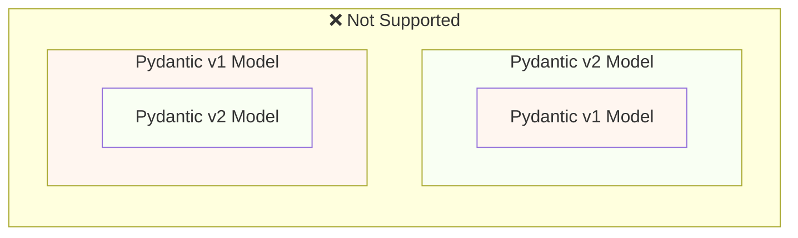
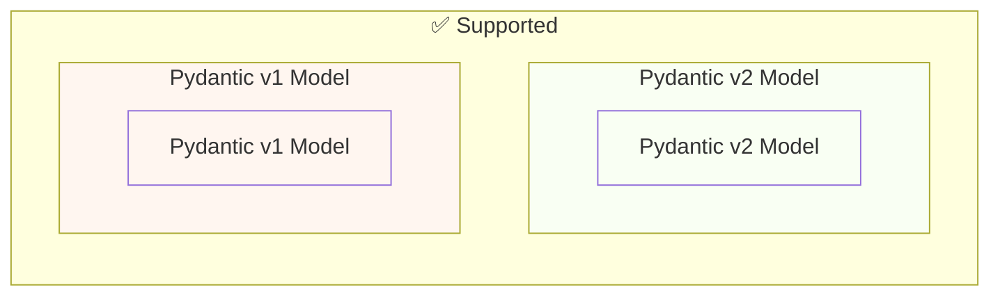

# Pydantic v1'den Pydantic v2'ye Geçiş { #migrate-from-pydantic-v1-to-pydantic-v2 }

Eski bir FastAPI uygulamanız varsa, Pydantic'in 1. sürümünü kullanıyor olabilirsiniz.

FastAPI 0.100.0 sürümü, Pydantic v1 veya v2 ile çalışmayı destekliyordu. Hangisi kuruluysa onu kullanıyordu.

FastAPI 0.119.0 sürümü, v2'ye geçişi kolaylaştırmak için, Pydantic v2’nin içinden Pydantic v1’e (`pydantic.v1` olarak) kısmi destek ekledi.

FastAPI 0.126.0 sürümü Pydantic v1 desteğini kaldırdı, ancak bir süre daha `pydantic.v1` desteğini sürdürdü.

/// warning | Uyarı

Pydantic ekibi, **Python 3.14** ile başlayarak Python'ın en yeni sürümleri için Pydantic v1 desteğini sonlandırdı.

Buna `pydantic.v1` de dahildir; Python 3.14 ve üzeri sürümlerde artık desteklenmemektedir.

Python'ın en yeni özelliklerini kullanmak istiyorsanız, Pydantic v2 kullandığınızdan emin olmanız gerekir.

///

Pydantic v1 kullanan eski bir FastAPI uygulamanız varsa, burada onu Pydantic v2'ye nasıl taşıyacağınızı ve kademeli geçişi kolaylaştıran **FastAPI 0.119.0 özelliklerini** göstereceğim.

## Resmi Kılavuz { #official-guide }

Pydantic'in v1'den v2'ye resmi bir <a href="https://docs.pydantic.dev/latest/migration/" class="external-link" target="_blank">Migration Guide</a>'ı vardır.

Ayrıca nelerin değiştiğini, validasyonların artık nasıl daha doğru ve katı olduğunu, olası dikkat edilmesi gereken noktaları (caveat) vb. de içerir.

Nelerin değiştiğini daha iyi anlamak için okuyabilirsiniz.

## Testler { #tests }

Uygulamanız için [testlerinizin](../tutorial/testing.md){.internal-link target=_blank} olduğundan ve bunları continuous integration (CI) üzerinde çalıştırdığınızdan emin olun.

Bu şekilde yükseltmeyi yapabilir ve her şeyin hâlâ beklendiği gibi çalıştığını doğrulayabilirsiniz.

## `bump-pydantic` { #bump-pydantic }

Birçok durumda, özel özelleştirmeler olmadan standart Pydantic modelleri kullanıyorsanız, Pydantic v1'den Pydantic v2'ye geçiş sürecinin büyük kısmını otomatikleştirebilirsiniz.

Aynı Pydantic ekibinin geliştirdiği <a href="https://github.com/pydantic/bump-pydantic" class="external-link" target="_blank">`bump-pydantic`</a> aracını kullanabilirsiniz.

Bu araç, değişmesi gereken kodun büyük bir kısmını otomatik olarak dönüştürmenize yardımcı olur.

Bundan sonra testleri çalıştırıp her şeyin çalışıp çalışmadığını kontrol edebilirsiniz. Çalışıyorsa işiniz biter. 😎

## v2 İçinde Pydantic v1 { #pydantic-v1-in-v2 }

Pydantic v2, `pydantic.v1` adlı bir alt modül olarak Pydantic v1'in tamamını içerir. Ancak bu yapı, Python 3.13'ün üzerindeki sürümlerde artık desteklenmemektedir.

Bu da şu anlama gelir: Pydantic v2'nin en güncel sürümünü kurup, bu alt modülden eski Pydantic v1 bileşenlerini import ederek, sanki eski Pydantic v1 kuruluymuş gibi kullanabilirsiniz.

{* ../../docs_src/pydantic_v1_in_v2/tutorial001_an_py310.py hl[1,4] *}

### v2 İçinde Pydantic v1 için FastAPI Desteği { #fastapi-support-for-pydantic-v1-in-v2 }

FastAPI 0.119.0'dan itibaren, v2'ye geçişi kolaylaştırmak için Pydantic v2’nin içinden Pydantic v1 kullanımına yönelik kısmi destek de vardır.

Dolayısıyla Pydantic'i en güncel 2 sürümüne yükseltip import'ları `pydantic.v1` alt modülünü kullanacak şekilde değiştirebilirsiniz; çoğu durumda bu doğrudan çalışır.

{* ../../docs_src/pydantic_v1_in_v2/tutorial002_an_py310.py hl[2,5,15] *}

/// warning | Uyarı

Pydantic ekibi Python 3.14'ten itibaren yeni Python sürümlerinde Pydantic v1'i artık desteklemediği için, `pydantic.v1` kullanımı da Python 3.14 ve üzeri sürümlerde desteklenmez.

///

### Aynı Uygulamada Pydantic v1 ve v2 { #pydantic-v1-and-v2-on-the-same-app }

Pydantic açısından, alanları (field) Pydantic v1 modelleriyle tanımlanmış bir Pydantic v2 modeli (ya da tersi) kullanmak **desteklenmez**.

...ancak aynı uygulamada Pydantic v1 ve v2 kullanarak **ayrı** modeller tanımlayabilirsiniz.

Bazı durumlarda, FastAPI uygulamanızda aynı **path operation** içinde hem Pydantic v1 hem de v2 modellerini kullanmak bile mümkündür:

{* ../../docs_src/pydantic_v1_in_v2/tutorial003_an_py310.py hl[2:3,6,12,21:22] *}

Yukarıdaki örnekte input modeli bir Pydantic v1 modelidir; output modeli ( `response_model=ItemV2` ile tanımlanan) ise bir Pydantic v2 modelidir.

### Pydantic v1 Parametreleri { #pydantic-v1-parameters }

Pydantic v1 modelleriyle `Body`, `Query`, `Form` vb. parametreler için FastAPI'ye özgü bazı araçları kullanmanız gerekiyorsa, Pydantic v2'ye geçişi tamamlayana kadar bunları `fastapi.temp_pydantic_v1_params` içinden import edebilirsiniz:

{* ../../docs_src/pydantic_v1_in_v2/tutorial004_an_py310.py hl[4,18] *}

### Adım Adım Geçiş { #migrate-in-steps }

/// tip | İpucu

Önce `bump-pydantic` ile deneyin; testleriniz geçerse ve bu yol çalışırsa tek komutla işi bitirmiş olursunuz. ✨

///

`bump-pydantic` sizin senaryonuz için uygun değilse, aynı uygulamada hem Pydantic v1 hem de v2 modellerini birlikte kullanma desteğinden yararlanarak Pydantic v2'ye kademeli şekilde geçebilirsiniz.

Önce Pydantic'i en güncel 2 sürümüne yükseltip tüm modelleriniz için import'ları `pydantic.v1` kullanacak şekilde değiştirebilirsiniz.

Ardından modellerinizi Pydantic v1'den v2'ye gruplar hâlinde, adım adım taşımaya başlayabilirsiniz. 🚶
