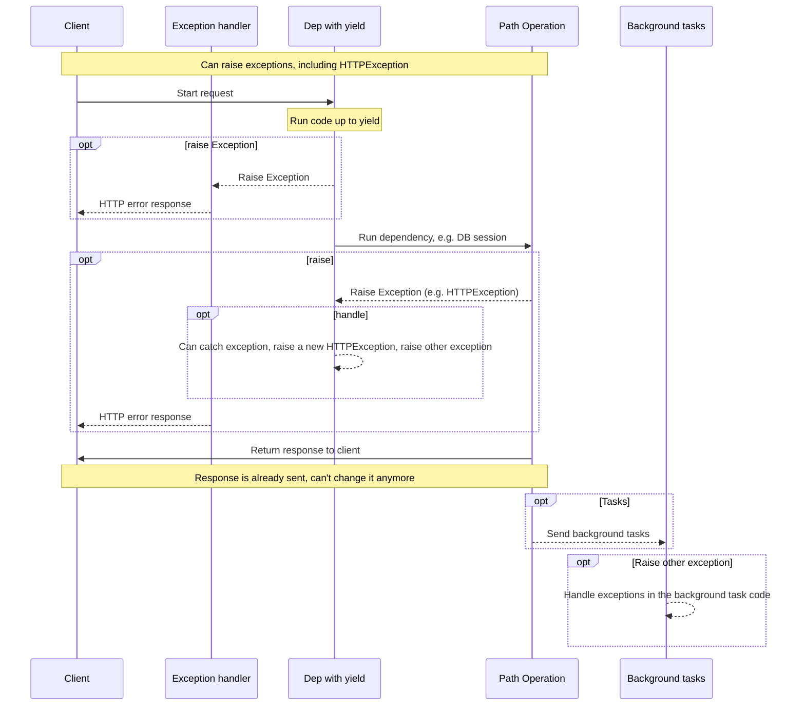
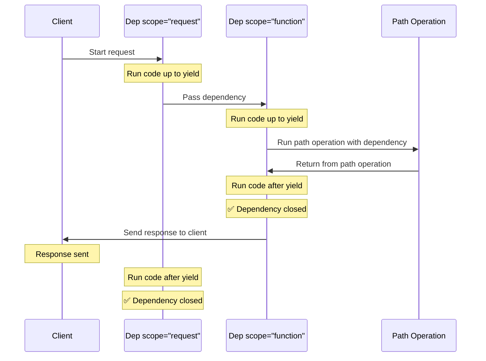

# `yield` ile Dependency'ler { #dependencies-with-yield }

FastAPI, işini bitirdikten sonra <dfn title='bazen "exit code", "cleanup code", "teardown code", "closing code", "context manager exit code" vb. olarak da adlandırılır'>ek adımlar</dfn> çalıştıran dependency'leri destekler.

Bunu yapmak için `return` yerine `yield` kullanın ve ek adımları (kodu) `yield` satırından sonra yazın.

/// tip | İpucu

Her dependency için yalnızca bir kez `yield` kullandığınızdan emin olun.

///

/// note | Teknik Detaylar

Şunlarla kullanılabilen herhangi bir fonksiyon:

* <a href="https://docs.python.org/3/library/contextlib.html#contextlib.contextmanager" class="external-link" target="_blank">`@contextlib.contextmanager`</a> veya
* <a href="https://docs.python.org/3/library/contextlib.html#contextlib.asynccontextmanager" class="external-link" target="_blank">`@contextlib.asynccontextmanager`</a>

bir **FastAPI** dependency'si olarak kullanılabilir.

Hatta FastAPI bu iki decorator'ı içeride (internally) kullanır.

///

## `yield` ile Bir Veritabanı Dependency'si { #a-database-dependency-with-yield }

Örneğin bunu, bir veritabanı session'ı oluşturmak ve iş bittikten sonra kapatmak için kullanabilirsiniz.

Response oluşturulmadan önce yalnızca `yield` satırına kadar olan (ve `yield` dahil) kod çalıştırılır:

{* ../../docs_src/dependencies/tutorial007_py310.py hl[2:4] *}

`yield` edilen değer, *path operation*'lara ve diğer dependency'lere enjekte edilen (injected) değerdir:

{* ../../docs_src/dependencies/tutorial007_py310.py hl[4] *}

Response'dan sonra `yield` satırını takip eden kod çalıştırılır:

{* ../../docs_src/dependencies/tutorial007_py310.py hl[5:6] *}

/// tip | İpucu

`async` ya da normal fonksiyonlar kullanabilirsiniz.

**FastAPI**, normal dependency'lerde olduğu gibi her ikisinde de doğru şekilde davranır.

///

## `yield` ve `try` ile Bir Dependency { #a-dependency-with-yield-and-try }

`yield` kullanan bir dependency içinde bir `try` bloğu kullanırsanız, dependency kullanılırken fırlatılan (raised) herhangi bir exception'ı alırsınız.

Örneğin, başka bir dependency'de veya bir *path operation* içinde çalışan bir kod, bir veritabanı transaction'ını "rollback" yaptıysa ya da başka bir exception oluşturduysa, o exception dependency'nizde size gelir.

Dolayısıyla `except SomeException` ile dependency içinde o spesifik exception'ı yakalayabilirsiniz.

Aynı şekilde, exception olsun ya da olmasın çıkış (exit) adımlarının çalıştırılmasını garanti etmek için `finally` kullanabilirsiniz.

{* ../../docs_src/dependencies/tutorial007_py310.py hl[3,5] *}

## `yield` ile Alt Dependency'ler { #sub-dependencies-with-yield }

Her boyutta ve şekilde alt dependency'ler ve alt dependency "ağaçları" (trees) oluşturabilirsiniz; bunların herhangi biri veya hepsi `yield` kullanabilir.

**FastAPI**, `yield` kullanan her dependency'deki "exit code"'un doğru sırayla çalıştırılmasını sağlar.

Örneğin, `dependency_c`, `dependency_b`'ye; `dependency_b` de `dependency_a`'ya bağlı olabilir:

{* ../../docs_src/dependencies/tutorial008_an_py310.py hl[6,14,22] *}

Ve hepsi `yield` kullanabilir.

Bu durumda `dependency_c`, exit code'unu çalıştırabilmek için `dependency_b`'den gelen değerin (burada `dep_b`) hâlâ erişilebilir olmasına ihtiyaç duyar.

Aynı şekilde `dependency_b` de exit code'u için `dependency_a`'dan gelen değerin (burada `dep_a`) erişilebilir olmasına ihtiyaç duyar.

{* ../../docs_src/dependencies/tutorial008_an_py310.py hl[18:19,26:27] *}

Benzer şekilde, bazı dependency'ler `yield`, bazıları `return` kullanabilir ve bunların bazıları diğerlerine bağlı olabilir.

Ayrıca birden fazla `yield` kullanan dependency gerektiren tek bir dependency'niz de olabilir, vb.

İstediğiniz herhangi bir dependency kombinasyonunu kullanabilirsiniz.

**FastAPI** her şeyin doğru sırada çalışmasını sağlar.

/// note | Teknik Detaylar

Bu, Python'un <a href="https://docs.python.org/3/library/contextlib.html" class="external-link" target="_blank">Context Managers</a> yapısı sayesinde çalışır.

**FastAPI** bunu sağlamak için içeride onları kullanır.

///

## `yield` ve `HTTPException` ile Dependency'ler { #dependencies-with-yield-and-httpexception }

`yield` kullanan dependency'lerde `try` bloklarıyla bazı kodları çalıştırıp ardından `finally` sonrasında exit code çalıştırabileceğinizi gördünüz.

Ayrıca `except` ile fırlatılan exception'ı yakalayıp onunla bir şey yapabilirsiniz.

Örneğin `HTTPException` gibi farklı bir exception fırlatabilirsiniz.

/// tip | İpucu

Bu biraz ileri seviye bir tekniktir ve çoğu durumda gerçekten ihtiyaç duymazsınız; çünkü exception'ları (`HTTPException` dahil) uygulamanızın geri kalan kodundan, örneğin *path operation function* içinden fırlatabilirsiniz.

Ama ihtiyaç duyarsanız diye burada. 🤓

///

{* ../../docs_src/dependencies/tutorial008b_an_py310.py hl[18:22,31] *}

Exception yakalayıp buna göre özel bir response oluşturmak istiyorsanız bir [Custom Exception Handler](../handling-errors.md#install-custom-exception-handlers){.internal-link target=_blank} oluşturun.

## `yield` ve `except` ile Dependency'ler { #dependencies-with-yield-and-except }

`yield` kullanan bir dependency içinde `except` ile bir exception yakalar ve bunu tekrar fırlatmazsanız (ya da yeni bir exception fırlatmazsanız), FastAPI normal Python'da olduğu gibi bir exception olduğunu fark edemez:

{* ../../docs_src/dependencies/tutorial008c_an_py310.py hl[15:16] *}

Bu durumda client, biz `HTTPException` veya benzeri bir şey fırlatmadığımız için olması gerektiği gibi *HTTP 500 Internal Server Error* response'u görür; ancak server **hiç log üretmez** ve hatanın ne olduğuna dair başka bir işaret de olmaz. 😱

### `yield` ve `except` Kullanan Dependency'lerde Her Zaman `raise` Edin { #always-raise-in-dependencies-with-yield-and-except }

`yield` kullanan bir dependency içinde bir exception yakalarsanız, başka bir `HTTPException` veya benzeri bir şey fırlatmıyorsanız, **orijinal exception'ı tekrar raise etmelisiniz**.

Aynı exception'ı `raise` ile tekrar fırlatabilirsiniz:

{* ../../docs_src/dependencies/tutorial008d_an_py310.py hl[17] *}

Artık client yine aynı *HTTP 500 Internal Server Error* response'unu alır, ama server log'larda bizim özel `InternalError`'ımızı görür. 😎

## `yield` Kullanan Dependency'lerin Çalıştırılması { #execution-of-dependencies-with-yield }

Çalıştırma sırası kabaca aşağıdaki diyagramdaki gibidir. Zaman yukarıdan aşağı akar. Her sütun, etkileşime giren veya kod çalıştıran parçalardan birini temsil eder.



/// info | Bilgi

Client'a yalnızca **tek bir response** gönderilir. Bu, error response'lardan biri olabilir ya da *path operation*'dan dönen response olabilir.

Bu response'lardan biri gönderildikten sonra başka bir response gönderilemez.

///

/// tip | İpucu

*Path operation function* içindeki koddan herhangi bir exception raise ederseniz, `HTTPException` dahil olmak üzere bu exception `yield` kullanan dependency'lere aktarılır. Çoğu durumda, doğru şekilde ele alındığından emin olmak için `yield` kullanan dependency'den aynı exception'ı (veya yeni bir tanesini) yeniden raise etmek istersiniz.

///

## Erken Çıkış ve `scope` { #early-exit-and-scope }

Normalde `yield` kullanan dependency'lerin exit code'u, client'a response gönderildikten **sonra** çalıştırılır.

Ama *path operation function*'dan döndükten sonra dependency'yi kullanmayacağınızı biliyorsanız, `Depends(scope="function")` kullanarak FastAPI'ye dependency'yi *path operation function* döndükten sonra kapatmasını, ancak **response gönderilmeden önce** kapatmasını söyleyebilirsiniz.

{* ../../docs_src/dependencies/tutorial008e_an_py310.py hl[12,16] *}

`Depends()` şu değerleri alabilen bir `scope` parametresi alır:

* `"function"`: dependency'yi request'i işleyen *path operation function* çalışmadan önce başlat, *path operation function* bittikten sonra bitir, ancak response client'a geri gönderilmeden **önce** sonlandır. Yani dependency fonksiyonu, *path operation **function***'ın **etrafında** çalıştırılır.
* `"request"`: dependency'yi request'i işleyen *path operation function* çalışmadan önce başlat (`"function"` kullanımına benzer), ancak response client'a geri gönderildikten **sonra** sonlandır. Yani dependency fonksiyonu, **request** ve response döngüsünün **etrafında** çalıştırılır.

Belirtilmezse ve dependency `yield` kullanıyorsa, varsayılan olarak `scope` `"request"` olur.

### Alt dependency'ler için `scope` { #scope-for-sub-dependencies }

`scope="request"` (varsayılan) ile bir dependency tanımladığınızda, herhangi bir alt dependency'nin `scope` değeri de `"request"` olmalıdır.

Ancak `scope` değeri `"function"` olan bir dependency, hem `"function"` hem de `"request"` scope'una sahip dependency'lere bağlı olabilir.

Bunun nedeni, bir dependency'nin exit code'unu alt dependency'lerden önce çalıştırabilmesi gerekmesidir; çünkü exit code sırasında hâlâ onları kullanması gerekebilir.



## `yield`, `HTTPException`, `except` ve Background Tasks ile Dependency'ler { #dependencies-with-yield-httpexception-except-and-background-tasks }

`yield` kullanan dependency'ler, zaman içinde farklı kullanım senaryolarını kapsamak ve bazı sorunları düzeltmek için gelişti.

FastAPI'nin farklı sürümlerinde nelerin değiştiğini görmek isterseniz, advanced guide'da şu bölümü okuyabilirsiniz: [Advanced Dependencies - Dependencies with `yield`, `HTTPException`, `except` and Background Tasks](../../advanced/advanced-dependencies.md#dependencies-with-yield-httpexception-except-and-background-tasks){.internal-link target=_blank}.
## Context Managers { #context-managers }

### "Context Managers" Nedir? { #what-are-context-managers }

"Context Managers", `with` ifadesiyle kullanabildiğiniz Python nesneleridir.

Örneğin, <a href="https://docs.python.org/3/tutorial/inputoutput.html#reading-and-writing-files" class="external-link" target="_blank">bir dosyayı okumak için `with` kullanabilirsiniz</a>:

```Python
with open("./somefile.txt") as f:
    contents = f.read()
    print(contents)
```

Temelde `open("./somefile.txt")`, "Context Manager" olarak adlandırılan bir nesne oluşturur.

`with` bloğu bittiğinde, exception olsa bile dosyanın kapatılmasını garanti eder.

`yield` ile bir dependency oluşturduğunuzda, **FastAPI** içeride bunun için bir context manager oluşturur ve bazı ilgili başka araçlarla birleştirir.

### `yield` kullanan dependency'lerde context manager kullanma { #using-context-managers-in-dependencies-with-yield }

/// warning | Uyarı

Bu, az çok "ileri seviye" bir fikirdir.

**FastAPI**'ye yeni başlıyorsanız şimdilik bunu atlamak isteyebilirsiniz.

///

Python'da Context Manager'ları, <a href="https://docs.python.org/3/reference/datamodel.html#context-managers" class="external-link" target="_blank">iki method'a sahip bir class oluşturarak: `__enter__()` ve `__exit__()`</a> yaratabilirsiniz.

Ayrıca dependency fonksiyonunun içinde `with` veya `async with` ifadeleri kullanarak **FastAPI**'de `yield` kullanan dependency'lerin içinde de kullanabilirsiniz:

{* ../../docs_src/dependencies/tutorial010_py310.py hl[1:9,13] *}

/// tip | İpucu

Bir context manager oluşturmanın başka bir yolu da şunlardır:

* <a href="https://docs.python.org/3/library/contextlib.html#contextlib.contextmanager" class="external-link" target="_blank">`@contextlib.contextmanager`</a> veya
* <a href="https://docs.python.org/3/library/contextlib.html#contextlib.asynccontextmanager" class="external-link" target="_blank">`@contextlib.asynccontextmanager`</a>

Bunları, tek bir `yield` içeren bir fonksiyonu decorate etmek için kullanabilirsiniz.

FastAPI, `yield` kullanan dependency'ler için içeride bunu yapar.

Ancak FastAPI dependency'leri için bu decorator'ları kullanmak zorunda değilsiniz (hatta kullanmamalısınız).

FastAPI bunu sizin yerinize içeride yapar.

///
