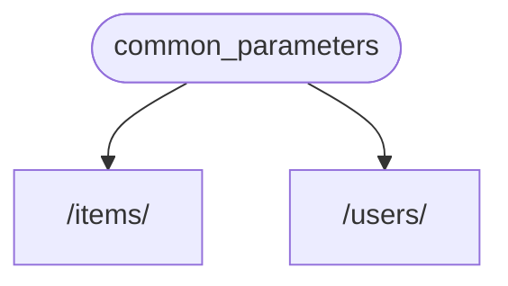
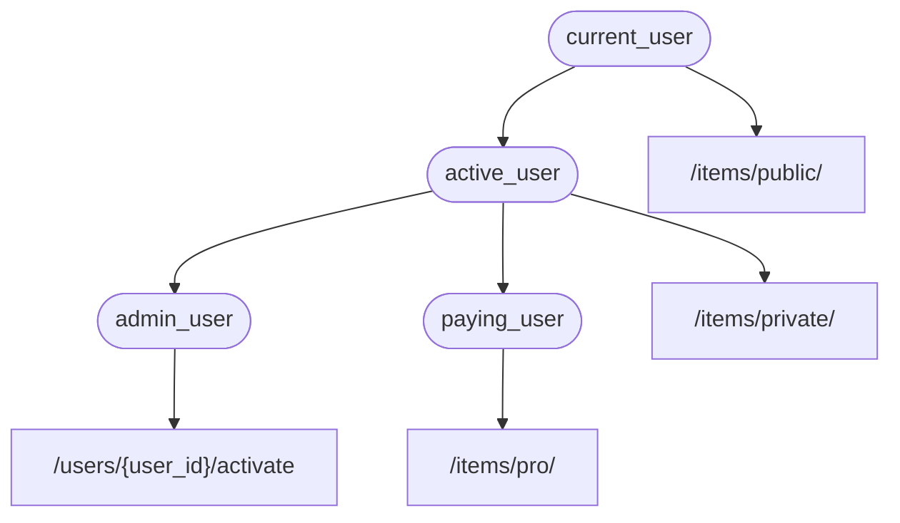

# Bağımlılıklar { #dependencies }

**FastAPI**, çok güçlü ama aynı zamanda sezgisel bir **<dfn title="diğer adları: components, resources, providers, services, injectables">Bağımlılık Enjeksiyonu</dfn>** sistemine sahiptir.

Kullanımı çok basit olacak şekilde tasarlanmıştır ve herhangi bir geliştiricinin diğer bileşenleri **FastAPI** ile entegre etmesini kolaylaştırır.

## "Dependency Injection" Nedir? { #what-is-dependency-injection }

Programlamada **"Dependency Injection"**, kodunuzun (bu örnekte *path operation function*'larınızın) çalışmak ve kullanmak için ihtiyaç duyduğu şeyleri: "dependencies" (bağımlılıklar) olarak beyan edebilmesi anlamına gelir.

Ardından bu sistem (bu örnekte **FastAPI**), kodunuza gerekli bağımlılıkları sağlamak ("inject" etmek) için gereken her şeyi sizin yerinize halleder.

Bu yaklaşım, şunlara ihtiyaç duyduğunuzda özellikle faydalıdır:

* Paylaşılan bir mantığa sahip olmak (aynı kod mantığını tekrar tekrar kullanmak).
* Veritabanı bağlantılarını paylaşmak.
* Güvenlik, authentication, rol gereksinimleri vb. kuralları zorunlu kılmak.
* Ve daha birçok şey...

Tüm bunları, kod tekrarını minimumda tutarak yaparsınız.

## İlk Adımlar { #first-steps }

Çok basit bir örneğe bakalım. Şimdilik o kadar basit olacak ki pek işe yaramayacak.

Ama bu sayede **Dependency Injection** sisteminin nasıl çalıştığına odaklanabiliriz.

### Bir dependency (bağımlılık) veya "dependable" Oluşturun { #create-a-dependency-or-dependable }

Önce dependency'e odaklanalım.

Bu, bir *path operation function*'ın alabileceği parametrelerin aynısını alabilen basit bir fonksiyondur:

{* ../../docs_src/dependencies/tutorial001_an_py310.py hl[8:9] *}

Bu kadar.

**2 satır**.

Ve tüm *path operation function*'larınızla aynı şekle ve yapıya sahiptir.

Bunu, "decorator" olmadan (yani `@app.get("/some-path")` olmadan) yazılmış bir *path operation function* gibi düşünebilirsiniz.

Ayrıca istediğiniz herhangi bir şeyi döndürebilir.

Bu örnekte, bu dependency şunları bekler:

* `str` olan, opsiyonel bir query parametresi `q`.
* `int` olan, opsiyonel bir query parametresi `skip` ve varsayılanı `0`.
* `int` olan, opsiyonel bir query parametresi `limit` ve varsayılanı `100`.

Sonra da bu değerleri içeren bir `dict` döndürür.

/// info | Bilgi

FastAPI, `Annotated` desteğini 0.95.0 sürümünde ekledi (ve önermeye başladı).

Daha eski bir sürüm kullanıyorsanız `Annotated` kullanmaya çalıştığınızda hata alırsınız.

`Annotated` kullanmadan önce **FastAPI** sürümünü en az 0.95.1'e yükseltmek için [FastAPI sürümünü yükseltin](../../deployment/versions.md#upgrading-the-fastapi-versions){.internal-link target=_blank}.

///

### `Depends`'i Import Edin { #import-depends }

{* ../../docs_src/dependencies/tutorial001_an_py310.py hl[3] *}

### "Dependant" İçinde Dependency'yi Tanımlayın { #declare-the-dependency-in-the-dependant }

*Path operation function* parametrelerinizde `Body`, `Query` vb. kullandığınız gibi, yeni bir parametreyle `Depends` kullanın:

{* ../../docs_src/dependencies/tutorial001_an_py310.py hl[13,18] *}

Fonksiyon parametrelerinde `Depends`'i `Body`, `Query` vb. ile aynı şekilde kullansanız da `Depends` biraz farklı çalışır.

`Depends`'e yalnızca tek bir parametre verirsiniz.

Bu parametre, bir fonksiyon gibi bir şey olmalıdır.

Onu doğrudan **çağırmazsınız** (sonuna parantez eklemezsiniz), sadece `Depends()`'e parametre olarak verirsiniz.

Ve bu fonksiyon da, *path operation function*'lar gibi parametre alır.

/// tip | İpucu

Fonksiyonların dışında başka hangi "şeylerin" dependency olarak kullanılabildiğini bir sonraki bölümde göreceksiniz.

///

Yeni bir request geldiğinde, **FastAPI** şunları sizin yerinize yapar:

* Dependency ("dependable") fonksiyonunuzu doğru parametrelerle çağırır.
* Fonksiyonunuzun sonucunu alır.
* Bu sonucu *path operation function*'ınızdaki parametreye atar.



Bu şekilde paylaşılan kodu bir kez yazarsınız ve onu *path operation*'larda çağırma işini **FastAPI** halleder.

/// check | Ek bilgi

Dikkat edin: Bunu "register" etmek ya da benzeri bir şey yapmak için özel bir class oluşturup **FastAPI**'ye bir yere geçirmeniz gerekmez.

Sadece `Depends`'e verirsiniz ve gerisini **FastAPI** nasıl yapacağını bilir.

///

## `Annotated` Dependency'lerini Paylaşın { #share-annotated-dependencies }

Yukarıdaki örneklerde, ufak bir **kod tekrarı** olduğunu görüyorsunuz.

`common_parameters()` dependency'sini kullanmanız gerektiğinde, type annotation ve `Depends()` içeren parametrenin tamamını yazmanız gerekir:

```Python
commons: Annotated[dict, Depends(common_parameters)]
```

Ancak `Annotated` kullandığımız için bu `Annotated` değerini bir değişkende saklayıp birden fazla yerde kullanabiliriz:

{* ../../docs_src/dependencies/tutorial001_02_an_py310.py hl[12,16,21] *}

/// tip | İpucu

Bu aslında standart Python'dır; buna "type alias" denir ve **FastAPI**'ye özel bir şey değildir.

Ama **FastAPI**, `Annotated` dahil Python standartları üzerine kurulu olduğu için bu tekniği kodunuzda kullanabilirsiniz. 😎

///

Dependency'ler beklediğiniz gibi çalışmaya devam eder ve **en güzel kısmı** da şudur: **type bilgisi korunur**. Bu da editörünüzün size **autocompletion**, **inline errors** vb. sağlamaya devam edeceği anlamına gelir. `mypy` gibi diğer araçlar için de aynısı geçerlidir.

Bu özellikle, **büyük bir kod tabanında**, aynı dependency'leri **birçok *path operation*** içinde tekrar tekrar kullandığınızda çok faydalı olacaktır.

## `async` Olsa da Olmasa da { #to-async-or-not-to-async }

Dependency'ler de **FastAPI** tarafından çağrılacağı için (tıpkı *path operation function*'larınız gibi), fonksiyonları tanımlarken aynı kurallar geçerlidir.

`async def` ya da normal `def` kullanabilirsiniz.

Ayrıca normal `def` *path operation function*'ları içinde `async def` dependency tanımlayabilir veya `async def` *path operation function*'ları içinde `def` dependency kullanabilirsiniz vb.

Fark etmez. **FastAPI** ne yapacağını bilir.

/// note | Not

Eğer bilmiyorsanız, dokümanlarda `async` ve `await` için [Async: *"In a hurry?"*](../../async.md#in-a-hurry){.internal-link target=_blank} bölümüne bakın.

///

## OpenAPI ile Entegre { #integrated-with-openapi }

Dependency'lerinizin (ve alt dependency'lerin) tüm request tanımları, doğrulamaları ve gereksinimleri aynı OpenAPI şemasına entegre edilir.

Bu nedenle interaktif dokümanlar, bu dependency'lerden gelen tüm bilgileri de içerir:


## Basit Kullanım { #simple-usage }

Şöyle düşünürseniz: *Path operation function*'lar, bir *path* ve *operation* eşleştiğinde kullanılacak şekilde tanımlanır; ardından **FastAPI** fonksiyonu doğru parametrelerle çağırır ve request'ten veriyi çıkarır.

Aslında tüm (veya çoğu) web framework'ü de aynı şekilde çalışır.

Bu fonksiyonları hiçbir zaman doğrudan çağırmazsınız. Onları framework'ünüz (bu örnekte **FastAPI**) çağırır.

Dependency Injection sistemiyle, *path operation function*'ınızın, ondan önce çalıştırılması gereken başka bir şeye de "bağlı" olduğunu **FastAPI**'ye söyleyebilirsiniz; **FastAPI** bunu çalıştırır ve sonuçları "inject" eder.

Aynı "dependency injection" fikri için kullanılan diğer yaygın terimler:

* resources
* providers
* services
* injectables
* components

## **FastAPI** Plug-in'leri { #fastapi-plug-ins }

Entegrasyonlar ve "plug-in"ler **Dependency Injection** sistemi kullanılarak inşa edilebilir. Ancak aslında **"plug-in" oluşturmanıza gerek yoktur**; çünkü dependency'leri kullanarak *path operation function*'larınıza sunulabilecek sınırsız sayıda entegrasyon ve etkileşim tanımlayabilirsiniz.

Dependency'ler, çok basit ve sezgisel bir şekilde oluşturulabilir. Böylece ihtiyacınız olan Python package'larını import edip, API fonksiyonlarınızla birkaç satır kodla *kelimenin tam anlamıyla* entegre edebilirsiniz.

İlerleyen bölümlerde ilişkisel ve NoSQL veritabanları, güvenlik vb. konularda bunun örneklerini göreceksiniz.

## **FastAPI** Uyumluluğu { #fastapi-compatibility }

Dependency injection sisteminin sadeliği, **FastAPI**'yi şunlarla uyumlu hale getirir:

* tüm ilişkisel veritabanları
* NoSQL veritabanları
* harici paketler
* harici API'ler
* authentication ve authorization sistemleri
* API kullanım izleme (monitoring) sistemleri
* response verisi injection sistemleri
* vb.

## Basit ve Güçlü { #simple-and-powerful }

Hiyerarşik dependency injection sistemi tanımlamak ve kullanmak çok basit olsa da, hâlâ oldukça güçlüdür.

Kendileri de dependency tanımlayabilen dependency'ler tanımlayabilirsiniz.

Sonuçta hiyerarşik bir dependency ağacı oluşur ve **Dependency Injection** sistemi tüm bu dependency'leri (ve alt dependency'lerini) sizin için çözer ve her adımda sonuçları sağlar ("inject" eder).

Örneğin, 4 API endpoint'iniz (*path operation*) olduğunu varsayalım:

* `/items/public/`
* `/items/private/`
* `/users/{user_id}/activate`
* `/items/pro/`

O zaman her biri için farklı izin gereksinimlerini yalnızca dependency'ler ve alt dependency'lerle ekleyebilirsiniz:



## **OpenAPI** ile Entegre { #integrated-with-openapi_1 }

Bu dependency'lerin tümü, gereksinimlerini beyan ederken aynı zamanda *path operation*'larınıza parametreler, doğrulamalar vb. da ekler.

**FastAPI**, bunların hepsini OpenAPI şemasına eklemekle ilgilenir; böylece interaktif dokümantasyon sistemlerinde gösterilir.
