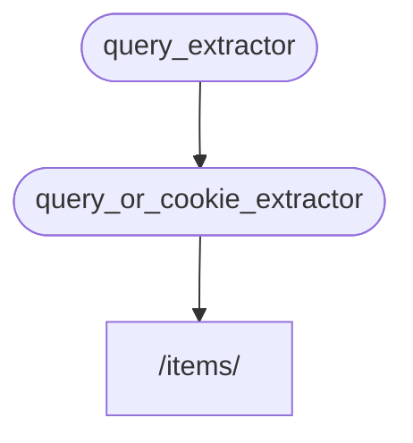

# Alt Bağımlılıklar { #sub-dependencies }

**Alt bağımlılıkları** olan bağımlılıklar oluşturabilirsiniz.

İhtiyacınız olduğu kadar **derine** gidebilirler.

Bunları çözme işini **FastAPI** üstlenir.

## İlk bağımlılık "dependable" { #first-dependency-dependable }

Şöyle bir ilk bağımlılık ("dependable") oluşturabilirsiniz:

{* ../../docs_src/dependencies/tutorial005_an_py310.py hl[8:9] *}

Burada `q` adında opsiyonel bir query parametresi `str` olarak tanımlanır ve sonra doğrudan geri döndürülür.

Bu oldukça basit (pek faydalı değil), ama alt bağımlılıkların nasıl çalıştığına odaklanmamıza yardımcı olacak.

## İkinci bağımlılık: "dependable" ve "dependant" { #second-dependency-dependable-and-dependant }

Ardından, aynı zamanda kendi içinde bir bağımlılık da tanımlayan başka bir bağımlılık fonksiyonu (bir "dependable") oluşturabilirsiniz (yani o da bir "dependant" olur):

{* ../../docs_src/dependencies/tutorial005_an_py310.py hl[13] *}

Tanımlanan parametrelere odaklanalım:

* Bu fonksiyonun kendisi bir bağımlılık ("dependable") olmasına rağmen, ayrıca başka bir bağımlılık daha tanımlar (başka bir şeye "depends" olur).
    * `query_extractor`'a bağlıdır ve ondan dönen değeri `q` parametresine atar.
* Ayrıca `last_query` adında opsiyonel bir cookie'yi `str` olarak tanımlar.
    * Kullanıcı herhangi bir query `q` sağlamadıysa, daha önce cookie'ye kaydettiğimiz en son kullanılan query'yi kullanırız.

## Bağımlılığı Kullanma { #use-the-dependency }

Sonra bu bağımlılığı şöyle kullanabiliriz:

{* ../../docs_src/dependencies/tutorial005_an_py310.py hl[23] *}

/// info | Bilgi

Dikkat edin, *path operation function* içinde yalnızca tek bir bağımlılık tanımlıyoruz: `query_or_cookie_extractor`.

Ancak **FastAPI**, `query_or_cookie_extractor`'ı çağırmadan önce `query_extractor`'ı önce çözmesi gerektiğini bilir ve onun sonucunu `query_or_cookie_extractor`'a aktarır.

///



## Aynı Bağımlılığı Birden Fazla Kez Kullanma { #using-the-same-dependency-multiple-times }

Bağımlılıklarınızdan biri aynı *path operation* için birden fazla kez tanımlanırsa (örneğin birden fazla bağımlılığın ortak bir alt bağımlılığı varsa), **FastAPI** o alt bağımlılığı request başına yalnızca bir kez çağıracağını bilir.

Dönen değeri bir <dfn title="Hesaplanan/üretilen değerleri saklayıp, tekrar hesaplamak yerine yeniden kullanmayı sağlayan bir yardımcı araç/sistem.">"önbellek"</dfn> içinde saklar ve aynı request içinde buna ihtiyaç duyan tüm "dependant"lara aktarır; böylece aynı request için bağımlılığı tekrar tekrar çağırmaz.

Daha ileri bir senaryoda, "cached" değeri kullanmak yerine aynı request içinde her adımda (muhtemelen birden fazla kez) bağımlılığın çağrılması gerektiğini biliyorsanız, `Depends` kullanırken `use_cache=False` parametresini ayarlayabilirsiniz:

//// tab | Python 3.10+

```Python hl_lines="1"
async def needy_dependency(fresh_value: Annotated[str, Depends(get_value, use_cache=False)]):
    return {"fresh_value": fresh_value}
```

////

//// tab | Python 3.10+ Annotated olmayan

/// tip | İpucu

Mümkünse `Annotated` sürümünü tercih edin.

///

```Python hl_lines="1"
async def needy_dependency(fresh_value: str = Depends(get_value, use_cache=False)):
    return {"fresh_value": fresh_value}
```

////

## Özet { #recap }

Burada kullanılan havalı terimlerin ötesinde, **Dependency Injection** sistemi aslında oldukça basittir.

*Path operation function*'lara benzeyen fonksiyonlardan ibarettir.

Yine de çok güçlüdür ve keyfi derecede derin iç içe geçmiş bağımlılık "graph"ları (ağaçları) tanımlamanıza izin verir.

/// tip | İpucu

Bu basit örneklerle çok faydalı görünmeyebilir.

Ancak **security** ile ilgili bölümlerde bunun ne kadar işe yaradığını göreceksiniz.

Ayrıca size ne kadar kod kazandırdığını da göreceksiniz.

///
