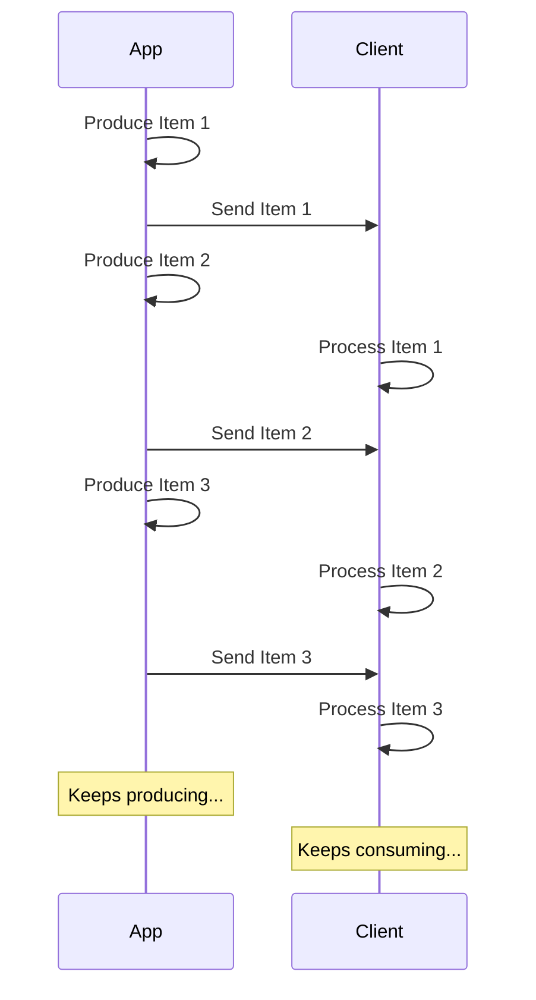

# JSON Lines Akışı { #stream-json-lines }

Bir veri dizisini “akış” olarak göndermek istediğiniz durumlar olabilir; bunu **JSON Lines** ile yapabilirsiniz.

/// info | Bilgi

FastAPI 0.134.0 ile eklendi.

///

## Akış (Stream) Nedir? { #what-is-a-stream }

Verileri “streaming” olarak göndermek, uygulamanızın tüm öğe dizisi hazır olmasını beklemeden, öğeleri istemciye göndermeye başlaması demektir.

Yani ilk öğeyi gönderirsiniz, istemci onu alıp işlemeye başlar, bu sırada siz bir sonraki öğeyi üretmeye devam edebilirsiniz.



Hatta, sürekli veri gönderdiğiniz sonsuz bir akış da olabilir.

## JSON Lines { #json-lines }

Bu tür durumlarda, her satıra bir JSON nesnesi gönderdiğiniz bir biçim olan “**JSON Lines**” kullanmak yaygındır.

Response’un `application/json` yerine `application/jsonl` içerik türü (Content-Type) olur ve body aşağıdaki gibi görünür:

```json
{"name": "Plumbus", "description": "A multi-purpose household device."}
{"name": "Portal Gun", "description": "A portal opening device."}
{"name": "Meeseeks Box", "description": "A box that summons a Meeseeks."}
```

Bir JSON dizisine (Python list eşdeğeri) çok benzer; ancak öğeler `[]` içine alınmak ve araya `,` konmak yerine, her satırda **bir JSON nesnesi** vardır; bunlar yeni satır karakteri ile ayrılır.

/// info | Bilgi

Önemli nokta, uygulamanız her satırı sırayla üretebilirken, istemcinin de önceki satırları tüketmeye devam edebilmesidir.

///

/// note | Teknik Detaylar

Her JSON nesnesi yeni bir satırla ayrıldığı için, içeriklerinde gerçek yeni satır karakterleri bulunamaz; ancak JSON standardının bir parçası olan kaçışlı yeni satırlar (`\n`) bulunabilir.

Genelde bununla sizin uğraşmanız gerekmez, otomatik olarak halledilir, okumaya devam edin. 🤓

///

## Kullanım Senaryoları { #use-cases }

Bunu bir **AI LLM** servisinden, **loglar**dan veya **telemetri**den ya da **JSON** öğeleri halinde yapılandırılabilen başka tür verilerden akış yapmak için kullanabilirsiniz.

/// tip | İpucu

İkili (binary) veri akışı yapmak istiyorsanız, örneğin video veya ses, gelişmiş kılavuza bakın: [Veri Akışı](../advanced/stream-data.md).

///

## FastAPI ile JSON Lines Akışı { #stream-json-lines-with-fastapi }

FastAPI ile JSON Lines akışı yapmak için, *path operation function* içinde `return` kullanmak yerine, her öğeyi sırayla üretmek için `yield` kullanabilirsiniz.

{* ../../docs_src/stream_json_lines/tutorial001_py310.py ln[1:24] hl[24] *}

Göndermek istediğiniz her JSON öğesi `Item` tipindeyse (bir Pydantic modeli) ve fonksiyon async ise, dönüş tipini `AsyncIterable[Item]` olarak belirtebilirsiniz:

{* ../../docs_src/stream_json_lines/tutorial001_py310.py ln[1:24] hl[9:11,22] *}

Dönüş tipini belirtirseniz, FastAPI bu tipi kullanarak veriyi **doğrular**, OpenAPI’de **dokümante** eder, **filtreler** ve Pydantic ile **serileştirir**.

/// tip | İpucu

Pydantic serileştirmeyi **Rust** tarafında yapacağı için, dönüş tipi belirtmediğiniz duruma göre çok daha yüksek **performans** elde edersiniz.

///

### Async Olmayan path operation function'lar { #non-async-path-operation-functions }

`async` olmadan normal `def` fonksiyonları da kullanabilir ve aynı şekilde `yield` yazabilirsiniz.

FastAPI, event loop’u bloklamayacak şekilde doğru çalışmasını garanti eder.

Bu durumda fonksiyon async olmadığı için doğru dönüş tipi `Iterable[Item]` olur:

{* ../../docs_src/stream_json_lines/tutorial001_py310.py ln[27:30] hl[28] *}

### Dönüş Tipi Olmadan { #no-return-type }

Dönüş tipini belirtmeyebilirsiniz de. Bu durumda FastAPI, veriyi JSON’a serileştirilebilir bir yapıya dönüştürmek için [`jsonable_encoder`](./encoder.md)’ı kullanır ve ardından JSON Lines olarak gönderir.

{* ../../docs_src/stream_json_lines/tutorial001_py310.py ln[33:36] hl[34] *}

## Server-Sent Events (SSE) { #server-sent-events-sse }

FastAPI, Server-Sent Events (SSE) için de birinci sınıf destek sağlar; benzerlerdir ancak birkaç ekstra ayrıntı vardır. Bir sonraki bölümden öğrenebilirsiniz: [Server-Sent Events (SSE)](server-sent-events.md). 🤓
