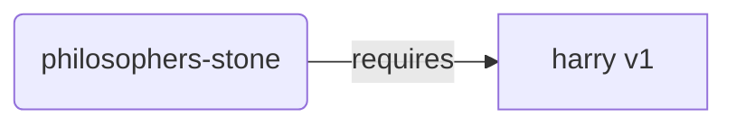
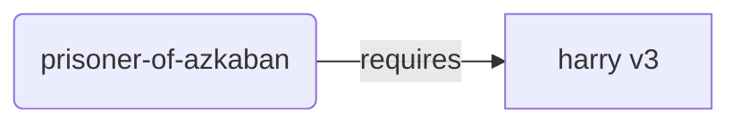
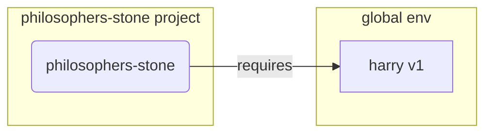
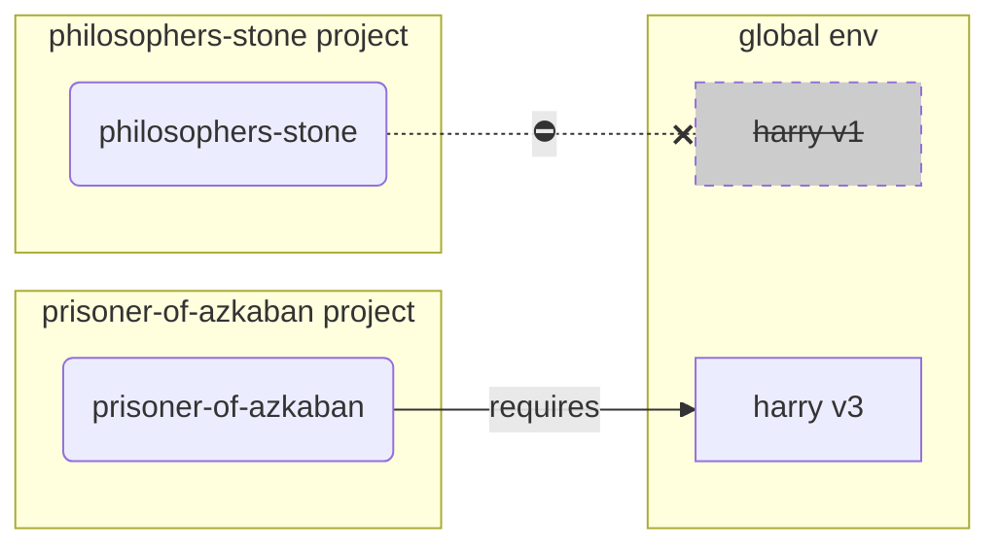
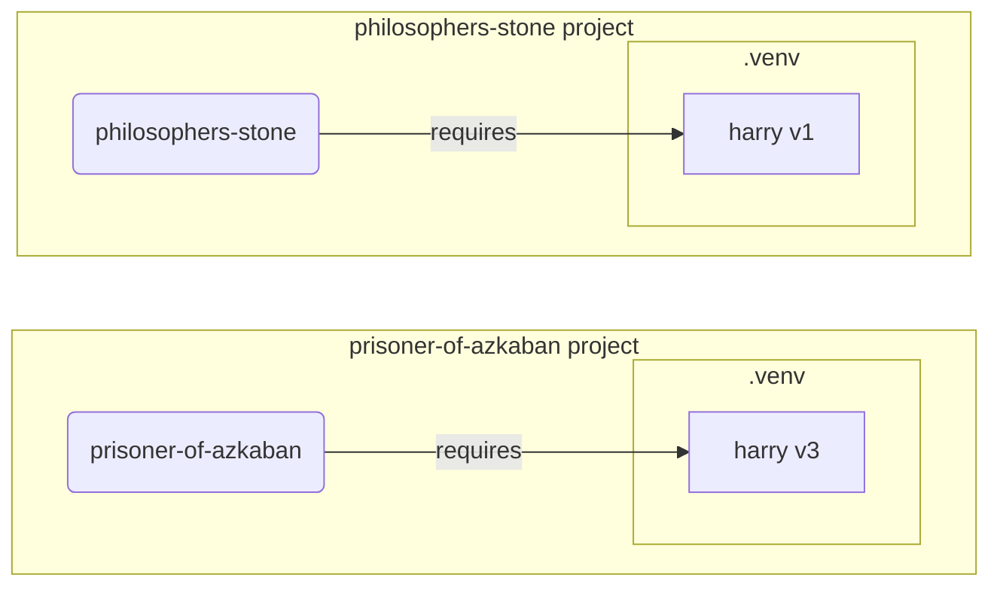

# Virtual Environments { #virtual-environments }

Python projeleriyle çalışırken, her proje için kurduğunuz package'leri birbirinden izole etmek adına büyük ihtimalle bir **virtual environment** (veya benzer bir mekanizma) kullanmalısınız.

/// info | Bilgi

Virtual environment'leri, nasıl oluşturulduklarını ve nasıl kullanıldıklarını zaten biliyorsanız bu bölümü atlamak isteyebilirsiniz. 🤓

///

/// tip | İpucu

**Virtual environment**, **environment variable** ile aynı şey değildir.

**Environment variable**, sistemde bulunan ve programların kullanabildiği bir değişkendir.

**Virtual environment** ise içinde bazı dosyalar bulunan bir klasördür.

///

/// info | Bilgi

Bu sayfada **virtual environment**'leri nasıl kullanacağınızı ve nasıl çalıştıklarını öğreneceksiniz.

Eğer Python'ı kurmak dahil her şeyi sizin yerinize yöneten bir **tool** kullanmaya hazırsanız, <a href="https://github.com/astral-sh/uv" class="external-link" target="_blank">uv</a>'yi deneyin.

///

## Proje Oluşturun { #create-a-project }

Önce projeniz için bir klasör oluşturun.

Ben genelde home/user klasörümün içinde `code` adlı bir klasör oluştururum.

Sonra bunun içinde her proje için ayrı bir klasör oluştururum.

<div class="termy">

```console
// Go to the home directory
$ cd
// Create a directory for all your code projects
$ mkdir code
// Enter into that code directory
$ cd code
// Create a directory for this project
$ mkdir awesome-project
// Enter into that project directory
$ cd awesome-project
```

</div>

## Virtual Environment Oluşturun { #create-a-virtual-environment }

Bir Python projesi üzerinde **ilk kez** çalışmaya başladığınızda, **virtual environment**'i <dfn title="başka seçenekler de var, bu basit bir yönergedir">projenizin içinde</dfn> oluşturun.

/// tip | İpucu

Bunu her çalıştığınızda değil, **proje başına sadece bir kez** yapmanız yeterlidir.

///

//// tab | `venv`

Bir virtual environment oluşturmak için, Python ile birlikte gelen `venv` modülünü kullanabilirsiniz.

<div class="termy">

```console
$ python -m venv .venv
```

</div>

/// details | Bu komut ne anlama geliyor

* `python`: `python` adlı programı kullan
* `-m`: bir modülü script gibi çalıştır; bir sonraki kısımda hangi modül olduğunu söyleyeceğiz
* `venv`: normalde Python ile birlikte kurulu gelen `venv` modülünü kullan
* `.venv`: virtual environment'i yeni `.venv` klasörünün içine oluştur

///

////

//// tab | `uv`

Eğer <a href="https://github.com/astral-sh/uv" class="external-link" target="_blank">`uv`</a> kuruluysa, onunla da virtual environment oluşturabilirsiniz.

<div class="termy">

```console
$ uv venv
```

</div>

/// tip | İpucu

Varsayılan olarak `uv`, `.venv` adlı bir klasörde virtual environment oluşturur.

Ancak ek bir argümanla klasör adını vererek bunu özelleştirebilirsiniz.

///

////

Bu komut `.venv` adlı bir klasörün içinde yeni bir virtual environment oluşturur.

/// details | `.venv` veya başka bir ad

Virtual environment'i başka bir klasörde de oluşturabilirsiniz; ancak buna `.venv` demek yaygın bir konvansiyondur.

///

## Virtual Environment'i Aktif Edin { #activate-the-virtual-environment }

Oluşturduğunuz virtual environment'i aktif edin; böylece çalıştırdığınız her Python komutu veya kurduğunuz her package onu kullanır.

/// tip | İpucu

Projede çalışmak için **yeni bir terminal oturumu** başlattığınız **her seferinde** bunu yapın.

///

//// tab | Linux, macOS

<div class="termy">

```console
$ source .venv/bin/activate
```

</div>

////

//// tab | Windows PowerShell

<div class="termy">

```console
$ .venv\Scripts\Activate.ps1
```

</div>

////

//// tab | Windows Bash

Ya da Windows'ta Bash kullanıyorsanız (örn. <a href="https://gitforwindows.org/" class="external-link" target="_blank">Git Bash</a>):

<div class="termy">

```console
$ source .venv/Scripts/activate
```

</div>

////

/// tip | İpucu

Bu environment'e **yeni bir package** kurduğunuz her seferinde environment'i yeniden **aktif edin**.

Böylece, o package'in kurduğu bir **terminal (<abbr title="command line interface - Komut Satırı Arayüzü">CLI</abbr>) programı** kullanıyorsanız, global olarak kurulu (ve muhtemelen ihtiyacınız olandan farklı bir versiyona sahip) başka bir program yerine, virtual environment'inizdeki programı kullanmış olursunuz.

///

## Virtual Environment'in Aktif Olduğunu Kontrol Edin { #check-the-virtual-environment-is-active }

Virtual environment'in aktif olduğunu (bir önceki komutun çalıştığını) kontrol edin.

/// tip | İpucu

Bu **opsiyoneldir**; ancak her şeyin beklendiği gibi çalıştığını ve hedeflediğiniz virtual environment'i kullandığınızı **kontrol etmek** için iyi bir yöntemdir.

///

//// tab | Linux, macOS, Windows Bash

<div class="termy">

```console
$ which python

/home/user/code/awesome-project/.venv/bin/python
```

</div>

Eğer `python` binary'sini projenizin içinde (bu örnekte `awesome-project`) `.venv/bin/python` yolunda gösteriyorsa, tamamdır. 🎉

////

//// tab | Windows PowerShell

<div class="termy">

```console
$ Get-Command python

C:\Users\user\code\awesome-project\.venv\Scripts\python
```

</div>

Eğer `python` binary'sini projenizin içinde (bu örnekte `awesome-project`) `.venv\Scripts\python` yolunda gösteriyorsa, tamamdır. 🎉

////

## `pip`'i Yükseltin { #upgrade-pip }

/// tip | İpucu

<a href="https://github.com/astral-sh/uv" class="external-link" target="_blank">`uv`</a> kullanıyorsanız, `pip` yerine onunla kurulum yaparsınız; dolayısıyla `pip`'i yükseltmeniz gerekmez. 😎

///

Package'leri kurmak için `pip` kullanıyorsanız (Python ile varsayılan olarak gelir), en güncel sürüme **yükseltmeniz** gerekir.

Bir package kurarken görülen birçok garip hata, önce `pip`'i yükseltince çözülür.

/// tip | İpucu

Bunu genelde virtual environment'i oluşturduktan hemen sonra **bir kez** yaparsınız.

///

Virtual environment'in aktif olduğundan emin olun (yukarıdaki komutla) ve sonra şunu çalıştırın:

<div class="termy">

```console
$ python -m pip install --upgrade pip

---> 100%
```

</div>

/// tip | İpucu

Bazen pip'i yükseltmeye çalışırken **`No module named pip`** hatası alabilirsiniz.

Böyle olursa, aşağıdaki komutla pip'i kurup yükseltin:

<div class="termy">

```console
$ python -m ensurepip --upgrade

---> 100%
```

</div>

Bu komut pip kurulu değilse kurar ve ayrıca kurulu pip sürümünün `ensurepip` içinde bulunan sürüm kadar güncel olmasını garanti eder.

///

## `.gitignore` Ekleyin { #add-gitignore }

**Git** kullanıyorsanız (kullanmalısınız), `.venv` içindeki her şeyi Git'ten hariç tutmak için bir `.gitignore` dosyası ekleyin.

/// tip | İpucu

Virtual environment'i <a href="https://github.com/astral-sh/uv" class="external-link" target="_blank">`uv`</a> ile oluşturduysanız, bunu zaten sizin için yaptı; bu adımı atlayabilirsiniz. 😎

///

/// tip | İpucu

Bunu virtual environment'i oluşturduktan hemen sonra **bir kez** yapın.

///

<div class="termy">

```console
$ echo "*" > .venv/.gitignore
```

</div>

/// details | Bu komut ne anlama geliyor

* `echo "*"`: terminale `*` metnini "yazar" (sonraki kısım bunu biraz değiştiriyor)
* `>`: `>` işaretinin solundaki komutun terminale yazdıracağı çıktı, ekrana basılmak yerine sağ taraftaki dosyaya yazılsın
* `.gitignore`: metnin yazılacağı dosyanın adı

Git'te `*` "her şey" demektir. Yani `.venv` klasörü içindeki her şeyi ignore eder.

Bu komut, içeriği şu olan bir `.gitignore` dosyası oluşturur:

```gitignore
*
```

///

## Package'leri Kurun { #install-packages }

Environment'i aktif ettikten sonra, içine package kurabilirsiniz.

/// tip | İpucu

Projede ihtiyaç duyduğunuz package'leri ilk kez kurarken veya yükseltirken bunu **bir kez** yapın.

Bir sürümü yükseltmeniz veya yeni bir package eklemeniz gerekirse **tekrar** yaparsınız.

///

### Package'leri Doğrudan Kurun { #install-packages-directly }

Acele ediyorsanız ve projenizin package gereksinimlerini bir dosyada belirtmek istemiyorsanız, doğrudan kurabilirsiniz.

/// tip | İpucu

Programınızın ihtiyaç duyduğu package'leri ve versiyonlarını bir dosyada tutmak (ör. `requirements.txt` veya `pyproject.toml`) (çok) iyi bir fikirdir.

///

//// tab | `pip`

<div class="termy">

```console
$ pip install "fastapi[standard]"

---> 100%
```

</div>

////

//// tab | `uv`

Eğer <a href="https://github.com/astral-sh/uv" class="external-link" target="_blank">`uv`</a> varsa:

<div class="termy">

```console
$ uv pip install "fastapi[standard]"
---> 100%
```

</div>

////

### `requirements.txt`'ten Kurun { #install-from-requirements-txt }

Bir `requirements.txt` dosyanız varsa, içindeki package'leri kurmak için artık onu kullanabilirsiniz.

//// tab | `pip`

<div class="termy">

```console
$ pip install -r requirements.txt
---> 100%
```

</div>

////

//// tab | `uv`

Eğer <a href="https://github.com/astral-sh/uv" class="external-link" target="_blank">`uv`</a> varsa:

<div class="termy">

```console
$ uv pip install -r requirements.txt
---> 100%
```

</div>

////

/// details | `requirements.txt`

Bazı package'ler içeren bir `requirements.txt` şöyle görünebilir:

```requirements.txt
fastapi[standard]==0.113.0
pydantic==2.8.0
```

///

## Programınızı Çalıştırın { #run-your-program }

Virtual environment'i aktif ettikten sonra programınızı çalıştırabilirsiniz; program, virtual environment'in içindeki Python'ı ve oraya kurduğunuz package'leri kullanır.

<div class="termy">

```console
$ python main.py

Hello World
```

</div>

## Editörünüzü Yapılandırın { #configure-your-editor }

Muhtemelen bir editör kullanırsınız; otomatik tamamlamayı ve satır içi hataları alabilmek için, editörünüzü oluşturduğunuz aynı virtual environment'i kullanacak şekilde yapılandırdığınızdan emin olun (muhtemelen otomatik algılar).

Örneğin:

* <a href="https://code.visualstudio.com/docs/python/environments#_select-and-activate-an-environment" class="external-link" target="_blank">VS Code</a>
* <a href="https://www.jetbrains.com/help/pycharm/creating-virtual-environment.html" class="external-link" target="_blank">PyCharm</a>

/// tip | İpucu

Bunu genelde yalnızca **bir kez**, virtual environment'i oluşturduğunuzda yapmanız gerekir.

///

## Virtual Environment'i Devre Dışı Bırakın { #deactivate-the-virtual-environment }

Projeniz üzerinde işiniz bittiğinde virtual environment'i **deactivate** edebilirsiniz.

<div class="termy">

```console
$ deactivate
```

</div>

Böylece `python` çalıştırdığınızda, o virtual environment içinden (ve oraya kurulu package'lerle) çalıştırmaya çalışmaz.

## Çalışmaya Hazırsınız { #ready-to-work }

Artık projeniz üzerinde çalışmaya başlayabilirsiniz.

/// tip | İpucu

Yukarıdaki her şeyin aslında ne olduğunu anlamak ister misiniz?

Okumaya devam edin. 👇🤓

///

## Neden Virtual Environment { #why-virtual-environments }

FastAPI ile çalışmak için <a href="https://www.python.org/" class="external-link" target="_blank">Python</a> kurmanız gerekir.

Sonrasında FastAPI'yi ve kullanmak istediğiniz diğer tüm **package**'leri **kurmanız** gerekir.

Package kurmak için genelde Python ile gelen `pip` komutunu (veya benzeri alternatifleri) kullanırsınız.

Ancak `pip`'i doğrudan kullanırsanız, package'ler **global Python environment**'ınıza (Python'ın global kurulumuna) yüklenir.

### Problem { #the-problem }

Peki package'leri global Python environment'a kurmanın sorunu ne?

Bir noktada, muhtemelen **farklı package**'lere bağımlı birçok farklı program yazacaksınız. Ayrıca üzerinde çalıştığınız bazı projeler, aynı package'in **farklı versiyonlarına** ihtiyaç duyacak. 😱

Örneğin `philosophers-stone` adında bir proje oluşturduğunuzu düşünün; bu program, `harry` adlı başka bir package'e **`1` versiyonu ile** bağlı. Yani `harry`'yi kurmanız gerekir.



Sonra daha ileri bir zamanda `prisoner-of-azkaban` adlı başka bir proje oluşturuyorsunuz; bu proje de `harry`'ye bağlı, fakat bu proje **`harry` versiyon `3`** istiyor.



Şimdi sorun şu: package'leri local bir **virtual environment** yerine global (global environment) olarak kurarsanız, `harry`'nin hangi versiyonunu kuracağınıza karar vermek zorunda kalırsınız.

`philosophers-stone`'u çalıştırmak istiyorsanız önce `harry` versiyon `1`'i kurmanız gerekir; örneğin:

<div class="termy">

```console
$ pip install "harry==1"
```

</div>

Sonuç olarak global Python environment'ınızda `harry` versiyon `1` kurulu olur.



Fakat `prisoner-of-azkaban`'ı çalıştırmak istiyorsanız, `harry` versiyon `1`'i kaldırıp `harry` versiyon `3`'ü kurmanız gerekir (ya da sadece `3`'ü kurmak, otomatik olarak `1`'i kaldırabilir).

<div class="termy">

```console
$ pip install "harry==3"
```

</div>

Sonuç olarak global Python environment'ınızda `harry` versiyon `3` kurulu olur.

Ve `philosophers-stone`'u tekrar çalıştırmaya kalkarsanız, `harry` versiyon `1`'e ihtiyaç duyduğu için **çalışmama** ihtimali vardır.



/// tip | İpucu

Python package'lerinde **yeni versiyonlarda** **breaking change**'lerden kaçınmak oldukça yaygındır; ancak yine de daha güvenlisi, yeni versiyonları bilinçli şekilde kurmak ve mümkünse test'leri çalıştırıp her şeyin doğru çalıştığını doğrulamaktır.

///

Şimdi bunu, **projelerinizin bağımlı olduğu** daha **birçok** başka **package** ile birlikte düşünün. Yönetmesi epey zorlaşır. Sonunda bazı projeleri package'lerin **uyumsuz versiyonlarıyla** çalıştırıp, bir şeylerin neden çalışmadığını anlamamak gibi durumlara düşebilirsiniz.

Ayrıca işletim sisteminize (örn. Linux, Windows, macOS) bağlı olarak Python zaten kurulu gelmiş olabilir. Bu durumda, sisteminizin **ihtiyaç duyduğu** bazı package'ler belirli versiyonlarla önceden kurulu olabilir. Global Python environment'a package kurarsanız, işletim sistemiyle gelen bazı programları **bozma** ihtimaliniz olabilir.

## Package'ler Nereye Kuruluyor { #where-are-packages-installed }

Python'ı kurduğunuzda, bilgisayarınızda bazı dosyalar içeren klasörler oluşturulur.

Bu klasörlerin bir kısmı, kurduğunuz tüm package'leri barındırmaktan sorumludur.

Şunu çalıştırdığınızda:

<div class="termy">

```console
// Don't run this now, it's just an example 🤓
$ pip install "fastapi[standard]"
---> 100%
```

</div>

Bu, FastAPI kodunu içeren sıkıştırılmış bir dosyayı genellikle <a href="https://pypi.org/project/fastapi/" class="external-link" target="_blank">PyPI</a>'dan indirir.

Ayrıca FastAPI'nin bağımlı olduğu diğer package'ler için de dosyaları **indirir**.

Sonra tüm bu dosyaları **açar (extract)** ve bilgisayarınızdaki bir klasöre koyar.

Varsayılan olarak bu indirilip çıkarılan dosyaları, Python kurulumunuzla birlikte gelen klasöre yerleştirir; yani **global environment**'a.

## Virtual Environment Nedir { #what-are-virtual-environments }

Global environment'da tüm package'leri bir arada tutmanın sorunlarına çözüm, çalıştığınız her proje için ayrı bir **virtual environment** kullanmaktır.

Virtual environment, global olana çok benzeyen bir **klasördür**; bir projenin ihtiyaç duyduğu package'leri buraya kurarsınız.

Böylece her projenin kendi virtual environment'i (`.venv` klasörü) ve kendi package'leri olur.



## Virtual Environment'i Aktif Etmek Ne Demek { #what-does-activating-a-virtual-environment-mean }

Bir virtual environment'i örneğin şununla aktif ettiğinizde:

//// tab | Linux, macOS

<div class="termy">

```console
$ source .venv/bin/activate
```

</div>

////

//// tab | Windows PowerShell

<div class="termy">

```console
$ .venv\Scripts\Activate.ps1
```

</div>

////

//// tab | Windows Bash

Ya da Windows'ta Bash kullanıyorsanız (örn. <a href="https://gitforwindows.org/" class="external-link" target="_blank">Git Bash</a>):

<div class="termy">

```console
$ source .venv/Scripts/activate
```

</div>

////

Bu komut, sonraki komutlarda kullanılabilecek bazı [environment variable](environment-variables.md){.internal-link target=_blank}'ları oluşturur veya değiştirir.

Bunlardan biri `PATH` değişkenidir.

/// tip | İpucu

`PATH` environment variable hakkında daha fazla bilgiyi [Environment Variables](environment-variables.md#path-environment-variable){.internal-link target=_blank} bölümünde bulabilirsiniz.

///

Bir virtual environment'i aktive etmek, onun `.venv/bin` (Linux ve macOS'ta) veya `.venv\Scripts` (Windows'ta) yolunu `PATH` environment variable'ına ekler.

Diyelim ki environment'i aktive etmeden önce `PATH` değişkeni şöyleydi:

//// tab | Linux, macOS

```plaintext
/usr/bin:/bin:/usr/sbin:/sbin
```

Bu, sistemin programları şu klasörlerde arayacağı anlamına gelir:

* `/usr/bin`
* `/bin`
* `/usr/sbin`
* `/sbin`

////

//// tab | Windows

```plaintext
C:\Windows\System32
```

Bu, sistemin programları şurada arayacağı anlamına gelir:

* `C:\Windows\System32`

////

Virtual environment'i aktive ettikten sonra `PATH` değişkeni şuna benzer hale gelir:

//// tab | Linux, macOS

```plaintext
/home/user/code/awesome-project/.venv/bin:/usr/bin:/bin:/usr/sbin:/sbin
```

Bu, sistemin artık programları önce şurada aramaya başlayacağı anlamına gelir:

```plaintext
/home/user/code/awesome-project/.venv/bin
```

diğer klasörlere bakmadan önce.

Dolayısıyla terminale `python` yazdığınızda, sistem Python programını şurada bulur:

```plaintext
/home/user/code/awesome-project/.venv/bin/python
```

ve onu kullanır.

////

//// tab | Windows

```plaintext
C:\Users\user\code\awesome-project\.venv\Scripts;C:\Windows\System32
```

Bu, sistemin artık programları önce şurada aramaya başlayacağı anlamına gelir:

```plaintext
C:\Users\user\code\awesome-project\.venv\Scripts
```

diğer klasörlere bakmadan önce.

Dolayısıyla terminale `python` yazdığınızda, sistem Python programını şurada bulur:

```plaintext
C:\Users\user\code\awesome-project\.venv\Scripts\python
```

ve onu kullanır.

////

Önemli bir detay: virtual environment yolu `PATH` değişkeninin **en başına** eklenir. Sistem, mevcut başka herhangi bir Python'ı bulmadan **önce** bunu bulur. Böylece `python` çalıştırdığınızda, başka bir `python` (örneğin global environment'tan gelen `python`) yerine **virtual environment'taki** Python kullanılır.

Virtual environment'i aktive etmek birkaç şeyi daha değiştirir; ancak yaptığı en önemli işlerden biri budur.

## Virtual Environment'i Kontrol Etmek { #checking-a-virtual-environment }

Bir virtual environment'in aktif olup olmadığını örneğin şununla kontrol ettiğinizde:

//// tab | Linux, macOS, Windows Bash

<div class="termy">

```console
$ which python

/home/user/code/awesome-project/.venv/bin/python
```

</div>

////

//// tab | Windows PowerShell

<div class="termy">

```console
$ Get-Command python

C:\Users\user\code\awesome-project\.venv\Scripts\python
```

</div>

////

Bu, kullanılacak `python` programının **virtual environment'in içindeki** Python olduğu anlamına gelir.

Linux ve macOS'ta `which`, Windows PowerShell'de ise `Get-Command` kullanırsınız.

Bu komutun çalışma mantığı şudur: `PATH` environment variable içindeki **her yolu sırayla** dolaşır, `python` adlı programı arar. Bulduğunda, size o programın **dosya yolunu** gösterir.

En önemli kısım şu: `python` dediğinizde çalışacak olan "`python`" tam olarak budur.

Yani doğru virtual environment'da olup olmadığınızı doğrulayabilirsiniz.

/// tip | İpucu

Bir virtual environment'i aktive etmek kolaydır; sonra o Python ile kalıp **başka bir projeye geçmek** de kolaydır.

Bu durumda ikinci proje, başka bir projenin virtual environment'ından gelen **yanlış Python**'ı kullandığınız için **çalışmayabilir**.

Hangi `python`'ın kullanıldığını kontrol edebilmek bu yüzden faydalıdır. 🤓

///

## Neden Virtual Environment'i Deactivate Edelim { #why-deactivate-a-virtual-environment }

Örneğin `philosophers-stone` projesi üzerinde çalışıyor olabilirsiniz; **o virtual environment'i aktive eder**, package kurar ve o environment ile çalışırsınız.

Sonra **başka bir proje** olan `prisoner-of-azkaban` üzerinde çalışmak istersiniz.

O projeye gidersiniz:

<div class="termy">

```console
$ cd ~/code/prisoner-of-azkaban
```

</div>

Eğer `philosophers-stone` için olan virtual environment'i deactivate etmezseniz, terminalde `python` çalıştırdığınızda `philosophers-stone`'dan gelen Python'ı kullanmaya çalışır.

<div class="termy">

```console
$ cd ~/code/prisoner-of-azkaban

$ python main.py

// Error importing sirius, it's not installed 😱
Traceback (most recent call last):
    File "main.py", line 1, in <module>
        import sirius
```

</div>

Ama virtual environment'i deactivate edip `prisoner-of-askaban` için yeni olanı aktive ederseniz, `python` çalıştırdığınızda `prisoner-of-azkaban` içindeki virtual environment'dan gelen Python kullanılır.

<div class="termy">

```console
$ cd ~/code/prisoner-of-azkaban

// You don't need to be in the old directory to deactivate, you can do it wherever you are, even after going to the other project 😎
$ deactivate

// Activate the virtual environment in prisoner-of-azkaban/.venv 🚀
$ source .venv/bin/activate

// Now when you run python, it will find the package sirius installed in this virtual environment ✨
$ python main.py

I solemnly swear 🐺
```

</div>

## Alternatifler { #alternatives }

Bu, başlamanız için basit bir rehber ve alttaki mekanizmaların nasıl çalıştığını öğretmeyi amaçlıyor.

Virtual environment'leri, package bağımlılıklarını (requirements) ve projeleri yönetmek için birçok **alternatif** vardır.

Hazır olduğunuzda ve package bağımlılıkları, virtual environment'ler vb. dahil **tüm projeyi yönetmek** için bir tool kullanmak istediğinizde, <a href="https://github.com/astral-sh/uv" class="external-link" target="_blank">uv</a>'yi denemenizi öneririm.

`uv` birçok şey yapabilir, örneğin:

* Sizin için **Python kurabilir**, farklı sürümler dahil
* Projelerinizin **virtual environment**'ini yönetebilir
* **Package** kurabilir
* Projeniz için package **bağımlılıklarını ve versiyonlarını** yönetebilir
* Bağımlılıkları dahil, kurulacak package ve versiyonların **tam (exact)** bir setini garanti edebilir; böylece geliştirirken bilgisayarınızda çalıştırdığınız projeyi production'da da birebir aynı şekilde çalıştırabileceğinizden emin olursunuz; buna **locking** denir
* Ve daha birçok şey

## Sonuç { #conclusion }

Buradaki her şeyi okuduysanız ve anladıysanız, artık birçok geliştiriciden **çok daha fazla** virtual environment bilgisine sahipsiniz. 🤓

Bu detayları bilmek, ileride karmaşık görünen bir sorunu debug ederken büyük olasılıkla işinize yarayacak; çünkü **altta nasıl çalıştığını** biliyor olacaksınız. 😎
