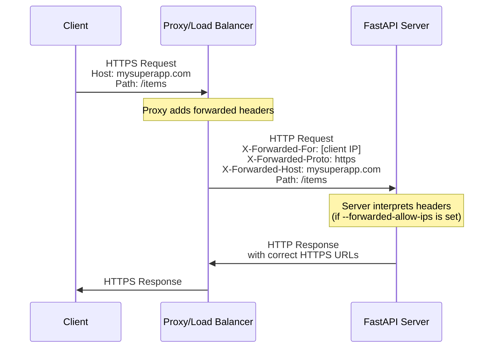
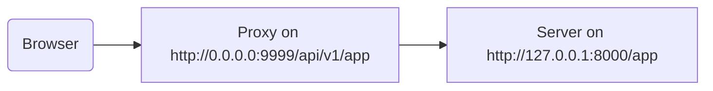

# За проксі { #behind-a-proxy }

У багатьох ситуаціях перед вашим застосунком FastAPI ви використовуватимете **проксі**, як-от Traefik або Nginx.

Такі проксі можуть обробляти сертифікати HTTPS та інші речі.

## Forwarded-заголовки проксі { #proxy-forwarded-headers }

**Проксі** перед вашим застосунком зазвичай «на льоту» встановлює деякі заголовки перед надсиланням запитів на ваш **сервер**, щоб повідомити серверу, що запит був **переспрямований** проксі, і передати початковий (публічний) URL, включно з доменом, що використовується HTTPS тощо.

Програма **сервера** (наприклад, **Uvicorn** через **FastAPI CLI**) уміє інтерпретувати ці заголовки, а потім передавати цю інформацію вашому застосунку.

Але з міркувань безпеки, оскільки сервер не знає, що він знаходиться за довіреним проксі, він не інтерпретуватиме ці заголовки.

/// note | Технічні деталі

Заголовки проксі:

* <a href="https://developer.mozilla.org/en-US/docs/Web/HTTP/Reference/Headers/X-Forwarded-For" class="external-link" target="_blank">X-Forwarded-For</a>
* <a href="https://developer.mozilla.org/en-US/docs/Web/HTTP/Reference/Headers/X-Forwarded-Proto" class="external-link" target="_blank">X-Forwarded-Proto</a>
* <a href="https://developer.mozilla.org/en-US/docs/Web/HTTP/Reference/Headers/X-Forwarded-Host" class="external-link" target="_blank">X-Forwarded-Host</a>

///

### Увімкнення Forwarded-заголовків проксі { #enable-proxy-forwarded-headers }

Ви можете запустити FastAPI CLI з *CLI Option* `--forwarded-allow-ips` і передати IP-адреси, яким слід довіряти для читання цих forwarded-заголовків.

Якщо встановити `--forwarded-allow-ips="*"`, довіра буде до всіх вхідних IP.

Якщо ваш **сервер** знаходиться за довіреним **проксі** і лише проксі звертається до нього, це змусить сервер приймати як «дозволену» ту IP-адресу, з якої приходять запити до сервера — тобто IP цього **проксі**.

<div class="termy">

```console
$ fastapi run --forwarded-allow-ips="*"

<span style="color: green;">INFO</span>:     Uvicorn running on http://127.0.0.1:8000 (Press CTRL+C to quit)
```

</div>

### Редіректи з HTTPS { #redirects-with-https }

Наприклад, припустімо, ви визначили *операцію шляху* `/items/`:

{* ../../docs_src/behind_a_proxy/tutorial001_01_py39.py hl[6] *}

Якщо клієнт спробує перейти на `/items`, за замовчуванням його буде перенаправлено на `/items/`.

Але до встановлення *CLI Option* `--forwarded-allow-ips` редірект може вести на `http://localhost:8000/items/`.

Та, можливо, ваш застосунок розміщено на `https://mysuperapp.com`, і перенаправлення має вести на `https://mysuperapp.com/items/`.

Після встановлення `--proxy-headers` FastAPI зможе перенаправляти на правильне місце. 😎

```
https://mysuperapp.com/items/
```

/// tip | Порада

Якщо хочете дізнатися більше про HTTPS, перегляньте посібник [Про HTTPS](../deployment/https.md){.internal-link target=_blank}.

///

### Як працюють Forwarded-заголовки проксі { #how-proxy-forwarded-headers-work }

Ось візуальне представлення того, як **проксі** додає forwarded-заголовки між клієнтом і **сервером застосунку**:



**Проксі** перехоплює початковий запит клієнта й додає спеціальні *forwarded*-заголовки (`X-Forwarded-*`) перед тим, як передати запит на **сервер застосунку**.

Ці заголовки зберігають інформацію про початковий запит, яка інакше була б втрачена:

* **X-Forwarded-For**: IP-адреса початкового клієнта
* **X-Forwarded-Proto**: початковий протокол (`https`)
* **X-Forwarded-Host**: початковий хост (`mysuperapp.com`)

Коли **FastAPI CLI** налаштовано з `--forwarded-allow-ips`, він довіряє цим заголовкам і використовує їх, наприклад, щоб генерувати правильні URL в редіректах.

## Проксі зі «зрізаним» префіксом шляху { #proxy-with-a-stripped-path-prefix }

У вас може бути проксі, який додає префікс шляху до вашого застосунку.

У таких випадках ви можете використати `root_path` для налаштування застосунку.

`root_path` — це механізм, наданий специфікацією ASGI (на якій побудований FastAPI через Starlette).

`root_path` використовується для обробки таких специфічних випадків.

Також він використовується внутрішньо під час монтування підзастосунків.

Наявність проксі зі «зрізаним» префіксом шляху в цьому випадку означає, що ви можете оголосити шлях `/app` у своєму коді, але потім додати шар зверху (проксі), який розмістить ваш застосунок **FastAPI** під шляхом на кшталт `/api/v1`.

У цьому разі початковий шлях `/app` фактично обслуговуватиметься за адресою `/api/v1/app`.

Попри те, що весь ваш код написано так, ніби існує лише `/app`.

{* ../../docs_src/behind_a_proxy/tutorial001_py39.py hl[6] *}

І проксі буде **«зрізати»** **префікс шляху** на льоту перед передаванням запиту на сервер застосунку (ймовірно, Uvicorn через FastAPI CLI), залишаючи ваш застосунок переконаним, що його обслуговують на `/app`, тож вам не потрібно оновлювати весь код, додаючи префікс `/api/v1`.

До цього моменту все працюватиме як зазвичай.

Але потім, коли ви відкриєте вбудований UI документації (frontend), він очікуватиме отримати схему OpenAPI за адресою `/openapi.json`, а не `/api/v1/openapi.json`.

Тож frontend (який працює в браузері) спробує звернутися до `/openapi.json` і не зможе отримати схему OpenAPI.

Оскільки для нашого застосунку використовується проксі з префіксом шляху `/api/v1`, frontend має отримувати схему OpenAPI за адресою `/api/v1/openapi.json`.



/// tip | Порада

IP `0.0.0.0` зазвичай використовують, щоб означити: програма слухає на всіх IP, доступних на цій машині/сервері.

///

UI документації також потрібна схема OpenAPI, щоб задекларувати, що цей API `server` розташований на `/api/v1` (за проксі). Наприклад:

```JSON hl_lines="4-8"
{
    "openapi": "3.1.0",
    // More stuff here
    "servers": [
        {
            "url": "/api/v1"
        }
    ],
    "paths": {
            // More stuff here
    }
}
```

У цьому прикладі «Proxy» може бути чимось на кшталт **Traefik**. А сервером може бути FastAPI CLI з **Uvicorn**, який запускає ваш застосунок FastAPI.

### Надання `root_path` { #providing-the-root-path }

Щоб цього досягти, ви можете використати опцію командного рядка `--root-path`, наприклад:

<div class="termy">

```console
$ fastapi run main.py --forwarded-allow-ips="*" --root-path /api/v1

<span style="color: green;">INFO</span>:     Uvicorn running on http://127.0.0.1:8000 (Press CTRL+C to quit)
```

</div>

Якщо ви використовуєте Hypercorn, у нього також є опція `--root-path`.

/// note | Технічні деталі

Специфікація ASGI визначає `root_path` для цього сценарію.

А опція командного рядка `--root-path` надає цей `root_path`.

///

### Перевірка поточного `root_path` { #checking-the-current-root-path }

Ви можете отримати поточний `root_path`, який використовується вашим застосунком для кожного запиту: він є частиною словника `scope` (це частина специфікації ASGI).

Тут ми включаємо його в повідомлення лише для демонстрації.

{* ../../docs_src/behind_a_proxy/tutorial001_py39.py hl[8] *}

Далі, якщо ви запустите Uvicorn так:

<div class="termy">

```console
$ fastapi run main.py --forwarded-allow-ips="*" --root-path /api/v1

<span style="color: green;">INFO</span>:     Uvicorn running on http://127.0.0.1:8000 (Press CTRL+C to quit)
```

</div>

Відповідь буде приблизно такою:

```JSON
{
    "message": "Hello World",
    "root_path": "/api/v1"
}
```

### Встановлення `root_path` у застосунку FastAPI { #setting-the-root-path-in-the-fastapi-app }

Альтернативно, якщо у вас немає способу передати опцію командного рядка на кшталт `--root-path` або еквівалентну, ви можете встановити параметр `root_path` під час створення застосунку FastAPI:

{* ../../docs_src/behind_a_proxy/tutorial002_py39.py hl[3] *}

Передавання `root_path` у `FastAPI` еквівалентне передаванню опції командного рядка `--root-path` до Uvicorn або Hypercorn.

### Про `root_path` { #about-root-path }

Майте на увазі: сервер (Uvicorn) не використовуватиме цей `root_path` ні для чого іншого, окрім передавання його застосунку.

Але якщо ви перейдете в браузері на <a href="http://127.0.0.1:8000/app" class="external-link" target="_blank">http://127.0.0.1:8000/app</a>, ви побачите звичайну відповідь:

```JSON
{
    "message": "Hello World",
    "root_path": "/api/v1"
}
```

Отже, він не очікуватиме доступу за адресою `http://127.0.0.1:8000/api/v1/app`.

Uvicorn очікуватиме, що проксі звертатиметься до Uvicorn за адресою `http://127.0.0.1:8000/app`, а додавання додаткового префікса `/api/v1` зверху — це вже відповідальність проксі.

## Про проксі зі «зрізаним» префіксом шляху { #about-proxies-with-a-stripped-path-prefix }

Майте на увазі: проксі зі «зрізаним» префіксом шляху — лише один зі способів налаштування.

Ймовірно, у багатьох випадках за замовчуванням проксі не матиме «зрізаного» префікса шляху.

У такому випадку (без «зрізаного» префікса) проксі слухатиме щось на кшталт `https://myawesomeapp.com`, і тоді, якщо браузер перейде на `https://myawesomeapp.com/api/v1/app`, а ваш сервер (наприклад, Uvicorn) слухає на `http://127.0.0.1:8000`, проксі (без «зрізаного» префікса шляху) звертатиметься до Uvicorn за тим самим шляхом: `http://127.0.0.1:8000/api/v1/app`.

## Локальне тестування з Traefik { #testing-locally-with-traefik }

Ви можете легко виконати цей експеримент локально зі «зрізаним» префіксом шляху, використовуючи <a href="https://docs.traefik.io/" class="external-link" target="_blank">Traefik</a>.

<a href="https://github.com/containous/traefik/releases" class="external-link" target="_blank">Завантажте Traefik</a> — це один бінарний файл; ви можете розпакувати стиснений файл і запустити його безпосередньо з термінала.

Потім створіть файл `traefik.toml` із таким вмістом:

```TOML hl_lines="3"
[entryPoints]
  [entryPoints.http]
    address = ":9999"

[providers]
  [providers.file]
    filename = "routes.toml"
```

Це вказує Traefik слухати порт 9999 і використовувати інший файл `routes.toml`.

/// tip | Порада

Ми використовуємо порт 9999 замість стандартного HTTP-порту 80, щоб вам не доводилося запускати його з правами адміністратора (`sudo`).

///

Тепер створіть той інший файл `routes.toml`:

```TOML hl_lines="5  12  20"
[http]
  [http.middlewares]

    [http.middlewares.api-stripprefix.stripPrefix]
      prefixes = ["/api/v1"]

  [http.routers]

    [http.routers.app-http]
      entryPoints = ["http"]
      service = "app"
      rule = "PathPrefix(`/api/v1`)"
      middlewares = ["api-stripprefix"]

  [http.services]

    [http.services.app]
      [http.services.app.loadBalancer]
        [[http.services.app.loadBalancer.servers]]
          url = "http://127.0.0.1:8000"
```

Цей файл налаштовує Traefik на використання префікса шляху `/api/v1`.

І тоді Traefik переспрямовуватиме свої запити до вашого Uvicorn, що працює на `http://127.0.0.1:8000`.

Тепер запустіть Traefik:

<div class="termy">

```console
$ ./traefik --configFile=traefik.toml

INFO[0000] Configuration loaded from file: /home/user/awesomeapi/traefik.toml
```

</div>

А тепер запустіть ваш застосунок, використовуючи опцію `--root-path`:

<div class="termy">

```console
$ fastapi run main.py --forwarded-allow-ips="*" --root-path /api/v1

<span style="color: green;">INFO</span>:     Uvicorn running on http://127.0.0.1:8000 (Press CTRL+C to quit)
```

</div>

### Перевірка відповідей { #check-the-responses }

Тепер, якщо ви перейдете на URL з портом Uvicorn: <a href="http://127.0.0.1:8000/app" class="external-link" target="_blank">http://127.0.0.1:8000/app</a>, ви побачите звичайну відповідь:

```JSON
{
    "message": "Hello World",
    "root_path": "/api/v1"
}
```

/// tip | Порада

Зверніть увагу: хоча ви звертаєтеся за адресою `http://127.0.0.1:8000/app`, показується `root_path` `/api/v1`, узятий з опції `--root-path`.

///

А тепер відкрийте URL з портом Traefik, включно з префіксом шляху: <a href="http://127.0.0.1:9999/api/v1/app" class="external-link" target="_blank">http://127.0.0.1:9999/api/v1/app</a>.

Ми отримуємо ту саму відповідь:

```JSON
{
    "message": "Hello World",
    "root_path": "/api/v1"
}
```

але цього разу за URL із префіксом шляху, наданим проксі: `/api/v1`.

Звісно, ідея тут у тому, що всі звертатимуться до застосунку через проксі, тож варіант із префіксом шляху `/api/v1` є «правильним».

А варіант без префікса шляху (`http://127.0.0.1:8000/app`), який надає безпосередньо Uvicorn, буде виключно для доступу _проксі_ (Traefik) до нього.

Це демонструє, як Proxy (Traefik) використовує префікс шляху і як сервер (Uvicorn) використовує `root_path` з опції `--root-path`.

### Перевірка UI документації { #check-the-docs-ui }

Але найцікавіше — далі. ✨

«Офіційний» спосіб доступу до застосунку — через проксі з префіксом шляху, який ми визначили. Тож, як і слід очікувати, якщо ви спробуєте UI документації, який віддає Uvicorn напряму, без префікса шляху в URL, він не працюватиме, бо очікує доступ через проксі.

Ви можете перевірити це за адресою <a href="http://127.0.0.1:8000/docs" class="external-link" target="_blank">http://127.0.0.1:8000/docs</a>:


Але якщо ми звернемося до UI документації за «офіційною» URL через проксі на порту `9999`, за адресою `/api/v1/docs`, він працює коректно! 🎉

Ви можете перевірити це за адресою <a href="http://127.0.0.1:9999/api/v1/docs" class="external-link" target="_blank">http://127.0.0.1:9999/api/v1/docs</a>:


Саме так, як ми й хотіли. ✔️

Це тому, що FastAPI використовує цей `root_path`, щоб створити `server` за замовчуванням в OpenAPI з URL, наданим через `root_path`.

## Додаткові сервери { #additional-servers }

/// warning | Попередження

Це більш просунутий сценарій. За бажанням можете його пропустити.

///

За замовчуванням **FastAPI** створює `server` у схемі OpenAPI з URL для `root_path`.

Але ви також можете надати інші альтернативні `servers`, наприклад, якщо хочете, щоб *той самий* UI документації взаємодіяв і зі staging-, і з production-середовищем.

Якщо ви передаєте власний список `servers` і є `root_path` (бо ваш API знаходиться за проксі), **FastAPI** вставить «server» з цим `root_path` на початок списку.

Наприклад:

{* ../../docs_src/behind_a_proxy/tutorial003_py39.py hl[4:7] *}

Згенерує схему OpenAPI на кшталт:

```JSON hl_lines="5-7"
{
    "openapi": "3.1.0",
    // More stuff here
    "servers": [
        {
            "url": "/api/v1"
        },
        {
            "url": "https://stag.example.com",
            "description": "Staging environment"
        },
        {
            "url": "https://prod.example.com",
            "description": "Production environment"
        }
    ],
    "paths": {
            // More stuff here
    }
}
```

/// tip | Порада

Зверніть увагу на автоматично згенерований server зі значенням `url` `/api/v1`, узятим з `root_path`.

///

У UI документації за адресою <a href="http://127.0.0.1:9999/api/v1/docs" class="external-link" target="_blank">http://127.0.0.1:9999/api/v1/docs</a> це виглядатиме так:


/// tip | Порада

UI документації взаємодіятиме з тим сервером, який ви виберете.

///

/// note | Технічні деталі

Властивість `servers` у специфікації OpenAPI є необов’язковою.

Якщо ви не вказуєте параметр `servers` і `root_path` дорівнює `/`, властивість `servers` у згенерованій схемі OpenAPI буде повністю пропущена за замовчуванням, що еквівалентно одному server зі значенням `url` `/`.

///

### Вимкнення автоматичного server з `root_path` { #disable-automatic-server-from-root-path }

Якщо ви не хочете, щоб **FastAPI** включав автоматичний server з `root_path`, можете використати параметр `root_path_in_servers=False`:

{* ../../docs_src/behind_a_proxy/tutorial004_py39.py hl[9] *}

і тоді він не включатиметься в схему OpenAPI.

## Монтування підзастосунку { #mounting-a-sub-application }

Якщо вам потрібно змонтувати підзастосунок (як описано в [Підзастосунки — монтування](sub-applications.md){.internal-link target=_blank}), водночас використовуючи проксі з `root_path`, ви можете зробити це у звичний спосіб.

FastAPI внутрішньо «розумно» використовує `root_path`, тож усе просто працюватиме. ✨
