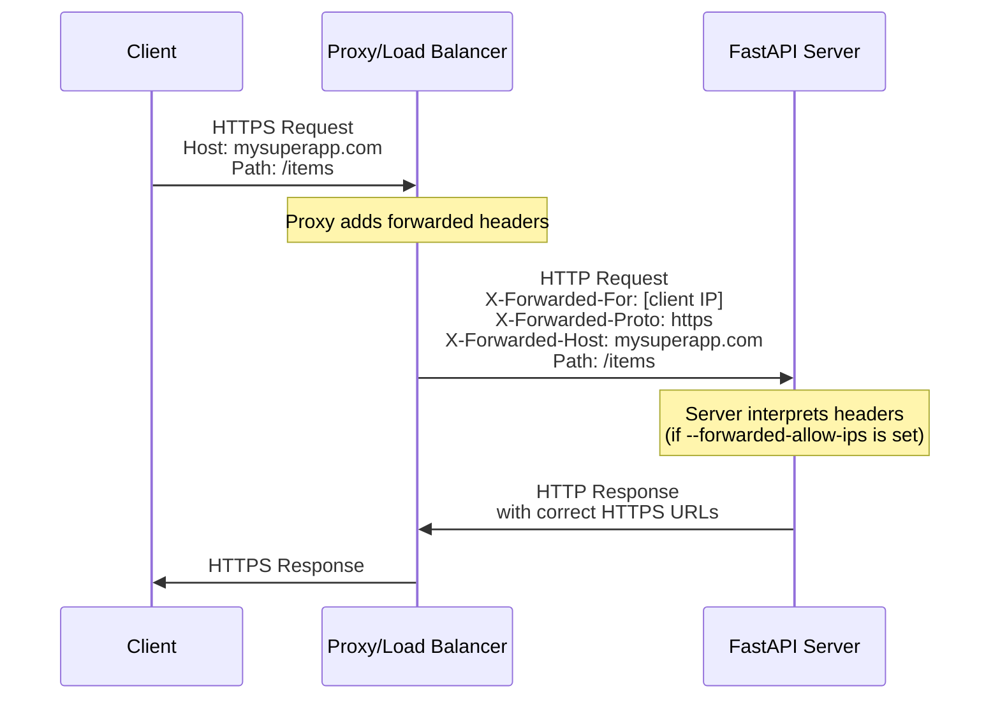
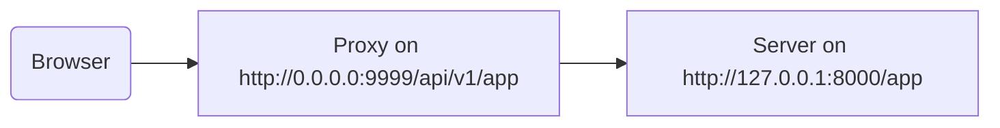

# За представником { #behind-a-proxy }

У багатьох випадках ви будете використовувати **представника** на кшталт Traefik або Nginx перед вашим застосунком FastAPI.

Такі представники можуть обробляти сертифікати HTTPS та інші речі.

## Направлені заголовки представника { #proxy-forwarded-headers }

**Представник** перед вашим застосунком зазвичай встановлює деякі заголовки на льоту перед відправленням запитів до вашого **сервера**, щоб повідомити серверу, що запит було **направлено** через представника, вказати оригінальну (публічну) URL-адресу, включно з доменом, що використовується HTTPS тощо.

Програмний **сервер** (наприклад, **Uvicorn** через **FastAPI CLI**) здатний інтерпретувати ці заголовки і передавати цю інформацію вашому застосунку.

Але з міркувань безпеки, оскільки сервер не знає, що він працює за довіреним представником, він не інтерпретуватиме ці заголовки.

/// note | Технічні деталі

Заголовки представника:

* <a href="https://developer.mozilla.org/en-US/docs/Web/HTTP/Reference/Headers/X-Forwarded-For" class="external-link" target="_blank">X-Forwarded-For</a>
* <a href="https://developer.mozilla.org/en-US/docs/Web/HTTP/Reference/Headers/X-Forwarded-Proto" class="external-link" target="_blank">X-Forwarded-Proto</a>
* <a href="https://developer.mozilla.org/en-US/docs/Web/HTTP/Reference/Headers/X-Forwarded-Host" class="external-link" target="_blank">X-Forwarded-Host</a>

///

### Увімкнути направлені заголовки представника { #enable-proxy-forwarded-headers }

Ви можете запустити FastAPI CLI з *опцією CLI* `--forwarded-allow-ips` і передати IP-адреси, яким слід довіряти для читання цих направлених заголовків.

Якщо ви встановите `--forwarded-allow-ips="*"`, це означатиме довіру до всіх вхідних IP.

Якщо ваш **сервер** знаходиться за довіреним **представником** і тільки представник спілкується з ним, це змусить сервер приймати будь-яку IP-адресу цього **представника**.

<div class="termy">

```console
$ fastapi run --forwarded-allow-ips="*"

<span style="color: green;">INFO</span>:     Uvicorn running on http://127.0.0.1:8000 (Press CTRL+C to quit)
```

</div>

### Перенаправлення з HTTPS { #redirects-with-https }

Наприклад, припустимо, ви визначили *операцію шляху* `/items/`:

{* ../../docs_src/behind_a_proxy/tutorial001_01_py310.py hl[6] *}

Якщо клієнт спробує перейти до `/items`, за замовчуванням буде виконано перенаправлення на `/items/`.

Але до встановлення *опції CLI* `--forwarded-allow-ips` це могло б перенаправити на `http://localhost:8000/items/`.

Втім, можливо ваш застосунок розміщено на `https://mysuperapp.com`, і перенаправлення має бути на `https://mysuperapp.com/items/`.

Налаштувавши `--proxy-headers`, FastAPI зможе перенаправляти на правильну адресу. 😎

```
https://mysuperapp.com/items/
```

/// tip | Порада

Якщо хочете дізнатися більше про HTTPS, перегляньте посібник [Про HTTPS](../deployment/https.md){.internal-link target=_blank}.

///

### Як працюють направлені заголовки представника { #how-proxy-forwarded-headers-work }

Ось візуальне подання того, як **представник** додає направлені заголовки між клієнтом і **сервером застосунку**:



**Представник** перехоплює початковий запит клієнта і додає спеціальні *направлені* заголовки (`X-Forwarded-*`) перед передачею запиту на **сервер застосунку**.

Ці заголовки зберігають інформацію про оригінальний запит, яка інакше була б втрачена:

- X-Forwarded-For: оригінальна IP-адреса клієнта
- X-Forwarded-Proto: оригінальний протокол (`https`)
- X-Forwarded-Host: оригінальний хост (`mysuperapp.com`)

Коли **FastAPI CLI** налаштовано з `--forwarded-allow-ips`, він довіряє цим заголовкам і використовує їх, наприклад, для побудови коректних URL-адрес у перенаправленнях.

## Представник із вилученим префіксом шляху { #proxy-with-a-stripped-path-prefix }

У вас може бути представник, що додає префікс шляху до вашого застосунку.

У таких випадках ви можете використати `root_path` для конфігурації застосунку.

`root_path` - це механізм, наданий специфікацією ASGI (на якій побудовано FastAPI через Starlette).

`root_path` використовується для обробки саме таких випадків.

Його також використано внутрішньо під час монтування підзастосунків.

Наявність представника з вилученим префіксом шляху означає, що ви могли б оголосити шлях `/app` у вашому коді, але потім додати шар зверху (представника), який розмістить ваш застосунок **FastAPI** під шляхом на кшталт `/api/v1`.

У такому разі початковий шлях `/app` фактично буде доступний за `/api/v1/app`.

Хоча весь ваш код написано з припущенням, що є лише `/app`.

{* ../../docs_src/behind_a_proxy/tutorial001_py310.py hl[6] *}

І представник буде **«зрізати»** **префікс шляху** на льоту перед передачею запиту серверу застосунку (ймовірно, Uvicorn через FastAPI CLI), зберігаючи переконання вашого застосунку, що його обслуговують за `/app`, тож вам не доведеться оновлювати весь код, щоб додати префікс `/api/v1`.

Дотепер усе працювало б як зазвичай.

Але коли ви відкриєте вбудований інтерфейс документації (фронтенд), він очікуватиме отримати схему OpenAPI за `/openapi.json`, замість `/api/v1/openapi.json`.

Отже, фронтенд (що працює у браузері) спробує звернутися до `/openapi.json` і не зможе отримати схему OpenAPI.

Оскільки у нас є представник з префіксом шляху `/api/v1` для нашого застосунку, фронтенду потрібно отримувати схему OpenAPI за `/api/v1/openapi.json`.



/// tip | Порада

IP `0.0.0.0` зазвичай означає, що програма слухає на всіх IP-адресах, доступних на цій машині/сервері.

///

Інтерфейсу документації також потрібно, щоб схема OpenAPI оголошувала, що цей `server` API розташований за `/api/v1` (за представником). Наприклад:

```JSON hl_lines="4-8"
{
    "openapi": "3.1.0",
    // Ще дещо тут
    "servers": [
        {
            "url": "/api/v1"
        }
    ],
    "paths": {
            // Ще дещо тут
    }
}
```

У цьому прикладі «Proxy» може бути чимось на кшталт **Traefik**. А сервером буде щось на кшталт FastAPI CLI з **Uvicorn**, який запускає ваш застосунок FastAPI.

### Задання `root_path` { #providing-the-root-path }

Щоб цього досягти, ви можете використати опцію командного рядка `--root-path`, наприклад:

<div class="termy">

```console
$ fastapi run main.py --forwarded-allow-ips="*" --root-path /api/v1

<span style="color: green;">INFO</span>:     Uvicorn running on http://127.0.0.1:8000 (Press CTRL+C to quit)
```

</div>

Якщо ви використовуєте Hypercorn, у нього також є опція `--root-path`.

/// note | Технічні деталі

Специфікація ASGI визначає `root_path` для такого випадку використання.

А опція командного рядка `--root-path` надає цей `root_path`.

///

### Перевірка поточного `root_path` { #checking-the-current-root-path }

Ви можете отримати поточний `root_path`, який використовує ваш застосунок для кожного запиту, він є частиною словника `scope` (це частина специфікації ASGI).

Тут ми додаємо його у повідомлення лише для демонстрації.

{* ../../docs_src/behind_a_proxy/tutorial001_py310.py hl[8] *}

Потім, якщо ви запустите Uvicorn так:

<div class="termy">

```console
$ fastapi run main.py --forwarded-allow-ips="*" --root-path /api/v1

<span style="color: green;">INFO</span>:     Uvicorn running on http://127.0.0.1:8000 (Press CTRL+C to quit)
```

</div>

Відповідь буде приблизно такою:

```JSON
{
    "message": "Hello World",
    "root_path": "/api/v1"
}
```

### Встановлення `root_path` у застосунку FastAPI { #setting-the-root-path-in-the-fastapi-app }

Альтернативно, якщо у вас немає способу передати опцію командного рядка на кшталт `--root-path` чи еквівалентну, ви можете встановити параметр `root_path` під час створення вашого застосунку FastAPI:

{* ../../docs_src/behind_a_proxy/tutorial002_py310.py hl[3] *}

Передача `root_path` до `FastAPI` еквівалентна передачі опції командного рядка `--root-path` до Uvicorn або Hypercorn.

### Про `root_path` { #about-root-path }

Майте на увазі, що сервер (Uvicorn) не використовуватиме `root_path` ні для чого, окрім передачі його застосунку.

Але якщо ви перейдете у вашому браузері на <a href="http://127.0.0.1:8000/app" class="external-link" target="_blank">http://127.0.0.1:8000/app</a>, ви побачите звичайну відповідь:

```JSON
{
    "message": "Hello World",
    "root_path": "/api/v1"
}
```

Тобто він не очікуватиме доступу за адресою `http://127.0.0.1:8000/api/v1/app`.

Uvicorn очікуватиме, що представник буде звертатися до Uvicorn на `http://127.0.0.1:8000/app`, і тоді саме представник відповідатиме за додавання додаткового префікса `/api/v1` зверху.

## Про представників із вилученим префіксом шляху { #about-proxies-with-a-stripped-path-prefix }

Майте на увазі, що представник із вилученим префіксом шляху - це лише один зі способів його налаштування.

Ймовірно, в багатьох випадках за замовчуванням представник не матиме вилученого префікса шляху.

У такому випадку (без вилученого префікса шляху) представник слухатиме щось на кшталт `https://myawesomeapp.com`, і коли браузер перейде на `https://myawesomeapp.com/api/v1/app`, а ваш сервер (наприклад, Uvicorn) слухає на `http://127.0.0.1:8000`, представник (без вилученого префікса) звернеться до Uvicorn за тим самим шляхом: `http://127.0.0.1:8000/api/v1/app`.

## Локальне тестування з Traefik { #testing-locally-with-traefik }

Ви можете легко провести експеримент локально з вилученим префіксом шляху, використовуючи <a href="https://docs.traefik.io/" class="external-link" target="_blank">Traefik</a>.

<a href="https://github.com/containous/traefik/releases" class="external-link" target="_blank">Завантажте Traefik</a>, це один бінарний файл, ви можете розпакувати архів і запустити його безпосередньо з термінала.

Потім створіть файл `traefik.toml` з таким вмістом:

```TOML hl_lines="3"
[entryPoints]
  [entryPoints.http]
    address = ":9999"

[providers]
  [providers.file]
    filename = "routes.toml"
```

Це вказує Traefik слухати порт 9999 і використовувати інший файл `routes.toml`.

/// tip | Порада

Ми використовуємо порт 9999 замість стандартного HTTP-порту 80, щоб вам не довелося запускати його з адмін-повноваженнями (`sudo`).

///

Тепер створіть інший файл `routes.toml`:

```TOML hl_lines="5  12  20"
[http]
  [http.middlewares]

    [http.middlewares.api-stripprefix.stripPrefix]
      prefixes = ["/api/v1"]

  [http.routers]

    [http.routers.app-http]
      entryPoints = ["http"]
      service = "app"
      rule = "PathPrefix(`/api/v1`)"
      middlewares = ["api-stripprefix"]

  [http.services]

    [http.services.app]
      [http.services.app.loadBalancer]
        [[http.services.app.loadBalancer.servers]]
          url = "http://127.0.0.1:8000"
```

Цей файл налаштовує Traefik на використання префікса шляху `/api/v1`.

Потім Traefik переспрямовуватиме свої запити до вашого Uvicorn, який працює на `http://127.0.0.1:8000`.

Тепер запустіть Traefik:

<div class="termy">

```console
$ ./traefik --configFile=traefik.toml

INFO[0000] Configuration loaded from file: /home/user/awesomeapi/traefik.toml
```

</div>

А тепер запустіть ваш застосунок, використовуючи опцію `--root-path`:

<div class="termy">

```console
$ fastapi run main.py --forwarded-allow-ips="*" --root-path /api/v1

<span style="color: green;">INFO</span>:     Uvicorn running on http://127.0.0.1:8000 (Press CTRL+C to quit)
```

</div>

### Перевірте відповіді { #check-the-responses }

Тепер, якщо ви перейдете за URL із портом Uvicorn: <a href="http://127.0.0.1:8000/app" class="external-link" target="_blank">http://127.0.0.1:8000/app</a>, ви побачите звичайну відповідь:

```JSON
{
    "message": "Hello World",
    "root_path": "/api/v1"
}
```

/// tip | Порада

Зверніть увагу, що хоча ви звертаєтеся за адресою `http://127.0.0.1:8000/app`, відображається `root_path` `/api/v1`, взятий із опції `--root-path`.

///

А тепер відкрийте URL із портом Traefik, включно з префіксом шляху: <a href="http://127.0.0.1:9999/api/v1/app" class="external-link" target="_blank">http://127.0.0.1:9999/api/v1/app</a>.

Ми отримуємо ту саму відповідь:

```JSON
{
    "message": "Hello World",
    "root_path": "/api/v1"
}
```

але цього разу за URL із префіксом шляху, який надає представник: `/api/v1`.

Звісно, ідея полягає в тому, що всі мають доступатися до застосунку через представника, тож варіант із префіксом шляху `/api/v1` є «правильним».

А варіант без префікса шляху (`http://127.0.0.1:8000/app`), який надає безпосередньо Uvicorn, має бути виключно для того, щоб _представник_ (Traefik) звертався до нього.

Це демонструє, як Представник (Traefik) використовує префікс шляху і як сервер (Uvicorn) використовує `root_path` з опції `--root-path`.

### Перевірте інтерфейс документації { #check-the-docs-ui }

А тепер до цікавої частини. ✨

«Офіційний» спосіб доступу до застосунку - через представника з префіксом шляху, який ми визначили. Тож, як і очікується, якщо ви спробуєте інтерфейс документації, який обслуговує безпосередньо Uvicorn без префікса шляху в URL, це не запрацює, оскільки він очікує доступу через представника.

Ви можете перевірити це на <a href="http://127.0.0.1:8000/docs" class="external-link" target="_blank">http://127.0.0.1:8000/docs</a>:


Але якщо ми звернемося до інтерфейсу документації за «офіційним» URL, використовуючи представника з портом `9999`, за адресою `/api/v1/docs`, усе працює коректно! 🎉

Ви можете перевірити це на <a href="http://127.0.0.1:9999/api/v1/docs" class="external-link" target="_blank">http://127.0.0.1:9999/api/v1/docs</a>:


Саме так, як ми хотіли. ✔️

Це тому, що FastAPI використовує `root_path`, щоб створити типовий `server` в OpenAPI з URL, наданою `root_path`.

## Додаткові сервери { #additional-servers }

/// warning | Попередження

Це більш просунутий випадок використання. Можете пропустити його.

///

За замовчуванням **FastAPI** створить `server` у схемі OpenAPI з URL для `root_path`.

Але ви також можете надати інші альтернативні `servers`, наприклад, якщо хочете, щоб той самий інтерфейс документації взаємодіяв і зі стейджингом, і з продакшном.

Якщо ви передасте власний список `servers`, і є `root_path` (тому що ваш API знаходиться за представником), **FastAPI** вставить «server» з цим `root_path` на початок списку.

Наприклад:

{* ../../docs_src/behind_a_proxy/tutorial003_py310.py hl[4:7] *}

Буде згенерована схема OpenAPI на кшталт:

```JSON hl_lines="5-7"
{
    "openapi": "3.1.0",
    // Ще дещо тут
    "servers": [
        {
            "url": "/api/v1"
        },
        {
            "url": "https://stag.example.com",
            "description": "Staging environment"
        },
        {
            "url": "https://prod.example.com",
            "description": "Production environment"
        }
    ],
    "paths": {
            // Ще дещо тут
    }
}
```

/// tip | Порада

Зверніть увагу на автоматично згенерований сервер із значенням `url` `/api/v1`, взятим із `root_path`.

///

В інтерфейсі документації за адресою <a href="http://127.0.0.1:9999/api/v1/docs" class="external-link" target="_blank">http://127.0.0.1:9999/api/v1/docs</a> це виглядатиме так:


/// tip | Порада

Інтерфейс документації взаємодіятиме з сервером, який ви оберете.

///

/// note | Технічні деталі

Властивість `servers` у специфікації OpenAPI є необовʼязковою.

Якщо ви не вкажете параметр `servers`, і `root_path` дорівнює `/`, властивість `servers` у згенерованій схемі OpenAPI буде повністю пропущено за замовчуванням, що еквівалентно одному серверу зі значенням `url` рівним `/`.

///

### Вимкнути автоматичний сервер із `root_path` { #disable-automatic-server-from-root-path }

Якщо ви не хочете, щоб **FastAPI** додавав автоматичний сервер, використовуючи `root_path`, скористайтеся параметром `root_path_in_servers=False`:

{* ../../docs_src/behind_a_proxy/tutorial004_py310.py hl[9] *}

і тоді він не буде включений у схему OpenAPI.

## Монтування підзастосунку { #mounting-a-sub-application }

Якщо вам потрібно змонтувати підзастосунок (як описано в [Підзастосунки - монтування](sub-applications.md){.internal-link target=_blank}), одночасно використовуючи представника з `root_path`, ви можете робити це звичайним чином, як і очікуєте.

FastAPI внутрішньо розумно використовуватиме `root_path`, тож усе просто працюватиме. ✨
