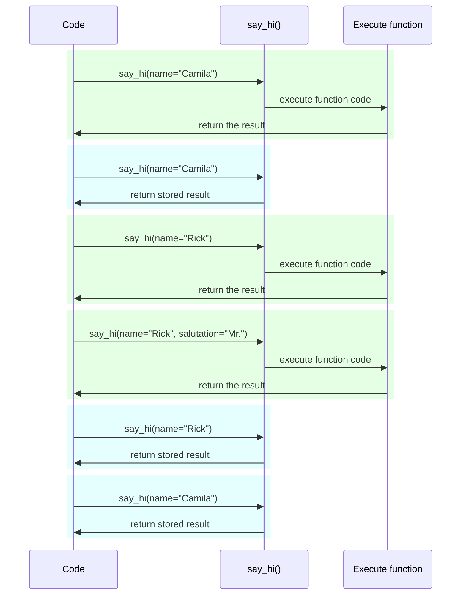

# Налаштування та змінні оточення { #settings-and-environment-variables }

У багатьох випадках вашому застосунку можуть знадобитися зовнішні налаштування або конфігурації, наприклад секретні ключі, облікові дані бази даних, облікові дані для email-сервісів тощо.

Більшість із цих налаштувань змінні (можуть змінюватися), як-от URL-адреси баз даних. І багато з них можуть бути чутливими, як-от секрети.

З цієї причини поширено надавати їх у змінних оточення, які зчитуються застосунком.

/// tip | Порада

Щоб зрозуміти змінні оточення, ви можете прочитати [Змінні оточення](../environment-variables.md){.internal-link target=_blank}.

///

## Типи та перевірка { #types-and-validation }

Ці змінні оточення можуть містити лише текстові строки, оскільки вони зовнішні до Python і мають бути сумісні з іншими програмами та рештою системи (і навіть з різними операційними системами, як-от Linux, Windows, macOS).

Це означає, що будь-яке значення, прочитане в Python зі змінної оточення, буде `str`, і будь-яке перетворення в інший тип або будь-яка перевірка мають виконуватися в коді.

## Pydantic `Settings` { #pydantic-settings }

На щастя, Pydantic надає чудовий інструмент для обробки цих налаштувань із змінних оточення - <a href="https://docs.pydantic.dev/latest/concepts/pydantic_settings/" class="external-link" target="_blank">Pydantic: Settings management</a>.

### Встановіть `pydantic-settings` { #install-pydantic-settings }

Спершу переконайтеся, що ви створили [віртуальне оточення](../virtual-environments.md){.internal-link target=_blank}, активували його, а потім встановили пакет `pydantic-settings`:

<div class="termy">

```console
$ pip install pydantic-settings
---> 100%
```

</div>

Він також входить у склад, якщо ви встановлюєте додаткові можливості «all» за допомогою:

<div class="termy">

```console
$ pip install "fastapi[all]"
---> 100%
```

</div>

### Створіть об'єкт `Settings` { #create-the-settings-object }

Імпортуйте `BaseSettings` із Pydantic і створіть підклас, дуже подібно до моделі Pydantic.

Так само, як і з моделями Pydantic, ви оголошуєте атрибути класу з анотаціями типів і, за потреби, значеннями за замовчуванням.

Ви можете використовувати всі ті самі можливості перевірки та інструменти, що й для моделей Pydantic, як-от різні типи даних і додаткові перевірки з `Field()`.

{* ../../docs_src/settings/tutorial001_py310.py hl[2,5:8,11] *}

/// tip | Порада

Якщо вам потрібно щось швидко скопіювати й вставити, не використовуйте цей приклад, скористайтеся останнім нижче.

///

Потім, коли ви створите екземпляр цього класу `Settings` (у цьому випадку в об'єкті `settings`), Pydantic зчитуватиме змінні оточення без урахування регістру, тож верхньорегістрова змінна `APP_NAME` все одно буде прочитана для атрибута `app_name`.

Далі він перетворить і перевірить дані. Тож коли ви використовуватимете об'єкт `settings`, у вас будуть дані тих типів, які ви оголосили (наприклад, `items_per_user` буде `int`).

### Використовуйте `settings` { #use-the-settings }

Потім ви можете використати новий об'єкт `settings` у вашому застосунку:

{* ../../docs_src/settings/tutorial001_py310.py hl[18:20] *}

### Запустіть сервер { #run-the-server }

Далі ви б запустили сервер, передаючи конфігурації як змінні оточення, наприклад, ви можете встановити `ADMIN_EMAIL` і `APP_NAME` так:

<div class="termy">

```console
$ ADMIN_EMAIL="deadpool@example.com" APP_NAME="ChimichangApp" fastapi run main.py

<span style="color: green;">INFO</span>:     Uvicorn running on http://127.0.0.1:8000 (Press CTRL+C to quit)
```

</div>

/// tip | Порада

Щоб встановити кілька змінних оточення для однієї команди, просто розділіть їх пробілами і розмістіть усі перед командою.

///

Після цього налаштування `admin_email` буде встановлено в `"deadpool@example.com"`.

`app_name` буде `"ChimichangApp"`.

А `items_per_user` збереже своє значення за замовчуванням `50`.

## Налаштування в іншому модулі { #settings-in-another-module }

Ви можете розмістити ці налаштування в іншому модулі, як ви бачили в [Більші застосунки - кілька файлів](../tutorial/bigger-applications.md){.internal-link target=_blank}.

Наприклад, у вас може бути файл `config.py` з:

{* ../../docs_src/settings/app01_py310/config.py *}

А потім використати його у файлі `main.py`:

{* ../../docs_src/settings/app01_py310/main.py hl[3,11:13] *}

/// tip | Порада

Вам також знадобиться файл `__init__.py`, як ви бачили в [Більші застосунки - кілька файлів](../tutorial/bigger-applications.md){.internal-link target=_blank}.

///

## Налаштування як залежність { #settings-in-a-dependency }

Іноді може бути корисно надавати налаштування через залежність, замість того, щоб мати глобальний об'єкт `settings`, який використовується всюди.

Це може бути особливо корисно під час тестування, оскільки дуже легко переписати залежність власними налаштуваннями.

### Файл конфігурації { #the-config-file }

Продовжуючи попередній приклад, ваш файл `config.py` може виглядати так:

{* ../../docs_src/settings/app02_an_py310/config.py hl[10] *}

Зверніть увагу, що тепер ми не створюємо екземпляр за замовчуванням `settings = Settings()`.

### Основний файл застосунку { #the-main-app-file }

Тепер ми створюємо залежність, яка повертає новий `config.Settings()`.

{* ../../docs_src/settings/app02_an_py310/main.py hl[6,12:13] *}

/// tip | Порада

Ми обговоримо `@lru_cache` трохи згодом.

Поки що можете вважати, що `get_settings()` - це звичайна функція.

///

А далі ми можемо вимагати її у *функції операції шляху* як залежність і використовувати будь-де, де це потрібно.

{* ../../docs_src/settings/app02_an_py310/main.py hl[17,19:21] *}

### Налаштування і тестування { #settings-and-testing }

Потім буде дуже просто надати інший об'єкт налаштувань під час тестування, створивши переписування залежності для `get_settings`:

{* ../../docs_src/settings/app02_an_py310/test_main.py hl[9:10,13,21] *}

У переписуванні залежності ми встановлюємо нове значення `admin_email` під час створення нового об'єкта `Settings`, а потім повертаємо цей новий об'єкт.

Після цього ми можемо перевірити, що саме він використовується.

## Читання файлу `.env` { #reading-a-env-file }

Якщо у вас багато налаштувань, які можуть часто змінюватися, можливо в різних оточеннях, може бути корисно розмістити їх у файлі, а потім зчитувати їх із нього так, ніби це змінні оточення.

Ця практика достатньо поширена, тож має назву - ці змінні оточення зазвичай розміщуються у файлі `.env`, а сам файл називається «dotenv».

/// tip | Порада

Файл, що починається з крапки (`.`), є прихованим у системах, подібних до Unix, як-от Linux і macOS.

Але файл dotenv не обов'язково має мати саме таку назву.

///

Pydantic має підтримку читання з таких типів файлів за допомогою зовнішньої бібліотеки. Ви можете дізнатися більше тут: <a href="https://docs.pydantic.dev/latest/concepts/pydantic_settings/#dotenv-env-support" class="external-link" target="_blank">Pydantic Settings: Dotenv (.env) support</a>.

/// tip | Порада

Щоб це працювало, потрібно виконати `pip install python-dotenv`.

///

### Файл `.env` { #the-env-file }

У вас може бути файл `.env` із вмістом:

```bash
ADMIN_EMAIL="deadpool@example.com"
APP_NAME="ChimichangApp"
```

### Зчитування налаштувань із `.env` { #read-settings-from-env }

Потім оновіть ваш `config.py` так:

{* ../../docs_src/settings/app03_an_py310/config.py hl[9] *}

/// tip | Порада

Атрибут `model_config` використовується лише для конфігурації Pydantic. Докладніше: <a href="https://docs.pydantic.dev/latest/concepts/config/" class="external-link" target="_blank">Pydantic: Concepts: Configuration</a>.

///

Тут ми визначаємо конфіг `env_file` усередині вашого класу Pydantic `Settings` і задаємо значення - ім'я файла з dotenv, який ми хочемо використати.

### Створення `Settings` лише один раз за допомогою `lru_cache` { #creating-the-settings-only-once-with-lru-cache }

Читання файла з диска зазвичай є дорогою (повільною) операцією, тож, імовірно, ви захочете робити це лише один раз і потім перевикористовувати той самий об'єкт налаштувань замість зчитування для кожного запиту.

Але щоразу, коли ми робимо:

```Python
Settings()
```

буде створено новий об'єкт `Settings`, і під час створення він знову зчитуватиме файл `.env`.

Якби функція залежності виглядала так:

```Python
def get_settings():
    return Settings()
```

ми створювали б цей об'єкт для кожного запиту і читали б файл `.env` для кожного запиту. ⚠️

Але оскільки ми використовуємо декоратор `@lru_cache` зверху, об'єкт `Settings` буде створено лише один раз, під час першого виклику. ✔️

{* ../../docs_src/settings/app03_an_py310/main.py hl[1,11] *}

Потім для будь-якого подальшого виклику `get_settings()` у залежностях для наступних запитів, замість виконання внутрішнього коду `get_settings()` і створення нового об'єкта `Settings`, він повертатиме той самий об'єкт, що був повернутий під час першого виклику, знову і знову.

#### Технічні деталі `lru_cache` { #lru-cache-technical-details }

`@lru_cache` модифікує функцію, яку він декорує, так, щоб вона повертала те саме значення, що й уперше, замість повторного обчислення, виконуючи код функції щоразу.

Тобто функція під ним буде виконана один раз для кожної комбінації аргументів. А потім значення, повернені кожною з цих комбінацій аргументів, використовуватимуться знову і знову щоразу, коли функцію викликають із точно такою ж комбінацією аргументів.

Наприклад, якщо у вас є функція:

```Python
@lru_cache
def say_hi(name: str, salutation: str = "Ms."):
    return f"Hello {salutation} {name}"
```

ваша програма може виконуватись так:



У випадку з нашою залежністю `get_settings()` функція взагалі не приймає жодних аргументів, тож вона завжди повертає те саме значення.

Таким чином, вона поводиться майже так само, якби це була просто глобальна змінна. Але оскільки використовується функція залежності, ми можемо легко переписати її для тестування.

`@lru_cache` є частиною `functools`, що входить до стандартної бібліотеки Python, більше про це можна прочитати в <a href="https://docs.python.org/3/library/functools.html#functools.lru_cache" class="external-link" target="_blank">документації Python для `@lru_cache`</a>.

## Підсумок { #recap }

Ви можете використовувати Pydantic Settings для обробки налаштувань або конфігурацій вашого застосунку, з усією потужністю моделей Pydantic.

- Використовуючи залежність, ви можете спростити тестування.
- Ви можете використовувати з ним файли `.env`.
- Використання `@lru_cache` дає змогу уникнути повторного читання файла dotenv для кожного запиту, водночас дозволяючи переписувати його під час тестування.
