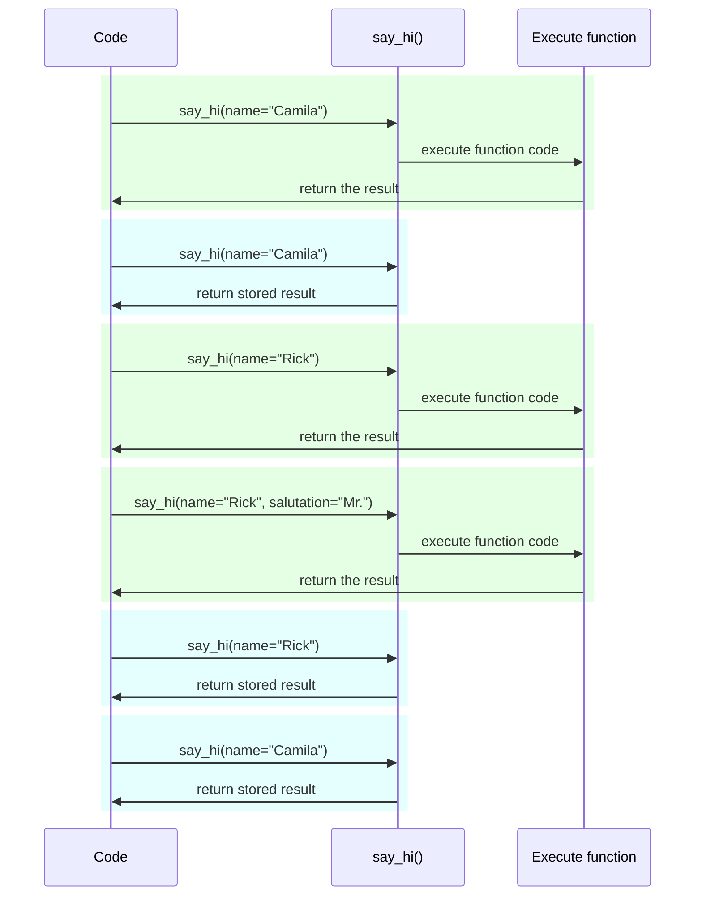

# Налаштування та змінні середовища { #settings-and-environment-variables }

У багатьох випадках вашому застосунку можуть знадобитися зовнішні налаштування або конфігурації, наприклад секретні ключі, облікові дані бази даних, облікові дані для email-сервісів тощо.

Більшість із цих налаштувань є змінними (можуть змінюватися), як-от URL бази даних. І багато з них можуть бути чутливими, як-от секрети.

Тому зазвичай їх передають через змінні середовища, які застосунок зчитує.

/// tip | Порада

Щоб зрозуміти змінні середовища, можете прочитати [Змінні середовища](../environment-variables.md){.internal-link target=_blank}.

///

## Типи та валідація { #types-and-validation }

Ці змінні середовища можуть містити лише текстові рядки, адже вони зовнішні для Python і мають бути сумісними з іншими програмами та рештою системи (і навіть із різними операційними системами, як-от Linux, Windows, macOS).

Це означає, що будь-яке значення, зчитане в Python зі змінної середовища, буде `str`, а будь-яке перетворення на інший тип або будь-яку валідацію потрібно виконувати в коді.

## Pydantic `Settings` { #pydantic-settings }

На щастя, Pydantic надає чудову утиліту для обробки цих налаштувань, що надходять зі змінних середовища, за допомогою <a href="https://docs.pydantic.dev/latest/concepts/pydantic_settings/" class="external-link" target="_blank">Pydantic: Settings management</a>.

### Встановіть `pydantic-settings` { #install-pydantic-settings }

Спочатку переконайтеся, що ви створили своє [віртуальне середовище](../virtual-environments.md){.internal-link target=_blank}, активували його, а потім встановіть пакет `pydantic-settings`:

<div class="termy">

```console
$ pip install pydantic-settings
---> 100%
```

</div>

Він також встановлюється, коли ви встановлюєте extra `all` командою:

<div class="termy">

```console
$ pip install "fastapi[all]"
---> 100%
```

</div>

### Створіть об’єкт `Settings` { #create-the-settings-object }

Імпортуйте `BaseSettings` із Pydantic і створіть підклас, майже так само, як із моделлю Pydantic.

Так само, як і з моделями Pydantic, ви оголошуєте атрибути класу з анотаціями типів і, за потреби, зі значеннями за замовчуванням.

Ви можете використовувати всі ті самі можливості та інструменти валідації, що й для моделей Pydantic, як-от різні типи даних і додаткові перевірки через `Field()`.

{* ../../docs_src/settings/tutorial001_py39.py hl[2,5:8,11] *}

/// tip | Порада

Якщо вам потрібно щось швидко скопіювати й вставити, не використовуйте цей приклад — використайте останній нижче.

///

Далі, коли ви створите екземпляр цього класу `Settings` (у цьому випадку — в об’єкті `settings`), Pydantic зчитає змінні середовища без урахування регістру, тож змінна у верхньому регістрі `APP_NAME` все одно буде прочитана для атрибута `app_name`.

Потім він перетворить і провалідовує дані. Отже, коли ви використовуєте об’єкт `settings`, ви матимете дані тих типів, які оголосили (наприклад, `items_per_user` буде `int`).

### Використовуйте `settings` { #use-the-settings }

Далі ви можете використати новий об’єкт `settings` у вашому застосунку:

{* ../../docs_src/settings/tutorial001_py39.py hl[18:20] *}

### Запустіть сервер { #run-the-server }

Потім ви запускатимете сервер, передаючи конфігурації як змінні середовища. Наприклад, ви можете встановити `ADMIN_EMAIL` і `APP_NAME` так:

<div class="termy">

```console
$ ADMIN_EMAIL="deadpool@example.com" APP_NAME="ChimichangApp" fastapi run main.py

<span style="color: green;">INFO</span>:     Uvicorn running on http://127.0.0.1:8000 (Press CTRL+C to quit)
```

</div>

/// tip | Порада

Щоб встановити кілька env vars для однієї команди, просто розділіть їх пробілом і розмістіть усі перед командою.

///

Після цього налаштування `admin_email` буде встановлено в `"deadpool@example.com"`.

`app_name` буде `"ChimichangApp"`.

А `items_per_user` збереже своє значення за замовчуванням `50`.

## Налаштування в іншому модулі { #settings-in-another-module }

Ви можете винести ці налаштування в інший файл модуля, як ви бачили в розділі [Більші застосунки — кілька файлів](../tutorial/bigger-applications.md){.internal-link target=_blank}.

Наприклад, у вас може бути файл `config.py` з таким вмістом:

{* ../../docs_src/settings/app01_py39/config.py *}

А потім використати його у файлі `main.py`:

{* ../../docs_src/settings/app01_py39/main.py hl[3,11:13] *}

/// tip | Порада

Вам також знадобиться файл `__init__.py`, як ви бачили в розділі [Більші застосунки — кілька файлів](../tutorial/bigger-applications.md){.internal-link target=_blank}.

///

## Налаштування в залежності { #settings-in-a-dependency }

У деяких випадках може бути корисно надавати налаштування через залежність, замість того щоб мати глобальний об’єкт `settings`, який використовується всюди.

Це може бути особливо корисно під час тестування, адже дуже легко перевизначити залежність власними кастомними налаштуваннями.

### Файл конфігурації { #the-config-file }

На основі попереднього прикладу, ваш файл `config.py` може виглядати так:

{* ../../docs_src/settings/app02_an_py39/config.py hl[10] *}

Зверніть увагу, що тепер ми не створюємо екземпляр за замовчуванням `settings = Settings()`.

### Основний файл застосунку { #the-main-app-file }

Тепер ми створюємо залежність, яка повертає новий `config.Settings()`.

{* ../../docs_src/settings/app02_an_py39/main.py hl[6,12:13] *}

/// tip | Порада

Трохи згодом ми обговоримо `@lru_cache`.

Поки що можете вважати `get_settings()` звичайною функцією.

///

Потім ми можемо вимагати її як залежність у *функції операції шляху* і використовувати всюди, де вона потрібна.

{* ../../docs_src/settings/app02_an_py39/main.py hl[17,19:21] *}

### Налаштування та тестування { #settings-and-testing }

Тоді під час тестування буде дуже легко надати інший об’єкт налаштувань, створивши перевизначення залежності для `get_settings`:

{* ../../docs_src/settings/app02_an_py39/test_main.py hl[9:10,13,21] *}

У перевизначенні залежності ми задаємо нове значення для `admin_email` під час створення нового об’єкта `Settings`, а потім повертаємо цей новий об’єкт.

Потім ми можемо перевірити, що використовується саме він.

## Читання файлу `.env` { #reading-a-env-file }

Якщо у вас багато налаштувань, які, ймовірно, часто змінюються, можливо в різних середовищах, може бути корисно зберігати їх у файлі, а потім зчитувати з нього так, ніби це змінні середовища.

Ця практика настільки поширена, що має назву: ці змінні середовища зазвичай розміщують у файлі `.env`, а файл називають «dotenv».

/// tip | Порада

Файл, назва якого починається з крапки (`.`), є прихованим у Unix-подібних системах, як-от Linux і macOS.

Але файл dotenv не обов’язково має мати саме таку назву.

///

Pydantic підтримує читання таких файлів за допомогою зовнішньої бібліотеки. Докладніше дивіться в <a href="https://docs.pydantic.dev/latest/concepts/pydantic_settings/#dotenv-env-support" class="external-link" target="_blank">Pydantic Settings: Dotenv (.env) support</a>.

/// tip | Порада

Щоб це працювало, вам потрібно виконати `pip install python-dotenv`.

///

### Файл `.env` { #the-env-file }

Ви можете мати файл `.env` з таким вмістом:

```bash
ADMIN_EMAIL="deadpool@example.com"
APP_NAME="ChimichangApp"
```

### Читайте налаштування з `.env` { #read-settings-from-env }

А потім оновіть ваш `config.py` так:

{* ../../docs_src/settings/app03_an_py39/config.py hl[9] *}

/// tip | Порада

Атрибут `model_config` використовується лише для конфігурації Pydantic. Докладніше дивіться в <a href="https://docs.pydantic.dev/latest/concepts/config/" class="external-link" target="_blank">Pydantic: Concepts: Configuration</a>.

///

Тут ми визначаємо `env_file` всередині вашого класу `Settings` у Pydantic і встановлюємо значення як ім’я файлу з dotenv, який ми хочемо використати.

### Створюйте `Settings` лише один раз за допомогою `lru_cache` { #creating-the-settings-only-once-with-lru-cache }

Читання файлу з диска зазвичай є затратною (повільною) операцією, тож, імовірно, ви захочете робити це лише один раз і потім повторно використовувати той самий об’єкт налаштувань, замість читання для кожного запиту.

Але щоразу, коли ми робимо:

```Python
Settings()
```

буде створюватися новий об’єкт `Settings`, і під час створення він знову читатиме файл `.env`.

Якби функція-залежність виглядала так:

```Python
def get_settings():
    return Settings()
```

ми створювали б цей об’єкт для кожного запиту й читали б файл `.env` для кожного запиту. ⚠️

Але оскільки зверху ми використовуємо декоратор `@lru_cache`, об’єкт `Settings` буде створений лише один раз — під час першого виклику. ✔️

{* ../../docs_src/settings/app03_an_py39/main.py hl[1,11] *}

Потім, для будь-якого наступного виклику `get_settings()` у залежностях для наступних запитів, замість виконання внутрішнього коду `get_settings()` і створення нового об’єкта `Settings`, буде повертатися той самий об’єкт, що був повернутий під час першого виклику, знову і знову.

#### Технічні деталі `lru_cache` { #lru-cache-technical-details }

`@lru_cache` модифікує функцію, яку він декорує, так, щоб вона повертала те саме значення, яке було повернене вперше, замість повторного обчислення й виконання коду функції щоразу.

Тому функція під ним буде виконана один раз для кожної комбінації аргументів. А потім значення, повернуті для кожної з цих комбінацій аргументів, будуть використовуватися знову і знову щоразу, коли функцію викликають з точно такою самою комбінацією аргументів.

Наприклад, якщо у вас є функція:

```Python
@lru_cache
def say_hi(name: str, salutation: str = "Ms."):
    return f"Hello {salutation} {name}"
```

ваша програма може виконуватися так:



У випадку нашої залежності `get_settings()`, функція навіть не приймає жодних аргументів, тож вона завжди повертає те саме значення.

Таким чином вона поводиться майже так, ніби це просто глобальна змінна. Але оскільки використовується функція-залежність, ми можемо легко перевизначати її для тестування.

`@lru_cache` є частиною `functools`, який є частиною стандартної бібліотеки Python. Можете прочитати більше в <a href="https://docs.python.org/3/library/functools.html#functools.lru_cache" class="external-link" target="_blank">документації Python про `@lru_cache`</a>.

## Підсумок { #recap }

Ви можете використовувати Pydantic Settings для керування налаштуваннями або конфігураціями вашого застосунку з усією потужністю моделей Pydantic.

* Використовуючи залежність, ви можете спростити тестування.
* Ви можете використовувати з ним файли `.env`.
* Використання `@lru_cache` дозволяє уникнути повторного читання файла dotenv для кожного запиту, водночас даючи змогу перевизначати це під час тестування.
