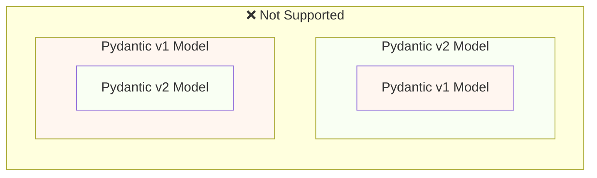
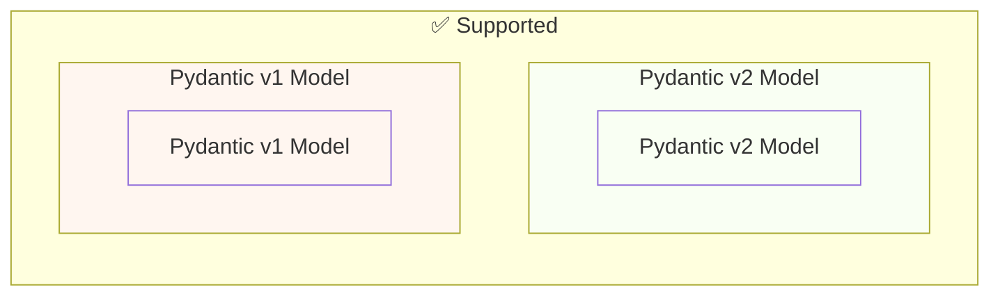

# Міграція з Pydantic v1 на Pydantic v2 { #migrate-from-pydantic-v1-to-pydantic-v2 }

Якщо у вас старий застосунок FastAPI, можливо, ви використовуєте Pydantic версії 1.

FastAPI версії 0.100.0 підтримував або Pydantic v1, або v2. Він використовував ту версію, яку ви встановили.

FastAPI версії 0.119.0 представив часткову підтримку Pydantic v1 усередині Pydantic v2 (як `pydantic.v1`), щоб полегшити міграцію на v2.

FastAPI 0.126.0 припинив підтримку Pydantic v1, водночас ще деякий час підтримуючи `pydantic.v1`.

/// warning | Попередження

Команда Pydantic припинила підтримку Pydantic v1 для найновіших версій Python, починаючи з **Python 3.14**.

Це також стосується `pydantic.v1`, який більше не підтримується в Python 3.14 і вище.

Якщо ви хочете використовувати найновіші можливості Python, вам потрібно переконатися, що ви використовуєте Pydantic v2.

///

Якщо у вас старий застосунок FastAPI з Pydantic v1, тут я покажу, як мігрувати на Pydantic v2, і **можливості у FastAPI 0.119.0**, що допомагають виконати поступову міграцію.

## Офіційний посібник { #official-guide }

Pydantic має офіційний <a href="https://docs.pydantic.dev/latest/migration/" class="external-link" target="_blank">посібник з міграції</a> з v1 на v2.

Він також містить інформацію про те, що змінилося, як валідації тепер є коректнішими та суворішими, можливі застереження тощо.

Ви можете прочитати його, щоб краще зрозуміти, що змінилося.

## Тести { #tests }

Переконайтеся, що у вас є [тести](../tutorial/testing.md){.internal-link target=_blank} для вашого застосунку та ви запускаєте їх у безперервній інтеграції (CI).

Так ви зможете виконати оновлення й переконатися, що все й далі працює як очікується.

## `bump-pydantic` { #bump-pydantic }

У багатьох випадках, коли ви використовуєте звичайні моделі Pydantic без налаштувань, ви зможете автоматизувати більшість процесу міграції з Pydantic v1 на Pydantic v2.

Ви можете використати <a href="https://github.com/pydantic/bump-pydantic" class="external-link" target="_blank">`bump-pydantic`</a> від тієї ж команди Pydantic.

Цей інструмент допоможе вам автоматично змінити більшість коду, який потрібно змінити.

Після цього ви можете запустити тести й перевірити, чи все працює. Якщо так — готово. 😎

## Pydantic v1 у v2 { #pydantic-v1-in-v2 }

Pydantic v2 включає все з Pydantic v1 як підмодуль `pydantic.v1`. Але це більше не підтримується у версіях вище Python 3.13.

Це означає, що ви можете встановити найновішу версію Pydantic v2, імпортувати та використовувати старі компоненти Pydantic v1 з цього підмодуля — так, ніби у вас встановлено старий Pydantic v1.

{* ../../docs_src/pydantic_v1_in_v2/tutorial001_an_py310.py hl[1,4] *}

### Підтримка FastAPI для Pydantic v1 у v2 { #fastapi-support-for-pydantic-v1-in-v2 }

Починаючи з FastAPI 0.119.0, також є часткова підтримка Pydantic v1 усередині Pydantic v2, щоб полегшити міграцію на v2.

Тож ви могли б оновити Pydantic до найновішої версії 2, змінити імпорти, щоб використовувати підмодуль `pydantic.v1`, і в багатьох випадках це просто працюватиме.

{* ../../docs_src/pydantic_v1_in_v2/tutorial002_an_py310.py hl[2,5,15] *}

/// warning | Попередження

Майте на увазі: оскільки команда Pydantic більше не підтримує Pydantic v1 у нових версіях Python, починаючи з Python 3.14, використання `pydantic.v1` також не підтримується в Python 3.14 і вище.

///

### Pydantic v1 і v2 в одному застосунку { #pydantic-v1-and-v2-on-the-same-app }

Pydantic **не підтримує** модель Pydantic v2, у якій власні поля визначені як моделі Pydantic v1, або навпаки.

...але ви можете мати розділені моделі, використовуючи Pydantic v1 і v2 в одному застосунку.

У деяких випадках навіть можливо мати і моделі Pydantic v1, і v2 в одній **операції шляху** у вашому застосунку FastAPI:

{* ../../docs_src/pydantic_v1_in_v2/tutorial003_an_py310.py hl[2:3,6,12,21:22] *}

У наведеному вище прикладі вхідна модель — це модель Pydantic v1, а вихідна модель (визначена в `response_model=ItemV2`) — це модель Pydantic v2.

### Параметри Pydantic v1 { #pydantic-v1-parameters }

Якщо вам потрібно використовувати деякі специфічні для FastAPI інструменти для параметрів, як-от `Body`, `Query`, `Form` тощо, з моделями Pydantic v1, ви можете імпортувати їх із `fastapi.temp_pydantic_v1_params`, доки завершуєте міграцію на Pydantic v2:

{* ../../docs_src/pydantic_v1_in_v2/tutorial004_an_py310.py hl[4,18] *}

### Міграція поетапно { #migrate-in-steps }

/// tip | Порада

Спочатку спробуйте `bump-pydantic`: якщо ваші тести проходять і це працює, тоді ви завершили все однією командою. ✨

///

Якщо `bump-pydantic` не підходить для вашого випадку, ви можете використати підтримку одночасно моделей Pydantic v1 і v2 в одному застосунку, щоб виконувати міграцію на Pydantic v2 поступово.

Спочатку ви можете оновити Pydantic до найновішої версії 2 і змінити імпорти, щоб використовувати `pydantic.v1` для всіх ваших моделей.

Далі ви можете почати мігрувати ваші моделі з Pydantic v1 на v2 групами, крок за кроком. 🚶
