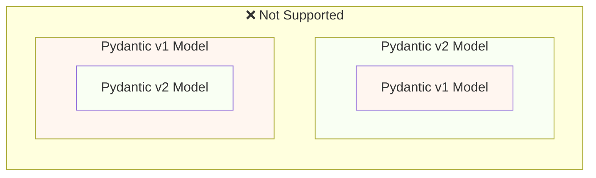
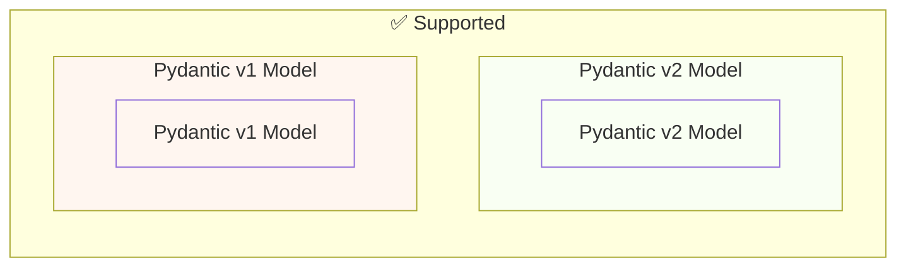

# Перехід з Pydantic v1 на Pydantic v2 { #migrate-from-pydantic-v1-to-pydantic-v2 }

Якщо у вас стара програма FastAPI, можливо, ви використовуєте Pydantic версії 1.

FastAPI версії 0.100.0 підтримував як Pydantic v1, так і v2. Використовувалася та версія, яку ви встановили.

FastAPI версії 0.119.0 запровадив часткову підтримку Pydantic v1 всередині Pydantic v2 (як `pydantic.v1`), щоб спростити перехід на v2.

FastAPI 0.126.0 припинив підтримку Pydantic v1, водночас ще певний час підтримував `pydantic.v1`.

/// warning | Попередження

Команда Pydantic припинила підтримку Pydantic v1 для останніх версій Python, починаючи з Python 3.14.

Це стосується і `pydantic.v1`, який більше не підтримується в Python 3.14 і новіших.

Якщо ви хочете використовувати найновіші можливості Python, вам потрібно переконатися, що ви використовуєте Pydantic v2.

///

Якщо у вас стара програма FastAPI з Pydantic v1, нижче я покажу, як мігрувати на Pydantic v2, а також можливості FastAPI 0.119.0, які допоможуть з поступовою міграцією.

## Офіційний посібник { #official-guide }

У Pydantic є офіційний <a href="https://docs.pydantic.dev/latest/migration/" class="external-link" target="_blank">Посібник з міграції</a> з v1 на v2.

Там описано, що змінилося, як перевірки тепер стали коректнішими та суворішими, можливі застереження тощо.

Прочитайте його, щоб краще зрозуміти зміни.

## Тести { #tests }

Переконайтеся, що у вашій програмі є [тести](../tutorial/testing.md){.internal-link target=_blank} і що ви запускаєте їх у системі безперервної інтеграції (CI).

Так ви зможете виконати оновлення і впевнитися, що все працює як очікується.

## `bump-pydantic` { #bump-pydantic }

У багатьох випадках, якщо ви використовуєте звичайні моделі Pydantic без налаштувань, більшу частину процесу міграції з Pydantic v1 на Pydantic v2 можна автоматизувати.

Ви можете скористатися <a href="https://github.com/pydantic/bump-pydantic" class="external-link" target="_blank">`bump-pydantic`</a> від тієї ж команди Pydantic.

Цей інструмент допоможе автоматично змінити більшість коду, який потрібно змінити.

Після цього запустіть тести й перевірте, чи все працює. Якщо так - ви все завершили. 😎

## Pydantic v1 у v2 { #pydantic-v1-in-v2 }

Pydantic v2 містить усе з Pydantic v1 як підмодуль `pydantic.v1`. Але це більше не підтримується у версіях Python вище 3.13.

Це означає, що ви можете встановити останню версію Pydantic v2 та імпортувати і використовувати старі компоненти Pydantic v1 з цього підмодуля, ніби у вас встановлено старий Pydantic v1.

{* ../../docs_src/pydantic_v1_in_v2/tutorial001_an_py310.py hl[1,4] *}

### Підтримка FastAPI для Pydantic v1 у v2 { #fastapi-support-for-pydantic-v1-in-v2 }

Починаючи з FastAPI 0.119.0, також є часткова підтримка Pydantic v1 всередині Pydantic v2, щоб спростити перехід на v2.

Тож ви можете оновити Pydantic до останньої версії 2 і змінити імпорти на використання підмодуля `pydantic.v1`, і в багатьох випадках усе просто запрацює.

{* ../../docs_src/pydantic_v1_in_v2/tutorial002_an_py310.py hl[2,5,15] *}

/// warning | Попередження

Майте на увазі, що оскільки команда Pydantic більше не підтримує Pydantic v1 у нових версіях Python, починаючи з Python 3.14, використання `pydantic.v1` також не підтримується в Python 3.14 і новіших.

///

### Pydantic v1 і v2 в одній програмі { #pydantic-v1-and-v2-on-the-same-app }

Pydantic не підтримує ситуацію, коли модель Pydantic v2 має власні поля, визначені як моделі Pydantic v1, або навпаки.

...але в одній програмі ви можете мати окремі моделі на Pydantic v1 і v2.

У деяких випадках можна навіть використовувати моделі і Pydantic v1, і v2 в одній операції шляху у вашій програмі FastAPI:

{* ../../docs_src/pydantic_v1_in_v2/tutorial003_an_py310.py hl[2:3,6,12,21:22] *}

У наведеному вище прикладі вхідна модель - це модель Pydantic v1, а вихідна модель (визначена як `response_model=ItemV2`) - модель Pydantic v2.

### Параметри Pydantic v1 { #pydantic-v1-parameters }

Якщо вам потрібно використовувати деякі специфічні для FastAPI інструменти для параметрів, як-от `Body`, `Query`, `Form` тощо, з моделями Pydantic v1, ви можете імпортувати їх з `fastapi.temp_pydantic_v1_params`, поки завершуєте міграцію на Pydantic v2:

{* ../../docs_src/pydantic_v1_in_v2/tutorial004_an_py310.py hl[4,18] *}

### Покрокова міграція { #migrate-in-steps }

/// tip | Порада

Спершу спробуйте `bump-pydantic`: якщо ваші тести проходять і все працює - ви впоралися однією командою. ✨

///

Якщо `bump-pydantic` не підходить для вашого випадку, скористайтеся підтримкою одночасно Pydantic v1 і v2 в одній програмі, щоб виконати поступову міграцію на Pydantic v2.

Спочатку ви можете оновити Pydantic до останньої версії 2 і змінити імпорти на `pydantic.v1` для всіх ваших моделей.

Потім починайте переносити моделі з Pydantic v1 на v2 групами, поступовими кроками. 🚶
