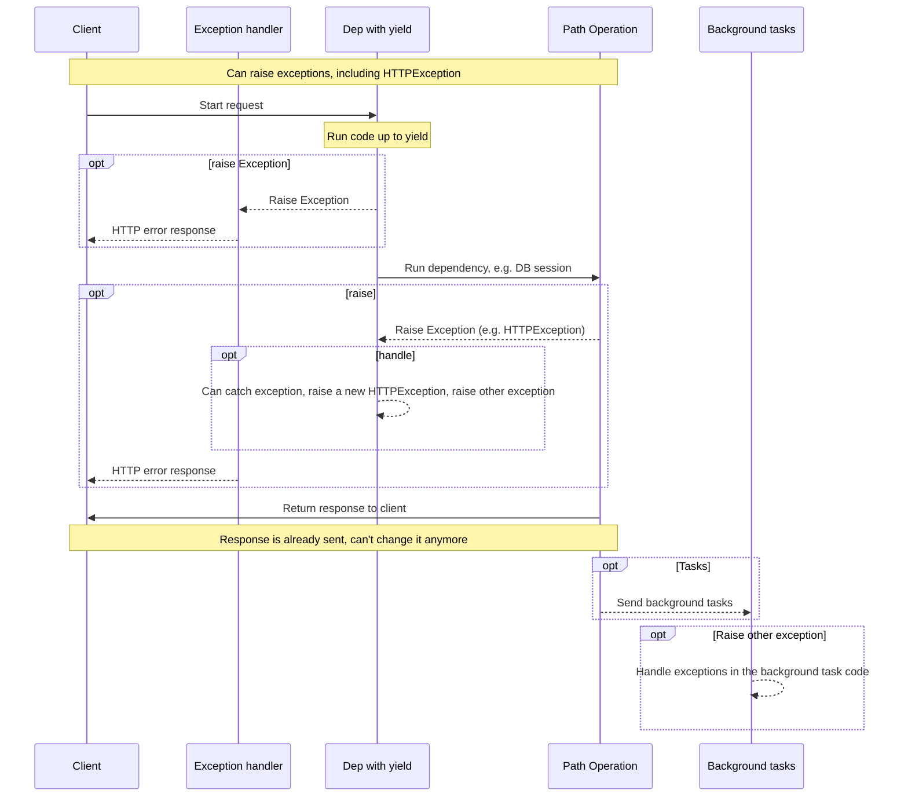
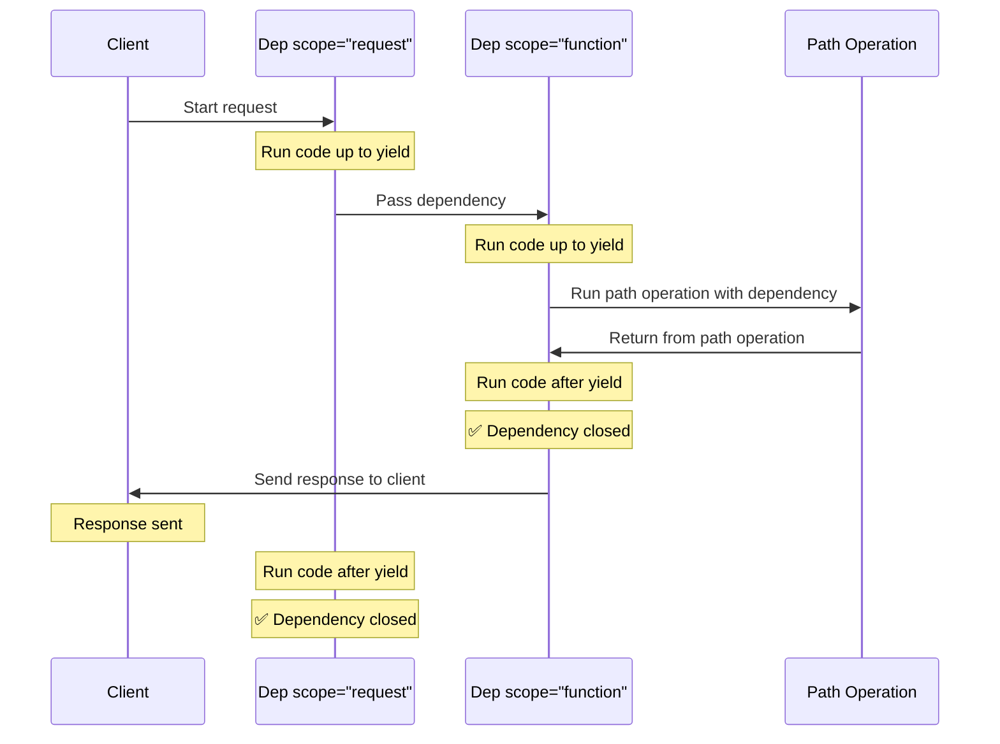

# Залежності з yield { #dependencies-with-yield }

FastAPI підтримує залежності, які виконують деякі <dfn title='інколи також називається «exit code», «cleanup code», «teardown code», «closing code», «context manager exit code» тощо'>додаткові кроки після завершення</dfn>.

Щоб це зробити, використовуйте `yield` замість `return` і напишіть додаткові кроки (код) після нього.

/// tip | Порада

Переконайтесь, що ви використовуєте `yield` лише один раз на залежність.

///

/// note | Технічні деталі

Будь-яка функція, яку можна використовувати з:

* <a href="https://docs.python.org/3/library/contextlib.html#contextlib.contextmanager" class="external-link" target="_blank">`@contextlib.contextmanager`</a> або
* <a href="https://docs.python.org/3/library/contextlib.html#contextlib.asynccontextmanager" class="external-link" target="_blank">`@contextlib.asynccontextmanager`</a>

буде придатною як залежність у **FastAPI**.

Насправді FastAPI використовує ці два декоратори внутрішньо.

///

## Залежність бази даних з `yield` { #a-database-dependency-with-yield }

Наприклад, ви можете використати це, щоб створити сесію бази даних і закрити її після завершення.

Перед створенням відповіді виконується лише код до і включно з оператором `yield`:

{* ../../docs_src/dependencies/tutorial007_py310.py hl[2:4] *}

Значення, передане `yield`, впроваджується в *операції шляху* та інші залежності:

{* ../../docs_src/dependencies/tutorial007_py310.py hl[4] *}

Код після оператора `yield` виконується після відповіді:

{* ../../docs_src/dependencies/tutorial007_py310.py hl[5:6] *}

/// tip | Порада

Можете використовувати як `async`, так і звичайні функції.

**FastAPI** зробить усе правильно з кожною з них, так само як і зі звичайними залежностями.

///

## Залежність з `yield` та `try` { #a-dependency-with-yield-and-try }

Якщо ви використовуєте блок `try` в залежності з `yield`, ви отримаєте будь-який виняток, який був згенерований під час використання залежності.

Наприклад, якщо якийсь код десь посередині, в іншій залежності або в *операції шляху*, зробив «rollback» транзакції бази даних або створив будь-який інший виняток, ви отримаєте цей виняток у своїй залежності.

Тож ви можете обробити цей конкретний виняток усередині залежності за допомогою `except SomeException`.

Так само ви можете використовувати `finally`, щоб гарантувати виконання завершальних кроків незалежно від того, був виняток чи ні.

{* ../../docs_src/dependencies/tutorial007_py310.py hl[3,5] *}

## Підзалежності з `yield` { #sub-dependencies-with-yield }

Ви можете мати підзалежності та «дерева» підзалежностей будь-якого розміру і форми, і будь-яка або всі з них можуть використовувати `yield`.

**FastAPI** гарантує, що «exit code» у кожній залежності з `yield` буде виконано в правильному порядку.

Наприклад, `dependency_c` може залежати від `dependency_b`, а `dependency_b` - від `dependency_a`:

{* ../../docs_src/dependencies/tutorial008_an_py310.py hl[6,14,22] *}

І всі вони можуть використовувати `yield`.

У цьому випадку `dependency_c`, щоб виконати свій завершальний код, потребує, щоб значення з `dependency_b` (тут `dep_b`) все ще було доступним.

І, у свою чергу, `dependency_b` потребує, щоб значення з `dependency_a` (тут `dep_a`) було доступним для свого завершального коду.

{* ../../docs_src/dependencies/tutorial008_an_py310.py hl[18:19,26:27] *}

Так само ви можете мати деякі залежності з `yield`, а інші - з `return`, і частина з них може залежати від інших.

І ви можете мати одну залежність, яка вимагає кілька інших залежностей з `yield` тощо.

Ви можете мати будь-які комбінації залежностей, які вам потрібні.

**FastAPI** подбає, щоб усе виконувалося в правильному порядку.

/// note | Технічні деталі

Це працює завдяки <a href="https://docs.python.org/3/library/contextlib.html" class="external-link" target="_blank">Менеджерам контексту</a> Python.

**FastAPI** використовує їх внутрішньо, щоб досягти цього.

///

## Залежності з `yield` та `HTTPException` { #dependencies-with-yield-and-httpexception }

Ви бачили, що можна використовувати залежності з `yield` і мати блоки `try`, які намагаються виконати деякий код, а потім запускають завершальний код після `finally`.

Також можна використовувати `except`, щоб перехопити згенерований виняток і щось із ним зробити.

Наприклад, ви можете підняти інший виняток, як-от `HTTPException`.

/// tip | Порада

Це доволі просунута техніка, і в більшості випадків вона вам не знадобиться, адже ви можете піднімати винятки (включно з `HTTPException`) всередині іншого коду вашого застосунку, наприклад, у *функції операції шляху*.

Але вона є, якщо вам це потрібно. 🤓

///

{* ../../docs_src/dependencies/tutorial008b_an_py310.py hl[18:22,31] *}

Якщо ви хочете перехоплювати винятки та створювати на їх основі користувацьку відповідь, створіть [Користувацький обробник винятків](../handling-errors.md#install-custom-exception-handlers){.internal-link target=_blank}.

## Залежності з `yield` та `except` { #dependencies-with-yield-and-except }

Якщо ви перехоплюєте виняток за допомогою `except` у залежності з `yield` і не піднімаєте його знову (або не піднімаєте новий виняток), FastAPI не зможе помітити, що стався виняток, так само як це було б у звичайному Python:

{* ../../docs_src/dependencies/tutorial008c_an_py310.py hl[15:16] *}

У цьому випадку клієнт побачить відповідь *HTTP 500 Internal Server Error*, як і має бути, з огляду на те, що ми не піднімаємо `HTTPException` або подібний виняток, але на сервері **не буде жодних логів** чи інших ознак того, що це була за помилка. 😱

### Завжди використовуйте `raise` у залежностях з `yield` та `except` { #always-raise-in-dependencies-with-yield-and-except }

Якщо ви перехоплюєте виняток у залежності з `yield`, якщо тільки ви не піднімаєте інший `HTTPException` або подібний, **вам слід повторно підняти початковий виняток**.

Ви можете повторно підняти той самий виняток, використовуючи `raise`:

{* ../../docs_src/dependencies/tutorial008d_an_py310.py hl[17] *}

Тепер клієнт отримає ту саму відповідь *HTTP 500 Internal Server Error*, але сервер матиме наш користувацький `InternalError` у логах. 😎

## Виконання залежностей з `yield` { #execution-of-dependencies-with-yield }

Послідовність виконання приблизно така, як на цій діаграмі. Час тече зверху вниз. І кожна колонка - це одна з частин, що взаємодіють або виконують код.



/// info | Інформація

Лише **одна відповідь** буде надіслана клієнту. Це може бути одна з помилкових відповідей або відповідь від *операції шляху*.

Після відправлення однієї з цих відповідей іншу відправити не можна.

///

/// tip | Порада

Якщо ви піднімаєте будь-який виняток у коді з *функції операції шляху*, він буде переданий у залежності з `yield`, включно з `HTTPException`. У більшості випадків ви захочете повторно підняти той самий виняток або новий із залежності з `yield`, щоб переконатися, що його коректно оброблено.

///

## Ранній вихід і `scope` { #early-exit-and-scope }

Зазвичай завершальний код залежностей з `yield` виконується **після того**, як відповідь надіслано клієнту.

Але якщо ви знаєте, що вам не потрібно використовувати залежність після повернення з *функції операції шляху*, ви можете використати `Depends(scope="function")`, щоб сказати FastAPI, що слід закрити залежність після повернення з *функції операції шляху*, але **до** надсилання **відповіді**.

{* ../../docs_src/dependencies/tutorial008e_an_py310.py hl[12,16] *}

`Depends()` приймає параметр `scope`, який може бути:

* `"function"`: запустити залежність перед *функцією операції шляху*, що обробляє запит, завершити залежність після завершення *функції операції шляху*, але **до** того, як відповідь буде відправлена клієнту. Тобто функція залежності буде виконуватися **навколо** *функції операції **шляху***.
* `"request"`: запустити залежність перед *функцією операції шляху*, що обробляє запит (подібно до `"function"`), але завершити **після** того, як відповідь буде відправлена клієнту. Тобто функція залежності буде виконуватися **навколо** циклу **запиту** та відповіді.

Якщо не вказано, і залежність має `yield`, за замовчуванням `scope` дорівнює `"request"`.

### `scope` для підзалежностей { #scope-for-sub-dependencies }

Коли ви оголошуєте залежність із `scope="request"` (за замовчуванням), будь-яка підзалежність також має мати `scope` рівний `"request"`.

Але залежність з `scope` рівним `"function"` може мати залежності з `scope` `"function"` і `scope` `"request"`.

Це тому, що будь-яка залежність має бути здатною виконати свій завершальний код раніше за підзалежності, оскільки вона може все ще потребувати їх під час свого завершального коду.



## Залежності з `yield`, `HTTPException`, `except` і фоновими задачами { #dependencies-with-yield-httpexception-except-and-background-tasks }

Залежності з `yield` еволюціонували з часом, щоб покрити різні сценарії та виправити деякі проблеми.

Якщо ви хочете дізнатися, що змінювалося в різних версіях FastAPI, прочитайте про це в просунутому посібнику користувача: [Розширені залежності - Залежності з `yield`, `HTTPException`, `except` і фоновими задачами](../../advanced/advanced-dependencies.md#dependencies-with-yield-httpexception-except-and-background-tasks){.internal-link target=_blank}.
## Менеджери контексту { #context-managers }

### Що таке «Менеджери контексту» { #what-are-context-managers }

«Менеджери контексту» - це будь-які Python-об'єкти, які можна використовувати в операторі `with`.

Наприклад, <a href="https://docs.python.org/3/tutorial/inputoutput.html#reading-and-writing-files" class="external-link" target="_blank">можна використати `with`, щоб прочитати файл</a>:

```Python
with open("./somefile.txt") as f:
    contents = f.read()
    print(contents)
```

Під капотом `open("./somefile.txt")` створює об'єкт, який називається «Менеджер контексту».

Коли блок `with` завершується, він гарантує закриття файлу, навіть якщо були винятки.

Коли ви створюєте залежність з `yield`, **FastAPI** внутрішньо створить для неї менеджер контексту й поєднає його з іншими пов'язаними інструментами.

### Використання менеджерів контексту в залежностях з `yield` { #using-context-managers-in-dependencies-with-yield }

/// warning | Попередження

Це, загалом, «просунута» ідея.

Якщо ви тільки починаєте з **FastAPI**, можливо, варто наразі пропустити це.

///

У Python ви можете створювати Менеджери контексту, <a href="https://docs.python.org/3/reference/datamodel.html#context-managers" class="external-link" target="_blank">створивши клас із двома методами: `__enter__()` і `__exit__()`</a>.

Ви також можете використовувати їх усередині залежностей **FastAPI** з `yield`, використовуючи
`with` або `async with` у середині функції залежності:

{* ../../docs_src/dependencies/tutorial010_py310.py hl[1:9,13] *}

/// tip | Порада

Інший спосіб створити менеджер контексту:

* <a href="https://docs.python.org/3/library/contextlib.html#contextlib.contextmanager" class="external-link" target="_blank">`@contextlib.contextmanager`</a> або
* <a href="https://docs.python.org/3/library/contextlib.html#contextlib.asynccontextmanager" class="external-link" target="_blank">`@contextlib.asynccontextmanager`</a>

використовуючи їх для декорування функції з одним `yield`.

Саме це **FastAPI** використовує внутрішньо для залежностей з `yield`.

Але вам не потрібно використовувати ці декоратори для залежностей FastAPI (і не варто).

FastAPI зробить це за вас внутрішньо.

///
