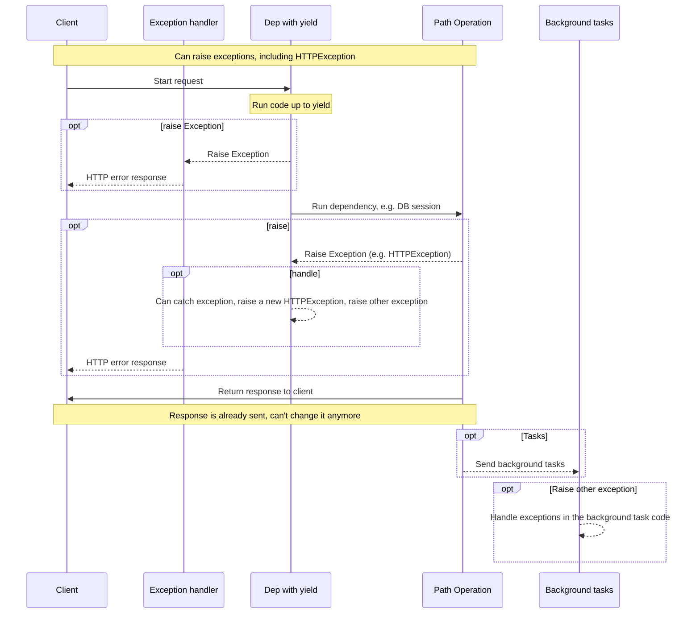
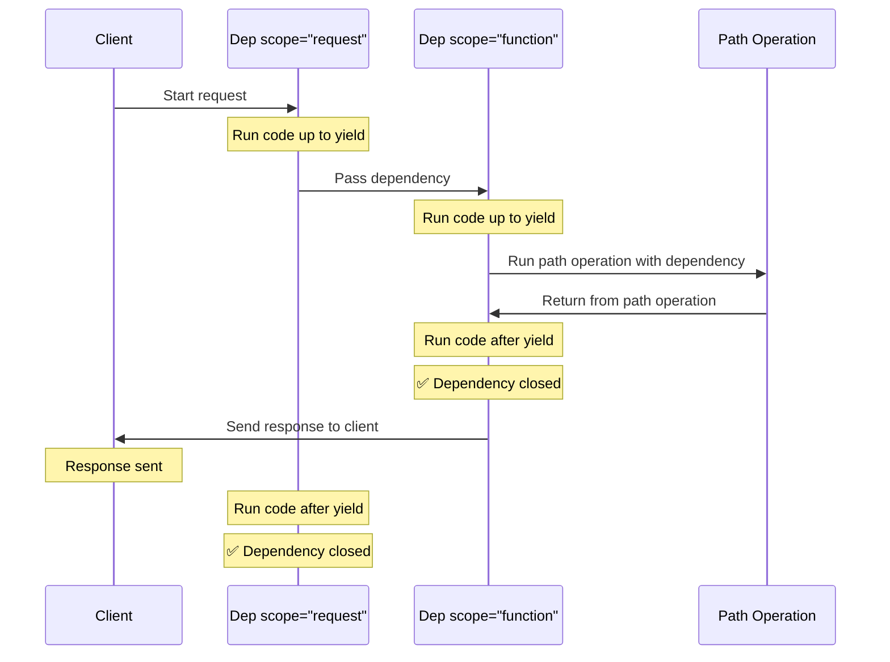

# Залежності з `yield` { #dependencies-with-yield }

FastAPI підтримує залежності, які виконують деякі <abbr title='інколи також називають «exit code», «cleanup code», «teardown code», «closing code», «context manager exit code» тощо'>додаткові кроки після завершення</abbr>.

Щоб зробити це, використовуйте `yield` замість `return` і напишіть додаткові кроки (код) після нього.

/// tip | Порада

Переконайтеся, що використовуєте `yield` лише один раз на одну залежність.

///

/// note | Технічні деталі

Будь-яка функція, яку коректно використовувати з:

* <a href="https://docs.python.org/3/library/contextlib.html#contextlib.contextmanager" class="external-link" target="_blank">`@contextlib.contextmanager`</a> або
* <a href="https://docs.python.org/3/library/contextlib.html#contextlib.asynccontextmanager" class="external-link" target="_blank">`@contextlib.asynccontextmanager`</a>

також буде коректною як залежність **FastAPI**.

Насправді FastAPI внутрішньо використовує ці два декоратори.

///

## Залежність бази даних з `yield` { #a-database-dependency-with-yield }

Наприклад, ви можете використати це, щоб створити сесію бази даних і закрити її після завершення.

Лише код до оператора `yield` включно виконується перед створенням відповіді:

{* ../../docs_src/dependencies/tutorial007_py39.py hl[2:4] *}

Значення, повернуте через `yield`, — це те, що буде інʼєктовано в *операції шляху* та інші залежності:

{* ../../docs_src/dependencies/tutorial007_py39.py hl[4] *}

Код після оператора `yield` виконується після відповіді:

{* ../../docs_src/dependencies/tutorial007_py39.py hl[5:6] *}

/// tip | Порада

Ви можете використовувати `async` або звичайні функції.

**FastAPI** коректно обробить кожен варіант — так само, як і зі звичайними залежностями.

///

## Залежність з `yield` і `try` { #a-dependency-with-yield-and-try }

Якщо ви використовуєте блок `try` у залежності з `yield`, ви отримаєте будь-який виняток, який було згенеровано під час використання залежності.

Наприклад, якщо якийсь код десь посередині, в іншій залежності або в *операції шляху*, виконав «rollback» транзакції бази даних або створив будь-який інший виняток, ви отримаєте цей виняток у вашій залежності.

Тож ви можете обробити конкретний виняток усередині залежності через `except SomeException`.

Так само ви можете використати `finally`, щоб переконатися, що кроки виходу буде виконано незалежно від того, був виняток чи ні.

{* ../../docs_src/dependencies/tutorial007_py39.py hl[3,5] *}

## Підзалежності з `yield` { #sub-dependencies-with-yield }

Ви можете мати підзалежності та «дерева» підзалежностей будь-якого розміру й форми, і будь-яка з них (або всі) можуть використовувати `yield`.

**FastAPI** подбає, щоб «exit code» у кожній залежності з `yield` виконувався в правильному порядку.

Наприклад, `dependency_c` може залежати від `dependency_b`, а `dependency_b` — від `dependency_a`:

{* ../../docs_src/dependencies/tutorial008_an_py39.py hl[6,14,22] *}

І всі вони можуть використовувати `yield`.

У цьому випадку `dependency_c`, щоб виконати свій код виходу, потребує, щоб значення з `dependency_b` (тут назване `dep_b`) усе ще було доступне.

А `dependency_b`, своєю чергою, потребує, щоб значення з `dependency_a` (тут назване `dep_a`) було доступне для її коду виходу.

{* ../../docs_src/dependencies/tutorial008_an_py39.py hl[18:19,26:27] *}

Так само ви можете мати частину залежностей з `yield`, а інші — з `return`, і щоб деякі з них залежали від інших.

Також ви можете мати одну залежність, яка потребує кілька інших залежностей з `yield`, тощо.

Ви можете мати будь-які комбінації залежностей, які вам потрібні.

**FastAPI** забезпечить виконання всього в правильному порядку.

/// note | Технічні деталі

Це працює завдяки <a href="https://docs.python.org/3/library/contextlib.html" class="external-link" target="_blank">Context Managers</a> у Python.

**FastAPI** використовує їх внутрішньо, щоб досягти цього.

///

## Залежності з `yield` і `HTTPException` { #dependencies-with-yield-and-httpexception }

Ви бачили, що можете використовувати залежності з `yield` і мати блоки `try`, які намагаються виконати певний код, а потім запускають код виходу після `finally`.

Ви також можете використовувати `except`, щоб перехопити виняток, який було згенеровано, і зробити з ним щось.

Наприклад, ви можете згенерувати інший виняток, як-от `HTTPException`.

/// tip | Порада

Це дещо просунута техніка, і в більшості випадків вона вам насправді не знадобиться, адже ви можете піднімати винятки (включно з `HTTPException`) з решти коду вашого застосунку, наприклад у *функції операції шляху*.

Але вона доступна, якщо вам це потрібно. 🤓

///

{* ../../docs_src/dependencies/tutorial008b_an_py39.py hl[18:22,31] *}

Якщо ви хочете перехоплювати винятки й створювати кастомну відповідь на їхній основі, створіть [кастомний обробник винятків](../handling-errors.md#install-custom-exception-handlers){.internal-link target=_blank}.

## Залежності з `yield` і `except` { #dependencies-with-yield-and-except }

Якщо ви перехопите виняток через `except` у залежності з `yield` і не піднімете його знову (або не піднімете новий виняток), FastAPI не зможе помітити, що був виняток — так само, як це відбувається у звичайному Python:

{* ../../docs_src/dependencies/tutorial008c_an_py39.py hl[15:16] *}

У цьому випадку клієнт побачить відповідь *HTTP 500 Internal Server Error*, як і має бути, з огляду на те, що ми не піднімаємо `HTTPException` або подібне, але сервер **не матиме жодних логів** чи будь-яких інших вказівок на те, в чому була помилка. 😱

### Завжди робіть `raise` у залежностях з `yield` і `except` { #always-raise-in-dependencies-with-yield-and-except }

Якщо ви перехопили виняток у залежності з `yield`, то, якщо ви не піднімаєте інший `HTTPException` або подібний виняток, **вам слід повторно підняти початковий виняток**.

Ви можете повторно підняти той самий виняток за допомогою `raise`:

{* ../../docs_src/dependencies/tutorial008d_an_py39.py hl[17] *}

Тепер клієнт отримає ту саму відповідь *HTTP 500 Internal Server Error*, але на сервері в логах буде наш кастомний `InternalError`. 😎

## Виконання залежностей з `yield` { #execution-of-dependencies-with-yield }

Послідовність виконання приблизно така, як на цій діаграмі. Час іде зверху вниз. А кожна колонка — це одна зі сторін, які взаємодіють або виконують код.



/// info | Інформація

Клієнту буде надіслано лише **одну відповідь**. Це може бути одна з відповідей про помилку або відповідь від *операції шляху*.

Після надсилання однієї з цих відповідей жодної іншої відповіді надіслати вже не можна.

///

/// tip | Порада

Якщо ви піднімете будь-який виняток у коді *функції операції шляху*, його буде передано залежностям із yield, включно з `HTTPException`. У більшості випадків ви захочете повторно підняти той самий виняток або новий із залежності з `yield`, щоб забезпечити його коректну обробку.

///

## Ранній вихід і `scope` { #early-exit-and-scope }

Зазвичай код виходу залежностей з `yield` виконується **після того**, як відповідь надіслано клієнту.

Але якщо ви знаєте, що не потребуватимете залежність після повернення з *функції операції шляху*, ви можете використати `Depends(scope="function")`, щоб сказати FastAPI, що він має закрити залежність після того, як *функція операції шляху* завершиться, але **до того**, як **відповідь буде надіслано**.

{* ../../docs_src/dependencies/tutorial008e_an_py39.py hl[12,16] *}

`Depends()` приймає параметр `scope`, який може бути:

* `"function"`: запустити залежність перед *функцією операції шляху*, що обробляє запит, завершити залежність після завершення *функції операції шляху*, але **до того**, як відповідь буде надіслано назад клієнту. Тобто функція залежності виконуватиметься **навколо** *функції операції шляху*.
* `"request"`: запустити залежність перед *функцією операції шляху*, що обробляє запит (подібно до `"function"`), але завершити **після того**, як відповідь буде надіслано назад клієнту. Тобто функція залежності виконуватиметься **навколо** циклу **запит-відповідь**.

Якщо не вказано і залежність має `yield`, за замовчуванням вона матиме `scope="request"`.

### `scope` для підзалежностей { #scope-for-sub-dependencies }

Коли ви оголошуєте залежність із `scope="request"` (за замовчуванням), будь-яка підзалежність також має мати `scope="request"`.

Але залежність із `scope="function"` може мати залежності як із `scope="function"`, так і з `scope="request"`.

Це тому, що будь-яка залежність має мати змогу виконати свій код виходу раніше за підзалежності, адже вона може все ще потребувати їх під час виконання коду виходу.



## Залежності з `yield`, `HTTPException`, `except` і Background Tasks { #dependencies-with-yield-httpexception-except-and-background-tasks }

Залежності з `yield` еволюціонували з часом, щоб покрити різні сценарії використання та виправити деякі проблеми.

Якщо ви хочете побачити, що змінювалося в різних версіях FastAPI, можете прочитати про це більше в розширеному посібнику: [Розширені залежності — залежності з `yield`, `HTTPException`, `except` і Background Tasks](../../advanced/advanced-dependencies.md#dependencies-with-yield-httpexception-except-and-background-tasks){.internal-link target=_blank}.

## Context Managers { #context-managers }

### Що таке «Context Managers» { #what-are-context-managers }

«Context Managers» — це будь-які об’єкти Python, які ви можете використовувати в операторі `with`.

Наприклад, <a href="https://docs.python.org/3/tutorial/inputoutput.html#reading-and-writing-files" class="external-link" target="_blank">ви можете використати `with`, щоб прочитати файл</a>:

```Python
with open("./somefile.txt") as f:
    contents = f.read()
    print(contents)
```

Під капотом `open("./somefile.txt")` створює об’єкт, який називають «Context Manager».

Коли блок `with` завершується, він гарантує закриття файлу, навіть якщо виникали винятки.

Коли ви створюєте залежність з `yield`, **FastAPI** внутрішньо створить для неї context manager і поєднає його з деякими іншими пов’язаними інструментами.

### Використання context managers у залежностях з `yield` { #using-context-managers-in-dependencies-with-yield }

/// warning | Попередження

Це, більш-менш, «просунута» ідея.

Якщо ви лише починаєте працювати з **FastAPI**, можливо, вам варто поки що її пропустити.

///

У Python ви можете створювати Context Managers, <a href="https://docs.python.org/3/reference/datamodel.html#context-managers" class="external-link" target="_blank">створивши клас із двома методами: `__enter__()` і `__exit__()`</a>.

Ви також можете використовувати їх усередині залежностей **FastAPI** з `yield`, застосовуючи оператори
`with` або `async with` усередині функції залежності:

{* ../../docs_src/dependencies/tutorial010_py39.py hl[1:9,13] *}

/// tip | Порада

Інший спосіб створити context manager — це:

* <a href="https://docs.python.org/3/library/contextlib.html#contextlib.contextmanager" class="external-link" target="_blank">`@contextlib.contextmanager`</a> або
* <a href="https://docs.python.org/3/library/contextlib.html#contextlib.asynccontextmanager" class="external-link" target="_blank">`@contextlib.asynccontextmanager`</a>

використати їх як декоратори для функції з одним `yield`.

Саме так **FastAPI** внутрішньо працює із залежностями з `yield`.

Але вам не потрібно використовувати ці декоратори для залежностей FastAPI (і не слід).

FastAPI зробить це за вас внутрішньо.

///
