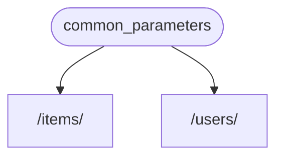
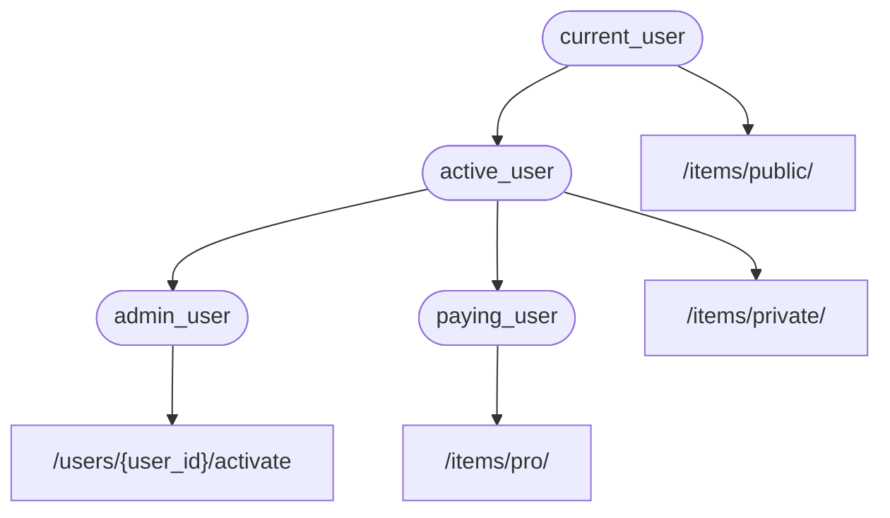

# Залежності { #dependencies }

**FastAPI** має дуже потужну, але інтуїтивну систему **<dfn title="також відомо як: компоненти, ресурси, провайдери, сервіси, інжектовані об'єкти">Впровадження залежностей</dfn>**.

Вона створена так, щоб бути дуже простою у використанні та щоб полегшити будь-якому розробнику інтеграцію інших компонентів з **FastAPI**.

## Що таке «Впровадження залежностей» { #what-is-dependency-injection }

У програмуванні **«Впровадження залежностей»** означає, що існує спосіб для вашого коду (у цьому випадку ваших *функцій операцій шляху*) задекларувати речі, які йому потрібні для роботи: «залежності».

А потім ця система (у цьому випадку **FastAPI**) подбає про все необхідне, щоб надати вашому коду ці потрібні залежності («інжектувати» залежності).

Це дуже корисно, коли вам потрібно:

* Мати спільну логіку (одна й та сама логіка знову і знову).
* Ділитися з’єднаннями з базою даних.
* Примусово застосовувати безпеку, автентифікацію, вимоги до ролей тощо.
* І багато іншого...

Все це з мінімізацією дублювання коду.

## Перші кроки { #first-steps }

Розгляньмо дуже простий приклад. Він буде таким простим, що поки що не дуже корисним.

Але так ми зможемо зосередитися на тому, як працює система **Впровадження залежностей**.

### Створіть залежність або «залежний» { #create-a-dependency-or-dependable }

Спочатку зосередьмося на залежності.

Це просто функція, яка може приймати ті самі параметри, що й *функція операції шляху*:

{* ../../docs_src/dependencies/tutorial001_an_py310.py hl[8:9] *}

Ось і все.

**2 рядки**.

І вона має ту саму форму та структуру, що й усі ваші *функції операцій шляху*.

Можете думати про неї як про *функцію операції шляху* без «декоратора» (без `@app.get("/some-path")`).

І вона може повертати будь-що.

У цьому випадку ця залежність очікує:

* Необов’язковий параметр запиту `q` типу `str`.
* Необов’язковий параметр запиту `skip` типу `int`, за замовчуванням `0`.
* Необов’язковий параметр запиту `limit` типу `int`, за замовчуванням `100`.

Потім вона просто повертає `dict`, що містить ці значення.

/// info | Інформація

FastAPI додав підтримку `Annotated` (і почав її рекомендувати) у версії 0.95.0.

Якщо у вас старіша версія, ви отримаєте помилки при спробі використати `Annotated`.

Переконайтеся, що ви [Оновіть версію FastAPI](../../deployment/versions.md#upgrading-the-fastapi-versions){.internal-link target=_blank} щонайменше до 0.95.1 перед використанням `Annotated`.

///

### Імпортуйте `Depends` { #import-depends }

{* ../../docs_src/dependencies/tutorial001_an_py310.py hl[3] *}

### Оголосіть залежність у «залежному» { #declare-the-dependency-in-the-dependant }

Так само, як ви використовуєте `Body`, `Query` тощо з параметрами вашої *функції операції шляху*, використовуйте `Depends` з новим параметром:

{* ../../docs_src/dependencies/tutorial001_an_py310.py hl[13,18] *}

Хоча ви використовуєте `Depends` у параметрах вашої функції так само, як `Body`, `Query` тощо, `Depends` працює трохи інакше.

Ви передаєте в `Depends` лише один параметр.

Цей параметр має бути чимось на кшталт функції.

Ви її не викликаєте безпосередньо (не додавайте дужки в кінці), ви просто передаєте її як параметр у `Depends()`.

І ця функція приймає параметри так само, як і *функції операцій шляху*.

/// tip | Порада

У наступному розділі ви побачите, які ще «речі», окрім функцій, можна використовувати як залежності.

///

Щоразу, коли надходить новий запит, **FastAPI** подбає про:

* Виклик вашої функції-залежності («залежного») з правильними параметрами.
* Отримання результату з вашої функції.
* Присвоєння цього результату параметру у вашій *функції операції шляху*.



Таким чином ви пишете спільний код один раз, а **FastAPI** подбає про його виклик для ваших *операцій шляху*.

/// check | Перевірте

Зверніть увагу, що вам не потрібно створювати спеціальний клас і передавати його кудись у **FastAPI**, щоб «зареєструвати» його чи щось подібне.

Ви просто передаєте його в `Depends`, і **FastAPI** знає, що робити далі.

///

## Спільне використання залежностей `Annotated` { #share-annotated-dependencies }

У наведених вище прикладах видно невелике **дублювання коду**.

Коли вам потрібно використати залежність `common_parameters()`, доводиться писати весь параметр з анотацією типу та `Depends()`:

```Python
commons: Annotated[dict, Depends(common_parameters)]
```

Але оскільки ми використовуємо `Annotated`, ми можемо зберегти це значення `Annotated` у змінній і використовувати його в кількох місцях:

{* ../../docs_src/dependencies/tutorial001_02_an_py310.py hl[12,16,21] *}

/// tip | Порада

Це просто стандартний Python, це називається «псевдонім типу» і насправді не є специфічним для **FastAPI**.

Але оскільки **FastAPI** базується на стандартах Python, включно з `Annotated`, ви можете використати цей трюк у своєму коді. 😎

///

Залежності продовжать працювати як очікується, і **найкраще** те, що **інформація про типи буде збережена**, а це означає, що ваш редактор зможе й надалі надавати **автозаповнення**, **помилки в рядку** тощо. Те саме і для інших інструментів, як-от `mypy`.

Це буде особливо корисно у **великій кодовій базі**, де ви використовуєте **одні й ті самі залежності** знову і знову в **багатьох *операціях шляху***.

## Бути `async` чи не бути `async` { #to-async-or-not-to-async }

Оскільки залежності також викликатимуться **FastAPI** (так само, як і ваші *функції операцій шляху*), під час визначення ваших функцій діють ті самі правила.

Ви можете використовувати `async def` або звичайний `def`.

І ви можете оголошувати залежності з `async def` всередині звичайних *функцій операцій шляху* з `def`, або залежності з `def` всередині *функцій операцій шляху* з `async def` тощо.

Це не має значення. **FastAPI** знатиме, що робити.

/// note | Примітка

Якщо ви не впевнені, перегляньте розділ [Async: *"In a hurry?"*](../../async.md#in-a-hurry){.internal-link target=_blank} про `async` і `await` у документації.

///

## Інтегровано з OpenAPI { #integrated-with-openapi }

Усі декларації запитів, перевірки та вимоги ваших залежностей (і субзалежностей) будуть інтегровані в ту саму схему OpenAPI.

Тож інтерактивна документація також міститиме всю інформацію з цих залежностей:


## Просте використання { #simple-usage }

Якщо придивитися, *функції операцій шляху* оголошуються для використання щоразу, коли збігаються *шлях* та *операція*, а потім **FastAPI** подбає про виклик функції з правильними параметрами, витягуючи дані із запиту.

Насправді всі (або більшість) вебфреймворків працюють так само.

Ви ніколи не викликаєте ці функції безпосередньо. Їх викликає ваш фреймворк (у цьому випадку **FastAPI**).

За допомогою системи впровадження залежностей ви також можете вказати **FastAPI**, що ваша *функція операції шляху* також «залежить» від чогось, що має бути виконано до вашої *функції операції шляху*, і **FastAPI** подбає про виконання цього та «інжектування» результатів.

Інші поширені терміни для цієї самої ідеї «впровадження залежностей»:

* ресурси
* провайдери
* сервіси
* інжектовані об’єкти
* компоненти

## Плагіни **FastAPI** { #fastapi-plug-ins }

Інтеграції та «плагіни» можна будувати за допомогою системи **Впровадження залежностей**. Але насправді **немає потреби створювати «плагіни»**, оскільки, використовуючи залежності, можна оголосити безмежну кількість інтеграцій та взаємодій, які стають доступними для ваших *функцій операцій шляху*.

І залежності можна створювати дуже просто та інтуїтивно, що дозволяє вам просто імпортувати потрібні пакунки Python і інтегрувати їх з вашими функціями API за кілька рядків коду, буквально.

Ви побачите приклади цього в наступних розділах, про реляційні та NoSQL бази даних, безпеку тощо.

## Сумісність **FastAPI** { #fastapi-compatibility }

Простота системи впровадження залежностей робить **FastAPI** сумісним з:

* усіма реляційними базами даних
* NoSQL базами даних
* зовнішніми пакунками
* зовнішніми API
* системами автентифікації та авторизації
* системами моніторингу використання API
* системами інжекції даних у відповідь
* тощо.

## Просто і потужно { #simple-and-powerful }

Хоча ієрархічна система впровадження залежностей дуже проста у визначенні та використанні, вона все ще дуже потужна.

Ви можете визначати залежності, які своєю чергою можуть визначати власні залежності.

Зрештою будується ієрархічне дерево залежностей, і система **Впровадження залежностей** подбає про розв’язання всіх цих залежностей (і їхніх субзалежностей) та надання (інжектування) результатів на кожному кроці.

Наприклад, припустімо, у вас є 4 кінцеві точки API (*операції шляху*):

* `/items/public/`
* `/items/private/`
* `/users/{user_id}/activate`
* `/items/pro/`

тоді ви могли б додати різні вимоги до дозволів для кожної з них лише за допомогою залежностей і субзалежностей:



## Інтегровано з **OpenAPI** { #integrated-with-openapi_1 }

Усі ці залежності, декларуючи свої вимоги, також додають параметри, перевірки тощо до ваших *операцій шляху*.

**FastAPI** подбає про додавання всього цього до схеми OpenAPI, щоб це відображалося в інтерактивних системах документації.
