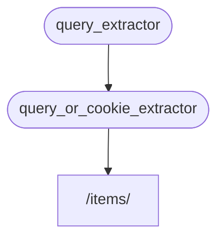

# Підзалежності { #sub-dependencies }

Ви можете створювати залежності, які мають підзалежності.

Вони можуть бути настільки глибокими, наскільки потрібно.

FastAPI подбає про їх розв'язання.

## Перша залежність «dependable» { #first-dependency-dependable }

Можна створити першу залежність («dependable») так:

{* ../../docs_src/dependencies/tutorial005_an_py310.py hl[8:9] *}

Вона оголошує необов'язковий параметр запиту `q` типу `str`, а потім просто повертає його.

Це досить просто (не дуже корисно), але допоможе зосередитися на тому, як працюють підзалежності.

## Друга залежність, «dependable» і «dependant» { #second-dependency-dependable-and-dependant }

Далі ви можете створити іншу функцію залежності («dependable»), яка водночас оголошує власну залежність (тож вона також є «dependant»):

{* ../../docs_src/dependencies/tutorial005_an_py310.py hl[13] *}

Зосередьмося на оголошених параметрах:

- Хоча ця функція сама є залежністю («dependable»), вона також оголошує іншу залежність (вона «залежить» від чогось).
    - Вона залежить від `query_extractor` і присвоює значення, яке він повертає, параметру `q`.
- Вона також оголошує необов'язкове кукі `last_query` типу `str`.
    - Якщо користувач не надав параметр запиту `q`, ми використовуємо останній запит, який зберегли раніше в кукі.

## Використання залежності { #use-the-dependency }

Потім ми можемо використати залежність так:

{* ../../docs_src/dependencies/tutorial005_an_py310.py hl[23] *}

/// info | Інформація

Зверніть увагу, що ми оголошуємо лише одну залежність у функції операції шляху — `query_or_cookie_extractor`.

Але FastAPI знатиме, що спочатку треба розв'язати `query_extractor`, щоб передати його результат у `query_or_cookie_extractor` під час виклику.

///



## Використання тієї ж залежності кілька разів { #using-the-same-dependency-multiple-times }

Якщо одна з ваших залежностей оголошена кілька разів для однієї операції шляху, наприклад, кілька залежностей мають спільну підзалежність, FastAPI знатиме, що цю підзалежність потрібно викликати лише один раз на запит.

І він збереже повернуте значення у <dfn title="Утиліта/система для збереження обчислених/згенерованих значень, щоб повторно використовувати їх замість повторного обчислення.">«кеш»</dfn> і передасть його всім «dependants», яким воно потрібне в цьому конкретному запиті, замість того щоб викликати залежність кілька разів для одного й того ж запиту.

У просунутому сценарії, коли ви знаєте, що залежність має викликатися на кожному кроці (можливо, кілька разів) у межах того самого запиту замість використання «кешованого» значення, ви можете встановити параметр `use_cache=False` при використанні `Depends`:

//// tab | Python 3.10+

```Python hl_lines="1"
async def needy_dependency(fresh_value: Annotated[str, Depends(get_value, use_cache=False)]):
    return {"fresh_value": fresh_value}
```

////

//// tab | Python 3.10+ без Annotated

/// tip | Порада

Надавайте перевагу версії з `Annotated`, якщо це можливо.

///

```Python hl_lines="1"
async def needy_dependency(fresh_value: str = Depends(get_value, use_cache=False)):
    return {"fresh_value": fresh_value}
```

////

## Підсумок { #recap }

Попри всі модні терміни, система впровадження залежностей досить проста.

Це просто функції, які виглядають так само, як функції операцій шляху.

Втім вона дуже потужна і дозволяє оголошувати довільно глибоко вкладені «графи» залежностей (дерева).

/// tip | Порада

Усе це може здаватися не надто корисним на простих прикладах.

Але ви побачите, наскільки це корисно, у розділах про **безпеку**.

І також побачите, скільки коду це вам заощадить.

///
