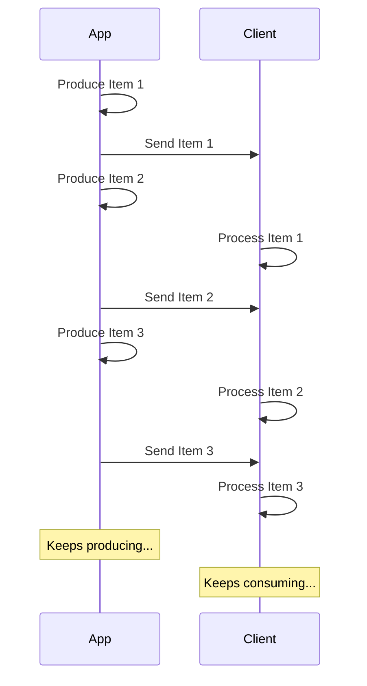

# Стрімінг JSON Lines { #stream-json-lines }

У вас може бути послідовність даних, яку ви хочете надсилати у **«потоці»**, це можна зробити за допомогою **JSON Lines**.

/// info | Інформація

Додано в FastAPI 0.134.0.

///

## Що таке потік { #what-is-a-stream }

«**Стрімінг**» даних означає, що ваш застосунок почне надсилати елементи даних клієнту, не чекаючи, доки буде готова вся послідовність елементів.

Тобто він надішле перший елемент, клієнт його отримає і почне обробляти, а ви в цей час уже можете створювати наступний елемент.



Це може бути навіть нескінченний потік, у якому ви постійно надсилаєте дані.

## JSON Lines { #json-lines }

У таких випадках часто надсилають «**JSON Lines**» - формат, у якому ви надсилаєте по одному об’єкту JSON на рядок.

Відповідь матиме тип вмісту `application/jsonl` (замість `application/json`), а тіло буде приблизно таким:

```json
{"name": "Plumbus", "description": "A multi-purpose household device."}
{"name": "Portal Gun", "description": "A portal opening device."}
{"name": "Meeseeks Box", "description": "A box that summons a Meeseeks."}
```

Це дуже схоже на масив JSON (еквівалент списку Python), але замість того, щоб бути загорнутим у `[]` і мати `,` між елементами, тут є **по одному об’єкту JSON на рядок**, вони розділені символом нового рядка.

/// info | Інформація

Важливо те, що ваш застосунок зможе по черзі створювати кожен рядок, поки клієнт споживає попередні рядки.

///

/// note | Технічні деталі

Оскільки кожен об’єкт JSON буде розділено новим рядком, він не може містити буквальні символи нового рядка у своєму вмісті, але може містити екрановані нові рядки (`\n`), що є частиною стандарту JSON.

Зазвичай про це не треба турбуватися, усе робиться автоматично, читайте далі. 🤓

///

## Випадки використання { #use-cases }

Ви можете використовувати це, щоб стрімити дані зі служби **AI LLM**, із **логів** чи **телеметрії**, або з інших типів даних, які можна структурувати як елементи **JSON**.

/// tip | Порада

Якщо ви хочете стрімити бінарні дані, наприклад відео чи аудіо, перегляньте просунутий посібник: [Потокова передача даних](../advanced/stream-data.md).

///

## Стрімінг JSON Lines з FastAPI { #stream-json-lines-with-fastapi }

Щоб стрімити JSON Lines з FastAPI, замість використання `return` у вашій *функції операції шляху* використовуйте `yield`, щоб по черзі створювати кожен елемент.

{* ../../docs_src/stream_json_lines/tutorial001_py310.py ln[1:24] hl[24] *}

Якщо кожен елемент JSON, який ви хочете надіслати у відповідь, має тип `Item` (модель Pydantic) і це async-функція, ви можете оголосити тип повернення як `AsyncIterable[Item]`:

{* ../../docs_src/stream_json_lines/tutorial001_py310.py ln[1:24] hl[9:11,22] *}

Якщо ви оголосите тип повернення, FastAPI використає його, щоб **перевіряти** дані, **документувати** їх в OpenAPI, **фільтрувати** їх і **серіалізувати** за допомогою Pydantic.

/// tip | Порада

Оскільки Pydantic серіалізуватиме це на боці **Rust**, ви отримаєте значно вищу **продуктивність**, ніж якби не оголошували тип повернення.

///

### Не-async *функції операцій шляху* { #non-async-path-operation-functions }

Ви також можете використовувати звичайні функції `def` (без `async`) і використовувати `yield` так само.

FastAPI подбає про коректне виконання, щоб це не блокувало цикл подій.

Оскільки в цьому випадку функція не є async, правильним типом повернення буде `Iterable[Item]`:

{* ../../docs_src/stream_json_lines/tutorial001_py310.py ln[27:30] hl[28] *}

### Без типу повернення { #no-return-type }

Ви також можете опустити тип повернення. Тоді FastAPI використає [`jsonable_encoder`](./encoder.md), щоб перетворити дані на щось, що можна серіалізувати в JSON, і потім надішле їх як JSON Lines.

{* ../../docs_src/stream_json_lines/tutorial001_py310.py ln[33:36] hl[34] *}

## Події, надіслані сервером (SSE) { #server-sent-events-sse }

FastAPI також має повноцінну підтримку Server-Sent Events (SSE), які досить схожі, але мають кілька додаткових деталей. Ви можете дізнатися про них у наступному розділі: [Події, надіслані сервером (SSE)](server-sent-events.md). 🤓
