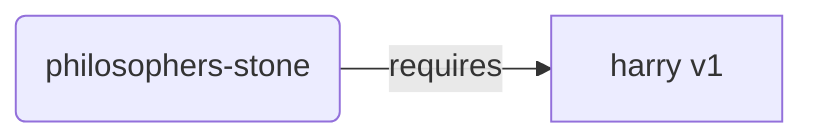
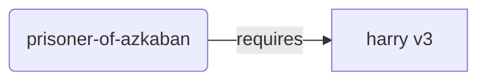
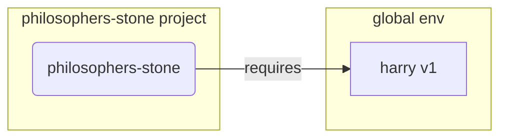
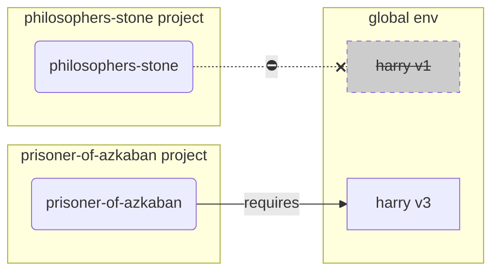
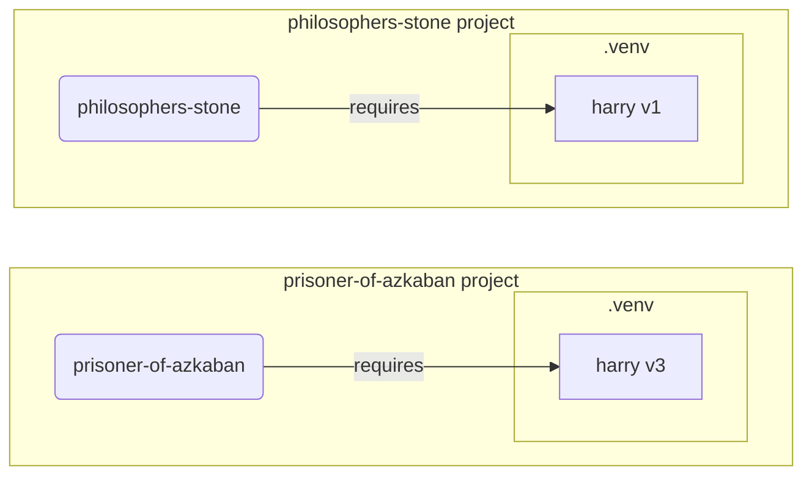

# Віртуальні середовища { #virtual-environments }

Коли ви працюєте над проєктами Python, вам, імовірно, слід використовувати віртуальне середовище (або схожий механізм), щоб ізолювати пакети, які ви встановлюєте для кожного проєкту.

/// info | Інформація

Якщо ви вже знаєте про віртуальні середовища, як їх створювати та використовувати, можете пропустити цей розділ. 🤓

///

/// tip | Порада

Віртуальне середовище відрізняється від змінної оточення.

Змінна оточення - це змінна в системі, яку можуть використовувати програми.

Віртуальне середовище - це каталог із файлами в ньому.

///

/// info | Інформація

На цій сторінці ви дізнаєтеся, як використовувати віртуальні середовища і як вони працюють.

Якщо ви готові прийняти інструмент, що керує всім за вас (включно з установленням Python), спробуйте <a href="https://github.com/astral-sh/uv" class="external-link" target="_blank">uv</a>.

///

## Створіть проєкт { #create-a-project }

Спочатку створіть каталог для вашого проєкту.

Зазвичай я створюю каталог з назвою `code` у моєму домашньому каталозі користувача.

І всередині нього я створюю окремий каталог на кожен проєкт.

<div class="termy">

```console
// Перейдіть до домашнього каталогу
$ cd
// Створіть каталог для всіх ваших проєктів з кодом
$ mkdir code
// Перейдіть у цей каталог code
$ cd code
// Створіть каталог для цього проєкту
$ mkdir awesome-project
// Перейдіть до каталогу цього проєкту
$ cd awesome-project
```

</div>

## Створіть віртуальне середовище { #create-a-virtual-environment }

Коли ви починаєте працювати над проєктом Python уперше, створіть віртуальне середовище у вашому проєкті **<dfn title="є інші варіанти, це проста настанова">у вашому проєкті</dfn>**.

/// tip | Порада

Це потрібно робити лише один раз на проєкт, не щоразу, коли ви працюєте.

///

//// tab | `venv`

Щоб створити віртуальне середовище, ви можете використати модуль `venv`, який постачається разом із Python.

<div class="termy">

```console
$ python -m venv .venv
```

</div>

/// details | Що означає ця команда

* `python`: використати програму з назвою `python`
* `-m`: викликати модуль як скрипт, далі ми вкажемо, який модуль
* `venv`: використати модуль з назвою `venv`, який зазвичай уже встановлено з Python
* `.venv`: створити віртуальне середовище в новому каталозі `.venv`

///

////

//// tab | `uv`

Якщо у вас встановлено <a href="https://github.com/astral-sh/uv" class="external-link" target="_blank">`uv`</a>, ви можете використати його для створення віртуального середовища.

<div class="termy">

```console
$ uv venv
```

</div>

/// tip | Порада

Типово `uv` створить віртуальне середовище в каталозі з назвою `.venv`.

Але ви можете налаштувати це, передавши додатковий аргумент з назвою каталогу.

///

////

Ця команда створює нове віртуальне середовище в каталозі з назвою `.venv`.

/// details | `.venv` або інша назва

Ви можете створити віртуальне середовище в іншому каталозі, але існує усталена домовленість називати його `.venv`.

///

## Активуйте віртуальне середовище { #activate-the-virtual-environment }

Активуйте нове віртуальне середовище, щоб будь-яка команда Python, яку ви запускаєте, або пакет, який ви встановлюєте, використовували його.

/// tip | Порада

Робіть це щоразу, коли ви починаєте нову сесію термінала для роботи над проєктом.

///

//// tab | Linux, macOS

<div class="termy">

```console
$ source .venv/bin/activate
```

</div>

////

//// tab | Windows PowerShell

<div class="termy">

```console
$ .venv\Scripts\Activate.ps1
```

</div>

////

//// tab | Windows Bash

Або якщо ви використовуєте Bash для Windows (напр., <a href="https://gitforwindows.org/" class="external-link" target="_blank">Git Bash</a>):

<div class="termy">

```console
$ source .venv/Scripts/activate
```

</div>

////

/// tip | Порада

Кожного разу, коли ви встановлюєте новий пакет у це середовище, активуйте середовище знову.

Це гарантує, що якщо ви використовуєте програму термінала (<abbr title="command line interface - інтерфейс командного рядка">CLI</abbr>), встановлену цим пакетом, ви використовуєте саме ту з вашого віртуального середовища, а не будь-яку іншу, яка може бути встановлена глобально, імовірно з іншою версією, ніж вам потрібно.

///

## Перевірте активність віртуального середовища { #check-the-virtual-environment-is-active }

Перевірте, що віртуальне середовище активне (попередня команда спрацювала).

/// tip | Порада

Це необов'язково, але це гарний спосіб перевірити, що все працює як очікується і ви використовуєте саме те віртуальне середовище, яке планували.

///

//// tab | Linux, macOS, Windows Bash

<div class="termy">

```console
$ which python

/home/user/code/awesome-project/.venv/bin/python
```

</div>

Якщо показано бінарний файл `python` за шляхом `.venv/bin/python` усередині вашого проєкту (у цьому випадку `awesome-project`), тоді все спрацювало. 🎉

////

//// tab | Windows PowerShell

<div class="termy">

```console
$ Get-Command python

C:\Users\user\code\awesome-project\.venv\Scripts\python
```

</div>

Якщо показано бінарний файл `python` за шляхом `.venv\Scripts\python` усередині вашого проєкту (у цьому випадку `awesome-project`), тоді все спрацювало. 🎉

////

## Оновіть `pip` { #upgrade-pip }

/// tip | Порада

Якщо ви використовуєте <a href="https://github.com/astral-sh/uv" class="external-link" target="_blank">`uv`</a>, ви використовуватимете його для встановлення замість `pip`, тож вам не потрібно оновлювати `pip`. 😎

///

Якщо ви використовуєте `pip` для встановлення пакетів (він іде за замовчуванням із Python), вам слід оновити його до найновішої версії.

Багато дивних помилок під час встановлення пакета вирішуються тим, що спочатку оновлюють `pip`.

/// tip | Порада

Зазвичай це роблять один раз, відразу після створення віртуального середовища.

///

Переконайтеся, що віртуальне середовище активне (командою вище), а потім виконайте:

<div class="termy">

```console
$ python -m pip install --upgrade pip

---> 100%
```

</div>

/// tip | Порада

Іноді ви можете отримати помилку **`No module named pip`** при спробі оновити pip.

Якщо це сталося, встановіть і оновіть pip за допомогою команди нижче:

<div class="termy">

```console
$ python -m ensurepip --upgrade

---> 100%
```

</div>

Ця команда встановить pip, якщо він ще не встановлений, і також гарантує, що встановлена версія pip принаймні така ж нова, як доступна в `ensurepip`.

///

## Додайте `.gitignore` { #add-gitignore }

Якщо ви використовуєте Git (варто це робити), додайте файл `.gitignore`, щоб виключити з Git усе у вашому `.venv`.

/// tip | Порада

Якщо ви використали <a href="https://github.com/astral-sh/uv" class="external-link" target="_blank">`uv`</a> для створення віртуального середовища, він уже зробив це за вас, можете пропустити цей крок. 😎

///

/// tip | Порада

Зробіть це один раз, відразу після створення віртуального середовища.

///

<div class="termy">

```console
$ echo "*" > .venv/.gitignore
```

</div>

/// details | Що означає ця команда

* `echo "*"`: «виведе» текст `*` у термінал (наступна частина трохи це змінює)
* `>`: усе, що команда ліворуч від `>` «виводить» у термінал, не слід друкувати, натомість записати у файл, вказаний праворуч від `>`
* `.gitignore`: назва файлу, куди слід записати текст

А `*` для Git означає «все». Тож він ігноруватиме все в каталозі `.venv`.

Ця команда створить файл `.gitignore` із вмістом:

```gitignore
*
```

///

## Встановіть пакети { #install-packages }

Після активації середовища ви можете встановлювати в нього пакети.

/// tip | Порада

Робіть це один раз під час встановлення або оновлення пакетів, потрібних вашому проєкту.

Якщо вам потрібно оновити версію або додати новий пакет, ви зробите це знову.

///

### Встановіть пакети безпосередньо { #install-packages-directly }

Якщо ви поспішаєте та не хочете використовувати файл для оголошення вимог вашого проєкту до пакетів, ви можете встановити їх безпосередньо.

/// tip | Порада

Дуже добра ідея - записати пакети та версії, потрібні вашій програмі, у файл (наприклад, `requirements.txt` або `pyproject.toml`).

///

//// tab | `pip`

<div class="termy">

```console
$ pip install "fastapi[standard]"

---> 100%
```

</div>

////

//// tab | `uv`

Якщо у вас є <a href="https://github.com/astral-sh/uv" class="external-link" target="_blank">`uv`</a>:

<div class="termy">

```console
$ uv pip install "fastapi[standard]"
---> 100%
```

</div>

////

### Встановіть з `requirements.txt` { #install-from-requirements-txt }

Якщо у вас є `requirements.txt`, ви можете використати його для встановлення перелічених там пакетів.

//// tab | `pip`

<div class="termy">

```console
$ pip install -r requirements.txt
---> 100%
```

</div>

////

//// tab | `uv`

Якщо у вас є <a href="https://github.com/astral-sh/uv" class="external-link" target="_blank">`uv`</a>:

<div class="termy">

```console
$ uv pip install -r requirements.txt
---> 100%
```

</div>

////

/// details | `requirements.txt`

`requirements.txt` із деякими пакетами може виглядати так:

```requirements.txt
fastapi[standard]==0.113.0
pydantic==2.8.0
```

///

## Запустіть вашу програму { #run-your-program }

Після активації віртуального середовища ви можете запустити вашу програму, і вона використовуватиме Python із вашого віртуального середовища з пакетами, які ви там встановили.

<div class="termy">

```console
$ python main.py

Hello World
```

</div>

## Налаштуйте ваш редактор { #configure-your-editor }

Ймовірно, ви використовуєте редактор коду, переконайтеся, що ви налаштували його на використання того самого віртуального середовища, яке ви створили (швидше за все, він визначить його автоматично), щоб отримувати автодоповнення та підсвічування помилок.

Наприклад:

* <a href="https://code.visualstudio.com/docs/python/environments#_select-and-activate-an-environment" class="external-link" target="_blank">VS Code</a>
* <a href="https://www.jetbrains.com/help/pycharm/creating-virtual-environment.html" class="external-link" target="_blank">PyCharm</a>

/// tip | Порада

Зазвичай це потрібно робити лише один раз, коли ви створюєте віртуальне середовище.

///

## Деактивуйте віртуальне середовище { #deactivate-the-virtual-environment }

Коли ви завершили роботу над проєктом, ви можете деактивувати віртуальне середовище.

<div class="termy">

```console
$ deactivate
```

</div>

Таким чином, коли ви запустите `python`, він не намагатиметься запускатися з того віртуального середовища з установленими там пакетами.

## Готові до роботи { #ready-to-work }

Тепер ви готові почати працювати над вашим проєктом.

/// tip | Порада

Хочете зрозуміти, що це все було вище?

Продовжуйте читати. 👇🤓

///

## Навіщо віртуальні середовища { #why-virtual-environments }

Щоб працювати з FastAPI, вам потрібно встановити <a href="https://www.python.org/" class="external-link" target="_blank">Python</a>.

Після цього вам потрібно буде встановити FastAPI та інші пакети, які ви хочете використовувати.

Для встановлення пакетів зазвичай використовують команду `pip`, що постачається з Python (або схожі альтернативи).

Однак, якщо ви просто користуватиметеся `pip` напряму, пакети встановлюватимуться у ваше глобальне середовище Python (глобальну інсталяцію Python).

### Проблема { #the-problem }

То в чому ж проблема встановлення пакетів у глобальне середовище Python?

З часом ви, вірогідно, писатимете багато різних програм, які залежать від різних пакетів. І деякі з цих ваших проєктів залежатимуть від різних версій одного й того ж пакета. 😱

Наприклад, ви можете створити проєкт із назвою `philosophers-stone`, ця програма залежить від іншого пакета з назвою `harry`, використовуючи версію `1`. Тож вам потрібно встановити `harry`.



Потім, трохи згодом, ви створюєте інший проєкт із назвою `prisoner-of-azkaban`, і цей проєкт також залежить від `harry`, але йому потрібна версія `harry` `3`.



Але тепер проблема в тому, що якщо ви встановлюєте пакети глобально (у глобальне середовище), а не у локальне віртуальне середовище, вам доведеться вибирати, яку версію `harry` встановити.

Якщо ви хочете запустити `philosophers-stone`, вам спочатку потрібно встановити `harry` версії `1`, наприклад, так:

<div class="termy">

```console
$ pip install "harry==1"
```

</div>

У підсумку у вас буде встановлено `harry` версії `1` у глобальному середовищі Python.



Але якщо ви захочете запустити `prisoner-of-azkaban`, вам доведеться видалити `harry` версії `1` і встановити `harry` версії `3` (або просто встановлення версії `3` автоматично видалить версію `1`).

<div class="termy">

```console
$ pip install "harry==3"
```

</div>

У підсумку у вас буде встановлено `harry` версії `3` у глобальному середовищі Python.

А якщо ви знову спробуєте запустити `philosophers-stone`, є шанс, що він не працюватиме, тому що йому потрібен `harry` версії `1`.



/// tip | Порада

У пакетах Python дуже поширена практика намагатися якнайкраще уникати несумісних змін у нових версіях, але краще підстрахуватися та встановлювати новіші версії свідомо і тоді, коли ви можете запустити тести, щоб перевірити, що все працює коректно.

///

Тепер уявіть те саме з багатьма іншими пакетами, від яких залежать усі ваші проєкти. Це дуже складно керувати. І ви, імовірно, запускатимете деякі проєкти з деякими несумісними версіями пакетів і не розумітимете, чому щось не працює.

Також, залежно від вашої операційної системи (напр., Linux, Windows, macOS), у ній може бути вже встановлений Python. І в такому разі, імовірно, уже будуть попередньо встановлені деякі пакети з певними версіями, потрібними вашій системі. Якщо ви встановлюєте пакети в глобальне середовище Python, ви можете зламати деякі програми, що постачаються з вашою операційною системою.

## Де встановлюються пакети { #where-are-packages-installed }

Коли ви встановлюєте Python, він створює на вашому комп'ютері кілька каталогів із деякими файлами.

Деякі з цих каталогів відповідають за зберігання всіх пакетів, які ви встановлюєте.

Коли ви запускаєте:

<div class="termy">

```console
// Не запускайте це зараз, це лише приклад 🤓
$ pip install "fastapi[standard]"
---> 100%
```

</div>

Це завантажить стиснений файл з кодом FastAPI, зазвичай із <a href="https://pypi.org/project/fastapi/" class="external-link" target="_blank">PyPI</a>.

Також будуть завантажені файли для інших пакетів, від яких залежить FastAPI.

Потім усе це буде розпаковано та покладено в каталог на вашому комп'ютері.

Типово ці завантажені та розпаковані файли будуть покладені в каталог, що постачається з вашою інсталяцією Python, це глобальне середовище.

## Що таке віртуальні середовища { #what-are-virtual-environments }

Рішенням проблеми з наявністю всіх пакетів у глобальному середовищі є використання віртуального середовища для кожного проєкту, над яким ви працюєте.

Віртуальне середовище - це каталог, дуже схожий на глобальний, у якому ви можете встановлювати пакети для конкретного проєкту.

Таким чином кожен проєкт матиме власне віртуальне середовище (каталог `.venv`) із власними пакетами.



## Що означає активація віртуального середовища { #what-does-activating-a-virtual-environment-mean }

Коли ви активуєте віртуальне середовище, наприклад так:

//// tab | Linux, macOS

<div class="termy">

```console
$ source .venv/bin/activate
```

</div>

////

//// tab | Windows PowerShell

<div class="termy">

```console
$ .venv\Scripts\Activate.ps1
```

</div>

////

//// tab | Windows Bash

Або якщо ви використовуєте Bash для Windows (напр., <a href="https://gitforwindows.org/" class="external-link" target="_blank">Git Bash</a>):

<div class="termy">

```console
$ source .venv/Scripts/activate
```

</div>

////

Ця команда створить або змінить деякі [Змінні оточення](environment-variables.md){.internal-link target=_blank}, які будуть доступні для наступних команд.

Однією з цих змінних є змінна `PATH`.

/// tip | Порада

Ви можете дізнатися більше про змінну оточення `PATH` у розділі [Змінні оточення](environment-variables.md#path-environment-variable){.internal-link target=_blank}.

///

Активація віртуального середовища додає його шлях `.venv/bin` (на Linux і macOS) або `.venv\Scripts` (на Windows) до змінної оточення `PATH`.

Скажімо, до активації середовища змінна `PATH` виглядала так:

//// tab | Linux, macOS

```plaintext
/usr/bin:/bin:/usr/sbin:/sbin
```

Це означає, що система шукатиме програми в:

* `/usr/bin`
* `/bin`
* `/usr/sbin`
* `/sbin`

////

//// tab | Windows

```plaintext
C:\Windows\System32
```

Це означає, що система шукатиме програми в:

* `C:\Windows\System32`

////

Після активації віртуального середовища змінна `PATH` виглядатиме приблизно так:

//// tab | Linux, macOS

```plaintext
/home/user/code/awesome-project/.venv/bin:/usr/bin:/bin:/usr/sbin:/sbin
```

Це означає, що система тепер спочатку шукатиме програми в:

```plaintext
/home/user/code/awesome-project/.venv/bin
```

перед тим, як шукати в інших каталогах.

Тож коли ви введете `python` у терміналі, система знайде програму Python у

```plaintext
/home/user/code/awesome-project/.venv/bin/python
```

і використає саме її.

////

//// tab | Windows

```plaintext
C:\Users\user\code\awesome-project\.venv\Scripts;C:\Windows\System32
```

Це означає, що система тепер спочатку шукатиме програми в:

```plaintext
C:\Users\user\code\awesome-project\.venv\Scripts
```

перед тим, як шукати в інших каталогах.

Тож коли ви введете `python` у терміналі, система знайде програму Python у

```plaintext
C:\Users\user\code\awesome-project\.venv\Scripts\python
```

і використає саме її.

////

Важлива деталь: шлях до віртуального середовища буде додано на початок змінної `PATH`. Система знайде його раніше за будь-який інший доступний Python. Таким чином, коли ви запускаєте `python`, використовується саме Python із віртуального середовища, а не будь-який інший `python` (наприклад, з глобального середовища).

Активація віртуального середовища також змінює ще кілька речей, але це одна з найважливіших.

## Перевірка віртуального середовища { #checking-a-virtual-environment }

Коли ви перевіряєте, чи активне віртуальне середовище, наприклад так:

//// tab | Linux, macOS, Windows Bash

<div class="termy">

```console
$ which python

/home/user/code/awesome-project/.venv/bin/python
```

</div>

////

//// tab | Windows PowerShell

<div class="termy">

```console
$ Get-Command python

C:\Users\user\code\awesome-project\.venv\Scripts\python
```

</div>

////

Це означає, що програма `python`, яка буде використана, знаходиться у віртуальному середовищі.

На Linux і macOS використовують `which`, а в Windows PowerShell - `Get-Command`.

Принцип роботи цієї команди в тому, що вона перевіряє змінну оточення `PATH`, проходячи по кожному шляху по порядку, шукаючи програму з назвою `python`. Щойно вона її знайде, вона покаже вам шлях до цієї програми.

Найважливіше, що коли ви викликаєте `python`, це рівно той «`python`», який буде виконаний.

Отже, ви можете підтвердити, чи перебуваєте в правильному віртуальному середовищі.

/// tip | Порада

Легко активувати одне віртуальне середовище, отримати один Python, а потім перейти до іншого проєкту.

І другий проєкт не працюватиме, бо ви використовуєте некоректний Python з віртуального середовища іншого проєкту.

Корисно вміти перевіряти, який саме `python` використовується. 🤓

///

## Навіщо деактивувати віртуальне середовище { #why-deactivate-a-virtual-environment }

Наприклад, ви працюєте над проєктом `philosophers-stone`, активували його віртуальне середовище, встановили пакети та працюєте з цим середовищем.

А потім ви хочете працювати над іншим проєктом `prisoner-of-azkaban`.

Ви переходите до цього проєкту:

<div class="termy">

```console
$ cd ~/code/prisoner-of-azkaban
```

</div>

Якщо ви не деактивуєте віртуальне середовище для `philosophers-stone`, коли ви запустите `python` у терміналі, він спробує використовувати Python із `philosophers-stone`.

<div class="termy">

```console
$ cd ~/code/prisoner-of-azkaban

$ python main.py

// Помилка імпорту sirius, його не встановлено 😱
Traceback (most recent call last):
    File "main.py", line 1, in <module>
        import sirius
```

</div>

Але якщо ви деактивуєте віртуальне середовище і активуєте нове для `prisoner-of-askaban`, тоді при запуску `python` він використовуватиме Python із віртуального середовища в `prisoner-of-azkaban`.

<div class="termy">

```console
$ cd ~/code/prisoner-of-azkaban

// Вам не потрібно бути в старому каталозі, щоб деактивувати, це можна зробити будь-де, навіть після переходу до іншого проєкту 😎
$ deactivate

// Активуйте віртуальне середовище в prisoner-of-azkaban/.venv 🚀
$ source .venv/bin/activate

// Тепер, коли ви запускаєте python, він знайде пакет sirius, встановлений у цьому віртуальному середовищі ✨
$ python main.py

I solemnly swear 🐺
```

</div>

## Альтернативи { #alternatives }

Це простий посібник, щоб ви швидко стартували та зрозуміли, як усе працює «під капотом».

Існує багато альтернатив керування віртуальними середовищами, залежностями пакетів (вимогами), проєктами.

Коли будете готові й захочете використовувати інструмент для керування всім проєктом, залежностями пакетів, віртуальними середовищами тощо, я раджу спробувати <a href="https://github.com/astral-sh/uv" class="external-link" target="_blank">uv</a>.

`uv` уміє багато чого, зокрема:

* Встановлювати Python для вас, включно з різними версіями
* Керувати віртуальним середовищем ваших проєктів
* Встановлювати пакети
* Керувати залежностями пакетів і версіями у вашому проєкті
* Гарантувати, що у вас є точний набір пакетів і версій для встановлення, включно з їхніми залежностями, щоб ви були певні, що зможете запустити ваш проєкт у продакшені точно так само, як і на вашому комп'ютері під час розробки - це називається блокуванням
* І багато іншого

## Висновок { #conclusion }

Якщо ви все це прочитали й зрозуміли, тепер ви знаєте значно більше про віртуальні середовища, ніж багато розробників. 🤓

Знання цих деталей, найімовірніше, стане в пригоді в майбутньому, коли ви налагоджуватимете щось, що виглядає складним, але ви знатимете, як усе працює «під капотом». 😎
