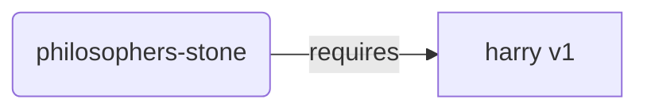
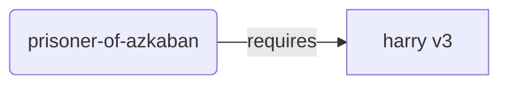
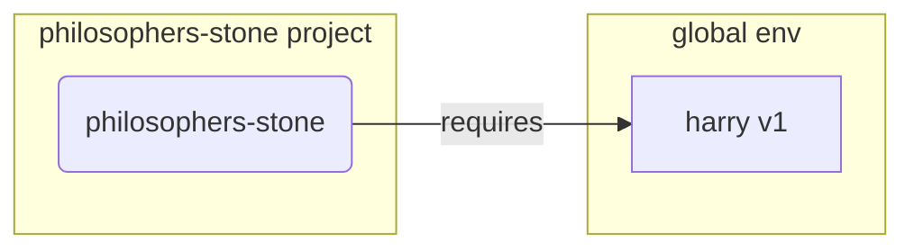
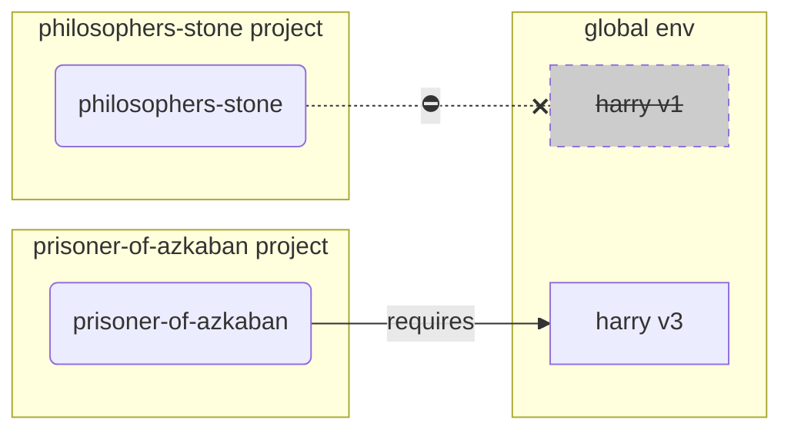
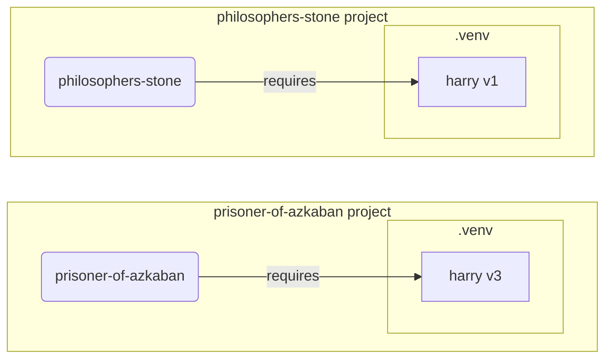

# Віртуальні середовища { #virtual-environments }

Коли ви працюєте з Python-проєктами, вам, імовірно, слід використовувати **віртуальне середовище** (або подібний механізм), щоб ізолювати пакунки, які ви встановлюєте для кожного проєкту.

/// info | Інформація

Якщо ви вже знаєте про віртуальні середовища, як їх створювати та використовувати, можливо, вам варто пропустити цей розділ. 🤓

///

/// tip | Порада

**Віртуальне середовище** відрізняється від **змінної середовища**.

**Змінна середовища** — це змінна в системі, яку можуть використовувати програми.

**Віртуальне середовище** — це директорія з деякими файлами всередині.

///

/// info | Інформація

Ця сторінка навчить вас використовувати **віртуальні середовища** та пояснить, як вони працюють.

Якщо ви готові перейти на **інструмент, який керує всім** за вас (включно зі встановленням Python), спробуйте <a href="https://github.com/astral-sh/uv" class="external-link" target="_blank">uv</a>.

///

## Створіть проєкт { #create-a-project }

Спочатку створіть директорію для вашого проєкту.

Зазвичай я роблю так: створюю директорію з назвою `code` у своєму домашньому/користувацькому каталозі.

А всередині неї створюю по одній директорії на кожен проєкт.

<div class="termy">

```console
// Go to the home directory
$ cd
// Create a directory for all your code projects
$ mkdir code
// Enter into that code directory
$ cd code
// Create a directory for this project
$ mkdir awesome-project
// Enter into that project directory
$ cd awesome-project
```

</div>

## Створіть віртуальне середовище { #create-a-virtual-environment }

Коли ви починаєте працювати над Python-проєктом **уперше**, створіть віртуальне середовище **<abbr title="there are other options, this is a simple guideline - є й інші варіанти, це проста рекомендація">всередині вашого проєкту</abbr>**.

/// tip | Порада

Вам потрібно зробити це **лише один раз для кожного проєкту**, а не щоразу, коли ви працюєте.

///

//// tab | `venv`

Щоб створити віртуальне середовище, ви можете використати модуль `venv`, який постачається разом із Python.

<div class="termy">

```console
$ python -m venv .venv
```

</div>

/// details | Що означає ця команда

* `python`: використати програму з назвою `python`
* `-m`: викликати модуль як скрипт, далі ми вкажемо, який саме модуль
* `venv`: використати модуль з назвою `venv`, який зазвичай встановлено разом із Python
* `.venv`: створити віртуальне середовище в новій директорії `.venv`

///

////

//// tab | `uv`

Якщо у вас встановлено <a href="https://github.com/astral-sh/uv" class="external-link" target="_blank">`uv`</a>, ви можете використати його для створення віртуального середовища.

<div class="termy">

```console
$ uv venv
```

</div>

/// tip | Порада

За замовчуванням `uv` створить віртуальне середовище в директорії з назвою `.venv`.

Але ви можете налаштувати це, передавши додатковий аргумент з назвою директорії.

///

////

Ця команда створює нове віртуальне середовище в директорії з назвою `.venv`.

/// details | `.venv` або інша назва

Ви можете створити віртуальне середовище в іншій директорії, але за домовленістю його називають `.venv`.

///

## Активуйте віртуальне середовище { #activate-the-virtual-environment }

Активуйте нове віртуальне середовище, щоб будь-яка команда Python, яку ви запускаєте, або пакунок, який ви встановлюєте, використовували його.

/// tip | Порада

Робіть це **кожного разу**, коли ви починаєте **нову сесію термінала**, щоб працювати над проєктом.

///

//// tab | Linux, macOS

<div class="termy">

```console
$ source .venv/bin/activate
```

</div>

////

//// tab | Windows PowerShell

<div class="termy">

```console
$ .venv\Scripts\Activate.ps1
```

</div>

////

//// tab | Windows Bash

Або якщо ви використовуєте Bash у Windows (наприклад, <a href="https://gitforwindows.org/" class="external-link" target="_blank">Git Bash</a>):

<div class="termy">

```console
$ source .venv/Scripts/activate
```

</div>

////

/// tip | Порада

Щоразу, коли ви встановлюєте **новий пакунок** у цьому середовищі, **активуйте** середовище знову.

Це гарантує, що якщо ви використовуєте програму для термінала (<abbr title="command line interface - інтерфейс командного рядка">CLI</abbr>), встановлену цим пакунком, ви використаєте ту, що з вашого віртуального середовища, а не будь-яку іншу, яка могла бути встановлена глобально — ймовірно, з іншою версією, ніж вам потрібно.

///

## Перевірте, що віртуальне середовище активне { #check-the-virtual-environment-is-active }

Перевірте, що віртуальне середовище активне (що попередня команда спрацювала).

/// tip | Порада

Це **необов’язково**, але це хороший спосіб **перевірити**, що все працює як очікується і ви використовуєте саме те віртуальне середовище, яке планували.

///

//// tab | Linux, macOS, Windows Bash

<div class="termy">

```console
$ which python

/home/user/code/awesome-project/.venv/bin/python
```

</div>

Якщо показано виконуваний файл `python` за шляхом `.venv/bin/python` всередині вашого проєкту (у цьому випадку `awesome-project`), отже, все спрацювало. 🎉

////

//// tab | Windows PowerShell

<div class="termy">

```console
$ Get-Command python

C:\Users\user\code\awesome-project\.venv\Scripts\python
```

</div>

Якщо показано виконуваний файл `python` за шляхом `.venv\Scripts\python` всередині вашого проєкту (у цьому випадку `awesome-project`), отже, все спрацювало. 🎉

////

## Оновіть `pip` { #upgrade-pip }

/// tip | Порада

Якщо ви використовуєте <a href="https://github.com/astral-sh/uv" class="external-link" target="_blank">`uv`</a>, ви встановлюватимете залежності за його допомогою замість `pip`, тож вам не потрібно оновлювати `pip`. 😎

///

Якщо ви використовуєте `pip` для встановлення пакунків (він постачається за замовчуванням разом із Python), вам слід **оновити** його до останньої версії.

Багато дивних помилок під час встановлення пакунка вирішуються простим попереднім оновленням `pip`.

/// tip | Порада

Зазвичай це роблять **один раз**, одразу після створення віртуального середовища.

///

Переконайтеся, що віртуальне середовище активне (командою вище), а потім виконайте:

<div class="termy">

```console
$ python -m pip install --upgrade pip

---> 100%
```

</div>

/// tip | Порада

Іноді під час спроби оновити pip ви можете отримати помилку **`No module named pip`**.

Якщо так сталося, встановіть і оновіть pip командою нижче:

<div class="termy">

```console
$ python -m ensurepip --upgrade

---> 100%
```

</div>

Ця команда встановить pip, якщо він ще не встановлений, а також гарантує, що встановлена версія pip принаймні така ж нова, як та, що доступна в `ensurepip`.

///

## Додайте `.gitignore` { #add-gitignore }

Якщо ви використовуєте **Git** (вам слід), додайте файл `.gitignore`, щоб виключити з Git усе у вашій `.venv`.

/// tip | Порада

Якщо ви використали <a href="https://github.com/astral-sh/uv" class="external-link" target="_blank">`uv`</a> для створення віртуального середовища, він уже зробив це за вас — можете пропустити цей крок. 😎

///

/// tip | Порада

Зробіть це **один раз**, одразу після створення віртуального середовища.

///

<div class="termy">

```console
$ echo "*" > .venv/.gitignore
```

</div>

/// details | Що означає ця команда

* `echo "*"`: «виведе» текст `*` у термінал (наступна частина трохи змінює це)
* `>`: усе, що команда ліворуч від `>` виводить у термінал, не має бути виведено, натомість це буде записано у файл праворуч від `>`
* `.gitignore`: назва файла, куди слід записати текст

А `*` для Git означає «усе». Отже, Git ігноруватиме все в директорії `.venv`.

Ця команда створить файл `.gitignore` із вмістом:

```gitignore
*
```

///

## Встановіть пакунки { #install-packages }

Після активації середовища ви можете встановлювати пакунки в нього.

/// tip | Порада

Зробіть це **один раз** під час встановлення або оновлення пакунків, потрібних вашому проєкту.

Якщо вам потрібно оновити версію або додати новий пакунок, ви **зробите це знову**.

///

### Встановіть пакунки напряму { #install-packages-directly }

Якщо ви поспішаєте і не хочете використовувати файл для опису вимог до пакунків вашого проєкту, ви можете встановити їх напряму.

/// tip | Порада

(Дуже) хороша ідея — записати пакунки та версії, потрібні вашій програмі, у файл (наприклад, `requirements.txt` або `pyproject.toml`).

///

//// tab | `pip`

<div class="termy">

```console
$ pip install "fastapi[standard]"

---> 100%
```

</div>

////

//// tab | `uv`

Якщо у вас є <a href="https://github.com/astral-sh/uv" class="external-link" target="_blank">`uv`</a>:

<div class="termy">

```console
$ uv pip install "fastapi[standard]"
---> 100%
```

</div>

////

### Встановіть із `requirements.txt` { #install-from-requirements-txt }

Якщо у вас є `requirements.txt`, тепер ви можете використати його для встановлення пакунків.

//// tab | `pip`

<div class="termy">

```console
$ pip install -r requirements.txt
---> 100%
```

</div>

////

//// tab | `uv`

Якщо у вас є <a href="https://github.com/astral-sh/uv" class="external-link" target="_blank">`uv`</a>:

<div class="termy">

```console
$ uv pip install -r requirements.txt
---> 100%
```

</div>

////

/// details | `requirements.txt`

`requirements.txt` з деякими пакунками може виглядати так:

```requirements.txt
fastapi[standard]==0.113.0
pydantic==2.8.0
```

///

## Запустіть вашу програму { #run-your-program }

Після того як ви активували віртуальне середовище, ви можете запускати вашу програму, і вона використовуватиме Python із вашого віртуального середовища з пакунками, які ви там встановили.

<div class="termy">

```console
$ python main.py

Hello World
```

</div>

## Налаштуйте редактор { #configure-your-editor }

Імовірно, ви використовуєте редактор — переконайтеся, що ви налаштували його на використання того самого віртуального середовища, яке створили (скоріше за все, він визначить його автоматично), щоб отримати автодоповнення та помилки «на льоту».

Наприклад:

* <a href="https://code.visualstudio.com/docs/python/environments#_select-and-activate-an-environment" class="external-link" target="_blank">VS Code</a>
* <a href="https://www.jetbrains.com/help/pycharm/creating-virtual-environment.html" class="external-link" target="_blank">PyCharm</a>

/// tip | Порада

Зазвичай це потрібно зробити лише **один раз**, коли ви створюєте віртуальне середовище.

///

## Деактивуйте віртуальне середовище { #deactivate-the-virtual-environment }

Коли ви завершили роботу над проєктом, ви можете **деактивувати** віртуальне середовище.

<div class="termy">

```console
$ deactivate
```

</div>

Так, коли ви запускаєте `python`, він не намагатиметься запускатися з того віртуального середовища з пакунками, встановленими там.

## Готові працювати { #ready-to-work }

Тепер ви готові почати працювати над вашим проєктом.

/// tip | Порада

Хочете зрозуміти, що означає все вище?

Читайте далі. 👇🤓

///

## Навіщо віртуальні середовища { #why-virtual-environments }

Щоб працювати з FastAPI, вам потрібно встановити <a href="https://www.python.org/" class="external-link" target="_blank">Python</a>.

Після цього вам потрібно буде **встановити** FastAPI та будь-які інші **пакунки**, які ви хочете використовувати.

Для встановлення пакунків зазвичай використовують команду `pip`, яка постачається разом із Python (або подібні альтернативи).

Втім, якщо ви просто використовуєте `pip` напряму, пакунки буде встановлено у вашому **глобальному середовищі Python** (глобальній інсталяції Python).

### Проблема { #the-problem }

Отже, у чому проблема встановлення пакунків у глобальне середовище Python?

У певний момент ви, ймовірно, напишете багато різних програм, які залежать від **різних пакунків**. І деякі проєкти, над якими ви працюєте, залежатимуть від **різних версій** одного й того самого пакунка. 😱

Наприклад, ви можете створити проєкт `philosophers-stone`: ця програма залежить від іншого пакунка **`harry`**, використовуючи **версію `1`**. Отже, вам потрібно встановити `harry`.



Потім, через деякий час, ви створюєте інший проєкт `prisoner-of-azkaban`, і цей проєкт також залежить від `harry`, але йому потрібна **версія `3`** пакунка **`harry`**.



Але тепер проблема в тому, що якщо ви встановлюєте пакунки глобально (у глобальному середовищі), замість локального **віртуального середовища**, вам доведеться обрати, яку версію `harry` встановити.

Якщо ви хочете запустити `philosophers-stone`, вам спочатку потрібно встановити `harry` версії `1`, наприклад так:

<div class="termy">

```console
$ pip install "harry==1"
```

</div>

І тоді у вашому глобальному середовищі Python буде встановлено `harry` версії `1`.



Але якщо потім ви захочете запустити `prisoner-of-azkaban`, вам потрібно буде видалити `harry` версії `1` і встановити `harry` версії `3` (або ж просте встановлення версії `3` автоматично видалить версію `1`).

<div class="termy">

```console
$ pip install "harry==3"
```

</div>

І тоді у вашому глобальному середовищі Python буде встановлено `harry` версії `3`.

І якщо ви спробуєте знову запустити `philosophers-stone`, є шанс, що він **не працюватиме**, бо йому потрібен `harry` версії `1`.



/// tip | Порада

Для Python-пакунків дуже типово намагатися якнайкраще **уникати несумісних змін** у **нових версіях**, але краще перестрахуватися та встановлювати нові версії свідомо — і тоді, коли ви можете запустити тести, щоб перевірити, що все працює правильно.

///

Тепер уявіть це з **багатьма** іншими **пакунками**, від яких залежать усі ваші **проєкти**. Це дуже складно керувати. І ви, ймовірно, зрештою запускатимете деякі проєкти з **несумісними версіями** пакунків і не розумітимете, чому щось не працює.

Також, залежно від вашої операційної системи (наприклад, Linux, Windows, macOS), Python міг бути вже встановленим. І в такому випадку, ймовірно, деякі пакунки вже були попередньо встановлені з конкретними версіями, **потрібними вашій системі**. Якщо ви встановлюватимете пакунки в глобальне середовище Python, ви можете в результаті **зламати** деякі програми, що постачалися разом з операційною системою.

## Де встановлюються пакунки { #where-are-packages-installed }

Коли ви встановлюєте Python, він створює на вашому комп’ютері деякі директорії з файлами.

Деякі з цих директорій відповідають за зберігання всіх пакунків, які ви встановлюєте.

Коли ви виконуєте:

<div class="termy">

```console
// Don't run this now, it's just an example 🤓
$ pip install "fastapi[standard]"
---> 100%
```

</div>

Це завантажить стиснений файл із кодом FastAPI, зазвичай з <a href="https://pypi.org/project/fastapi/" class="external-link" target="_blank">PyPI</a>.

Також буде **завантажено** файли для інших пакунків, від яких залежить FastAPI.

Потім усі ці файли буде **розпаковано** і розміщено в директорії на вашому комп’ютері.

За замовчуванням ці завантажені й розпаковані файли буде покладено в директорію, що йде разом із вашою інсталяцією Python — це **глобальне середовище**.

## Що таке віртуальні середовища { #what-are-virtual-environments }

Рішення проблеми з усіма пакунками в глобальному середовищі — використовувати **віртуальне середовище для кожного проєкту**, над яким ви працюєте.

Віртуальне середовище — це **директорія**, дуже схожа на глобальну, у яку ви можете встановлювати пакунки для проєкту.

Таким чином, кожен проєкт матиме власне віртуальне середовище (директорію `.venv`) зі своїми пакунками.



## Що означає активація віртуального середовища { #what-does-activating-a-virtual-environment-mean }

Коли ви активуєте віртуальне середовище, наприклад так:

//// tab | Linux, macOS

<div class="termy">

```console
$ source .venv/bin/activate
```

</div>

////

//// tab | Windows PowerShell

<div class="termy">

```console
$ .venv\Scripts\Activate.ps1
```

</div>

////

//// tab | Windows Bash

Або якщо ви використовуєте Bash у Windows (наприклад, <a href="https://gitforwindows.org/" class="external-link" target="_blank">Git Bash</a>):

<div class="termy">

```console
$ source .venv/Scripts/activate
```

</div>

////

Ця команда створить або змінить деякі [змінні середовища](environment-variables.md){.internal-link target=_blank}, які будуть доступні для наступних команд.

Одна з цих змінних — `PATH`.

/// tip | Порада

Дізнатися більше про змінну середовища `PATH` можна в розділі [Змінні середовища](environment-variables.md#path-environment-variable){.internal-link target=_blank}.

///

Активація віртуального середовища додає його шлях `.venv/bin` (на Linux і macOS) або `.venv\Scripts` (на Windows) до змінної середовища `PATH`.

Скажімо, до активації середовища змінна `PATH` виглядала так:

//// tab | Linux, macOS

```plaintext
/usr/bin:/bin:/usr/sbin:/sbin
```

Це означає, що система шукатиме програми в:

* `/usr/bin`
* `/bin`
* `/usr/sbin`
* `/sbin`

////

//// tab | Windows

```plaintext
C:\Windows\System32
```

Це означає, що система шукатиме програми в:

* `C:\Windows\System32`

////

Після активації віртуального середовища змінна `PATH` виглядатиме приблизно так:

//// tab | Linux, macOS

```plaintext
/home/user/code/awesome-project/.venv/bin:/usr/bin:/bin:/usr/sbin:/sbin
```

Це означає, що система тепер спочатку шукатиме програми в:

```plaintext
/home/user/code/awesome-project/.venv/bin
```

перед тим як шукати в інших директоріях.

Тож, коли ви вводите `python` у терміналі, система знайде програму Python у

```plaintext
/home/user/code/awesome-project/.venv/bin/python
```

і використає саме її.

////

//// tab | Windows

```plaintext
C:\Users\user\code\awesome-project\.venv\Scripts;C:\Windows\System32
```

Це означає, що система тепер спочатку шукатиме програми в:

```plaintext
C:\Users\user\code\awesome-project\.venv\Scripts
```

перед тим як шукати в інших директоріях.

Тож, коли ви вводите `python` у терміналі, система знайде програму Python у

```plaintext
C:\Users\user\code\awesome-project\.venv\Scripts\python
```

і використає саме її.

////

Важлива деталь: шлях до віртуального середовища буде додано на **початок** змінної `PATH`. Система знайде його **раніше**, ніж будь-який інший доступний Python. Таким чином, коли ви запускаєте `python`, буде використано Python **з віртуального середовища**, а не будь-який інший `python` (наприклад, `python` із глобального середовища).

Активація віртуального середовища також змінює ще кілька речей, але це — одна з найважливіших.

## Перевірка віртуального середовища { #checking-a-virtual-environment }

Коли ви перевіряєте, чи активне віртуальне середовище, наприклад так:

//// tab | Linux, macOS, Windows Bash

<div class="termy">

```console
$ which python

/home/user/code/awesome-project/.venv/bin/python
```

</div>

////

//// tab | Windows PowerShell

<div class="termy">

```console
$ Get-Command python

C:\Users\user\code\awesome-project\.venv\Scripts\python
```

</div>

////

Це означає, що програма `python`, яку буде використано, знаходиться **у віртуальному середовищі**.

Ви використовуєте `which` у Linux і macOS та `Get-Command` у Windows PowerShell.

Принцип роботи цієї команди: вона перевіряє змінну середовища `PATH`, проходячи **кожен шлях у порядку**, і шукає програму з назвою `python`. Щойно знаходить її, вона **показує шлях** до цієї програми.

Найважливіше те, що коли ви викликаєте `python`, буде виконано саме цей «`python`».

Тож ви можете підтвердити, що перебуваєте у правильному віртуальному середовищі.

/// tip | Порада

Легко активувати одне віртуальне середовище, отримати один Python, а потім **перейти в інший проєкт**.

І тоді другий проєкт **не працюватиме**, бо ви використовуєте **неправильний Python** — із віртуального середовища іншого проєкту.

Корисно вміти перевірити, який `python` використовується. 🤓

///

## Навіщо деактивувати віртуальне середовище { #why-deactivate-a-virtual-environment }

Наприклад, ви можете працювати над проєктом `philosophers-stone`, **активувати це віртуальне середовище**, встановлювати пакунки та працювати в ньому.

А потім ви хочете попрацювати над **іншим проєктом** `prisoner-of-azkaban`.

Ви переходите в цей проєкт:

<div class="termy">

```console
$ cd ~/code/prisoner-of-azkaban
```

</div>

Якщо ви не деактивуєте віртуальне середовище `philosophers-stone`, то коли ви запустите `python` у терміналі, він спробує використати Python із `philosophers-stone`.

<div class="termy">

```console
$ cd ~/code/prisoner-of-azkaban

$ python main.py

// Error importing sirius, it's not installed 😱
Traceback (most recent call last):
    File "main.py", line 1, in <module>
        import sirius
```

</div>

Але якщо ви деактивуєте віртуальне середовище і активуєте нове для `prisoner-of-askaban`, тоді під час запуску `python` буде використано Python із віртуального середовища в `prisoner-of-azkaban`.

<div class="termy">

```console
$ cd ~/code/prisoner-of-azkaban

// You don't need to be in the old directory to deactivate, you can do it wherever you are, even after going to the other project 😎
$ deactivate

// Activate the virtual environment in prisoner-of-azkaban/.venv 🚀
$ source .venv/bin/activate

// Now when you run python, it will find the package sirius installed in this virtual environment ✨
$ python main.py

I solemnly swear 🐺
```

</div>

## Альтернативи { #alternatives }

Це проста інструкція, щоб допомогти вам почати й пояснити, як усе працює «під капотом».

Існує багато **альтернатив** для керування віртуальними середовищами, залежностями пакунків (requirements), проєктами.

Коли ви будете готові й захочете використовувати інструмент для **керування всім проєктом** — залежностями пакунків, віртуальними середовищами тощо — я б порадив(ла) спробувати <a href="https://github.com/astral-sh/uv" class="external-link" target="_blank">uv</a>.

`uv` може робити багато речей, зокрема:

* **Встановлювати Python** для вас, включно з різними версіями
* Керувати **віртуальним середовищем** для ваших проєктів
* Встановлювати **пакунки**
* Керувати **залежностями та версіями** пакунків для вашого проєкту
* Гарантувати, що у вас є **точний** набір пакунків і версій для встановлення, включно з їхніми залежностями, щоб ви могли бути впевнені, що запускаєте проєкт у продакшені так само, як і на своєму комп’ютері під час розробки — це називається **locking**
* Та багато іншого

## Висновок { #conclusion }

Якщо ви прочитали та зрозуміли все це, тепер **ви знаєте набагато більше** про віртуальні середовища, ніж багато розробників. 🤓

Ці деталі, найімовірніше, стануть у пригоді в майбутньому, коли ви відлагоджуватимете щось, що здається складним, але ви знатимете, **як це все працює всередині**. 😎
