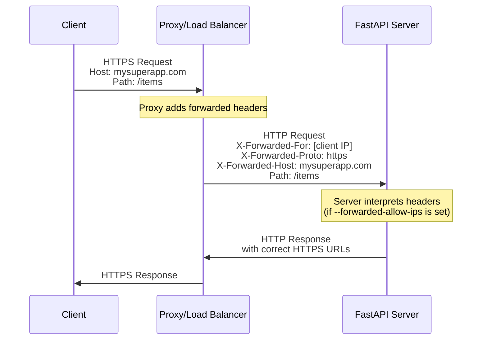
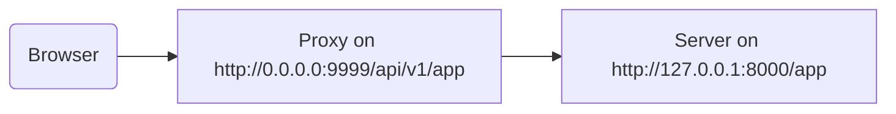

# Proxy کے پیچھے { #behind-a-proxy }

بہت سے حالات میں، آپ اپنی FastAPI ایپ کے سامنے **Traefik** یا **Nginx** جیسا **proxy** استعمال کریں گے۔

یہ proxy HTTPS سرٹیفکیٹ اور دیگر چیزیں ہینڈل کر سکتے ہیں۔

## Proxy Forwarded Headers { #proxy-forwarded-headers }

آپ کی ایپلیکیشن کے سامنے موجود **proxy** عام طور پر requests کو آپ کے **server** تک بھیجنے سے پہلے کچھ headers شامل کرتا ہے تاکہ server کو معلوم ہو کہ request proxy سے **forward** کی گئی ہے، اور اسے اصل (عوامی) URL، domain، اور HTTPS استعمال ہونے وغیرہ کی معلومات مل سکیں۔

**server** پروگرام (مثال کے طور پر **Uvicorn** بذریعہ **FastAPI CLI**) ان headers کو سمجھنے اور پھر وہ معلومات آپ کی ایپلیکیشن کو فراہم کرنے کے قابل ہے۔

لیکن سیکیورٹی کی وجہ سے، چونکہ server کو معلوم نہیں کہ وہ کسی قابل اعتماد proxy کے پیچھے ہے، یہ ان headers کو نہیں پڑھے گا۔

/// note | تکنیکی تفصیلات

proxy headers یہ ہیں:

* [X-Forwarded-For](https://developer.mozilla.org/en-US/docs/Web/HTTP/Reference/Headers/X-Forwarded-For)
* [X-Forwarded-Proto](https://developer.mozilla.org/en-US/docs/Web/HTTP/Reference/Headers/X-Forwarded-Proto)
* [X-Forwarded-Host](https://developer.mozilla.org/en-US/docs/Web/HTTP/Reference/Headers/X-Forwarded-Host)

///

### Proxy Forwarded Headers کو فعال کرنا { #enable-proxy-forwarded-headers }

آپ FastAPI CLI کو *CLI Option* `--forwarded-allow-ips` کے ساتھ شروع کر سکتے ہیں اور ان IP addresses کو پاس کر سکتے ہیں جن پر forwarded headers پڑھنے کے لیے بھروسہ کرنا ہے۔

اگر آپ اسے `--forwarded-allow-ips="*"` پر سیٹ کریں تو یہ تمام آنے والے IPs پر بھروسہ کرے گا۔

اگر آپ کا **server** کسی قابل اعتماد **proxy** کے پیچھے ہے اور صرف proxy ہی اس سے بات کرتا ہے، تو یہ اس **proxy** کے IP کو قبول کر لے گا۔

<div class="termy">

```console
$ fastapi run --forwarded-allow-ips="*"

<span style="color: green;">INFO</span>:     Uvicorn running on http://127.0.0.1:8000 (Press CTRL+C to quit)
```

</div>

### HTTPS کے ساتھ Redirects { #redirects-with-https }

مثال کے طور پر، فرض کریں آپ ایک *path operation* `/items/` بناتے ہیں:

{* ../../docs_src/behind_a_proxy/tutorial001_01_py310.py hl[6] *}

اگر client `/items` پر جانے کی کوشش کرے تو بطور ڈیفالٹ اسے `/items/` کی طرف redirect کیا جائے گا۔

لیکن `--forwarded-allow-ips` *CLI Option* سیٹ کرنے سے پہلے یہ `http://localhost:8000/items/` کی طرف redirect کر سکتا تھا۔

لیکن شاید آپ کی ایپلیکیشن `https://mysuperapp.com` پر ہوسٹ ہے، اور redirect `https://mysuperapp.com/items/` کی طرف ہونا چاہیے۔

`--proxy-headers` سیٹ کرنے کے بعد اب FastAPI درست جگہ پر redirect کر سکے گا۔

```
https://mysuperapp.com/items/
```

/// tip | مشورہ

اگر آپ HTTPS کے بارے میں مزید جاننا چاہتے ہیں تو [HTTPS کے بارے میں](../deployment/https.md) گائیڈ دیکھیں۔

///

### Proxy Forwarded Headers کیسے کام کرتے ہیں { #how-proxy-forwarded-headers-work }

یہاں ایک بصری نمائندگی ہے کہ **proxy** client اور **application server** کے درمیان forwarded headers کیسے شامل کرتا ہے:



**proxy** اصل client request کو روکتا ہے اور خصوصی *forwarded* headers (`X-Forwarded-*`) شامل کرتا ہے اس سے پہلے کہ request **application server** کو بھیجے۔

یہ headers اصل request کی وہ معلومات محفوظ رکھتے ہیں جو بصورت دیگر ضائع ہو جاتیں:

* **X-Forwarded-For**: اصل client کا IP address
* **X-Forwarded-Proto**: اصل protocol (`https`)
* **X-Forwarded-Host**: اصل host (`mysuperapp.com`)

جب **FastAPI CLI** کو `--forwarded-allow-ips` کے ساتھ ترتیب دیا جائے تو یہ ان headers پر بھروسہ کرتا ہے اور انہیں استعمال کرتا ہے، مثلاً redirects میں درست URLs بنانے کے لیے۔

## ہٹائے گئے path prefix والا Proxy { #proxy-with-a-stripped-path-prefix }

آپ کے پاس ایسا proxy ہو سکتا ہے جو آپ کی ایپلیکیشن میں path prefix شامل کرے۔

ان صورتوں میں آپ اپنی ایپلیکیشن کو ترتیب دینے کے لیے `root_path` استعمال کر سکتے ہیں۔

`root_path` ASGI specification کی فراہم کردہ ایک مکینزم ہے (جس پر FastAPI بنایا گیا ہے، Starlette کے ذریعے)۔

`root_path` ان مخصوص صورتوں کو ہینڈل کرنے کے لیے استعمال ہوتا ہے۔

اور اسے اندرونی طور پر sub-applications mount کرتے وقت بھی استعمال کیا جاتا ہے۔

ہٹائے گئے path prefix والے proxy کا مطلب ہے کہ آپ اپنے کوڈ میں `/app` پر path بیان کر سکتے ہیں، لیکن پھر آپ اوپر ایک تہہ شامل کرتے ہیں (proxy) جو آپ کی **FastAPI** ایپلیکیشن کو `/api/v1` جیسے path کے نیچے رکھے گا۔

اس صورت میں، اصل path `/app` دراصل `/api/v1/app` پر serve ہوگا۔

خواہ آپ کا سارا کوڈ یہ سمجھ کر لکھا گیا ہو کہ صرف `/app` ہے۔

{* ../../docs_src/behind_a_proxy/tutorial001_py310.py hl[6] *}

اور proxy request کو app server (شاید Uvicorn بذریعہ FastAPI CLI) تک بھیجنے سے پہلے **"path prefix کو ہٹا"** رہا ہوگا، تاکہ آپ کی ایپلیکیشن یہ سمجھے کہ وہ `/app` پر serve ہو رہی ہے، اور آپ کو اپنے تمام کوڈ میں `/api/v1` prefix شامل کرنے کی ضرورت نہ ہو۔

یہاں تک سب کچھ عام طور پر کام کرے گا۔

لیکن پھر، جب آپ integrated docs UI (frontend) کھولیں گے، تو وہ OpenAPI schema `/openapi.json` سے لینے کی کوشش کرے گا، `/api/v1/openapi.json` سے نہیں۔

تو، frontend (جو browser میں چلتا ہے) `/openapi.json` تک پہنچنے کی کوشش کرے گا اور OpenAPI schema نہیں مل پائے گا۔

چونکہ ہمارے پاس ایپ کے لیے `/api/v1` path prefix والا proxy ہے، frontend کو OpenAPI schema `/api/v1/openapi.json` سے لینا ہوگا۔



/// tip | مشورہ

IP `0.0.0.0` عام طور پر اس بات کی نشاندہی کرتا ہے کہ پروگرام اس مشین/server پر دستیاب تمام IPs پر سنتا ہے۔

///

docs UI کو یہ بھی ضرورت ہوگی کہ OpenAPI schema یہ بتائے کہ یہ API `server` `/api/v1` پر واقع ہے (proxy کے پیچھے)۔ مثال کے طور پر:

```JSON hl_lines="4-8"
{
    "openapi": "3.1.0",
    // More stuff here
    "servers": [
        {
            "url": "/api/v1"
        }
    ],
    "paths": {
            // More stuff here
    }
}
```

اس مثال میں، "Proxy" کچھ **Traefik** جیسا ہو سکتا ہے۔ اور server کچھ FastAPI CLI بمع **Uvicorn** جیسا ہو سکتا ہے، جو آپ کی FastAPI ایپلیکیشن چلا رہا ہو۔

### `root_path` فراہم کرنا { #providing-the-root-path }

یہ حاصل کرنے کے لیے، آپ command line option `--root-path` اس طرح استعمال کر سکتے ہیں:

<div class="termy">

```console
$ fastapi run main.py --forwarded-allow-ips="*" --root-path /api/v1

<span style="color: green;">INFO</span>:     Uvicorn running on http://127.0.0.1:8000 (Press CTRL+C to quit)
```

</div>

اگر آپ Hypercorn استعمال کرتے ہیں تو اس میں بھی `--root-path` آپشن ہے۔

/// note | تکنیکی تفصیلات

ASGI specification اس استعمال کے لیے `root_path` بیان کرتا ہے۔

اور `--root-path` command line option وہ `root_path` فراہم کرتا ہے۔

///

### موجودہ `root_path` چیک کرنا { #checking-the-current-root-path }

آپ ہر request کے لیے اپنی ایپلیکیشن کا استعمال شدہ موجودہ `root_path` حاصل کر سکتے ہیں، یہ `scope` dictionary کا حصہ ہے (جو ASGI spec کا حصہ ہے)۔

یہاں ہم اسے صرف مظاہرے کے مقاصد کے لیے پیغام میں شامل کر رہے ہیں۔

{* ../../docs_src/behind_a_proxy/tutorial001_py310.py hl[8] *}

پھر، اگر آپ Uvicorn اس طرح شروع کریں:

<div class="termy">

```console
$ fastapi run main.py --forwarded-allow-ips="*" --root-path /api/v1

<span style="color: green;">INFO</span>:     Uvicorn running on http://127.0.0.1:8000 (Press CTRL+C to quit)
```

</div>

response کچھ اس طرح ہوگا:

```JSON
{
    "message": "Hello World",
    "root_path": "/api/v1"
}
```

### FastAPI ایپ میں `root_path` سیٹ کرنا { #setting-the-root-path-in-the-fastapi-app }

متبادل طور پر، اگر آپ کے پاس `--root-path` جیسا command line option فراہم کرنے کا کوئی طریقہ نہیں ہے، تو آپ اپنی FastAPI ایپ بناتے وقت `root_path` parameter سیٹ کر سکتے ہیں:

{* ../../docs_src/behind_a_proxy/tutorial002_py310.py hl[3] *}

`FastAPI` کو `root_path` پاس کرنا Uvicorn یا Hypercorn کو `--root-path` command line option پاس کرنے کے برابر ہے۔

### `root_path` کے بارے میں { #about-root-path }

یاد رکھیں کہ server (Uvicorn) اس `root_path` کو ایپ کو پاس کرنے کے علاوہ کسی اور چیز کے لیے استعمال نہیں کرے گا۔

لیکن اگر آپ اپنے browser سے [http://127.0.0.1:8000/app](http://127.0.0.1:8000/app) پر جائیں تو آپ کو عام response نظر آئے گا:

```JSON
{
    "message": "Hello World",
    "root_path": "/api/v1"
}
```

تو، یہ `http://127.0.0.1:8000/api/v1/app` پر رسائی کی توقع نہیں رکھے گا۔

Uvicorn توقع رکھے گا کہ proxy، Uvicorn تک `http://127.0.0.1:8000/app` پر رسائی کرے، اور پھر اوپر اضافی `/api/v1` prefix شامل کرنا proxy کی ذمہ داری ہوگی۔

## ہٹائے گئے path prefix والے proxy کے بارے میں { #about-proxies-with-a-stripped-path-prefix }

یاد رکھیں کہ ہٹائے گئے path prefix والا proxy اسے ترتیب دینے کے طریقوں میں سے صرف ایک ہے۔

شاید بہت سے معاملات میں ڈیفالٹ یہ ہوگا کہ proxy کے پاس ہٹایا گیا path prefix نہیں ہوگا۔

ایسی صورت میں (بغیر ہٹائے گئے path prefix کے)، proxy کچھ ایسے `https://myawesomeapp.com` پر سنے گا، اور پھر اگر browser `https://myawesomeapp.com/api/v1/app` پر جائے اور آپ کا server (مثلاً Uvicorn) `http://127.0.0.1:8000` پر سنتا ہو تو proxy (بغیر ہٹائے گئے path prefix کے) Uvicorn تک اسی path پر رسائی کرے گا: `http://127.0.0.1:8000/api/v1/app`۔

## Traefik کے ساتھ مقامی جانچ { #testing-locally-with-traefik }

آپ [Traefik](https://docs.traefik.io/) استعمال کرتے ہوئے ہٹائے گئے path prefix کے ساتھ آسانی سے مقامی طور پر تجربہ کر سکتے ہیں۔

[Traefik ڈاؤن لوڈ کریں](https://github.com/containous/traefik/releases)، یہ ایک واحد binary ہے، آپ compressed فائل نکال کر اسے براہ راست terminal سے چلا سکتے ہیں۔

پھر ایک فائل `traefik.toml` بنائیں جس میں یہ ہو:

```TOML hl_lines="3"
[entryPoints]
  [entryPoints.http]
    address = ":9999"

[providers]
  [providers.file]
    filename = "routes.toml"
```

یہ Traefik کو بتاتا ہے کہ port 9999 پر سنے اور ایک اور فائل `routes.toml` استعمال کرے۔

/// tip | مشورہ

ہم معیاری HTTP port 80 کی بجائے port 9999 استعمال کر رہے ہیں تاکہ آپ کو اسے admin (`sudo`) مراعات کے ساتھ چلانے کی ضرورت نہ ہو۔

///

اب وہ دوسری فائل `routes.toml` بنائیں:

```TOML hl_lines="5  12  20"
[http]
  [http.middlewares]

    [http.middlewares.api-stripprefix.stripPrefix]
      prefixes = ["/api/v1"]

  [http.routers]

    [http.routers.app-http]
      entryPoints = ["http"]
      service = "app"
      rule = "PathPrefix(`/api/v1`)"
      middlewares = ["api-stripprefix"]

  [http.services]

    [http.services.app]
      [http.services.app.loadBalancer]
        [[http.services.app.loadBalancer.servers]]
          url = "http://127.0.0.1:8000"
```

یہ فائل Traefik کو path prefix `/api/v1` استعمال کرنے کے لیے ترتیب دیتی ہے۔

اور پھر Traefik اپنی requests `http://127.0.0.1:8000` پر چلنے والے آپ کے Uvicorn کو redirect کرے گا۔

اب Traefik شروع کریں:

<div class="termy">

```console
$ ./traefik --configFile=traefik.toml

INFO[0000] Configuration loaded from file: /home/user/awesomeapi/traefik.toml
```

</div>

اور اب `--root-path` آپشن کے ساتھ اپنی ایپ شروع کریں:

<div class="termy">

```console
$ fastapi run main.py --forwarded-allow-ips="*" --root-path /api/v1

<span style="color: green;">INFO</span>:     Uvicorn running on http://127.0.0.1:8000 (Press CTRL+C to quit)
```

</div>

### Responses چیک کریں { #check-the-responses }

اب، اگر آپ Uvicorn کے port والے URL پر جائیں: [http://127.0.0.1:8000/app](http://127.0.0.1:8000/app)، تو آپ کو عام response نظر آئے گا:

```JSON
{
    "message": "Hello World",
    "root_path": "/api/v1"
}
```

/// tip | مشورہ

غور کریں کہ باوجود اس کے کہ آپ `http://127.0.0.1:8000/app` پر رسائی کر رہے ہیں، یہ `/api/v1` کا `root_path` دکھاتا ہے، جو `--root-path` آپشن سے لیا گیا ہے۔

///

اور اب path prefix سمیت Traefik کے port والا URL کھولیں: [http://127.0.0.1:9999/api/v1/app](http://127.0.0.1:9999/api/v1/app)۔

ہمیں وہی response ملتا ہے:

```JSON
{
    "message": "Hello World",
    "root_path": "/api/v1"
}
```

لیکن اس بار proxy کے فراہم کردہ prefix path والے URL پر: `/api/v1`۔

ظاہر ہے، یہاں خیال یہ ہے کہ ہر کوئی ایپ تک proxy کے ذریعے رسائی کرے، تو path prefix `/api/v1` والا ورژن "درست" ہے۔

اور بغیر path prefix کا ورژن (`http://127.0.0.1:8000/app`)، جو Uvicorn براہ راست فراہم کرتا ہے، خصوصی طور پر _proxy_ (Traefik) کے لیے ہے تاکہ وہ اس تک رسائی کرے۔

یہ ظاہر کرتا ہے کہ Proxy (Traefik) path prefix کیسے استعمال کرتا ہے اور server (Uvicorn) `--root-path` آپشن سے `root_path` کیسے استعمال کرتا ہے۔

### Docs UI چیک کریں { #check-the-docs-ui }

لیکن یہاں دلچسپ حصہ ہے۔

ایپ تک رسائی کا "سرکاری" طریقہ اس path prefix والے proxy کے ذریعے ہے جو ہم نے بیان کیا۔ تو، جیسا کہ ہم توقع کریں گے، اگر آپ Uvicorn کے براہ راست فراہم کردہ docs UI کو آزمائیں، بغیر URL میں path prefix کے، تو یہ کام نہیں کرے گا، کیونکہ اسے proxy کے ذریعے رسائی کی توقع ہے۔

آپ اسے [http://127.0.0.1:8000/docs](http://127.0.0.1:8000/docs) پر چیک کر سکتے ہیں:


لیکن اگر ہم "سرکاری" URL سے proxy کے ذریعے port `9999` پر docs UI رسائی کریں، `/api/v1/docs` پر، تو یہ درست طریقے سے کام کرتا ہے!

آپ اسے [http://127.0.0.1:9999/api/v1/docs](http://127.0.0.1:9999/api/v1/docs) پر چیک کر سکتے ہیں:


بالکل جیسا ہم چاہتے تھے۔

اس کی وجہ یہ ہے کہ FastAPI اس `root_path` کو استعمال کرکے OpenAPI میں `root_path` کے فراہم کردہ URL کے ساتھ ڈیفالٹ `server` بناتا ہے۔

## اضافی servers { #additional-servers }

/// warning | انتباہ

یہ ایک زیادہ ایڈوانسڈ استعمال ہے۔ اسے چھوڑ دینے میں کوئی حرج نہیں۔

///

بطور ڈیفالٹ، **FastAPI** OpenAPI schema میں `root_path` کے URL کے ساتھ ایک `server` بنائے گا۔

لیکن آپ دیگر متبادل `servers` بھی فراہم کر سکتے ہیں، مثال کے طور پر اگر آپ چاہتے ہیں کہ *وہی* docs UI staging اور production دونوں ماحول کے ساتھ بات چیت کرے۔

اگر آپ `servers` کی حسب ضرورت فہرست پاس کریں اور `root_path` موجود ہو (کیونکہ آپ کا API proxy کے پیچھے ہے)، تو **FastAPI** فہرست کے شروع میں اس `root_path` کے ساتھ ایک "server" داخل کرے گا۔

مثال کے طور پر:

{* ../../docs_src/behind_a_proxy/tutorial003_py310.py hl[4:7] *}

یہ اس طرح کا OpenAPI schema بنائے گا:

```JSON hl_lines="5-7"
{
    "openapi": "3.1.0",
    // More stuff here
    "servers": [
        {
            "url": "/api/v1"
        },
        {
            "url": "https://stag.example.com",
            "description": "Staging environment"
        },
        {
            "url": "https://prod.example.com",
            "description": "Production environment"
        }
    ],
    "paths": {
            // More stuff here
    }
}
```

/// tip | مشورہ

غور کریں خود بخود بنایا گیا server جس کی `url` ویلیو `/api/v1` ہے، جو `root_path` سے لی گئی ہے۔

///

[http://127.0.0.1:9999/api/v1/docs](http://127.0.0.1:9999/api/v1/docs) پر docs UI میں یہ اس طرح نظر آئے گا:


/// tip | مشورہ

docs UI اس server کے ساتھ بات چیت کرے گا جسے آپ منتخب کریں۔

///

/// note | تکنیکی تفصیلات

OpenAPI specification میں `servers` خاصیت اختیاری ہے۔

اگر آپ `servers` parameter بیان نہ کریں اور `root_path` `/` کے برابر ہو، تو بنائے گئے OpenAPI schema میں `servers` خاصیت مکمل طور پر چھوڑ دی جائے گی، جو بطور ڈیفالٹ `url` ویلیو `/` والے ایک واحد server کے برابر ہے۔

///

### `root_path` سے خودکار server غیر فعال کرنا { #disable-automatic-server-from-root-path }

اگر آپ نہیں چاہتے کہ **FastAPI** `root_path` استعمال کرتے ہوئے خودکار server شامل کرے، تو آپ `root_path_in_servers=False` parameter استعمال کر سکتے ہیں:

{* ../../docs_src/behind_a_proxy/tutorial004_py310.py hl[9] *}

اور پھر اسے OpenAPI schema میں شامل نہیں کیا جائے گا۔

## Sub-application mount کرنا { #mounting-a-sub-application }

اگر آپ کو sub-application mount کرنی ہو (جیسا کہ [Sub Applications - Mounts](sub-applications.md) میں بیان ہے) جبکہ `root_path` کے ساتھ proxy بھی استعمال ہو رہا ہو، تو آپ اسے عام طور پر کر سکتے ہیں، جیسا کہ آپ توقع کریں گے۔

FastAPI اندرونی طور پر `root_path` کو سمجھداری سے استعمال کرے گا، تو یہ بس کام کر جائے گا۔
