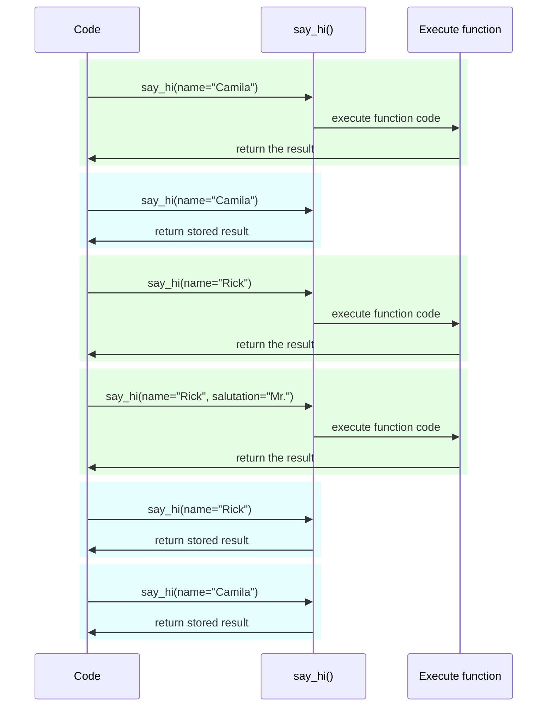

# Settings اور Environment Variables { #settings-and-environment-variables }

بہت سے معاملات میں آپ کی ایپلیکیشن کو کچھ بیرونی settings یا configurations کی ضرورت ہو سکتی ہے، مثال کے طور پر خفیہ کلیدیں، database credentials، ای میل سروسز کے credentials وغیرہ۔

ان میں سے زیادہ تر settings متغیر ہیں (تبدیل ہو سکتی ہیں)، جیسے database URLs۔ اور بہت سی حساس ہو سکتی ہیں، جیسے خفیہ معلومات۔

اسی لیے انہیں environment variables میں فراہم کرنا عام ہے جنہیں ایپلیکیشن پڑھتی ہے۔

/// tip | مشورہ

Environment variables کو سمجھنے کے لیے آپ [Environment Variables](../environment-variables.md) پڑھ سکتے ہیں۔

///

## اقسام اور validation { #types-and-validation }

یہ environment variables صرف text strings ہینڈل کر سکتے ہیں، کیونکہ یہ Python سے باہر ہیں اور دوسرے پروگراموں اور باقی سسٹم (اور مختلف آپریٹنگ سسٹمز، جیسے Linux، Windows، macOS) کے ساتھ مطابقت رکھنی ہوتی ہے۔

اس کا مطلب ہے کہ Python میں environment variable سے پڑھی گئی ہر قدر `str` ہوگی، اور کسی مختلف قسم میں تبدیلی یا کوئی validation کوڈ میں کرنی ہوگی۔

## Pydantic `Settings` { #pydantic-settings }

خوش قسمتی سے، Pydantic environment variables سے آنے والی ان settings کو ہینڈل کرنے کے لیے ایک بہترین utility فراہم کرتا ہے [Pydantic: Settings management](https://docs.pydantic.dev/latest/concepts/pydantic_settings/) کے ساتھ۔

### `pydantic-settings` انسٹال کریں { #install-pydantic-settings }

سب سے پہلے، یقینی بنائیں کہ آپ اپنا [virtual environment](../virtual-environments.md) بنائیں، اسے فعال کریں، اور پھر `pydantic-settings` پیکیج انسٹال کریں:

<div class="termy">

```console
$ pip install pydantic-settings
---> 100%
```

</div>

یہ `all` extras انسٹال کرنے پر بھی شامل ہوتا ہے:

<div class="termy">

```console
$ pip install "fastapi[all]"
---> 100%
```

</div>

### `Settings` آبجیکٹ بنائیں { #create-the-settings-object }

Pydantic سے `BaseSettings` import کریں اور ایک sub-class بنائیں، بالکل Pydantic model کی طرح۔

Pydantic models کی طرح ہی، آپ type annotations اور ممکنہ ڈیفالٹ اقدار کے ساتھ class attributes بیان کرتے ہیں۔

آپ وہ تمام validation خصوصیات اور ٹولز استعمال کر سکتے ہیں جو آپ Pydantic models کے لیے استعمال کرتے ہیں، جیسے مختلف data اقسام اور `Field()` کے ساتھ اضافی validations۔

{* ../../docs_src/settings/tutorial001_py310.py hl[2,5:8,11] *}

/// tip | مشورہ

اگر آپ کاپی اور پیسٹ کے لیے کچھ فوری چاہتے ہیں تو یہ مثال استعمال نہ کریں، نیچے آخری مثال استعمال کریں۔

///

پھر، جب آپ اس `Settings` class کی instance بنائیں گے (اس صورت میں، `settings` آبجیکٹ میں)، Pydantic environment variables کو case-insensitive طریقے سے پڑھے گا، تو بڑے حروف والا variable `APP_NAME` بھی attribute `app_name` کے لیے پڑھا جائے گا۔

اس کے بعد یہ ڈیٹا تبدیل اور validate کرے گا۔ تو، جب آپ وہ `settings` آبجیکٹ استعمال کریں گے، آپ کو بیان کردہ اقسام کا ڈیٹا ملے گا (مثلاً `items_per_user` ایک `int` ہوگا)۔

### `settings` استعمال کریں { #use-the-settings }

پھر آپ نیا `settings` آبجیکٹ اپنی ایپلیکیشن میں استعمال کر سکتے ہیں:

{* ../../docs_src/settings/tutorial001_py310.py hl[18:20] *}

### Server چلائیں { #run-the-server }

اس کے بعد، آپ configurations کو environment variables کے طور پر پاس کرتے ہوئے server چلائیں گے، مثال کے طور پر آپ `ADMIN_EMAIL` اور `APP_NAME` اس طرح سیٹ کر سکتے ہیں:

<div class="termy">

```console
$ ADMIN_EMAIL="deadpool@example.com" APP_NAME="ChimichangApp" fastapi run main.py

<span style="color: green;">INFO</span>:     Uvicorn running on http://127.0.0.1:8000 (Press CTRL+C to quit)
```

</div>

/// tip | مشورہ

ایک کمانڈ کے لیے متعدد env vars سیٹ کرنے کے لیے انہیں space سے الگ کریں، اور سب کو کمانڈ سے پہلے رکھیں۔

///

اور پھر `admin_email` setting `"deadpool@example.com"` پر سیٹ ہو جائے گی۔

`app_name` `"ChimichangApp"` ہوگا۔

اور `items_per_user` اپنی ڈیفالٹ قدر `50` پر رہے گا۔

## دوسرے module میں Settings { #settings-in-another-module }

آپ ان settings کو دوسری module فائل میں رکھ سکتے ہیں جیسا کہ آپ نے [بڑی ایپلیکیشنز - متعدد فائلیں](../tutorial/bigger-applications.md) میں دیکھا۔

مثال کے طور پر، آپ کے پاس `config.py` فائل ہو سکتی ہے:

{* ../../docs_src/settings/app01_py310/config.py *}

اور پھر اسے `main.py` فائل میں استعمال کریں:

{* ../../docs_src/settings/app01_py310/main.py hl[3,11:13] *}

/// tip | مشورہ

آپ کو `__init__.py` فائل بھی چاہیے ہوگی جیسا کہ آپ نے [بڑی ایپلیکیشنز - متعدد فائلیں](../tutorial/bigger-applications.md) میں دیکھا۔

///

## Dependency میں Settings { #settings-in-a-dependency }

بعض اوقات ہر جگہ `settings` کا global آبجیکٹ رکھنے کی بجائے، dependency سے settings فراہم کرنا مفید ہو سکتا ہے۔

یہ خاص طور پر testing کے دوران مفید ہو سکتا ہے، کیونکہ dependency کو اپنی حسب ضرورت settings کے ساتھ override کرنا بہت آسان ہے۔

### Config فائل { #the-config-file }

پچھلی مثال سے آتے ہوئے، آپ کی `config.py` فائل اس طرح ہو سکتی ہے:

{* ../../docs_src/settings/app02_an_py310/config.py hl[10] *}

غور کریں کہ اب ہم `settings = Settings()` کی ڈیفالٹ instance نہیں بناتے۔

### مرکزی ایپ فائل { #the-main-app-file }

اب ہم ایک dependency بناتے ہیں جو نئی `config.Settings()` واپس کرے۔

{* ../../docs_src/settings/app02_an_py310/main.py hl[6,12:13] *}

/// tip | مشورہ

ہم `@lru_cache` کے بارے میں تھوڑی دیر میں بات کریں گے۔

ابھی کے لیے آپ فرض کر سکتے ہیں کہ `get_settings()` ایک عام function ہے۔

///

اور پھر ہم اسے *path operation function* سے dependency کے طور پر طلب کر سکتے ہیں اور جہاں ضرورت ہو استعمال کر سکتے ہیں۔

{* ../../docs_src/settings/app02_an_py310/main.py hl[17,19:21] *}

### Settings اور testing { #settings-and-testing }

پھر testing کے دوران `get_settings` کے لیے dependency override بنا کر مختلف settings آبجیکٹ فراہم کرنا بہت آسان ہوگا:

{* ../../docs_src/settings/app02_an_py310/test_main.py hl[9:10,13,21] *}

dependency override میں ہم نئی `Settings` آبجیکٹ بناتے وقت `admin_email` کے لیے نئی قدر سیٹ کرتے ہیں، اور پھر وہ نیا آبجیکٹ واپس کرتے ہیں۔

پھر ہم ٹیسٹ کر سکتے ہیں کہ یہ استعمال ہو رہا ہے۔

## `.env` فائل پڑھنا { #reading-a-env-file }

اگر آپ کے پاس بہت سی settings ہیں جو ممکنہ طور پر بہت بدلتی ہیں، شاید مختلف ماحول میں، تو انہیں ایک فائل میں رکھنا اور پھر اسے ایسے پڑھنا مفید ہو سکتا ہے جیسے وہ environment variables ہوں۔

یہ رواج کافی عام ہے اور اس کا نام ہے، یہ environment variables عام طور پر `.env` فائل میں رکھے جاتے ہیں، اور فائل کو "dotenv" کہا جاتا ہے۔

/// tip | مشورہ

نقطے (`.`) سے شروع ہونے والی فائل Unix جیسے سسٹمز، جیسے Linux اور macOS میں ایک پوشیدہ فائل ہوتی ہے۔

لیکن dotenv فائل کا واقعی وہی نام ہونا ضروری نہیں ہے۔

///

Pydantic ایک بیرونی لائبریری استعمال کرتے ہوئے ان قسم کی فائلوں سے پڑھنے کی سپورٹ رکھتا ہے۔ آپ مزید [Pydantic Settings: Dotenv (.env) support](https://docs.pydantic.dev/latest/concepts/pydantic_settings/#dotenv-env-support) میں پڑھ سکتے ہیں۔

/// tip | مشورہ

اس کے کام کرنے کے لیے، آپ کو `pip install python-dotenv` کرنا ہوگا۔

///

### `.env` فائل { #the-env-file }

آپ کے پاس `.env` فائل ہو سکتی ہے جس میں:

```bash
ADMIN_EMAIL="deadpool@example.com"
APP_NAME="ChimichangApp"
```

### `.env` سے settings پڑھیں { #read-settings-from-env }

اور پھر اپنی `config.py` اس طرح اپ ڈیٹ کریں:

{* ../../docs_src/settings/app03_an_py310/config.py hl[9] *}

/// tip | مشورہ

`model_config` attribute صرف Pydantic ترتیب کے لیے استعمال ہوتا ہے۔ آپ مزید [Pydantic: Concepts: Configuration](https://docs.pydantic.dev/latest/concepts/config/) میں پڑھ سکتے ہیں۔

///

یہاں ہم Pydantic `Settings` class کے اندر config `env_file` بیان کرتے ہیں، اور اس dotenv فائل کے filename پر ویلیو سیٹ کرتے ہیں جو ہم استعمال کرنا چاہتے ہیں۔

### `lru_cache` کے ساتھ Settings صرف ایک بار بنائیں { #creating-the-settings-only-once-with-lru-cache }

ڈسک سے فائل پڑھنا عام طور پر مہنگا (سست) عمل ہے، تو آپ شاید یہ صرف ایک بار کرنا چاہیں گے اور پھر وہی settings آبجیکٹ دوبارہ استعمال کریں، ہر request کے لیے پڑھنے کی بجائے۔

لیکن ہر بار جب ہم یہ کریں:

```Python
Settings()
```

نیا `Settings` آبجیکٹ بنے گا، اور بنتے وقت `.env` فائل دوبارہ پڑھے گا۔

اگر dependency function صرف اس طرح ہوتا:

```Python
def get_settings():
    return Settings()
```

ہم ہر request کے لیے وہ آبجیکٹ بنائیں گے، اور ہر request کے لیے `.env` فائل پڑھیں گے۔

لیکن چونکہ ہم اوپر `@lru_cache` decorator استعمال کر رہے ہیں، `Settings` آبجیکٹ صرف ایک بار بنے گا، پہلی بار جب اسے بلایا جائے۔

{* ../../docs_src/settings/app03_an_py310/main.py hl[1,11] *}

پھر `get_settings()` کی اگلی requests کے لیے dependencies میں ہونے والی کسی بھی بعد کی کال کے لیے، `get_settings()` کا اندرونی کوڈ عمل میں لانے اور نیا `Settings` آبجیکٹ بنانے کی بجائے، یہ وہی آبجیکٹ واپس کرے گا جو پہلی بار واپس کیا گیا تھا، بار بار۔

#### `lru_cache` تکنیکی تفصیلات { #lru-cache-technical-details }

`@lru_cache` اس function کو modify کرتا ہے جسے decorate کرتا ہے تاکہ وہی قدر واپس کرے جو پہلی بار واپس کی گئی تھی، function کا کوڈ ہر بار دوبارہ عمل میں لانے کی بجائے۔

تو، اس کے نیچے والا function arguments کے ہر مجموعے کے لیے ایک بار عمل میں آئے گا۔ اور پھر ان مجموعوں سے واپس آنے والی اقدار بار بار استعمال ہوں گی جب بھی function کو بالکل وہی مجموعہ arguments کے ساتھ بلایا جائے۔

مثال کے طور پر، اگر آپ کے پاس یہ function ہو:

```Python
@lru_cache
def say_hi(name: str, salutation: str = "Ms."):
    return f"Hello {salutation} {name}"
```

آپ کا پروگرام اس طرح عمل کر سکتا ہے:



ہماری dependency `get_settings()` کی صورت میں، function کوئی arguments بھی نہیں لیتا، تو یہ ہمیشہ وہی قدر واپس کرتا ہے۔

اس طریقے سے، یہ تقریباً ایسے ہی برتاؤ کرتا ہے جیسے یہ صرف ایک global variable ہو۔ لیکن چونکہ یہ dependency function استعمال کرتا ہے، تو ہم اسے testing کے لیے آسانی سے override کر سکتے ہیں۔

`@lru_cache` Python کے standard library کے `functools` کا حصہ ہے، آپ اس کے بارے میں مزید [`@lru_cache` کی Python دستاویزات](https://docs.python.org/3/library/functools.html#functools.lru_cache) میں پڑھ سکتے ہیں۔

## خلاصہ { #recap }

آپ Pydantic Settings استعمال کر کے اپنی ایپلیکیشن کی settings یا configurations کو ہینڈل کر سکتے ہیں، Pydantic models کی تمام طاقت کے ساتھ۔

* Dependency استعمال کر کے آپ testing آسان بنا سکتے ہیں۔
* آپ اس کے ساتھ `.env` فائلیں استعمال کر سکتے ہیں۔
* `@lru_cache` استعمال کر کے آپ dotenv فائل کو ہر request کے لیے بار بار پڑھنے سے بچ سکتے ہیں، جبکہ testing کے دوران اسے override کرنے کی سہولت بھی رہتی ہے۔
