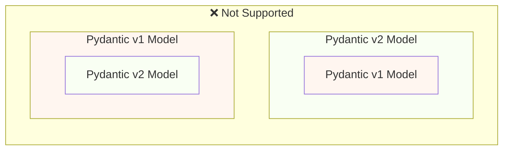
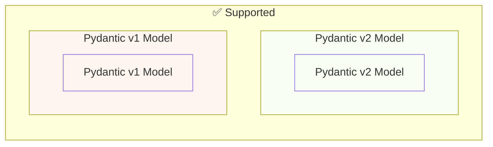

# Pydantic v1 سے Pydantic v2 میں منتقلی { #migrate-from-pydantic-v1-to-pydantic-v2 }

اگر آپ کے پاس پرانی FastAPI app ہے، تو آپ شاید Pydantic ورژن 1 استعمال کر رہے ہوں۔

FastAPI ورژن 0.100.0 میں Pydantic v1 یا v2 دونوں کی سپورٹ تھی۔ یہ جو بھی آپ نے install کیا ہوتا اسے استعمال کرتا۔

FastAPI ورژن 0.119.0 نے Pydantic v2 کے اندر سے Pydantic v1 کی جزوی سپورٹ (`pydantic.v1` کے طور پر) متعارف کرائی، تاکہ v2 میں منتقلی آسان ہو۔

FastAPI 0.126.0 نے Pydantic v1 کی سپورٹ ختم کر دی، جبکہ تھوڑی دیر کے لیے `pydantic.v1` کی سپورٹ جاری رکھی۔

/// warning | انتباہ

Pydantic ٹیم نے Python کے تازہ ترین ورژنز کے لیے Pydantic v1 کی سپورٹ بند کر دی ہے، **Python 3.14** سے شروع کرتے ہوئے۔

اس میں `pydantic.v1` بھی شامل ہے، جو Python 3.14 اور اس سے اوپر میں مزید سپورٹ نہیں ہے۔

اگر آپ Python کی تازہ ترین خصوصیات استعمال کرنا چاہتے ہیں، تو آپ کو یقینی بنانا ہوگا کہ آپ Pydantic v2 استعمال کریں۔

///

اگر آپ کے پاس Pydantic v1 والی پرانی FastAPI app ہے، تو یہاں میں آپ کو دکھاؤں گا کہ اسے Pydantic v2 میں کیسے منتقل کیا جائے، اور **FastAPI 0.119.0 کی خصوصیات** جو بتدریج منتقلی میں مدد کرتی ہیں۔

## سرکاری رہنما { #official-guide }

Pydantic کے پاس v1 سے v2 میں منتقلی کی سرکاری [Migration Guide](https://docs.pydantic.dev/latest/migration/) ہے۔

اس میں یہ بھی شامل ہے کہ کیا تبدیل ہوا ہے، validations اب کیسے زیادہ درست اور سخت ہیں، ممکنہ خدشات وغیرہ۔

آپ اسے پڑھ کر بہتر سمجھ سکتے ہیں کہ کیا تبدیل ہوا ہے۔

## Tests { #tests }

یقینی بنائیں کہ آپ کی app کے لیے [tests](../tutorial/testing.md) ہیں اور آپ انہیں continuous integration (CI) پر چلاتے ہیں۔

اس طرح، آپ اپ گریڈ کر سکتے ہیں اور یقینی بنا سکتے ہیں کہ سب کچھ توقع کے مطابق کام کر رہا ہے۔

## `bump-pydantic` { #bump-pydantic }

بہت سی صورتوں میں، جب آپ بغیر customizations کے عام Pydantic models استعمال کرتے ہیں، تو آپ Pydantic v1 سے Pydantic v2 میں منتقلی کے زیادہ تر عمل کو خودکار بنا سکتے ہیں۔

آپ Pydantic ٹیم کا [`bump-pydantic`](https://github.com/pydantic/bump-pydantic) استعمال کر سکتے ہیں۔

یہ ٹول زیادہ تر کوڈ کو خود بخود تبدیل کرنے میں مدد کرے گا جسے تبدیل کرنے کی ضرورت ہے۔

اس کے بعد، آپ tests چلا سکتے ہیں اور جانچ سکتے ہیں کہ سب کچھ کام کرتا ہے۔ اگر کرتا ہے، تو آپ کا کام ہو گیا۔ 😎

## Pydantic v2 میں Pydantic v1 { #pydantic-v1-in-v2 }

Pydantic v2 میں Pydantic v1 کی ہر چیز بطور submodule `pydantic.v1` شامل ہے۔ لیکن یہ Python 3.13 سے اوپر کے ورژنز میں مزید سپورٹ نہیں ہے۔

اس کا مطلب ہے کہ آپ Pydantic v2 کا تازہ ترین ورژن install کر سکتے ہیں اور اس submodule سے پرانے Pydantic v1 کے اجزاء import اور استعمال کر سکتے ہیں، جیسے کہ آپ کے پاس پرانا Pydantic v1 install ہو۔

{* ../../docs_src/pydantic_v1_in_v2/tutorial001_an_py310.py hl[1,4] *}

### Pydantic v2 میں Pydantic v1 کے لیے FastAPI سپورٹ { #fastapi-support-for-pydantic-v1-in-v2 }

FastAPI 0.119.0 سے، Pydantic v2 کے اندر سے Pydantic v1 کی جزوی سپورٹ بھی ہے، تاکہ v2 میں منتقلی آسان ہو۔

لہذا، آپ Pydantic کو تازہ ترین ورژن 2 میں اپ گریڈ کر سکتے ہیں، اور `pydantic.v1` submodule استعمال کرنے کے لیے imports تبدیل کر سکتے ہیں، اور بہت سی صورتوں میں یہ بس کام کر جائے گا۔

{* ../../docs_src/pydantic_v1_in_v2/tutorial002_an_py310.py hl[2,5,15] *}

/// warning | انتباہ

ذہن میں رکھیں کہ چونکہ Pydantic ٹیم Python کے حالیہ ورژنز میں Pydantic v1 کو مزید سپورٹ نہیں کرتی، Python 3.14 سے شروع کرتے ہوئے، `pydantic.v1` کا استعمال بھی Python 3.14 اور اس سے اوپر میں سپورٹ نہیں ہے۔

///

### ایک ہی app میں Pydantic v1 اور v2 { #pydantic-v1-and-v2-on-the-same-app }

Pydantic کی طرف سے یہ **سپورٹ نہیں** ہے کہ Pydantic v2 کے model کے اپنے fields بطور Pydantic v1 models defined ہوں یا اس کے برعکس۔

...لیکن، آپ ایک ہی app میں الگ الگ models میں Pydantic v1 اور v2 استعمال کر سکتے ہیں۔

بعض صورتوں میں، آپ کی FastAPI app میں ایک ہی **path operation** میں Pydantic v1 اور v2 دونوں models رکھنا بھی ممکن ہے:

{* ../../docs_src/pydantic_v1_in_v2/tutorial003_an_py310.py hl[2:3,6,12,21:22] *}

اوپر دی گئی اس مثال میں، input model ایک Pydantic v1 model ہے، اور output model (`response_model=ItemV2` میں defined) ایک Pydantic v2 model ہے۔

### Pydantic v1 parameters { #pydantic-v1-parameters }

اگر آپ کو Pydantic v1 models کے ساتھ FastAPI کے مخصوص ٹولز جیسے `Body`، `Query`، `Form` وغیرہ استعمال کرنے کی ضرورت ہے، تو آپ Pydantic v2 میں منتقلی مکمل ہونے تک انہیں `fastapi.temp_pydantic_v1_params` سے import کر سکتے ہیں:

{* ../../docs_src/pydantic_v1_in_v2/tutorial004_an_py310.py hl[4,18] *}

### مراحل میں منتقلی { #migrate-in-steps }

/// tip | مشورہ

پہلے `bump-pydantic` آزمائیں، اگر آپ کے tests پاس ہو جائیں اور یہ کام کر جائے، تو آپ کا کام ایک command میں ہو گیا۔ ✨

///

اگر `bump-pydantic` آپ کے استعمال کے لیے کام نہیں کرتا، تو آپ ایک ہی app میں Pydantic v1 اور v2 دونوں models کی سپورٹ استعمال کر کے بتدریج Pydantic v2 میں منتقلی کر سکتے ہیں۔

آپ پہلے Pydantic کو تازہ ترین ورژن 2 میں اپ گریڈ کر سکتے ہیں، اور اپنے تمام models کے لیے `pydantic.v1` استعمال کرنے کے لیے imports تبدیل کر سکتے ہیں۔

پھر، آپ اپنے models کو بتدریج گروپس میں Pydantic v1 سے v2 میں منتقل کرنا شروع کر سکتے ہیں۔ 🚶
