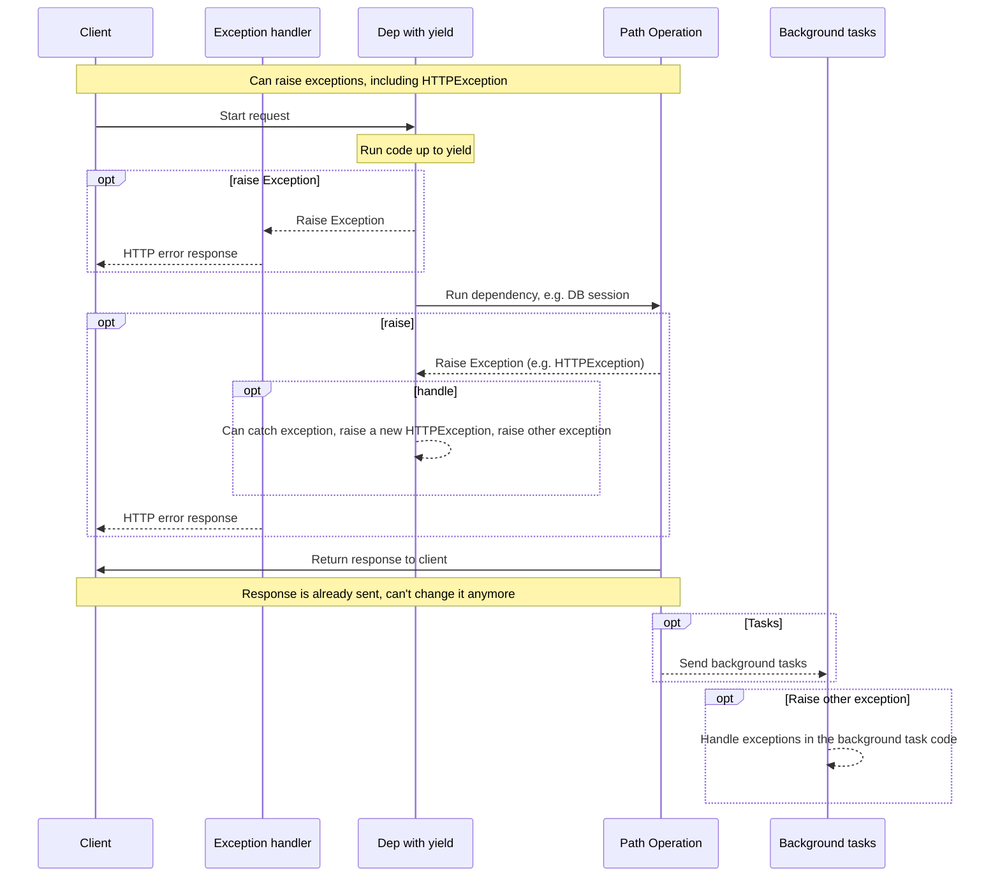
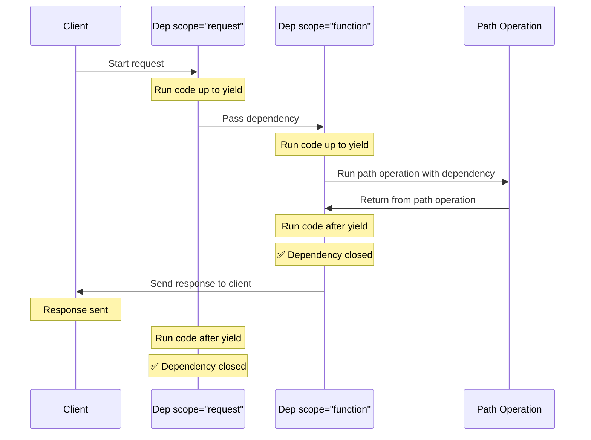

# `yield` والی Dependencies { #dependencies-with-yield }

FastAPI ایسی dependencies کو سپورٹ کرتا ہے جو مکمل ہونے کے بعد کچھ <dfn title='sometimes also called "exit code", "cleanup code", "teardown code", "closing code", "context manager exit code", etc.'>اضافی اقدامات</dfn> کرتی ہیں۔

ایسا کرنے کے لیے، `return` کی بجائے `yield` استعمال کریں، اور اس کے بعد اضافی اقدامات (code) لکھیں۔

/// tip | مشورہ

یقینی بنائیں کہ ہر dependency میں `yield` صرف ایک بار استعمال ہو۔

///

/// note | تکنیکی تفصیلات

کوئی بھی function جو ان کے ساتھ استعمال کے لیے درست ہو:

* [`@contextlib.contextmanager`](https://docs.python.org/3/library/contextlib.html#contextlib.contextmanager) یا
* [`@contextlib.asynccontextmanager`](https://docs.python.org/3/library/contextlib.html#contextlib.asynccontextmanager)

وہ **FastAPI** dependency کے طور پر استعمال کے لیے درست ہوگا۔

دراصل، FastAPI اندرونی طور پر انہی دو decorators کو استعمال کرتا ہے۔

///

## `yield` کے ساتھ Database dependency { #a-database-dependency-with-yield }

مثال کے طور پر، آپ اسے database session بنانے اور مکمل ہونے کے بعد بند کرنے کے لیے استعمال کر سکتے ہیں۔

Response بنانے سے پہلے صرف `yield` statement تک کا code execute ہوتا ہے:

{* ../../docs_src/dependencies/tutorial007_py310.py hl[2:4] *}

yield کی گئی value وہ ہے جو *path operations* اور دیگر dependencies میں inject ہوتی ہے:

{* ../../docs_src/dependencies/tutorial007_py310.py hl[4] *}

`yield` statement کے بعد کا code response کے بعد execute ہوتا ہے:

{* ../../docs_src/dependencies/tutorial007_py310.py hl[5:6] *}

/// tip | مشورہ

آپ `async` یا عام functions استعمال کر سکتے ہیں۔

**FastAPI** ہر ایک کے ساتھ صحیح کام کرے گا، بالکل جیسے عام dependencies کے ساتھ۔

///

## `yield` اور `try` والی dependency { #a-dependency-with-yield-and-try }

اگر آپ `yield` والی dependency میں `try` block استعمال کرتے ہیں، تو dependency استعمال کرتے وقت پھینکی گئی کوئی بھی exception آپ کو ملے گی۔

مثال کے طور پر، اگر درمیان میں کسی مقام پر، کسی دوسری dependency میں یا *path operation* میں، کسی code نے database transaction "rollback" کیا یا کوئی اور exception پیدا کی، تو آپ کو اپنی dependency میں وہ exception ملے گی۔

تو، آپ `except SomeException` کے ذریعے dependency کے اندر اس مخصوص exception کو تلاش کر سکتے ہیں۔

اسی طرح، آپ `finally` استعمال کر سکتے ہیں تاکہ exit کے اقدامات ضرور execute ہوں، چاہے exception ہو یا نہ ہو۔

{* ../../docs_src/dependencies/tutorial007_py310.py hl[3,5] *}

## `yield` والی Sub-dependencies { #sub-dependencies-with-yield }

آپ کے پاس کسی بھی سائز اور شکل کی sub-dependencies اور sub-dependencies کے "درخت" ہو سکتے ہیں، اور ان میں سے کوئی بھی یا سب `yield` استعمال کر سکتی ہیں۔

**FastAPI** یقینی بنائے گا کہ `yield` والی ہر dependency میں "exit code" صحیح ترتیب سے چلے۔

مثال کے طور پر، `dependency_c` کی dependency `dependency_b` پر ہو سکتی ہے، اور `dependency_b` کی `dependency_a` پر:

{* ../../docs_src/dependencies/tutorial008_an_py310.py hl[6,14,22] *}

اور یہ سب `yield` استعمال کر سکتی ہیں۔

اس صورت میں `dependency_c` کو، اپنا exit code execute کرنے کے لیے، `dependency_b` کی value (یہاں `dep_b` نام سے) ابھی بھی دستیاب ہونی چاہیے۔

اور، بالکل اسی طرح، `dependency_b` کو اپنے exit code کے لیے `dependency_a` کی value (یہاں `dep_a` نام سے) دستیاب ہونی چاہیے۔

{* ../../docs_src/dependencies/tutorial008_an_py310.py hl[18:19,26:27] *}

اسی طرح، آپ کے پاس کچھ dependencies `yield` کے ساتھ اور کچھ `return` کے ساتھ ہو سکتی ہیں، اور ان میں سے کچھ دوسروں پر منحصر ہو سکتی ہیں۔

اور آپ کے پاس ایک dependency ہو سکتی ہے جس کو کئی دوسری `yield` والی dependencies کی ضرورت ہو، وغیرہ۔

آپ dependencies کے جو بھی مجموعے چاہیں رکھ سکتے ہیں۔

**FastAPI** یقینی بنائے گا کہ سب کچھ صحیح ترتیب سے چلے۔

/// note | تکنیکی تفصیلات

یہ Python کے [Context Managers](https://docs.python.org/3/library/contextlib.html) کی بدولت کام کرتا ہے۔

**FastAPI** اسے حاصل کرنے کے لیے اندرونی طور پر انہیں استعمال کرتا ہے۔

///

## `yield` اور `HTTPException` والی Dependencies { #dependencies-with-yield-and-httpexception }

آپ نے دیکھا کہ آپ `yield` والی dependencies استعمال کر سکتے ہیں اور `try` blocks رکھ سکتے ہیں جو کچھ code execute کرنے کی کوشش کرتے ہیں اور پھر `finally` کے بعد کچھ exit code چلاتے ہیں۔

آپ `except` بھی استعمال کر سکتے ہیں تاکہ raise ہونے والی exception کو پکڑ سکیں اور اس کے ساتھ کچھ کر سکیں۔

مثال کے طور پر، آپ ایک مختلف exception raise کر سکتے ہیں، جیسے `HTTPException`۔

/// tip | مشورہ

یہ ایک حد تک ایڈوانسڈ تکنیک ہے، اور زیادہ تر صورتوں میں آپ کو واقعی اس کی ضرورت نہیں ہوگی، کیونکہ آپ اپنی باقی ایپلیکیشن code کے اندر سے exceptions (بشمول `HTTPException`) raise کر سکتے ہیں، مثال کے طور پر، *path operation function* میں۔

لیکن اگر آپ کو ضرورت ہو تو یہ آپ کے لیے موجود ہے۔

///

{* ../../docs_src/dependencies/tutorial008b_an_py310.py hl[18:22,31] *}

اگر آپ exceptions پکڑنا چاہتے ہیں اور اس کی بنیاد پر ایک custom response بنانا چاہتے ہیں، تو ایک [Custom Exception Handler](../handling-errors.md#install-custom-exception-handlers) بنائیں۔

## `yield` اور `except` والی Dependencies { #dependencies-with-yield-and-except }

اگر آپ `yield` والی dependency میں `except` استعمال کر کے exception پکڑتے ہیں اور اسے دوبارہ raise نہیں کرتے (یا نئی exception raise نہیں کرتے)، تو FastAPI کو پتا نہیں چلے گا کہ کوئی exception تھی، بالکل ویسے ہی جیسے عام Python میں ہوتا ہے:

{* ../../docs_src/dependencies/tutorial008c_an_py310.py hl[15:16] *}

اس صورت میں، client کو *HTTP 500 Internal Server Error* response نظر آئے گا جیسا کہ ہونا چاہیے، کیونکہ ہم `HTTPException` یا اس جیسی کوئی چیز raise نہیں کر رہے، لیکن server کے پاس **کوئی logs نہیں ہوں گے** یا error کی کوئی اور نشاندہی نہیں ہوگی۔

### `yield` اور `except` والی Dependencies میں ہمیشہ `raise` کریں { #always-raise-in-dependencies-with-yield-and-except }

اگر آپ `yield` والی dependency میں exception پکڑتے ہیں، تو جب تک آپ کوئی اور `HTTPException` یا اس جیسی چیز raise نہیں کر رہے، **آپ کو اصل exception دوبارہ raise کرنی چاہیے**۔

آپ `raise` استعمال کر کے وہی exception دوبارہ raise کر سکتے ہیں:

{* ../../docs_src/dependencies/tutorial008d_an_py310.py hl[17] *}

اب client کو وہی *HTTP 500 Internal Server Error* response ملے گا، لیکن server کے logs میں ہماری custom `InternalError` ہوگی۔

## `yield` والی Dependencies کا عمل { #execution-of-dependencies-with-yield }

عمل کی ترتیب تقریباً اس diagram کی طرح ہے۔ وقت اوپر سے نیچے کی طرف بہتا ہے۔ اور ہر column ان حصوں میں سے ایک ہے جو آپس میں تعامل کر رہے ہیں یا code execute کر رہے ہیں۔



/// info | معلومات

Client کو صرف **ایک response** بھیجا جائے گا۔ یہ error responses میں سے ایک ہو سکتا ہے یا *path operation* سے آنے والا response ہو سکتا ہے۔

ان میں سے ایک response بھیجے جانے کے بعد، کوئی اور response نہیں بھیجا جا سکتا۔

///

/// tip | مشورہ

اگر آپ *path operation function* کے code میں کوئی exception raise کرتے ہیں، تو یہ `yield` والی dependencies کو پاس ہوگی، بشمول `HTTPException`۔ زیادہ تر صورتوں میں آپ وہی exception یا ایک نئی exception `yield` والی dependency سے دوبارہ raise کرنا چاہیں گے تاکہ یقینی ہو کہ اسے صحیح طریقے سے ہینڈل کیا جائے۔

///

## جلد بند ہونا اور `scope` { #early-exit-and-scope }

عام طور پر `yield` والی dependencies کا exit code client کو **response بھیجے جانے کے بعد** execute ہوتا ہے۔

لیکن اگر آپ جانتے ہیں کہ *path operation function* سے واپس آنے کے بعد آپ کو dependency استعمال کرنے کی ضرورت نہیں ہوگی، تو آپ `Depends(scope="function")` استعمال کر سکتے ہیں تاکہ FastAPI کو بتا سکیں کہ *path operation function* واپس آنے کے بعد dependency بند کر دے، لیکن response بھیجنے سے **پہلے**۔

{* ../../docs_src/dependencies/tutorial008e_an_py310.py hl[12,16] *}

`Depends()` ایک `scope` parameter وصول کرتا ہے جو ہو سکتا ہے:

* `"function"`: request handle کرنے والے *path operation function* سے پہلے dependency شروع کریں، *path operation function* ختم ہونے کے بعد dependency ختم کریں، لیکن client کو response واپس بھیجنے سے **پہلے**۔ تو، dependency function *path operation **function*** کے **ارد گرد** execute ہوگا۔
* `"request"`: request handle کرنے والے *path operation function* سے پہلے dependency شروع کریں (`"function"` جیسا ہی)، لیکن client کو response واپس بھیجنے کے **بعد** ختم کریں۔ تو، dependency function **request** اور response cycle کے **ارد گرد** execute ہوگا۔

اگر مخصوص نہ کیا جائے اور dependency میں `yield` ہو، تو بطور default `scope` `"request"` ہوگا۔

### Sub-dependencies کے لیے `scope` { #scope-for-sub-dependencies }

جب آپ `scope="request"` (default) کے ساتھ dependency declare کرتے ہیں، تو کسی بھی sub-dependency کا `scope` بھی `"request"` ہونا ضروری ہے۔

لیکن `"function"` `scope` والی dependency کے پاس `"function"` اور `"request"` دونوں `scope` والی dependencies ہو سکتی ہیں۔

اس کی وجہ یہ ہے کہ ہر dependency کو sub-dependencies سے پہلے اپنا exit code چلانے کے قابل ہونا ضروری ہے، کیونکہ اسے اپنے exit code کے دوران انہیں ابھی بھی استعمال کرنے کی ضرورت ہو سکتی ہے۔



## `yield`، `HTTPException`، `except` اور Background Tasks والی Dependencies { #dependencies-with-yield-httpexception-except-and-background-tasks }

`yield` والی Dependencies وقت کے ساتھ مختلف استعمال کے معاملات کو پورا کرنے اور کچھ مسائل حل کرنے کے لیے ترقی پذیر ہوئی ہیں۔

اگر آپ دیکھنا چاہتے ہیں کہ FastAPI کے مختلف versions میں کیا تبدیل ہوا ہے، تو آپ اس کے بارے میں ایڈوانسڈ گائیڈ میں مزید پڑھ سکتے ہیں، [Advanced Dependencies - `yield`، `HTTPException`، `except` اور Background Tasks والی Dependencies](../../advanced/advanced-dependencies.md#dependencies-with-yield-httpexception-except-and-background-tasks)۔
## Context Managers { #context-managers }

### "Context Managers" کیا ہیں { #what-are-context-managers }

"Context Managers" وہ Python objects ہیں جنہیں آپ `with` statement میں استعمال کر سکتے ہیں۔

مثال کے طور پر، [آپ `with` کو فائل پڑھنے کے لیے استعمال کر سکتے ہیں](https://docs.python.org/3/tutorial/inputoutput.html#reading-and-writing-files):

```Python
with open("./somefile.txt") as f:
    contents = f.read()
    print(contents)
```

اندرونی طور پر، `open("./somefile.txt")` ایک object بناتا ہے جسے "Context Manager" کہتے ہیں۔

جب `with` block ختم ہوتا ہے، تو یہ فائل بند کرنے کو یقینی بناتا ہے، چاہے exceptions ہوں۔

جب آپ `yield` کے ساتھ dependency بناتے ہیں، تو **FastAPI** اندرونی طور پر اس کے لیے ایک context manager بنائے گا، اور اسے دیگر متعلقہ ٹولز کے ساتھ جوڑے گا۔

### `yield` والی dependencies میں context managers استعمال کرنا { #using-context-managers-in-dependencies-with-yield }

/// warning | انتباہ

یہ کم و بیش ایک "ایڈوانسڈ" خیال ہے۔

اگر آپ ابھی **FastAPI** سے شروعات کر رہے ہیں تو آپ فی الحال اسے چھوڑنا چاہ سکتے ہیں۔

///

Python میں، آپ [دو methods والی class بنا کر Context Managers بنا سکتے ہیں: `__enter__()` اور `__exit__()`](https://docs.python.org/3/reference/datamodel.html#context-managers)۔

آپ انہیں **FastAPI** dependencies کے اندر بھی `yield` کے ساتھ استعمال کر سکتے ہیں، dependency function کے اندر `with` یا `async with` statements استعمال کر کے:

{* ../../docs_src/dependencies/tutorial010_py310.py hl[1:9,13] *}

/// tip | مشورہ

Context manager بنانے کا ایک اور طریقہ یہ ہے:

* [`@contextlib.contextmanager`](https://docs.python.org/3/library/contextlib.html#contextlib.contextmanager) یا
* [`@contextlib.asynccontextmanager`](https://docs.python.org/3/library/contextlib.html#contextlib.asynccontextmanager)

ایک واحد `yield` والے function کو decorate کرنے کے لیے استعمال کریں۔

یہی وہ چیز ہے جو **FastAPI** اندرونی طور پر `yield` والی dependencies کے لیے استعمال کرتا ہے۔

لیکن آپ کو FastAPI dependencies کے لیے یہ decorators استعمال کرنے کی ضرورت نہیں ہے (اور نہیں کرنی چاہیے)۔

FastAPI آپ کے لیے یہ اندرونی طور پر کرے گا۔

///
