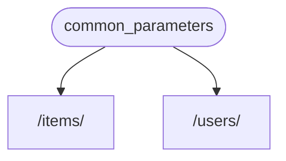
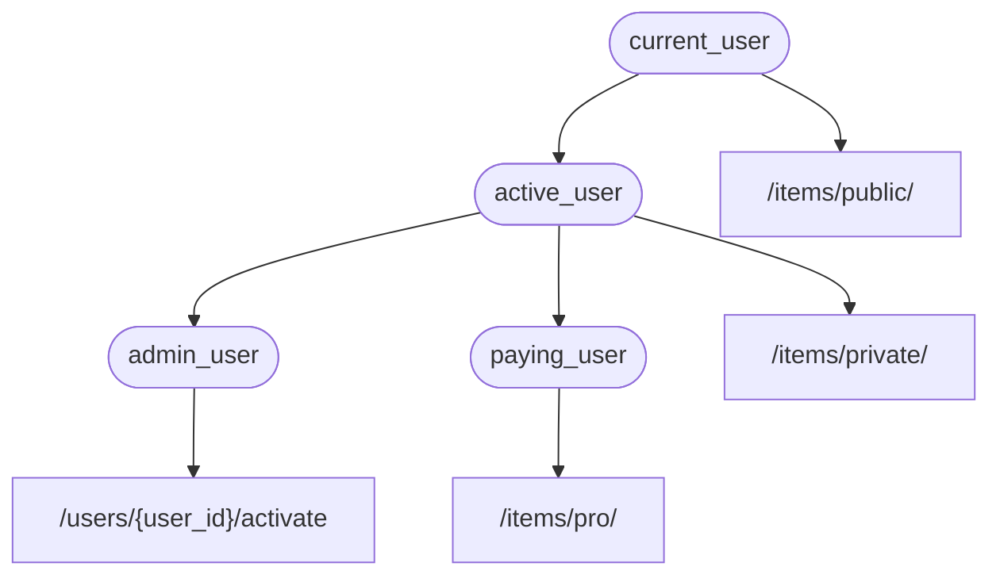

# Dependencies { #dependencies }

**FastAPI** میں ایک بہت طاقتور لیکن آسان **<dfn title="also known as components, resources, providers, services, injectables">Dependency Injection</dfn>** نظام موجود ہے۔

یہ استعمال میں بہت آسان ہونے کے لیے بنایا گیا ہے، اور کسی بھی developer کے لیے دوسرے components کو **FastAPI** کے ساتھ جوڑنا انتہائی سہل بناتا ہے۔

## "Dependency Injection" کیا ہے { #what-is-dependency-injection }

**"Dependency Injection"** کا مطلب، programming میں، یہ ہے کہ آپ کے code (اس صورت میں، آپ کے *path operation functions*) کے پاس یہ اعلان کرنے کا ایک طریقہ ہو کہ اسے کام کرنے کے لیے کن چیزوں کی ضرورت ہے: "dependencies"۔

اور پھر، وہ نظام (اس صورت میں **FastAPI**) آپ کے code کو ان ضروری dependencies فراہم کرنے کا خیال رکھے گا ("inject" کرے گا)۔

یہ بہت مفید ہے جب آپ کو ضرورت ہو:

* مشترکہ logic رکھنا (ایک ہی code logic بار بار)۔
* Database connections شیئر کرنا۔
* Security، authentication، role کے تقاضے نافذ کرنا، وغیرہ۔
* اور بہت سی دوسری چیزیں...

یہ سب کچھ، code کی تکرار کو کم سے کم کرتے ہوئے۔

## پہلے قدم { #first-steps }

آئیے ایک بہت سادی مثال دیکھتے ہیں۔ یہ اتنی سادی ہوگی کہ ابھی بہت مفید نہیں ہوگی۔

لیکن اس طرح ہم اس بات پر توجہ مرکوز کر سکتے ہیں کہ **Dependency Injection** نظام کیسے کام کرتا ہے۔

### ایک dependency، یا "dependable" بنائیں { #create-a-dependency-or-dependable }

آئیے پہلے dependency پر توجہ مرکوز کرتے ہیں۔

یہ صرف ایک function ہے جو وہ تمام parameters لے سکتا ہے جو ایک *path operation function* لے سکتا ہے:

{* ../../docs_src/dependencies/tutorial001_an_py310.py hl[8:9] *}

بس اتنا ہی۔

**2 سطریں**۔

اور اس کی شکل اور ساخت وہی ہے جو آپ کے تمام *path operation functions* کی ہوتی ہے۔

آپ اسے ایک *path operation function* کے طور پر سوچ سکتے ہیں بغیر "decorator" کے (بغیر `@app.get("/some-path")` کے)۔

اور یہ جو بھی آپ چاہیں واپس کر سکتا ہے۔

اس صورت میں، یہ dependency توقع رکھتی ہے:

* ایک اختیاری query parameter `q` جو `str` ہے۔
* ایک اختیاری query parameter `skip` جو `int` ہے، اور بطور default `0` ہے۔
* ایک اختیاری query parameter `limit` جو `int` ہے، اور بطور default `100` ہے۔

اور پھر یہ صرف ان اقدار پر مشتمل ایک `dict` واپس کرتا ہے۔

/// info

FastAPI نے `Annotated` کے لیے سپورٹ version 0.95.0 میں شامل کی (اور اس کی سفارش شروع کی)۔

اگر آپ کے پاس پرانا version ہے، تو `Annotated` استعمال کرتے وقت آپ کو errors آئیں گے۔

`Annotated` استعمال کرنے سے پہلے یقینی بنائیں کہ آپ [FastAPI version کو اپ گریڈ کریں](../../deployment/versions.md#upgrading-the-fastapi-versions) کم از کم 0.95.1 تک۔

///

### `Depends` import کریں { #import-depends }

{* ../../docs_src/dependencies/tutorial001_an_py310.py hl[3] *}

### Dependency کا اعلان کریں، "dependant" میں { #declare-the-dependency-in-the-dependant }

جس طرح آپ اپنے *path operation function* parameters کے ساتھ `Body`، `Query`، وغیرہ استعمال کرتے ہیں، اسی طرح ایک نئے parameter کے ساتھ `Depends` استعمال کریں:

{* ../../docs_src/dependencies/tutorial001_an_py310.py hl[13,18] *}

اگرچہ آپ اپنے function کے parameters میں `Depends` کو اسی طرح استعمال کرتے ہیں جیسے `Body`، `Query`، وغیرہ، `Depends` تھوڑا مختلف طریقے سے کام کرتا ہے۔

آپ `Depends` کو صرف ایک parameter دیتے ہیں۔

یہ parameter کچھ ایسا ہونا چاہیے جیسے function۔

آپ اسے **براہ راست call نہیں کرتے** (آخر میں قوسین نہیں لگاتے)، بلکہ اسے `Depends()` میں بطور parameter پاس کرتے ہیں۔

اور وہ function اسی طرح parameters لیتا ہے جیسے *path operation functions* لیتے ہیں۔

/// tip | مشورہ

آپ اگلے باب میں دیکھیں گے کہ functions کے علاوہ اور کون سی "چیزیں" dependencies کے طور پر استعمال ہو سکتی ہیں۔

///

جب بھی نئی request آتی ہے، **FastAPI** اس کا خیال رکھے گا:

* آپ کے dependency ("dependable") function کو صحیح parameters کے ساتھ call کرنا۔
* آپ کے function سے نتیجہ حاصل کرنا۔
* اس نتیجے کو آپ کے *path operation function* میں parameter کو assign کرنا۔



اس طرح آپ مشترکہ code ایک بار لکھتے ہیں اور **FastAPI** اسے آپ کے *path operations* کے لیے call کرنے کا خیال رکھتا ہے۔

/// check

دھیان دیں کہ آپ کو کوئی خاص class بنانے اور اسے **FastAPI** میں کہیں "register" کرنے یا اس جیسا کچھ کرنے کی ضرورت نہیں ہے۔

آپ بس اسے `Depends` میں پاس کریں اور **FastAPI** باقی سب کرنا جانتا ہے۔

///

## `Annotated` dependencies شیئر کریں { #share-annotated-dependencies }

اوپر کی مثالوں میں، آپ دیکھ سکتے ہیں کہ تھوڑی سی **code تکرار** ہے۔

جب آپ کو `common_parameters()` dependency استعمال کرنی ہو، تو آپ کو type annotation اور `Depends()` کے ساتھ پورا parameter لکھنا پڑتا ہے:

```Python
commons: Annotated[dict, Depends(common_parameters)]
```

لیکن چونکہ ہم `Annotated` استعمال کر رہے ہیں، ہم اس `Annotated` value کو ایک variable میں محفوظ کر سکتے ہیں اور اسے کئی جگہوں پر استعمال کر سکتے ہیں:

{* ../../docs_src/dependencies/tutorial001_02_an_py310.py hl[12,16,21] *}

/// tip | مشورہ

یہ صرف معیاری Python ہے، اسے "type alias" کہتے ہیں، یہ دراصل **FastAPI** کے لیے مخصوص نہیں ہے۔

لیکن چونکہ **FastAPI** Python کے معیارات پر مبنی ہے، بشمول `Annotated`، آپ اپنے code میں یہ ترکیب استعمال کر سکتے ہیں۔

///

Dependencies حسب توقع کام کرتی رہیں گی، اور **سب سے اچھی بات** یہ ہے کہ **type کی معلومات محفوظ رہیں گی**، جس کا مطلب ہے کہ آپ کا editor آپ کو **autocompletion**، **inline errors**، وغیرہ فراہم کرتا رہے گا۔ دوسرے ٹولز جیسے `mypy` کے لیے بھی یہی بات ہے۔

یہ خاص طور پر اس وقت مفید ہوگا جب آپ اسے ایک **بڑے code base** میں استعمال کریں جہاں آپ **ایک ہی dependencies** کو **کئی *path operations*** میں بار بار استعمال کرتے ہیں۔

## `async` یا نہ `async` { #to-async-or-not-to-async }

چونکہ dependencies کو بھی **FastAPI** call کرے گا (بالکل جیسے آپ کے *path operation functions*)، اس لیے اپنے functions define کرتے وقت وہی قواعد لاگو ہوتے ہیں۔

آپ `async def` یا عام `def` استعمال کر سکتے ہیں۔

اور آپ عام `def` *path operation functions* کے اندر `async def` dependencies کا اعلان کر سکتے ہیں، یا `async def` *path operation functions* کے اندر `def` dependencies کا، وغیرہ۔

اس سے کوئی فرق نہیں پڑتا۔ **FastAPI** جانتا ہے کہ کیا کرنا ہے۔

/// note | نوٹ

اگر آپ نہیں جانتے، تو docs میں [Async: *"جلدی میں ہیں؟"*](../../async.md#in-a-hurry) سیکشن میں `async` اور `await` کے بارے میں دیکھیں۔

///

## OpenAPI کے ساتھ مربوط { #integrated-with-openapi }

آپ کی dependencies (اور sub-dependencies) کے تمام request اعلانات، validations اور تقاضے اسی OpenAPI schema میں شامل ہوں گے۔

تو، interactive docs میں ان dependencies سے بھی تمام معلومات ہوں گی:


## آسان استعمال { #simple-usage }

اگر آپ غور کریں، تو *path operation functions* اس لیے declare کیے جاتے ہیں تاکہ جب بھی کوئی *path* اور *operation* ملے تو استعمال ہوں، اور پھر **FastAPI** صحیح parameters کے ساتھ function کو call کرنے اور request سے data نکالنے کا خیال رکھتا ہے۔

دراصل، تمام (یا زیادہ تر) web frameworks اسی طرح کام کرتے ہیں۔

آپ ان functions کو کبھی براہ راست call نہیں کرتے۔ انہیں آپ کا framework (اس صورت میں، **FastAPI**) call کرتا ہے۔

Dependency Injection نظام کے ساتھ، آپ **FastAPI** کو یہ بھی بتا سکتے ہیں کہ آپ کا *path operation function* بھی کسی اور چیز پر "منحصر" ہے جو آپ کے *path operation function* سے پہلے execute ہونی چاہیے، اور **FastAPI** اسے execute کرنے اور نتائج "inject" کرنے کا خیال رکھے گا۔

"dependency injection" کے اسی خیال کے دوسرے عام نام یہ ہیں:

* resources
* providers
* services
* injectables
* components

## **FastAPI** plug-ins { #fastapi-plug-ins }

**Dependency Injection** نظام کا استعمال کرتے ہوئے integrations اور "plug-ins" بنائے جا سکتے ہیں۔ لیکن دراصل، **"plug-ins" بنانے کی ضرورت نہیں ہے**، کیونکہ dependencies استعمال کر کے لامحدود تعداد میں integrations اور interactions declare کرنا ممکن ہے جو آپ کے *path operation functions* کے لیے دستیاب ہو جاتے ہیں۔

اور dependencies بہت آسان اور بدیہی طریقے سے بنائی جا سکتی ہیں جو آپ کو صرف ضروری Python packages import کرنے اور انہیں اپنے API functions کے ساتھ code کی چند سطروں میں جوڑنے دیتی ہیں، *لفظی طور پر*۔

آپ اگلے ابواب میں اس کی مثالیں دیکھیں گے، relational اور NoSQL databases، security، وغیرہ کے بارے میں۔

## **FastAPI** مطابقت { #fastapi-compatibility }

Dependency injection نظام کی سادگی **FastAPI** کو ان سب کے ساتھ مطابق بناتی ہے:

* تمام relational databases
* NoSQL databases
* بیرونی packages
* بیرونی APIs
* Authentication اور authorization نظام
* API استعمال کی نگرانی کے نظام
* Response data injection نظام
* وغیرہ۔

## سادہ اور طاقتور { #simple-and-powerful }

اگرچہ درجہ بندی والا dependency injection نظام define اور استعمال کرنے میں بہت آسان ہے، پھر بھی یہ بہت طاقتور ہے۔

آپ ایسی dependencies define کر سکتے ہیں جو خود بھی dependencies define کر سکتی ہیں۔

آخر میں، dependencies کا ایک درجہ بندی والا درخت بنتا ہے، اور **Dependency Injection** نظام ان تمام dependencies (اور ان کی sub-dependencies) کو حل کرنے اور ہر قدم پر نتائج فراہم (inject) کرنے کا خیال رکھتا ہے۔

مثال کے طور پر، فرض کریں آپ کے پاس 4 API endpoints (*path operations*) ہیں:

* `/items/public/`
* `/items/private/`
* `/users/{user_id}/activate`
* `/items/pro/`

تو آپ صرف dependencies اور sub-dependencies کے ذریعے ہر ایک کے لیے مختلف permission کے تقاضے شامل کر سکتے ہیں:



## **OpenAPI** کے ساتھ مربوط { #integrated-with-openapi_1 }

یہ تمام dependencies، اپنے تقاضوں کا اعلان کرتے ہوئے، آپ کے *path operations* میں parameters، validations، وغیرہ بھی شامل کرتی ہیں۔

**FastAPI** ان سب کو OpenAPI schema میں شامل کرنے کا خیال رکھے گا، تاکہ یہ interactive documentation نظاموں میں دکھایا جائے۔
