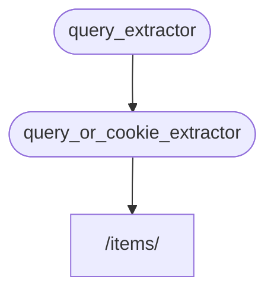

# Sub-dependencies { #sub-dependencies }

آپ ایسی dependencies بنا سکتے ہیں جن میں **sub-dependencies** ہوں۔

یہ جتنی **گہری** بھی ہوں، آپ کی ضرورت کے مطابق ہو سکتی ہیں۔

**FastAPI** انہیں حل کرنے کا خیال رکھے گا۔

## پہلی dependency "dependable" { #first-dependency-dependable }

آپ اس طرح پہلی dependency ("dependable") بنا سکتے ہیں:

{* ../../docs_src/dependencies/tutorial005_an_py310.py hl[8:9] *}

یہ ایک اختیاری query parameter `q` کو `str` کے طور پر declare کرتی ہے، اور پھر بس اسے واپس کر دیتی ہے۔

یہ کافی سادہ ہے (زیادہ مفید نہیں)، لیکن ہمیں sub-dependencies کے کام کرنے کے طریقے پر توجہ مرکوز کرنے میں مدد کرے گی۔

## دوسری dependency، "dependable" اور "dependant" { #second-dependency-dependable-and-dependant }

پھر آپ ایک اور dependency function ("dependable") بنا سکتے ہیں جو بیک وقت اپنی خود کی dependency بھی declare کرتی ہے (یعنی یہ "dependant" بھی ہے):

{* ../../docs_src/dependencies/tutorial005_an_py310.py hl[13] *}

آئیے declare کیے گئے parameters پر توجہ دیتے ہیں:

* اگرچہ یہ function خود ایک dependency ("dependable") ہے، یہ ایک اور dependency بھی declare کرتا ہے (یہ کسی اور چیز پر "منحصر" ہے)۔
    * یہ `query_extractor` پر منحصر ہے، اور اس سے واپس آنے والی value کو parameter `q` میں assign کرتا ہے۔
* یہ ایک اختیاری `last_query` cookie بھی declare کرتا ہے، بطور `str`۔
    * اگر صارف نے کوئی query `q` فراہم نہیں کی، تو ہم آخری استعمال شدہ query استعمال کرتے ہیں، جو ہم نے پہلے ایک cookie میں محفوظ کی تھی۔

## Dependency استعمال کریں { #use-the-dependency }

پھر ہم dependency کو اس طرح استعمال کر سکتے ہیں:

{* ../../docs_src/dependencies/tutorial005_an_py310.py hl[23] *}

/// info | معلومات

دھیان دیں کہ ہم *path operation function* میں صرف ایک dependency declare کر رہے ہیں، `query_or_cookie_extractor`۔

لیکن **FastAPI** جانے گا کہ اسے پہلے `query_extractor` کو حل کرنا ہوگا، تاکہ اس کے نتائج `query_or_cookie_extractor` کو call کرتے وقت پاس کر سکے۔

///



## ایک ہی dependency کو کئی بار استعمال کرنا { #using-the-same-dependency-multiple-times }

اگر آپ کی ایک dependency ایک ہی *path operation* کے لیے کئی بار declare ہو، مثال کے طور پر، کئی dependencies کی ایک مشترکہ sub-dependency ہو، تو **FastAPI** جانے گا کہ اس sub-dependency کو ہر request میں صرف ایک بار call کرنا ہے۔

اور یہ واپس آنے والی value کو ایک <dfn title="A utility/system to store computed/generated values, to reuse them instead of computing them again.">"cache"</dfn> میں محفوظ کر لے گا اور اسے اس مخصوص request میں ضرورت مند تمام "dependants" کو پاس کر دے گا، بجائے اس کے کہ ایک ہی request کے لیے dependency کو کئی بار call کرے۔

ایک ایڈوانسڈ صورت میں جہاں آپ جانتے ہیں کہ dependency کو ایک ہی request میں ہر قدم پر (ممکنہ طور پر کئی بار) call ہونا ضروری ہے بجائے "cached" value استعمال کرنے کے، آپ `Depends` استعمال کرتے وقت `use_cache=False` parameter سیٹ کر سکتے ہیں:

//// tab | Python 3.10+

```Python hl_lines="1"
async def needy_dependency(fresh_value: Annotated[str, Depends(get_value, use_cache=False)]):
    return {"fresh_value": fresh_value}
```

////

//// tab | Python 3.10+ non-Annotated

/// tip | مشورہ

ممکن ہو تو `Annotated` version استعمال کریں۔

///

```Python hl_lines="1"
async def needy_dependency(fresh_value: str = Depends(get_value, use_cache=False)):
    return {"fresh_value": fresh_value}
```

////

## خلاصہ { #recap }

یہاں استعمال ہونے والے تمام فینسی الفاظ سے ہٹ کر، **Dependency Injection** نظام کافی سادہ ہے۔

بس وہی functions جو *path operation functions* جیسے نظر آتے ہیں۔

لیکن پھر بھی، یہ بہت طاقتور ہے، اور آپ کو من مانی گہرائی تک nested dependency "graphs" (درخت) declare کرنے دیتا ہے۔

/// tip | مشورہ

ان سادہ مثالوں سے شاید یہ سب اتنا مفید نہ لگے۔

لیکن آپ **security** کے ابواب میں دیکھیں گے کہ یہ کتنا مفید ہے۔

اور آپ یہ بھی دیکھیں گے کہ یہ آپ کا کتنا code بچائے گا۔

///
