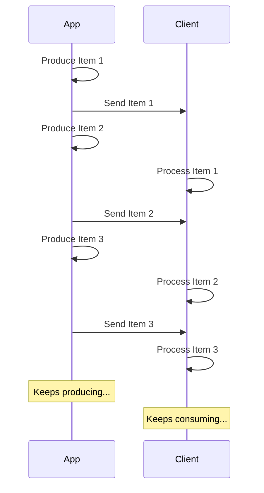

# Stream JSON Lines { #stream-json-lines }

آپ کے پاس data کی ایک ترتیب ہو سکتی ہے جسے آپ "**stream**" کی شکل میں بھیجنا چاہتے ہیں، آپ یہ **JSON Lines** کے ذریعے کر سکتے ہیں۔

/// info | معلومات

FastAPI 0.134.0 میں شامل کیا گیا۔

///

## Stream کیا ہے؟ { #what-is-a-stream }

"**Streaming**" data کا مطلب ہے کہ آپ کی app آئٹمز کی پوری ترتیب تیار ہونے کا انتظار کیے بغیر data آئٹمز client کو بھیجنا شروع کر دے گی۔

تو، یہ پہلا آئٹم بھیجے گی، client اسے وصول کر کے process کرنا شروع کرے گا، اور آپ ابھی بھی اگلا آئٹم تیار کر رہے ہوں گے۔



یہ ایک لامحدود stream بھی ہو سکتا ہے، جہاں آپ مسلسل data بھیجتے رہیں۔

## JSON Lines { #json-lines }

ان صورتوں میں، "**JSON Lines**" بھیجنا عام ہے، جو ایک format ہے جہاں آپ فی لائن ایک JSON object بھیجتے ہیں۔

ایک response کا content type `application/jsonl` ہوگا (`application/json` کی بجائے) اور body کچھ اس طرح ہوگا:

```json
{"name": "Plumbus", "description": "A multi-purpose household device."}
{"name": "Portal Gun", "description": "A portal opening device."}
{"name": "Meeseeks Box", "description": "A box that summons a Meeseeks."}
```

یہ JSON array (Python list کے مساوی) سے بہت ملتا جلتا ہے، لیکن `[]` میں wrap ہونے اور آئٹمز کے درمیان `,` ہونے کی بجائے، اس میں **فی لائن ایک JSON object** ہوتا ہے، جو نئی لائن کے حرف سے الگ ہوتے ہیں۔

/// info | معلومات

اہم بات یہ ہے کہ آپ کی app ہر لائن باری باری تیار کر سکے گی، جبکہ client پچھلی لائنیں استعمال کرتا رہے گا۔

///

/// note | تکنیکی تفصیلات

چونکہ ہر JSON object نئی لائن سے الگ ہوگا، وہ اپنے مواد میں حقیقی نئی لائن کے حروف نہیں رکھ سکتے، لیکن ان میں escaped نئی لائنیں (`\n`) ہو سکتی ہیں، جو JSON معیار کا حصہ ہے۔

لیکن عام طور پر آپ کو اس کی فکر نہیں کرنی پڑے گی، یہ خودکار طور پر ہوتا ہے، پڑھنا جاری رکھیں۔ 🤓

///

## استعمال کی صورتیں { #use-cases }

آپ اسے **AI LLM** service، **logs** یا **telemetry**، یا دیگر اقسام کے data سے stream کرنے کے لیے استعمال کر سکتے ہیں جو **JSON** آئٹمز میں منظم ہو سکتے ہیں۔

/// tip | مشورہ

اگر آپ binary data stream کرنا چاہتے ہیں، مثلاً video یا audio، تو advanced گائیڈ دیکھیں: [Stream Data](../advanced/stream-data.md)۔

///

## FastAPI کے ساتھ JSON Lines Stream کریں { #stream-json-lines-with-fastapi }

FastAPI کے ساتھ JSON Lines stream کرنے کے لیے آپ اپنے *path operation function* میں `return` کی بجائے `yield` استعمال کر سکتے ہیں تاکہ ہر آئٹم باری باری تیار ہو۔

{* ../../docs_src/stream_json_lines/tutorial001_py310.py ln[1:24] hl[24] *}

اگر ہر JSON آئٹم جو آپ واپس بھیجنا چاہتے ہیں وہ `Item` قسم (ایک Pydantic model) کا ہے اور یہ ایک async function ہے، تو آپ return type کو `AsyncIterable[Item]` declare کر سکتے ہیں:

{* ../../docs_src/stream_json_lines/tutorial001_py310.py ln[1:24] hl[9:11,22] *}

اگر آپ return type declare کرتے ہیں، تو FastAPI اسے Pydantic استعمال کرتے ہوئے data کو **validate**، OpenAPI میں **document**، **filter**، اور **serialize** کرنے کے لیے استعمال کرے گا۔

/// tip | مشورہ

چونکہ Pydantic اسے **Rust** کی طرف سے serialize کرے گا، آپ کو return type declare نہ کرنے کی نسبت بہت زیادہ **performance** ملے گی۔

///

### غیر async *path operation functions* { #non-async-path-operation-functions }

آپ عام `def` functions (بغیر `async`) بھی استعمال کر سکتے ہیں، اور اسی طرح `yield` استعمال کر سکتے ہیں۔

FastAPI یقینی بنائے گا کہ یہ درست طریقے سے چلے تاکہ event loop block نہ ہو۔

اس صورت میں چونکہ function async نہیں ہے، صحیح return type `Iterable[Item]` ہوگا:

{* ../../docs_src/stream_json_lines/tutorial001_py310.py ln[27:30] hl[28] *}

### بغیر Return Type { #no-return-type }

آپ return type بھی چھوڑ سکتے ہیں۔ FastAPI پھر data کو JSON میں serialize ہونے کے قابل کسی چیز میں تبدیل کرنے کے لیے [`jsonable_encoder`](./encoder.md) استعمال کرے گا اور پھر اسے JSON Lines کے طور پر بھیجے گا۔

{* ../../docs_src/stream_json_lines/tutorial001_py310.py ln[33:36] hl[34] *}

## Server-Sent Events (SSE) { #server-sent-events-sse }

FastAPI میں Server-Sent Events (SSE) کے لیے بھی فرسٹ کلاس حمایت موجود ہے، جو کافی ملتے جلتے ہیں لیکن چند اضافی تفصیلات کے ساتھ۔ آپ ان کے بارے میں اگلے باب میں سیکھ سکتے ہیں: [Server-Sent Events (SSE)](server-sent-events.md)۔ 🤓
