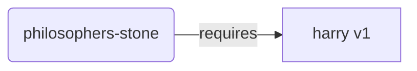
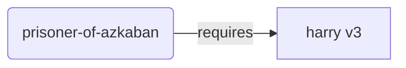
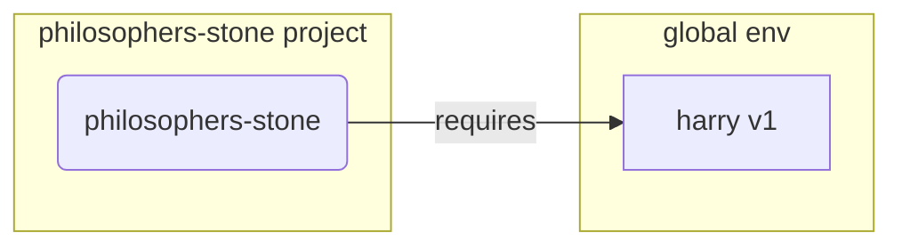
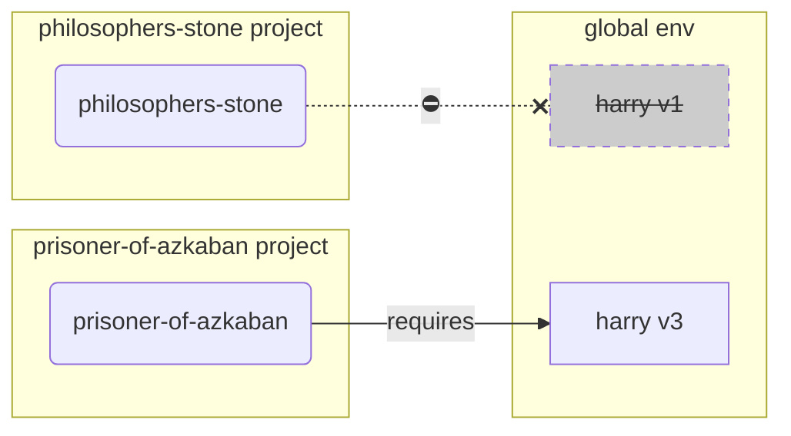
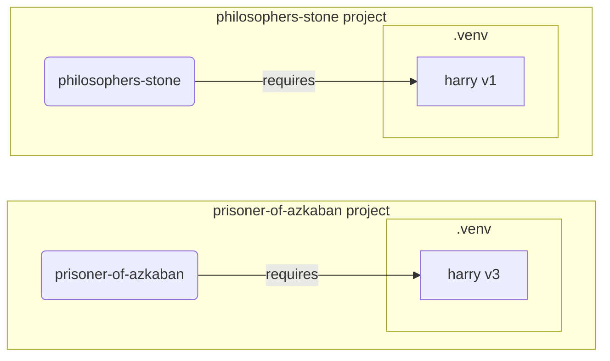

# Virtual Environments { #virtual-environments }

جب آپ Python projects میں کام کرتے ہیں تو آپ کو شاید **virtual environment** (یا اسی طرح کا کوئی طریقہ) استعمال کرنا چاہیے تاکہ ہر project کے لیے install کیے جانے والے packages الگ رہیں۔

/// info | معلومات

اگر آپ پہلے سے virtual environments کے بارے میں جانتے ہیں، انہیں بنانا اور استعمال کرنا جانتے ہیں، تو آپ اس سیکشن کو چھوڑنا چاہیں گے۔ 🤓

///

/// tip | مشورہ

**Virtual environment**، **environment variable** سے مختلف ہے۔

**Environment variable** system میں ایک variable ہے جو programs استعمال کر سکتے ہیں۔

**Virtual environment** کچھ فائلوں والی ایک directory ہے۔

///

/// info | معلومات

یہ صفحہ آپ کو سکھائے گا کہ **virtual environments** کو کیسے استعمال کریں اور یہ کیسے کام کرتے ہیں۔

اگر آپ ایسا **tool اپنانے کے لیے تیار ہیں جو سب کچھ** آپ کے لیے manage کرے (بشمول Python install کرنا)، [uv](https://github.com/astral-sh/uv) آزمائیں۔

///

## Project بنائیں { #create-a-project }

پہلے، اپنے project کے لیے ایک directory بنائیں۔

میں عام طور پر اپنی home/user directory کے اندر `code` نامی directory بناتا ہوں۔

اور اس کے اندر ہر project کے لیے ایک directory بناتا ہوں۔

<div class="termy">

```console
// Go to the home directory
$ cd
// Create a directory for all your code projects
$ mkdir code
// Enter into that code directory
$ cd code
// Create a directory for this project
$ mkdir awesome-project
// Enter into that project directory
$ cd awesome-project
```

</div>

## Virtual Environment بنائیں { #create-a-virtual-environment }

جب آپ Python project پر **پہلی بار** کام شروع کرتے ہیں، اپنے project کے **<dfn title="there are other options, this is a simple guideline">اندر</dfn>** ایک virtual environment بنائیں۔

/// tip | مشورہ

یہ آپ کو صرف **ایک بار فی project** کرنا ہے، ہر بار کام کرتے وقت نہیں۔

///

//// tab | `venv`

Virtual environment بنانے کے لیے، آپ `venv` module استعمال کر سکتے ہیں جو Python کے ساتھ آتا ہے۔

<div class="termy">

```console
$ python -m venv .venv
```

</div>

/// details | اس command کا مطلب

* `python`: `python` نامی program استعمال کریں
* `-m`: ایک module کو script کے طور پر call کریں، ہم بتائیں گے کون سا module
* `venv`: `venv` نامی module استعمال کریں جو عام طور پر Python کے ساتھ install آتا ہے
* `.venv`: نئی directory `.venv` میں virtual environment بنائیں

///

////

//// tab | `uv`

اگر آپ کے پاس [`uv`](https://github.com/astral-sh/uv) install ہے، تو آپ اسے virtual environment بنانے کے لیے استعمال کر سکتے ہیں۔

<div class="termy">

```console
$ uv venv
```

</div>

/// tip | مشورہ

بطور default، `uv` ایک `.venv` نامی directory میں virtual environment بنائے گا۔

لیکن آپ directory name کے ساتھ اضافی argument دے کر اسے customize کر سکتے ہیں۔

///

////

یہ command `.venv` نامی directory میں ایک نیا virtual environment بناتا ہے۔

/// details | `.venv` یا دوسرا نام

آپ virtual environment کسی مختلف directory میں بنا سکتے ہیں، لیکن اسے `.venv` کہنے کا رواج ہے۔

///

## Virtual Environment فعال کریں { #activate-the-virtual-environment }

نیا virtual environment فعال کریں تاکہ آپ جو بھی Python command چلائیں یا package install کریں وہ اسے استعمال کرے۔

/// tip | مشورہ

یہ **ہر بار** کریں جب آپ project پر کام کرنے کے لیے **نیا terminal session** شروع کریں۔

///

//// tab | Linux, macOS

<div class="termy">

```console
$ source .venv/bin/activate
```

</div>

////

//// tab | Windows PowerShell

<div class="termy">

```console
$ .venv\Scripts\Activate.ps1
```

</div>

////

//// tab | Windows Bash

یا اگر آپ Windows کے لیے Bash استعمال کرتے ہیں (مثلاً [Git Bash](https://gitforwindows.org/)):

<div class="termy">

```console
$ source .venv/Scripts/activate
```

</div>

////

/// tip | مشورہ

ہر بار جب آپ اس ماحول میں **نیا package** install کریں، ماحول کو دوبارہ **فعال** کریں۔

یہ یقینی بناتا ہے کہ اگر آپ اس package کا install کیا ہوا **terminal (<abbr title="command line interface">CLI</abbr>) program** استعمال کرتے ہیں، تو آپ اپنے virtual environment والا استعمال کرتے ہیں نہ کہ کوئی اور جو عالمی سطح پر install ہو، ممکنہ طور پر آپ کی ضرورت سے مختلف ورژن کے ساتھ۔

///

## چیک کریں کہ Virtual Environment فعال ہے { #check-the-virtual-environment-is-active }

چیک کریں کہ virtual environment فعال ہے (پچھلا command کام کیا)۔

/// tip | مشورہ

یہ **اختیاری** ہے، لیکن یہ **چیک** کرنے کا اچھا طریقہ ہے کہ سب کچھ توقع کے مطابق کام کر رہا ہے اور آپ وہ virtual environment استعمال کر رہے ہیں جس کا آپ ارادہ رکھتے ہیں۔

///

//// tab | Linux, macOS, Windows Bash

<div class="termy">

```console
$ which python

/home/user/code/awesome-project/.venv/bin/python
```

</div>

اگر یہ `.venv/bin/python` پر `python` binary دکھاتا ہے، آپ کے project (اس صورت میں `awesome-project`) کے اندر، تو یہ کام کر گیا۔ 🎉

////

//// tab | Windows PowerShell

<div class="termy">

```console
$ Get-Command python

C:\Users\user\code\awesome-project\.venv\Scripts\python
```

</div>

اگر یہ `.venv\Scripts\python` پر `python` binary دکھاتا ہے، آپ کے project (اس صورت میں `awesome-project`) کے اندر، تو یہ کام کر گیا۔ 🎉

////

## `pip` اپگریڈ کریں { #upgrade-pip }

/// tip | مشورہ

اگر آپ [`uv`](https://github.com/astral-sh/uv) استعمال کرتے ہیں تو آپ `pip` کی بجائے اسے چیزیں install کرنے کے لیے استعمال کریں گے، تو آپ کو `pip` اپگریڈ کرنے کی ضرورت نہیں۔ 😎

///

اگر آپ packages install کرنے کے لیے `pip` استعمال کر رہے ہیں (یہ Python کے ساتھ بطور default آتا ہے)، تو آپ کو اسے تازہ ترین ورژن میں **اپگریڈ** کرنا چاہیے۔

Package install کرتے وقت بہت سی عجیب errors صرف `pip` کو پہلے اپگریڈ کرنے سے حل ہو جاتی ہیں۔

/// tip | مشورہ

آپ عام طور پر یہ **ایک بار** کریں گے، virtual environment بنانے کے فوراً بعد۔

///

یقینی بنائیں کہ virtual environment فعال ہے (اوپر والے command سے) اور پھر چلائیں:

<div class="termy">

```console
$ python -m pip install --upgrade pip

---> 100%
```

</div>

/// tip | مشورہ

بعض اوقات، pip اپگریڈ کرنے کی کوشش کرتے وقت آپ کو **`No module named pip`** error مل سکتی ہے۔

اگر ایسا ہو تو نیچے دیے گئے command سے pip install اور اپگریڈ کریں:

<div class="termy">

```console
$ python -m ensurepip --upgrade

---> 100%
```

</div>

یہ command pip install کرے گا اگر پہلے سے install نہیں ہے اور یقینی بناتا ہے کہ pip کا install شدہ ورژن کم از کم `ensurepip` میں دستیاب ورژن جتنا حالیہ ہو۔

///

## `.gitignore` شامل کریں { #add-gitignore }

اگر آپ **Git** استعمال کر رہے ہیں (آپ کو کرنا چاہیے)، تو `.gitignore` فائل شامل کریں تاکہ `.venv` میں موجود ہر چیز Git سے باہر رہے۔

/// tip | مشورہ

اگر آپ نے virtual environment بنانے کے لیے [`uv`](https://github.com/astral-sh/uv) استعمال کیا، تو اس نے پہلے سے یہ آپ کے لیے کر دیا ہے، آپ یہ مرحلہ چھوڑ سکتے ہیں۔ 😎

///

/// tip | مشورہ

یہ **ایک بار** کریں، virtual environment بنانے کے فوراً بعد۔

///

<div class="termy">

```console
$ echo "*" > .venv/.gitignore
```

</div>

/// details | اس command کا مطلب

* `echo "*"`: terminal میں `*` متن "print" کرے گا (اگلا حصہ اسے تھوڑا بدل دیتا ہے)
* `>`: `>` کے بائیں والے command سے terminal میں print ہونے والی ہر چیز print نہیں ہونی چاہیے بلکہ `>` کے دائیں والی فائل میں لکھی جانی چاہیے
* `.gitignore`: اس فائل کا نام جس میں متن لکھا جائے

اور Git کے لیے `*` کا مطلب ہے "سب کچھ"۔ تو یہ `.venv` directory میں موجود ہر چیز کو نظرانداز کر دے گا۔

یہ command `.gitignore` فائل بنائے گا اس مواد کے ساتھ:

```gitignore
*
```

///

## Packages Install کریں { #install-packages }

ماحول فعال کرنے کے بعد، آپ اس میں packages install کر سکتے ہیں۔

/// tip | مشورہ

یہ **ایک بار** کریں جب آپ کے project کی ضروری packages install یا اپگریڈ کر رہے ہوں۔

اگر آپ کو ورژن اپگریڈ کرنا ہو یا نیا package شامل کرنا ہو تو آپ **دوبارہ یہ کریں**۔

///

### Packages براہ راست Install کریں { #install-packages-directly }

اگر آپ جلدی میں ہیں اور اپنے project کی package ضروریات declare کرنے کے لیے فائل استعمال نہیں کرنا چاہتے، تو آپ انہیں براہ راست install کر سکتے ہیں۔

/// tip | مشورہ

Packages اور ورژنز جو آپ کے program کو ضرورت ہیں انہیں فائل میں (مثلاً `requirements.txt` یا `pyproject.toml`) رکھنا (بہت) اچھا خیال ہے۔

///

//// tab | `pip`

<div class="termy">

```console
$ pip install "fastapi[standard]"

---> 100%
```

</div>

////

//// tab | `uv`

اگر آپ کے پاس [`uv`](https://github.com/astral-sh/uv) ہے:

<div class="termy">

```console
$ uv pip install "fastapi[standard]"
---> 100%
```

</div>

////

### `requirements.txt` سے Install کریں { #install-from-requirements-txt }

اگر آپ کے پاس `requirements.txt` ہے، تو آپ اب اسے استعمال کرکے packages install کر سکتے ہیں۔

//// tab | `pip`

<div class="termy">

```console
$ pip install -r requirements.txt
---> 100%
```

</div>

////

//// tab | `uv`

اگر آپ کے پاس [`uv`](https://github.com/astral-sh/uv) ہے:

<div class="termy">

```console
$ uv pip install -r requirements.txt
---> 100%
```

</div>

////

/// details | `requirements.txt`

کچھ packages والا `requirements.txt` اس طرح نظر آ سکتا ہے:

```requirements.txt
fastapi[standard]==0.113.0
pydantic==2.8.0
```

///

## اپنا Program چلائیں { #run-your-program }

Virtual environment فعال کرنے کے بعد، آپ اپنا program چلا سکتے ہیں، اور یہ آپ کے virtual environment کے اندر والا Python وہاں install کیے گئے packages کے ساتھ استعمال کرے گا۔

<div class="termy">

```console
$ python main.py

Hello World
```

</div>

## اپنا Editor Configure کریں { #configure-your-editor }

آپ شاید ایک editor استعمال کریں گے، یقینی بنائیں کہ آپ اسے وہی virtual environment استعمال کرنے کے لیے configure کریں جو آپ نے بنایا (یہ شاید خودکار طور پر detect ہو جائے) تاکہ آپ کو autocompletion اور inline errors ملیں۔

مثال کے طور پر:

* [VS Code](https://code.visualstudio.com/docs/python/environments#_select-and-activate-an-environment)
* [PyCharm](https://www.jetbrains.com/help/pycharm/creating-virtual-environment.html)

/// tip | مشورہ

آپ کو عام طور پر یہ صرف **ایک بار** کرنا ہوگا، جب آپ virtual environment بناتے ہیں۔

///

## Virtual Environment غیر فعال کریں { #deactivate-the-virtual-environment }

جب آپ اپنے project پر کام مکمل کر لیں تو آپ virtual environment **غیر فعال** کر سکتے ہیں۔

<div class="termy">

```console
$ deactivate
```

</div>

اس طرح، جب آپ `python` چلائیں گے تو یہ اس virtual environment سے وہاں install کیے گئے packages کے ساتھ چلانے کی کوشش نہیں کرے گا۔

## کام کے لیے تیار { #ready-to-work }

اب آپ اپنے project پر کام شروع کرنے کے لیے تیار ہیں۔


/// tip | مشورہ

کیا آپ سمجھنا چاہتے ہیں کہ اوپر والا سب کیا ہے؟

پڑھتے رہیں۔ 👇🤓

///

## Virtual Environments کیوں { #why-virtual-environments }

FastAPI کے ساتھ کام کرنے کے لیے آپ کو [Python](https://www.python.org/) install کرنا ہوگا۔

اس کے بعد، آپ کو FastAPI اور جو بھی دوسرے **packages** چاہئیں وہ **install** کرنے ہوں گے۔

Packages install کرنے کے لیے آپ عام طور پر `pip` command استعمال کریں گے جو Python کے ساتھ آتا ہے (یا ملتے جلتے متبادل)۔

تاہم، اگر آپ صرف `pip` براہ راست استعمال کریں، تو packages آپ کے **عالمی Python ماحول** (Python کی عالمی installation) میں install ہوں گے۔

### مسئلہ { #the-problem }

تو عالمی Python ماحول میں packages install کرنے میں کیا مسئلہ ہے؟

کسی وقت، آپ شاید بہت سے مختلف programs لکھیں گے جو **مختلف packages** پر منحصر ہیں۔ اور آپ کے کچھ projects ایک ہی package کے **مختلف ورژنز** پر منحصر ہوں گے۔ 😱

مثلاً، آپ `philosophers-stone` نامی project بنا سکتے ہیں، یہ program **`harry`، ورژن `1` استعمال کرنے والے** دوسرے package پر منحصر ہے۔ تو آپ کو `harry` install کرنا ہوگا۔



پھر، کچھ عرصے بعد، آپ `prisoner-of-azkaban` نامی دوسرا project بناتے ہیں، اور یہ project بھی `harry` پر منحصر ہے، لیکن اس project کو **`harry` ورژن `3`** چاہیے۔



لیکن اب مسئلہ یہ ہے کہ اگر آپ packages عالمی سطح پر (عالمی ماحول میں) install کریں تو مقامی **virtual environment** کی بجائے، آپ کو `harry` کا کون سا ورژن install کرنا ہے یہ فیصلہ کرنا ہوگا۔

اگر آپ `philosophers-stone` چلانا چاہیں تو پہلے `harry` ورژن `1` install کرنا ہوگا، مثلاً:

<div class="termy">

```console
$ pip install "harry==1"
```

</div>

اور پھر آپ کے عالمی Python ماحول میں `harry` ورژن `1` install ہو جائے گا۔



لیکن پھر اگر آپ `prisoner-of-azkaban` چلانا چاہیں، تو آپ کو `harry` ورژن `1` uninstall کرنا ہوگا اور `harry` ورژن `3` install کرنا ہوگا (یا صرف ورژن `3` install کرنے سے خودکار طور پر ورژن `1` uninstall ہو جائے گا)۔

<div class="termy">

```console
$ pip install "harry==3"
```

</div>

اور پھر آپ کے عالمی Python ماحول میں `harry` ورژن `3` install ہو جائے گا۔

اور اگر آپ `philosophers-stone` دوبارہ چلانے کی کوشش کریں، تو اچھا امکان ہے کہ یہ **کام نہ کرے** کیونکہ اسے `harry` ورژن `1` چاہیے۔



/// tip | مشورہ

Python packages میں **نئے ورژنز** میں **breaking changes** سے بچنے کی بہترین کوشش کی جاتی ہے، لیکن محفوظ رہنا بہتر ہے، اور نئے ورژنز جان بوجھ کر اور جب آپ tests چلا کر چیک کر سکیں کہ سب کچھ ٹھیک کام کر رہا ہے تب install کریں۔

///

اب تصور کریں یہ **بہت سے** دوسرے **packages** کے ساتھ جن پر آپ کے **تمام projects** منحصر ہوں۔ اسے manage کرنا بہت مشکل ہے۔ اور آپ شاید کچھ projects **ناموافق ورژنز** والے packages کے ساتھ چلا لیں، اور نہ جانیں کہ کچھ کیوں کام نہیں کر رہا۔

نیز، آپ کے operating system (مثلاً Linux، Windows، macOS) پر منحصر، یہ Python پہلے سے install آ سکتا ہے۔ اور اس صورت میں شاید کچھ packages مخصوص ورژنز کے ساتھ پہلے سے install ہوں جو **آپ کے system کو** ضرورت ہوں۔ اگر آپ عالمی Python ماحول میں packages install کریں، تو آپ اپنے operating system کے ساتھ آنے والے کچھ programs **توڑ** سکتے ہیں۔

## Packages کہاں Install ہوتے ہیں { #where-are-packages-installed }

جب آپ Python install کرتے ہیں، یہ آپ کے computer میں کچھ فائلوں کے ساتھ کچھ directories بناتا ہے۔

ان میں سے کچھ directories آپ کے install کیے جانے والے تمام packages رکھنے کی ذمہ دار ہیں۔

جب آپ چلاتے ہیں:

<div class="termy">

```console
// Don't run this now, it's just an example 🤓
$ pip install "fastapi[standard]"
---> 100%
```

</div>

یہ FastAPI code کے ساتھ ایک compressed فائل download کرے گا، عام طور پر [PyPI](https://pypi.org/project/fastapi/) سے۔

یہ ان دوسرے packages کی فائلیں بھی **download** کرے گا جن پر FastAPI منحصر ہے۔

پھر یہ ان تمام فائلوں کو **extract** کرے گا اور آپ کے computer میں ایک directory میں ڈالے گا۔

بطور default، یہ ان download اور extract کی گئی فائلوں کو آپ کی Python installation کے ساتھ آنے والی directory میں ڈالے گا، یہ **عالمی ماحول** ہے۔

## Virtual Environments کیا ہیں { #what-are-virtual-environments }

عالمی ماحول میں تمام packages رکھنے کے مسائل کا حل یہ ہے کہ ہر project کے لیے **virtual environment** استعمال کریں۔

Virtual environment ایک **directory** ہے، عالمی ماحول سے بہت ملتی جلتی، جہاں آپ project کے لیے packages install کر سکتے ہیں۔

اس طرح، ہر project کا اپنا virtual environment (`.venv` directory) اپنے packages کے ساتھ ہوگا۔



## Virtual Environment فعال کرنے کا مطلب { #what-does-activating-a-virtual-environment-mean }

جب آپ virtual environment فعال کرتے ہیں، مثلاً:

//// tab | Linux, macOS

<div class="termy">

```console
$ source .venv/bin/activate
```

</div>

////

//// tab | Windows PowerShell

<div class="termy">

```console
$ .venv\Scripts\Activate.ps1
```

</div>

////

//// tab | Windows Bash

یا اگر آپ Windows کے لیے Bash استعمال کرتے ہیں (مثلاً [Git Bash](https://gitforwindows.org/)):

<div class="termy">

```console
$ source .venv/Scripts/activate
```

</div>

////

یہ command کچھ [environment variables](environment-variables.md) بنائے یا تبدیل کرے گا جو اگلے commands کے لیے دستیاب ہوں گے۔

ان variables میں سے ایک `PATH` variable ہے۔

/// tip | مشورہ

آپ `PATH` environment variable کے بارے میں مزید [Environment Variables](environment-variables.md#path-environment-variable) سیکشن میں سیکھ سکتے ہیں۔

///

Virtual environment فعال کرنا اس کا path `.venv/bin` (Linux اور macOS پر) یا `.venv\Scripts` (Windows پر) `PATH` environment variable میں شامل کرتا ہے۔

فرض کریں کہ ماحول فعال کرنے سے پہلے `PATH` variable اس طرح نظر آتا تھا:

//// tab | Linux, macOS

```plaintext
/usr/bin:/bin:/usr/sbin:/sbin
```

اس کا مطلب ہے کہ system ان directories میں programs تلاش کرے گا:

* `/usr/bin`
* `/bin`
* `/usr/sbin`
* `/sbin`

////

//// tab | Windows

```plaintext
C:\Windows\System32
```

اس کا مطلب ہے کہ system ان directories میں programs تلاش کرے گا:

* `C:\Windows\System32`

////

Virtual environment فعال کرنے کے بعد، `PATH` variable کچھ اس طرح نظر آئے گا:

//// tab | Linux, macOS

```plaintext
/home/user/code/awesome-project/.venv/bin:/usr/bin:/bin:/usr/sbin:/sbin
```

اس کا مطلب ہے کہ system اب پہلے ان programs کو تلاش کرے گا:

```plaintext
/home/user/code/awesome-project/.venv/bin
```

دوسری directories میں دیکھنے سے پہلے۔

تو جب آپ terminal میں `python` ٹائپ کریں گے، system Python program یہاں تلاش کرے گا:

```plaintext
/home/user/code/awesome-project/.venv/bin/python
```

اور اسے استعمال کرے گا۔

////

//// tab | Windows

```plaintext
C:\Users\user\code\awesome-project\.venv\Scripts;C:\Windows\System32
```

اس کا مطلب ہے کہ system اب پہلے ان programs کو تلاش کرے گا:

```plaintext
C:\Users\user\code\awesome-project\.venv\Scripts
```

دوسری directories میں دیکھنے سے پہلے۔

تو جب آپ terminal میں `python` ٹائپ کریں گے، system Python program یہاں تلاش کرے گا:

```plaintext
C:\Users\user\code\awesome-project\.venv\Scripts\python
```

اور اسے استعمال کرے گا۔

////

ایک اہم تفصیل یہ ہے کہ یہ virtual environment کا path `PATH` variable کی **شروعات** میں رکھے گا۔ System اسے کسی بھی دوسرے دستیاب Python سے **پہلے** تلاش کرے گا۔ اس طرح، جب آپ `python` چلائیں، یہ کسی بھی دوسرے `python` (مثلاً عالمی ماحول سے `python`) کی بجائے **virtual environment والا** Python استعمال کرے گا۔

Virtual environment فعال کرنا چند اور چیزیں بھی بدلتا ہے، لیکن یہ اس کے سب سے اہم کاموں میں سے ایک ہے۔

## Virtual Environment چیک کرنا { #checking-a-virtual-environment }

جب آپ چیک کرتے ہیں کہ virtual environment فعال ہے، مثلاً:

//// tab | Linux, macOS, Windows Bash

<div class="termy">

```console
$ which python

/home/user/code/awesome-project/.venv/bin/python
```

</div>

////

//// tab | Windows PowerShell

<div class="termy">

```console
$ Get-Command python

C:\Users\user\code\awesome-project\.venv\Scripts\python
```

</div>

////

اس کا مطلب ہے کہ جو `python` program استعمال ہوگا وہ **virtual environment** میں والا ہے۔

آپ Linux اور macOS پر `which` اور Windows PowerShell پر `Get-Command` استعمال کرتے ہیں۔

یہ command اس طرح کام کرتا ہے کہ `PATH` environment variable میں جا کر **ہر path کو ترتیب سے** دیکھتا ہے، `python` نامی program تلاش کرتا ہے۔ ملنے پر، آپ کو اس program کا **path دکھاتا ہے**۔

سب سے اہم بات یہ ہے کہ جب آپ `python` call کریں، بالکل یہی "`python`" execute ہوگا۔

تو آپ تصدیق کر سکتے ہیں کہ آپ صحیح virtual environment میں ہیں۔

/// tip | مشورہ

ایک virtual environment فعال کرنا، ایک Python لینا، اور پھر **دوسرے project** میں جانا آسان ہے۔

اور دوسرا project **کام نہیں کرے گا** کیونکہ آپ **غلط Python** استعمال کر رہے ہیں، کسی اور project کے virtual environment سے۔

یہ جان سکنا مفید ہے کہ کون سا `python` استعمال ہو رہا ہے۔ 🤓

///

## Virtual Environment غیر فعال کیوں کریں { #why-deactivate-a-virtual-environment }

مثلاً، آپ `philosophers-stone` project پر کام کر رہے ہو سکتے ہیں، **اس virtual environment کو فعال** کریں، packages install کریں اور اس ماحول کے ساتھ کام کریں۔

اور پھر آپ **دوسرے project** `prisoner-of-azkaban` پر کام کرنا چاہتے ہیں۔

آپ اس project میں جاتے ہیں:

<div class="termy">

```console
$ cd ~/code/prisoner-of-azkaban
```

</div>

اگر آپ `philosophers-stone` کے virtual environment کو غیر فعال نہ کریں، جب آپ terminal میں `python` چلائیں گے، یہ `philosophers-stone` والا Python استعمال کرنے کی کوشش کرے گا۔

<div class="termy">

```console
$ cd ~/code/prisoner-of-azkaban

$ python main.py

// Error importing sirius, it's not installed 😱
Traceback (most recent call last):
    File "main.py", line 1, in <module>
        import sirius
```

</div>

لیکن اگر آپ virtual environment غیر فعال کریں اور `prisoner-of-azkaban` کے لیے نیا فعال کریں تو جب آپ `python` چلائیں گے یہ `prisoner-of-azkaban` کے virtual environment والا Python استعمال کرے گا۔

<div class="termy">

```console
$ cd ~/code/prisoner-of-azkaban

// You don't need to be in the old directory to deactivate, you can do it wherever you are, even after going to the other project 😎
$ deactivate

// Activate the virtual environment in prisoner-of-azkaban/.venv 🚀
$ source .venv/bin/activate

// Now when you run python, it will find the package sirius installed in this virtual environment ✨
$ python main.py

I solemnly swear 🐺
```

</div>

## متبادل { #alternatives }

یہ ایک سادہ گائیڈ ہے تاکہ آپ شروع کر سکیں اور سیکھ سکیں کہ **اندرونی طور پر** سب کچھ کیسے کام کرتا ہے۔

Virtual environments، package dependencies (requirements)، projects manage کرنے کے بہت سے **متبادل** ہیں۔

جب آپ تیار ہوں اور **پورے project** کو manage کرنے کے لیے tool استعمال کرنا چاہیں، packages dependencies، virtual environments وغیرہ، تو میں تجویز کروں گا کہ آپ [uv](https://github.com/astral-sh/uv) آزمائیں۔

`uv` بہت سارے کام کر سکتا ہے، یہ:

* آپ کے لیے **Python install** کر سکتا ہے، بشمول مختلف ورژنز
* آپ کے projects کے لیے **virtual environment** manage کر سکتا ہے
* **Packages** install کر سکتا ہے
* آپ کے project کے لیے package **dependencies اور ورژنز** manage کر سکتا ہے
* یقینی بنا سکتا ہے کہ آپ کے پاس packages اور ورژنز کا **صحیح** مجموعہ install ہو، بشمول ان کی dependencies، تاکہ آپ یقین کر سکیں کہ آپ اپنا project production میں بالکل ویسے ہی چلا سکتے ہیں جیسے اپنے computer پر development کرتے وقت، اسے **locking** کہتے ہیں
* اور بہت کچھ

## نتیجہ { #conclusion }

اگر آپ نے یہ سب پڑھ اور سمجھ لیا، تو اب **آپ** virtual environments کے بارے میں بہت سے developers سے **زیادہ جانتے ہیں**۔ 🤓

ان تفصیلات کو جاننا مستقبل میں کسی وقت ضرور مفید ثابت ہوگا جب آپ کچھ debug کر رہے ہوں جو پیچیدہ لگتا ہو، لیکن آپ جانیں گے **کہ اندرونی طور پر یہ سب کیسے کام کرتا ہے**۔ 😎
