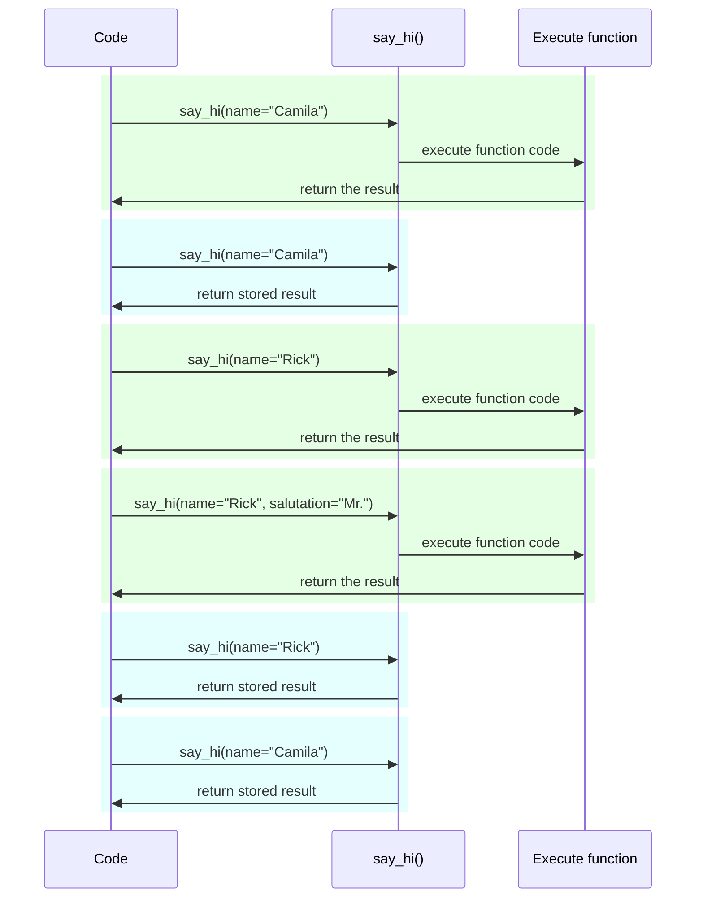

# Cài đặt và Biến Môi trường

Trong nhiều trường hợp, ứng dụng của bạn có thể cần một số cài đặt hoặc cấu hình bên ngoài, ví dụ như khóa bí mật, thông tin đăng nhập cơ sở dữ liệu, thông tin đăng nhập cho dịch vụ email, v.v.

Hầu hết các cài đặt này đều có thể thay đổi, như URL cơ sở dữ liệu. Và nhiều cài đặt có thể nhạy cảm, như các bí mật.

Vì lý do này, thông thường người ta cung cấp chúng trong các biến môi trường được đọc bởi ứng dụng.

/// tip

Để hiểu về biến môi trường, bạn có thể đọc [Biến Môi trường](../environment-variables.md){.internal-link target=\_blank}.

///

## Kiểu dữ liệu và xác thực

Các biến môi trường này chỉ có thể xử lý chuỗi văn bản, vì chúng là bên ngoài Python và phải tương thích với các chương trình khác và phần còn lại của hệ thống (và thậm chí với các hệ điều hành khác nhau, như Linux, Windows, macOS).

Điều đó có nghĩa là bất kỳ giá trị nào được đọc trong Python từ một biến môi trường sẽ là một `str`, và bất kỳ chuyển đổi nào sang một kiểu khác hoặc bất kỳ xác thực nào đều phải được thực hiện trong mã.

## Pydantic `Settings`

May mắn thay, Pydantic cung cấp một tiện ích tuyệt vời để xử lý các cài đặt này từ biến môi trường với <a href="https://docs.pydantic.dev/latest/concepts/pydantic_settings/" class="external-link" target="_blank">Pydantic: Quản lý Cài đặt</a>.

### Cài đặt `pydantic-settings`

Đầu tiên, hãy chắc chắn rằng bạn tạo [môi trường ảo](../virtual-environments.md){.internal-link target=\_blank} của mình, kích hoạt nó, và sau đó cài đặt gói `pydantic-settings`:

<div class="termy">

```console
$ pip install pydantic-settings
---> 100%
```

</div>

Nó cũng được bao gồm khi bạn cài đặt các tính năng bổ sung `all` với:

<div class="termy">

```console
$ pip install "fastapi[all]"
---> 100%
```

</div>

/// info

Trong Pydantic v1, nó được bao gồm trong gói chính. Bây giờ nó được phân phối như một gói độc lập để bạn có thể chọn cài đặt nó hoặc không nếu bạn không cần chức năng đó.

///

### Tạo đối tượng `Settings`

Nhập `BaseSettings` từ Pydantic và tạo một lớp con, rất giống với một mô hình Pydantic.

Cũng giống như với các mô hình Pydantic, bạn khai báo các thuộc tính lớp với chú thích kiểu, và có thể có giá trị mặc định.

Bạn có thể sử dụng tất cả các tính năng và công cụ xác thực giống như bạn sử dụng cho các mô hình Pydantic, như các kiểu dữ liệu khác nhau và xác thực bổ sung với `Field()`.

//// tab | Pydantic v2

```Python hl_lines="2  5-8  11"
{!> ../../docs_src/settings/tutorial001.py!}
```

////

//// tab | Pydantic v1

/// info

Trong Pydantic v1, bạn sẽ nhập `BaseSettings` trực tiếp từ `pydantic` thay vì từ `pydantic_settings`.

///

```Python hl_lines="2  5-8  11"
{!> ../../docs_src/settings/tutorial001_pv1.py!}
```

////

/// tip

Nếu bạn muốn một cái gì đó nhanh chóng để sao chép và dán, đừng sử dụng ví dụ này, hãy sử dụng ví dụ cuối cùng bên dưới.

///

Sau đó, khi bạn tạo một thể hiện của lớp `Settings` đó (trong trường hợp này, trong đối tượng `settings`), Pydantic sẽ đọc các biến môi trường một cách không phân biệt chữ hoa chữ thường, vì vậy, một bi��n viết hoa `APP_NAME` vẫn sẽ được đọc cho thuộc tính `app_name`.

Tiếp theo, nó sẽ chuyển đổi và xác thực dữ liệu. Vì vậy, khi bạn sử dụng đối tượng `settings` đó, bạn sẽ có dữ liệu của các kiểu bạn đã khai báo (ví dụ: `items_per_user` sẽ là một `int`).

### Sử dụng `settings`

Sau đó, bạn có thể sử dụng đối tượng `settings` mới trong ứng dụng của mình:

```Python hl_lines="18-20"
{!../../docs_src/settings/tutorial001.py!}
```

### Chạy máy chủ

Tiếp theo, bạn sẽ chạy máy chủ bằng cách truyền các cấu hình dưới dạng biến môi trường, ví dụ bạn có thể đặt `ADMIN_EMAIL` và `APP_NAME` với:

<div class="termy">

```console
$ ADMIN_EMAIL="deadpool@example.com" APP_NAME="ChimichangApp" fastapi run main.py

<span style="color: green;">INFO</span>:     Uvicorn running on http://127.0.0.1:8000 (Press CTRL+C to quit)
```

</div>

/// tip

Để đặt nhiều biến môi trường cho một lệnh duy nhất, chỉ cần phân tách chúng bằng dấu cách và đặt tất cả chúng trước lệnh.

///

Và sau đó cài đặt `admin_email` sẽ được đặt thành `"deadpool@example.com"`.

`app_name` sẽ là `"ChimichangApp"`.

Và `items_per_user` sẽ giữ giá trị mặc định là `50`.

## Cài đặt trong một module khác

Bạn có thể đặt những cài đặt đó trong một file module khác như bạn đã thấy trong [Ứng dụng Lớn hơn - Nhiều File](../../../en/docs/tutorial/bigger-applications.md){.internal-link target=\_blank}.

Ví dụ, bạn có thể có một file `config.py` với:

```Python
{!../../docs_src/settings/app01/config.py!}
```

Và sau đó sử dụng nó trong một file `main.py`:

```Python hl_lines="3  11-13"
{!../../docs_src/settings/app01/main.py!}
```

/// tip

Bạn cũng sẽ cần một file `__init__.py` như bạn đã thấy trong [Ứng dụng Lớn hơn - Nhiều File](../tutorial/bigger-applications.md){.internal-link target=\_blank}.

///

## Cài đặt trong một dependency

Trong một số trường hợp, có thể hữu ích khi cung cấp cài đặt từ một dependency, thay vì có một đối tượng toàn cục với `settings` được sử dụng ở mọi nơi.

Điều này có thể đặc biệt hữu ích trong quá trình kiểm thử, vì rất dễ dàng ghi đè một dependency bằng cài đặt tùy chỉnh của riêng bạn.

### File cấu hình

Tiếp tục từ ví dụ trước, file `config.py` của bạn có thể trông như sau:

```Python hl_lines="10"
{!../../docs_src/settings/app02/config.py!}
```

Lưu ý rằng bây giờ chúng ta không tạo một thể hiện mặc định `settings = Settings()`.

### File ứng dụng chính

Bây giờ chúng ta tạo một dependency trả về một `config.Settings()` mới.

//// tab | Python 3.9+

```Python hl_lines="6  12-13"
{!> ../../docs_src/settings/app02_an_py39/main.py!}
```

////

//// tab | Python 3.8+

```Python hl_lines="6  12-13"
{!> ../../docs_src/settings/app02_an/main.py!}
```

////

//// tab | Python 3.8+ non-Annotated

/// tip

Nên sử dụng phiên bản `Annotated` nếu có thể.

///

```Python hl_lines="5  11-12"
{!> ../../docs_src/settings/app02/main.py!}
```

////

/// tip

Chúng ta sẽ thảo luận về `@lru_cache` sau.

Hiện tại, bạn có thể coi `get_settings()` là một hàm bình thường.

///

Và sau đó chúng ta có thể yêu cầu nó từ hàm _path operation_ như một dependency và sử dụng nó ở bất kỳ đâu chúng ta cần.

//// tab | Python 3.9+

```Python hl_lines="17  19-21"
{!> ../../docs_src/settings/app02_an_py39/main.py!}
```

////

//// tab | Python 3.8+

```Python hl_lines="17  19-21"
{!> ../../docs_src/settings/app02_an/main.py!}
```

////

//// tab | Python 3.8+ non-Annotated

/// tip

Nên sử dụng phiên bản `Annotated` nếu có thể.

///

```Python hl_lines="16  18-20"
{!> ../../docs_src/settings/app02/main.py!}
```

////

### Cài đặt và kiểm thử

Sau đó, sẽ rất dễ dàng để cung cấp một đối tượng cài đặt khác trong quá trình kiểm thử bằng cách tạo một dependency override cho `get_settings`:

```Python hl_lines="9-10  13  21"
{!../../docs_src/settings/app02/test_main.py!}
```

Trong dependency override, chúng ta đặt một giá trị mới cho `admin_email` khi tạo đối tượng `Settings` mới, và sau đó chúng ta trả về đối tượng mới đó.

Sau đó, chúng ta có thể kiểm tra xem nó có được sử dụng hay không.

## Đọc file `.env`

Nếu bạn có nhiều cài đặt có thể thay đổi nhiều, có thể trong các môi trường khác nhau, có thể hữu ích khi đặt chúng vào một file và sau đó đọc chúng từ file đó như thể chúng là các biến môi trường.

Thực hành này đủ phổ biến để có một cái tên, các biến môi trường này thường được đặt trong một file `.env`, và file được gọi là "dotenv".

/// tip

Một file bắt đầu bằng dấu chấm (`.`) là một file ẩn trong các hệ thống giống Unix, như Linux và macOS.

Nhưng một file dotenv không nhất thiết phải có tên chính xác đó.

///

Pydantic có hỗ trợ đọc từ các loại file này bằng cách sử dụng một thư viện bên ngoài. Bạn có thể đọc thêm tại <a href="https://docs.pydantic.dev/latest/concepts/pydantic_settings/#dotenv-env-support" class="external-link" target="_blank">Pydantic Settings: Hỗ trợ Dotenv (.env)</a>.

/// tip

Để điều này hoạt động, bạn cần `pip install python-dotenv`.

///

### File `.env`

Bạn có thể có một file `.env` với:

```bash
ADMIN_EMAIL="deadpool@example.com"
APP_NAME="ChimichangApp"
```

### Đọc cài đặt từ `.env`

Và sau đó cập nhật `config.py` của bạn với:

//// tab | Pydantic v2

```Python hl_lines="9"
{!> ../../docs_src/settings/app03_an/config.py!}
```

/// tip

Thuộc tính `model_config` chỉ được sử dụng cho cấu hình Pydantic. Bạn có thể đọc thêm tại <a href="https://docs.pydantic.dev/latest/concepts/config/" class="external-link" target="_blank">Pydantic: Concepts: Configuration</a>.

///

////

//// tab | Pydantic v1

```Python hl_lines="9-10"
{!> ../../docs_src/settings/app03_an/config_pv1.py!}
```

/// tip

Lớp `Config` chỉ được sử dụng cho cấu hình Pydantic. Bạn có thể đọc thêm tại <a href="https://docs.pydantic.dev/1.10/usage/model_config/" class="external-link" target="_blank">Pydantic Model Config</a>.

///

////

/// info

Trong Pydantic phiên bản 1, cấu hình được thực hiện trong một lớp nội bộ `Config`, trong Pydantic phiên bản 2, nó được thực hiện trong một thuộc tính `model_config`. Thuộc tính này nhận một `dict`, và để có được tự động hoàn thành và lỗi nội tuyến, bạn có thể nhập và sử dụng `SettingsConfigDict` để định nghĩa `dict` đó.

///

Ở đây chúng ta định nghĩa cấu hình `env_file` bên trong lớp `Settings` của Pydantic, và đặt giá trị là tên file với file dotenv mà chúng ta muốn sử dụng.

### Tạo `Settings` chỉ một lần với `lru_cache`

Đọc một file từ đĩa thường là một hoạt động tốn kém (chậm), vì vậy bạn có thể muốn thực hiện nó chỉ một lần và sau đó tái sử dụng cùng một đối tượng cài đặt, thay vì đọc nó cho mỗi yêu cầu.

Nhưng mỗi lần chúng ta thực hiện:

```Python
Settings()
```

một đối tượng `Settings` mới sẽ được tạo, và khi tạo, nó sẽ đọc lại file `.env`.

Nếu hàm dependency chỉ như:

```Python
def get_settings():
    return Settings()
```

chúng ta sẽ tạo đối tượng đó cho mỗi yêu cầu, và chúng ta sẽ đọc file `.env` cho mỗi yêu cầu. ⚠️

Nhưng vì chúng ta đang sử dụng decorator `@lru_cache` ở trên, đối tượng `Settings` sẽ chỉ được tạo một lần, lần đầu tiên nó được gọi. ✔️

//// tab | Python 3.9+

```Python hl_lines="1  11"
{!> ../../docs_src/settings/app03_an_py39/main.py!}
```

////

//// tab | Python 3.8+

```Python hl_lines="1  11"
{!> ../../docs_src/settings/app03_an/main.py!}
```

////

//// tab | Python 3.8+ non-Annotated

/// tip

Nên sử dụng phiên bản `Annotated` nếu có thể.

///

```Python hl_lines="1  10"
{!> ../../docs_src/settings/app03/main.py!}
```

////

Sau đó, đối với bất kỳ lần gọi tiếp theo nào của `get_settings()` trong các dependencies cho các yêu cầu tiếp theo, thay vì thực thi mã nội bộ của `get_settings()` và tạo một đối tượng `Settings` mới, nó sẽ trả về cùng một đối tượng đã được trả về trong lần gọi đầu tiên, lặp đi lặp lại.

#### Chi tiết Kỹ thuật của `lru_cache`

`@lru_cache` sửa đổi hàm mà nó trang trí để trả về cùng một giá trị đã được trả về lần đầu tiên, thay vì tính toán lại, thực thi mã của hàm mỗi lần.

Vì vậy, hàm bên dưới nó sẽ được thực thi một lần cho mỗi kết hợp của các đối số. Và sau đó các giá trị được trả về bởi mỗi kết hợp của các đối số đó sẽ được sử dụng lại và lại bất cứ khi nào hàm được gọi với chính xác cùng một kết hợp của các đối số.

Ví dụ, nếu bạn có một hàm:

```Python
@lru_cache
def say_hi(name: str, salutation: str = "Ms."):
    return f"Hello {salutation} {name}"
```

chương trình của bạn có thể thực thi như sau:



Trong trường hợp của dependency `get_settings()` của chúng ta, hàm thậm chí không nhận bất kỳ đối số nào, vì vậy nó luôn trả về cùng một giá trị.

Bằng cách đó, nó hoạt động gần như thể nó chỉ là một biến toàn cục. Nhưng vì nó sử dụng một hàm dependency, chúng ta có thể dễ dàng ghi đè nó để kiểm thử.

`@lru_cache` là một phần của `functools` thuộc thư viện chuẩn của Python, bạn có thể đọc thêm về nó trong <a href="https://docs.python.org/3/library/functools.html#functools.lru_cache" class="external-link" target="_blank">Tài liệu Python cho `@lru_cache`</a>.

## Tóm tắt

Bạn có thể sử dụng Pydantic Settings để xử lý các cài đặt hoặc cấu hình cho ứng dụng của mình, với tất cả sức mạnh của các mô hình Pydantic.

- Bằng cách sử dụng một dependency, bạn có thể đơn giản hóa việc kiểm thử.
- Bạn có thể sử dụng các file `.env` với nó.
- Sử dụng `@lru_cache` cho phép bạn tránh đọc lại file dotenv nhiều lần cho mỗi yêu cầu, trong khi vẫn cho phép bạn ghi đè nó trong quá trình kiểm thử.
