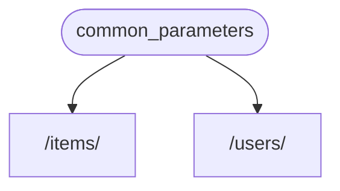
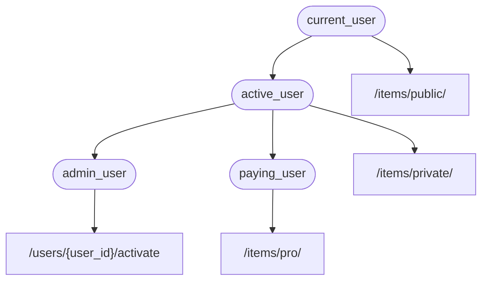

# Dependencies

**FastAPI** có một hệ thống **<abbr title="also known as components, resources, providers, services, injectables">Dependency Injection</abbr>** rất mạnh mẽ nhưng cũng trực quan.

Nó được thiết kế để sử dụng một cách đơn giản, giúp các lập trình viên dễ dàng tích hợp vào các component khác với **FastAPI**.

## "Dependency Injection" là gì?

**"Dependency Injection"** trong lập trình có nghĩa là có một cách để code của bạn (trong trường hợp này là các *path operation function*) khai báo những thứ mà nó cần để hoạt động và sử dụng: "dependencies".

Tiếp đó, hệ thống (trong trường hợp này là **FastAPI**) sẽ chịu trách nhiệm thực hiện những gì cần thiết để cung cấp cho code của bạn những dependencies thiết yếu ("inject" các dependencies).

Điều này rất hữu ích khi bạn cần:

* Có logic dùng chung (code logic giống nhau lặp đi lặp lại).
* Chia sẻ kết nối cơ sở dữ liệu.
* Thực thi bảo mật, xác thực, phân quyền, v.v.
* Và nhiều thứ khác...

Làm tất cả những điều này, trong khi vẫn giảm thiểu việc lặp lại code.

## Bước đầu tiên

Hãy xem một ví dụ rất đơn giản. Nó sẽ rất đơn giản, đến mức, cho đến hiện tại, nó không hữu ích lắm.

Nhưng cách này cho phép chúng ta tập trung vào cách hệ thống **Dependency Injection** hoạt động.

### Tạo một dependency, hay "dependable"

Đầu tiên, hãy tập trung vào dependency.

Đó là một hàm có thể nhận tất cả các tham số giống như các *path operation function*:

{* ../../docs_src/dependencies/tutorial001_an_py310.py hl[8:9] *}

Chỉ vậy thôi.

**2 dòng**.

Và nó có cùng hình dạng và cấu trúc như tất cả các *path operation function* của bạn.

Bạn có thể nghĩ về nó như là một *path operation function* mà không có "decorator" (không có `@app.get("/some-path")`).

Và nó có thể trả về bất kỳ điều gì bạn muốn.

Trong trường hợp này, dependency này mong đợi:

* Một tham số query tùy chọn `q` là `str`.
* Một tham số query tùy chọn `skip` là `int`, và mặc định là `0`.
* Một tham số query tùy chọn `limit` là `int`, và mặc định là `100`.

Và sau đó nó chỉ trả về một `dict` chứa những giá trị đó.

/// info

**FastAPI** đã hỗ trợ `Annotated` (và bắt đầu khuyến khích nó) trong phiên bản 0.95.0.

Nếu bạn có phiên bản cũ hơn, bạn sẽ nhận được lỗi khi cố gắng sử dụng `Annotated`.

Hãy đảm bảo bạn [nâng cấp phiên bản FastAPI](../../deployment/versions.md#upgrading-the-fastapi-versions){.internal-link target=_blank} lên ít nhất là 0.95.1 trước khi sử dụng `Annotated`.

///

### Import `Depends`

{* ../../docs_src/dependencies/tutorial001_an_py310.py hl[3] *}

### Khai báo dependency, trong "dependant"

Tương tự như bạn sử dụng `Body`, `Query`, v.v. với tham số của *path operation function*, hãy sử dụng `Depends` với một tham số mới:

{* ../../docs_src/dependencies/tutorial001_an_py310.py hl[13,18] *}

Mặc dù bạn sử dụng `Depends` trong tham số của hàm của bạn theo cách tương tự như bạn sử dụng `Body`, `Query`, v.v., `Depends` hoạt động khác một chút.

Bạn chỉ cung cấp `Depends` một tham số duy nhất.

Tham số đó phải là một hàm.

Bạn **không gọi nó** trực tiếp (không thêm dấu ngoặc nhọn ở cuối), bạn chỉ cần truyền nó làm tham số cho `Depends()`.

Và hàm đó nhận tham số theo cách tương tự như *path operation function* do.

/// tip

Bạn sẽ thấy những "thứ" khác, ngoài hàm, có thể được sử dụng làm dependencies trong chương tiếp theo.

///

Mỗi khi có một yêu cầu mới đến, **FastAPI** sẽ chịu trách nhiệm:

* Gọi hàm dependency ("dependable") của bạn với các tham số chính xác.
* Lấy kết quả từ hàm của bạn.
* Gán kết quả đó cho tham số trong *path operation function* của bạn.



Như vậy, bạn chỉ viết code chung một lần và **FastAPI** sẽ chịu trách nhiệm gọi nó cho các *path operation function* của bạn.

/// check

Lưu ý rằng bạn không cần tạo một lớp đặc biệt và chuyển nó đi đâu đó để **FastAPI** "đăng ký" nó hoặc điều gì tương tự.

Bạn chỉ cần truyền nó cho `Depends` và **FastAPI** sẽ biết làm gì tiếp theo.

///

## Chia sẻ `Annotated` dependencies

Trong các ví dụ trên, bạn thấy rằng có một chút **lặp lại code**.

Khi bạn cần sử dụng dependency `common_parameters()`, bạn phải viết toàn bộ tham số với chú thích kiểu và `Depends()`:

```Python
commons: Annotated[dict, Depends(common_parameters)]
```

Nhưng vì chúng ta đang sử dụng `Annotated`, chúng ta có thể lưu giá trị `Annotated` trong một biến và sử dụng nó ở nhiều nơi:

{* ../../docs_src/dependencies/tutorial001_02_an_py310.py hl[12,16,21] *}

/// tip

Đây chỉ là code Python tiêu chuẩn, nó được gọi là "type alias", thực ra không phải là đặc trưng của **FastAPI**.

Nhưng vì **FastAPI** dựa trên các tiêu chuẩn Python, bao gồm `Annotated`, bạn có thể sử dụng cách này trong code của bạn. 😎

///

Dependencies sẽ hoạt động như kỳ vòng, và **phần tuyệt nhất** là **thông tin về kiểu** sẽ được bảo toàn, nghĩa là các editor của bạn sẽ có thể cung cấp **autocomplete** và **inline errors**, v.v. Tương tự cho các công cụ khác như `mypy`.

Điều này sẽ rất hữu ích khi bạn sử dụng nó trong một **code base lớn**, trong đó bạn sử dụng **các dependencies giống nhau** lặp đi lặp lại trong **nhiều *path operation function***.

## `async` hay không `async`

Vì dependencies cũng sẽ được gọi bởi **FastAPI** (giống như các *path operation function* của bạn), các quy tắc tương tự áp dụng khi bạn định nghĩa các hàm của mình.

Bạn có thể sử dụng `async def` hoặc `def` bình thường.

Bạn có thể khai báo dependencies với `async def` bên trong `def` *path operation functions*, hoặc `def` dependencies bên trong `async def` *path operation functions*, v.v.

Không quan trọng. **FastAPI** sẽ biết làm gì.

/// note

Nếu bạn chưa rõ, hãy xem phần [Async: *"In a hurry?"*](../../async.md#in-a-hurry){.internal-link target=_blank} trong docs.

///

## Tích hợp với OpenAPI

Tất cả các khai báo của request, xác thực và yêu cầu của dependencies của bạn (và sub-dependencies) sẽ được tích hợp trong cùng một OpenAPI schema.

Vì vậy, hệ thống tài liệu tương tác sẽ có tất cả thông tin từ các dependencies này:


## Cách sử dụng đơn giản

Nếu bạn nhìn vào *path operation function*, bạn sẽ thấy chúng được khai báo để được sử dụng khi một *path* và *operation* trùng khớp, và sau đó **FastAPI** sẽ chịu trách nhiệm gọi hàm với các tham số chính xác, trích xuất dữ liệu từ request.

Thực ra, tất cả (hoặc hầu hết) các framework web hoạt động tương tự như vậy.

Bạn không bao giờ gọi các hàm đó trực tiếp. Chúng được gọi bởi framework của bạn (trong trường hợp này, **FastAPI**).

Với hệ thống Dependency Injection, bạn cũng có thể cho **FastAPI** biết rằng *path operation function* của bạn cũng "phụ thuộc" vào điều gì đó khác, cần được thực thi trước hàm này, và **FastAPI** sẽ chịu trách nhiệm thực thi nó và "injecting" kết quả.

Các thuật ngữ khác thường được sử dụng cho ý tưởng giống như "dependency injection" là:

* resources
* providers
* services
* injectables
* components

## **FastAPI** plug-ins

Các phần tích hợp và "plug-ins" có thể được xây dựng bằng cách sử dụng hệ thống **Dependency Injection**. Tuy nhiên, thực tế là bạn **không cần phải tạo "plug-ins"**, vì chỉ cần sử dụng dependencies, bạn hoàn toàn có thể khai báo không giới hạn các phần tích hợp và tương tác cho các *path operation function*.

Và dependencies có thể được tạo trong cách rất đơn giản và trực quan cho phép bạn chỉ cần import các package Python bạn cần, và tích hợp chúng với các hàm API của bạn trong vài dòng code, *đúng nghĩa đen*.

Bạn sẽ thấy nhiều ví dụ về điều này trong các chương tiếp theo, về cơ sở dữ liệu quan hệ và NoSQL, bảo mật, v.v.

## Tính tương thích của **FastAPI**

Sự đơn giản của hệ thống Dependency Injection làm cho **FastAPI** tương thích với:

* tất cả các cơ sở dữ liệu quan hệ
* cơ sở dữ liệu NoSQL
* các package bên ngoài
* các API bên ngoài
* các hệ thống xác thực và phân quyền
* các hệ thống theo dõi sử dụng API
* các hệ thống chèn dữ liệu phản hồi
* v.v.

## Đơn giản và Mạnh mẽ

Mặc dù hệ thống Dependency Injection có cấu trúc phân cấp là rất đơn giản để định nghĩa và sử dụng, nhưng nó vẫn rất mạnh mẽ.

Bạn có thể định nghĩa dependencies này mà cũng đồng thời định nghĩa dependencies khác.

Cuối cùng, một cây phân cấp dependencies được xây dựng, và hệ thống **Dependency Injection** sẽ chịu trách nhiệm giải quyết tất cả các dependencies này (và các dependencies con của chúng) và cung cấp (inject) kết quả ở mỗi bước.

Ví dụ, giả sử bạn có 4 endpoint API (*path operations*):

* `/items/public/`
* `/items/private/`
* `/users/{user_id}/activate`
* `/items/pro/`

bạn có thể thêm các yêu cầu quyền khác nhau cho mỗi endpoint chỉ với dependencies và sub-dependencies:



## Tích hợp với **OpenAPI**

Tất cả các dependencies, trong khi khai báo yêu cầu của chúng, cũng thêm các tham số, kiểm tra, v.v. vào các *path operations*.

**FastAPI** sẽ chịu trách nhiệm thêm tất cả điều này vào OpenAPI schema, đảm bảo nó được hiển thị trong các hệ thống tài liệu tương tác.
