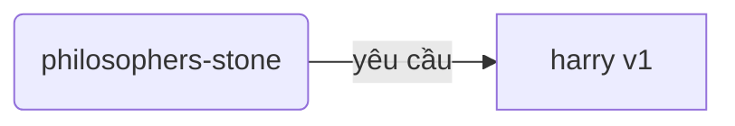
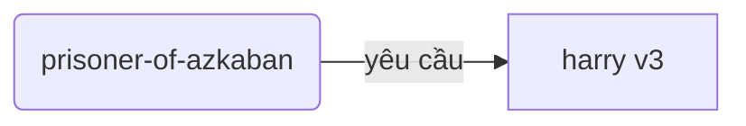
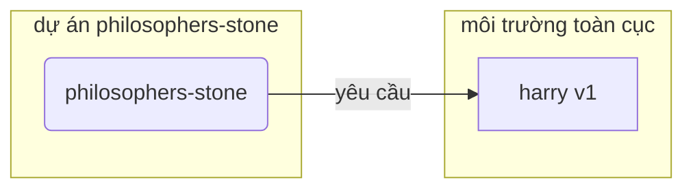
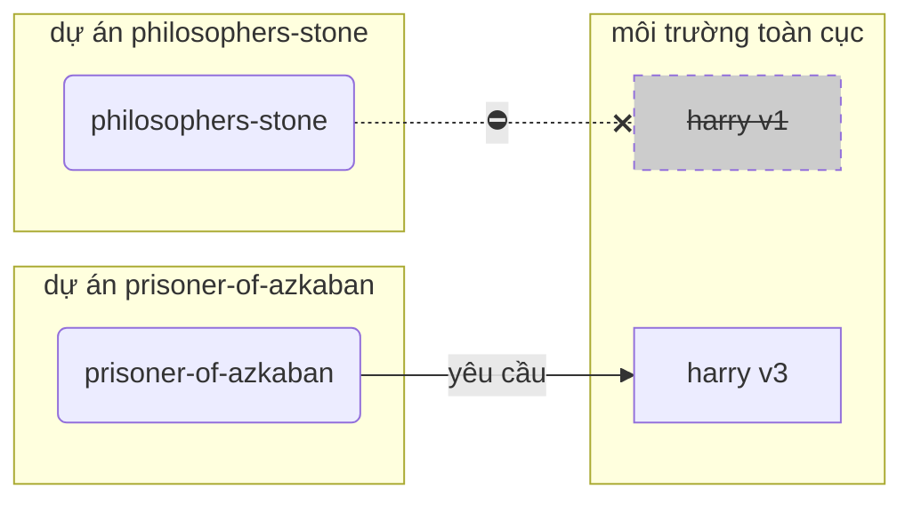
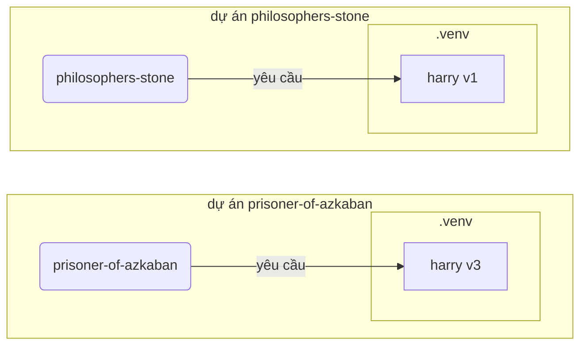

# Môi trường ảo

Khi bạn làm việc với các dự án Python, có lẽ bạn nên sử dụng **môi trường ảo** (hoặc một cơ chế tương tự) để cô lập các gói bạn cài đặt cho mỗi dự án.

/// info

Nếu bạn đã biết về môi trường ảo, cách tạo và sử dụng chúng, bạn có thể bỏ qua phần này. 🤓

///

/// tip

**Môi trường ảo** khác với **biến môi trường**.

**Biến môi trường** là một biến trong hệ thống có thể được sử dụng bởi các chương trình.

**Môi trường ảo** là một thư mục với một số tệp bên trong nó.

///

/// info

Trang này sẽ dạy bạn cách sử dụng **môi trường ảo** và cách chúng hoạt động.

Nếu bạn đã sẵn sàng áp dụng một **công cụ quản lý mọi thứ** cho bạn (bao gồm cả việc cài đặt Python), hãy thử <a href="https://github.com/astral-sh/uv" class="external-link" target="_blank">uv</a>.

///

## Tạo một Dự án

Đầu tiên, tạo một thư mục cho dự án của bạn.

Thông thường, tôi tạo một thư mục có tên là `code` bên trong thư mục home/user của mình.

Và bên trong đó, tôi tạo một thư mục cho mỗi dự án.

<div class="termy">

```console
// Đi đến thư mục home
$ cd
// Tạo một thư mục cho tất cả các dự án code của bạn
$ mkdir code
// Đi vào thư mục code đó
$ cd code
// Tạo một thư mục cho dự án này
$ mkdir awesome-project
// Đi vào thư mục dự án đó
$ cd awesome-project
```

</div>

## Tạo một Môi trường ảo

Khi bạn bắt đầu làm việc trên một dự án Python **lần đầu tiên**, hãy tạo một môi trường ảo **<abbr title="có các lựa chọn khác, đây chỉ là một hướng dẫn đơn giản">bên trong dự án của bạn</abbr>**.

/// tip

Bạn chỉ cần làm điều này **một lần cho mỗi dự án**, không phải mỗi lần bạn làm việc.

///

//// tab | `venv`

Để tạo một môi trường ảo, bạn có thể sử dụng module `venv` đi kèm với Python.

<div class="termy">

```console
$ python -m venv .venv
```

</div>

/// details | Ý nghĩa của lệnh đó

- `python`: sử dụng chương trình có tên là `python`
- `-m`: gọi một module như một script, chúng ta sẽ cho biết module nào tiếp theo
- `venv`: sử dụng module có tên là `venv` thường được cài đặt sẵn với Python
- `.venv`: tạo môi trường ảo trong thư mục mới có tên `.venv`

///

////

//// tab | `uv`

Nếu bạn đã cài đặt <a href="https://github.com/astral-sh/uv" class="external-link" target="_blank">`uv`</a>, bạn có thể sử dụng nó để tạo một môi trường ảo.

<div class="termy">

```console
$ uv venv
```

</div>

/// tip

Mặc định, `uv` sẽ tạo một môi trường ảo trong một thư mục có tên `.venv`.

Nhưng bạn có thể tùy chỉnh nó bằng cách truyền một đối số bổ sung với tên thư mục.

///

////

Lệnh đó tạo một môi trường ảo mới trong một thư mục có tên `.venv`.

/// details | `.venv` hoặc tên khác

Bạn có thể tạo môi trường ảo trong một thư mục khác, nhưng có một quy ước gọi nó là `.venv`.

///

## Kích hoạt Môi trường ảo

Kích hoạt môi trường ảo mới để bất kỳ lệnh Python nào bạn chạy hoặc gói nào bạn cài đặt đều sử dụng nó.

/// tip

Làm điều này **mỗi lần** bạn bắt đầu một **phiên terminal mới** để làm việc trên dự án.

///

//// tab | Linux, macOS

<div class="termy">

```console
$ source .venv/bin/activate
```

</div>

////

//// tab | Windows PowerShell

<div class="termy">

```console
$ .venv\Scripts\Activate.ps1
```

</div>

////

//// tab | Windows Bash

Hoặc nếu bạn sử dụng Bash cho Windows (ví dụ: <a href="https://gitforwindows.org/" class="external-link" target="_blank">Git Bash</a>):

<div class="termy">

```console
$ source .venv/Scripts/activate
```

</div>

////

/// tip

Mỗi khi bạn cài đặt một **gói mới** trong môi trường đó, hãy **kích hoạt** lại môi trường.

Điều này đảm bảo rằng nếu bạn sử dụng một **chương trình terminal (<abbr title="giao diện dòng lệnh">CLI</abbr>)** được cài đặt bởi gói đó, bạn sẽ sử dụng cái từ môi trường ảo của bạn và không phải bất kỳ cái nào khác có thể được cài đặt toàn cục, có thể với một phiên bản khác với những gì bạn cần.

///

## Kiểm tra Môi trường ảo đã Kích hoạt

Kiểm tra xem môi trường ảo đã được kích hoạt chưa (lệnh trước đó đã hoạt động).

/// tip

Điều này là **tùy chọn**, nhưng nó là một cách tốt để **kiểm tra** rằng mọi thứ đang hoạt động như mong đợi và bạn ang sử dụng môi trường ảo mà bạn dự định.

///

//// tab | Linux, macOS, Windows Bash

<div class="termy">

```console
$ which python

/home/user/code/awesome-project/.venv/bin/python
```

</div>

Nếu nó hiển thị tệp nhị phân `python` tại `.venv/bin/python`, bên trong dự án của bạn (trong trường hợp này là `awesome-project`), thì nó đã hoạt động. 🎉

////

//// tab | Windows PowerShell

<div class="termy">

```console
$ Get-Command python

C:\Users\user\code\awesome-project\.venv\Scripts\python
```

</div>

Nếu nó hiển thị tệp nhị phân `python` tại `.venv\Scripts\python`, bên trong dự án của bạn (trong trường hợp này là `awesome-project`), thì nó đã hoạt động. 🎉

////

## Nâng cấp `pip`

/// tip

Nếu bạn sử dụng <a href="https://github.com/astral-sh/uv" class="external-link" target="_blank">`uv`</a>, bạn sẽ sử dụng nó để cài đặt mọi thứ thay vì `pip`, vì vậy bạn không cần nâng cấp `pip`. 😎

///

Nếu bạn đang sử dụng `pip` để cài đặt các gói (nó đi kèm mặc định với Python), bạn nên **nâng cấp** nó lên phiên bản mới nhất.

Nhiều lỗi kỳ lạ khi cài đặt một gói được giải quyết chỉ bằng cách nâng cấp `pip` trước.

/// tip

Thông thường, bạn sẽ làm điều này **một lần**, ngay sau khi tạo môi trường ảo.

///

Đảm bảo môi trường ảo đang hoạt động (với lệnh ở trên) và sau đó chạy:

<div class="termy">

```console
$ python -m pip install --upgrade pip

---> 100%
```

</div>

## Thêm `.gitignore`

Nếu bạn đang sử dụng **Git** (bạn nên), hãy thêm một tệp `.gitignore` để loại trừ mọi thứ trong `.venv` của bạn khỏi Git.

/// tip

Nếu bạn đã sử dụng <a href="https://github.com/astral-sh/uv" class="external-link" target="_blank">`uv`</a> để tạo môi trường ảo, nó đã làm điều này cho bạn, bạn có thể bỏ qua bước này. 😎

///

/// tip

Làm điều này **một lần**, ngay sau khi bạn tạo môi trường ảo.

///

<div class="termy">

```console
$ echo "*" > .venv/.gitignore
```

</div>

/// details | Ý nghĩa của lệnh đó

- `echo "*"`: sẽ "in" văn bản `*` trong terminal (phần tiếp theo thay đổi điều đó một chút)
- `>`: bất cứ thứ gì được in ra terminal bởi lệnh ở bên trái của `>` sẽ không được in ra mà thay vào đó được ghi vào tệp ở bên phải của `>`
- `.gitignore`: tên của tệp nơi văn bản sẽ được ghi

Và `*` đối với Git có nghĩa là "mọi thứ". Vì vậy, nó sẽ bỏ qua mọi thứ trong thư mục `.venv`.

Lệnh đó sẽ tạo một tệp `.gitignore` với nội dung:

```gitignore
*
```

///

## Cài đặt Gói

Sau khi kích hoạt môi trường, bạn có thể cài đặt các gói vào nó.

/// tip

Làm điều này **một lần** khi cài đặt hoặc nâng cấp các gói mà dự án của bạn cần.

Nếu bạn cần nâng cấp một phiên bản hoặc thêm một gói mới, bạn sẽ **làm điều này lại**.

///

### Cài đặt Gói Trực tiếp

Nếu bạn đang vội và không muốn sử dụng một tệp để khai báo yêu cầu gói của dự án, bạn có thể cài đặt chúng trực tiếp.

/// tip

Đó là một ý tưởng (rất) tốt để đặt các gói và phiên bản mà chương trình của bạn cần vào một tệp (ví dụ: `requirements.txt` hoặc `pyproject.toml`).

///

//// tab | `pip`

<div class="termy">

```console
$ pip install "fastapi[standard]"

---> 100%
```

</div>

////

//// tab | `uv`

Nếu bạn có <a href="https://github.com/astral-sh/uv" class="external-link" target="_blank">`uv`</a>:

<div class="termy">

```console
$ uv pip install "fastapi[standard]"
---> 100%
```

</div>

////

### Cài đặt từ `requirements.txt`

Nếu bạn có một tệp `requirements.txt`, bạn có thể sử dụng nó để cài đặt các gói của nó.

//// tab | `pip`

<div class="termy">

```console
$ pip install -r requirements.txt
---> 100%
```

</div>

////

//// tab | `uv`

Nếu bạn có <a href="https://github.com/astral-sh/uv" class="external-link" target="_blank">`uv`</a>:

<div class="termy">

```console
$ uv pip install -r requirements.txt
---> 100%
```

</div>

////

/// details | `requirements.txt`

Một tệp `requirements.txt` với một số gói có thể trông như thế này:

```requirements.txt
fastapi[standard]==0.113.0
pydantic==2.8.0
```

///

## Chạy Chương trình của Bạn

Sau khi bạn đã kích hoạt môi trường ảo, bạn có thể chạy chương trình của mình, và nó sẽ sử dụng Python bên trong môi trường ảo của bạn với các gói bạn đã cài đặt ở đó.

<div class="termy">

```console
$ python main.py

Hello World
```

</div>

## Cấu hình Trình soạn thảo của Bạn

Có lẽ bạn sẽ sử dụng một trình soạn thảo, hãy đảm bảo bạn cấu hình nó để sử dụng cùng môi trường ảo mà bạn đã tạo (nó có thể sẽ tự động phát hiện) để bạn có thể nhận được tự động hoàn thành và lỗi nội tuyến.

Ví dụ:

- <a href="https://code.visualstudio.com/docs/python/environments#_select-and-activate-an-environment" class="external-link" target="_blank">VS Code</a>
- <a href="https://www.jetbrains.com/help/pycharm/creating-virtual-environment.html" class="external-link" target="_blank">PyCharm</a>

/// tip

Thông thường, bạn chỉ phải làm điều này **một lần**, khi bạn tạo môi trường ảo.

///

## Hủy kích hoạt Môi trường ảo

Khi bạn đã hoàn thành công việc trên dự án, bạn có thể **hủy kích hoạt** môi trường ảo.

<div class="termy">

```console
$ deactivate
```

</div>

Bằng cách này, khi bạn chạy `python`, nó sẽ không cố gắng chạy từ môi trường ảo đó với các gói được cài đặt ở đó.

## Sẵn sàng để Làm việc

Bây giờ bạn đã sẵn sàng để bắt đầu làm việc trên dự án của mình.

/// tip

Bạn có muốn hiểu tất cả những điều trên không?

Tiếp tục đọc. 👇🤓

///

## Tại sao cần Môi trường ảo

Để làm việc với FastAPI, bạn cần cài đặt <a href="https://www.python.org/" class="external-link" target="_blank">Python</a>.

Sau đó, bạn sẽ cần **cài đặt** FastAPI và bất kỳ **gói** nào khác bạn muốn sử dụng.

Để cài đặt các gói, thông thường bạn sẽ sử dụng lệnh `pip` đi kèm với Python (hoặc các lựa chọn thay thế tương tự).

Tuy nhiên, nếu bạn chỉ sử dụng `pip` trực tiếp, các gói sẽ được cài đặt trong **môi trường Python toàn cục** của bạn (cài đặt Python toàn cục).

### Vấn đề

Vậy, vấn đề gì khi cài đặt các gói trong môi trường Python toàn cục?

Đến một lúc nào đó, bạn có thể sẽ viết nhiều chương trình khác nhau phụ thuộc vào **các gói khác nhau**. Và một số dự án bạn làm việc sẽ phụ thuộc vào **các phiên bản khác nhau** của cùng một gói. 😱

Ví dụ, bạn có thể tạo một dự án có tên là `philosophers-stone`, chương trình này phụ thuộc vào một gói khác có tên là **`harry`, sử dụng phiên bản `1`**. Vì vậy, bạn cần cài đặt `harry`.



Sau đó, tại một thời điểm nào đó, bạn tạo một dự án khác có tên là `prisoner-of-azkaban`, và dự án này cũng phụ thuộc vào `harry`, nhưng dự án này cần **`harry` phiên bản `3`**.



Nhưng bây giờ vấn đề là, nếu bạn cài đặt các gói toàn cục (trong môi trường toàn cục) thay vì trong một **môi trường ảo** cục bộ, bạn sẽ phải chọn phiên bản nào của `harry` để cài đặt.

Nếu bạn muốn chạy `philosophers-stone`, bạn sẽ cần cài đặt trước `harry` phiên bản `1`, ví dụ với:

<div class="termy">

```console
$ pip install "harry==1"
```

</div>

Và sau đó bạn sẽ có `harry` phiên bản `1` được cài đặt trong môi trường Python toàn cục của bạn.



Nhưng sau đó nếu bạn muốn chạy `prisoner-of-azkaban`, bạn sẽ cần gỡ cài đặt `harry` phiên bản `1` và cài đặt `harry` phiên bản `3` (hoặc chỉ cần cài đặt phiên bản `3` sẽ tự động gỡ cài đặt phiên bản `1`).

<div class="termy">

```console
$ pip install "harry==3"
```

</div>

Và sau đó bạn sẽ có `harry` phiên bản `3` được cài đặt trong môi trường Python toàn cục của bạn.

Và nếu bạn cố gắng chạy `philosophers-stone` lại, có khả năng nó sẽ **không hoạt động** vì nó cần `harry` phiên bản `1`.



/// tip

Rất phổ biến trong các gói Python là cố gắng tốt nhất để **tránh các thay đổi gây hỏng** trong **các phiên bản mới**, nhưng tốt hơn là nên cẩn thận và cài đặt các phiên bản mới một cách có chủ ý và khi bạn có thể chạy các bài kiểm tra để kiểm tra mọi thứ đang hoạt động chính xác.

///

Bây giờ, hãy tưởng tượng điều đó với **nhiều** **gói** khác mà tất cả các **dự án** của bạn phụ thuộc vào. Điều đó rất khó quản lý. V bạn có thể sẽ kết thúc với việc chạy một số dự án với một số **phiên bản không tương thích** của các gói, và không biết tại sao một cái gì đó không hoạt động.

Ngoài ra, tùy thuộc vào hệ điều hành của bạn (ví dụ: Linux, Windows, macOS), nó có thể đã có sẵn Python được cài đặt. Và trong trường hợp đó, có thể nó đã có một số gói được cài đặt sẵn với một số phiên bản cụ thể **cần thiết cho hệ thống của bạn**. Nếu bạn cài đặt các gói trong môi trường Python toàn cục, bạn có thể kết thúc với việc **phá vỡ** một số chương trình đi kèm với hệ điều hành của bạn.

## Các gói được Cài đặt ở đâu

Khi bạn cài đặt Python, nó tạo ra một số thư mục với một số tệp trong máy tính của bạn.

Một số thư mục này chịu trách nhiệm chứa tất cả các gói bạn cài đặt.

Khi bạn chạy:

<div class="termy">

```console
// Đừng chạy cái này ngay bây giờ, nó chỉ là một ví dụ 🤓
$ pip install "fastapi[standard]"
---> 100%
```

</div>

Điều đó sẽ tải xuống một tệp nén chứa mã FastAPI, thường từ <a href="https://pypi.org/project/fastapi/" class="external-link" target="_blank">PyPI</a>.

Nó cũng sẽ **tải xuống** các tệp cho các gói khác mà FastAPI phụ thuộc vào.

Sau đó, nó sẽ **giải nén** tất cả các tệp đó và đặt chúng vào một thư mục trong máy tính của bạn.

Mặc định, nó sẽ đặt các tệp được tải xuống và giải nén trong thư mục đi kèm với cài đặt Python của bạn, đó là **môi trường toàn cục**.

## Môi trường ảo là gì

Giải pháp cho các vấn đề khi có tất cả các gói trong môi trường toàn cục là sử dụng **môi trường ảo cho mỗi dự án** bạn làm việc.

Môi trường ảo là một **thư mục**, rất giống với thư mục toàn cục, nơi bạn có thể cài đặt các gói cho một dự án.

Bằng cách này, mỗi dự án sẽ có môi trường ảo riêng của nó (thư mục `.venv`) với các gói riêng.



## Kích hoạt Môi trường ảo nghĩa là gì

Khi bạn kích hoạt một môi trường ảo, ví dụ với:

//// tab | Linux, macOS

<div class="termy">

```console
$ source .venv/bin/activate
```

</div>

////

//// tab | Windows PowerShell

<div class="termy">

```console
$ .venv\Scripts\Activate.ps1
```

</div>

////

//// tab | Windows Bash

Hoặc nếu bạn sử dụng Bash cho Windows (ví dụ: <a href="https://gitforwindows.org/" class="external-link" target="_blank">Git Bash</a>):

<div class="termy">

```console
$ source .venv/Scripts/activate
```

</div>

////

Lệnh đó sẽ tạo hoặc sửa đổi một số [biến môi trường](environment-variables.md){.internal-link target=\_blank} sẽ có sẵn cho các lệnh tiếp theo.

Một trong những biến đó là biến `PATH`.

/// tip

Bạn có thể tìm hiểu thêm về biến môi trường `PATH` trong phần [Biến Môi trường](environment-variables.md#path-environment-variable){.internal-link target=\_blank}.

///

Kích hoạt một môi trường ảo thêm đường dẫn `.venv/bin` (trên Linux và macOS) hoặc `.venv\Scripts` (trên Windows) vào biến môi trường `PATH`.

Giả sử rằng trước khi kích hoạt môi trường, biến `PATH` trông như thế này:

//// tab | Linux, macOS

```plaintext
/usr/bin:/bin:/usr/sbin:/sbin
```

Điều đó có nghĩa là hệ thống sẽ tìm kiếm các chương trình trong:

- `/usr/bin`
- `/bin`
- `/usr/sbin`
- `/sbin`

////

//// tab | Windows

```plaintext
C:\Windows\System32
```

Điều đó có nghĩa là hệ thống sẽ tìm kiếm các chương trình trong:

- `C:\Windows\System32`

////

Sau khi kích hoạt môi trường ảo, biến `PATH` sẽ trông giống như thế này:

//// tab | Linux, macOS

```plaintext
/home/user/code/awesome-project/.venv/bin:/usr/bin:/bin:/usr/sbin:/sbin
```

Điều đó có nghĩa là hệ thống sẽ bắt đầu tìm kiếm các chương trình trước tiên trong:

```plaintext
/home/user/code/awesome-project/.venv/bin
```

trước khi tìm kiếm trong các thư mục khác.

Vì vậy, khi bạn gõ `python` trong terminal, hệ thống sẽ tìm thấy chương trình Python trong

```plaintext
/home/user/code/awesome-project/.venv/bin/python
```

và sử dụng chương trình đó.

////

//// tab | Windows

```plaintext
C:\Users\user\code\awesome-project\.venv\Scripts;C:\Windows\System32
```

Điều đó có nghĩa là hệ thống sẽ bắt đầu tìm kiếm các chương trình trước tiên trong:

```plaintext
C:\Users\user\code\awesome-project\.venv\Scripts
```

trước khi tìm kiếm trong các thư mục khác.

Vì vậy, khi bạn gõ `python` trong terminal, hệ thống sẽ tìm thấy chương trình Python trong

```plaintext
C:\Users\user\code\awesome-project\.venv\Scripts\python
```

và sử dụng chương trình đó.

////

Một chi tiết quan trọng là nó sẽ đặt đường dẫn môi trường ảo ở **đầu** biến `PATH`. Hệ thống sẽ tìm thấy nó **trước** khi tìm thấy bất kỳ Python nào khác có sẵn. Bằng cách này, khi bạn chạy `python`, nó sẽ sử dụng Python **từ môi trường ảo** thay vì bất kỳ `python` nào khác (ví dụ, một `python` từ môi trường toàn cục).

Kích hoạt một môi trường ảo cũng thay đổi một vài thứ khác, nhưng đây là một trong những điều quan trọng nhất nó làm.

## Kiểm tra Môi trường ảo

Khi bạn kiểm tra xem một môi trường ảo có đang hoạt động hay không, ví dụ với:

//// tab | Linux, macOS, Windows Bash

<div class="termy">

```console
$ which python

/home/user/code/awesome-project/.venv/bin/python
```

</div>

////

//// tab | Windows PowerShell

<div class="termy">

```console
$ Get-Command python

C:\Users\user\code\awesome-project\.venv\Scripts\python
```

</div>

////

Điều đó có nghĩa là chương trình `python` sẽ được sử dụng là cái **trong môi trường ảo**.

Bạn sử dụng `which` trong Linux và macOS và `Get-Command` trong Windows PowerShell.

Cách lệnh đó hoạt động là nó sẽ kiểm tra trong biến môi trường `PATH`, đi qua **từng đường dẫn theo thứ tự**, tìm kiếm chương trình có tên `python`. Khi nó tìm thấy, nó sẽ **hiển thị cho bạn đường dẫn** đến chương trình đó.

Phần quan trọng nhất là khi bạn gọi `python`, đó chính xác là "`python`" sẽ được thực thi.

Vì vậy, bạn có thể xác nhận xem bạn có đang ở trong đúng môi trường ảo hay không.

/// tip

Rất dễ kích hoạt một môi trường ảo, nhận được một Python, và sau đó **đi đến một dự án khác**.

Và dự án thứ hai **sẽ không hoạt động** vì bạn đang sử dụng **Python không chính xác**, từ một môi trường ảo cho một dự án khác.

Việc có thể kiểm tra `python` nào đang được sử dụng là rất hữu ích. 🤓

///

## Tại sao cần Hủy kích hoạt Môi trường ảo

Ví dụ, bạn có thể đang làm việc trên một dự án `philosophers-stone`, **kích hoạt môi trường ảo đó**, cài đặt các gói và làm việc với môi trường đó.

Và sau đó bạn muốn làm việc trên **một dự án khác** `prisoner-of-azkaban`.

Bạn đi đến dự án đó:

<div class="termy">

```console
$ cd ~/code/prisoner-of-azkaban
```

</div>

Nếu bạn không hủy kích hoạt môi trường ảo cho `philosophers-stone`, khi bạn chạy `python` trong terminal, nó sẽ cố gắng sử dụng Python từ `philosophers-stone`.

<div class="termy">

```console
$ cd ~/code/prisoner-of-azkaban

$ python main.py

// Lỗi khi import sirius, nó không được cài đặt 😱
Traceback (most recent call last):
    File "main.py", line 1, in <module>
        import sirius
```

</div>

Nhưng nếu bạn hủy kích hoạt môi trường ảo và kích hoạt môi trường mới cho `prisoner-of-askaban` thì khi bạn chạy `python` nó sẽ sử dụng Python từ môi trường ảo trong `prisoner-of-azkaban`.

<div class="termy">

```console
$ cd ~/code/prisoner-of-azkaban

// Bạn không cần phải ở trong thư mục cũ để hủy kích hoạt, bạn có thể làm điều đó ở bất cứ đâu, ngay cả sau khi đi đến dự án khác 😎
$ deactivate

// Kích hoạt môi trường ảo trong prisoner-of-azkaban/.venv 🚀
$ source .venv/bin/activate

// Bây giờ khi bạn chạy python, nó sẽ tìm thấy gói sirius được cài đặt trong môi trường ảo này ✨
$ python main.py

I solemnly swear 🐺
```

</div>

## Các Lựa chọn Thay thế

Đây là một hướng dẫn đơn giản để giúp bạn bắt đầu và dạy bạn cách mọi thứ hoạt động **bên dưới**.

Có nhiều **lựa chọn thay thế** để quản lý môi trường ảo, phụ thuộc gói (yêu cầu), dự án.

Khi bạn đã sẵn sàng và muốn sử dụng một công cụ để **quản lý toàn bộ dự án**, phụ thuộc gói, môi trường ảo, v.v., tôi sẽ gợi ý bạn thử <a href="https://github.com/astral-sh/uv" class="external-link" target="_blank">uv</a>.

`uv` có thể làm nhiều việc, nó có thể:

- **Cài đặt Python** cho bạn, bao gồm cả các phiên bản khác nhau
- Quản lý **môi trường ảo** cho các dự án của bạn
- Cài đặt **các gói**
- Quản lý **phụ thuộc và phiên bản gói** cho dự án của bạn
- Đảm bảo bạn có một bộ **chính xác** các gói và phiên bản để cài đặt, bao gồm cả các phụ thuộc của chúng, để bạn có thể chắc chắn rằng bạn có thể chạy dự án của mình trong môi trường sản xuất chính xác như khi bạn phát triển trên máy tính của mình, điều này được gọi là **khóa**
- Và nhiều thứ khác

## Kết luận

Nếu bạn đã đọc và hiểu tất cả điều này, bây giờ **bạn biết nhiều hơn** về môi trường ảo so với nhiều nhà phát triển khác ngoài kia. 🤓

Biết những chi tiết này có thể sẽ hữu ích trong tương lai khi bạn đang gỡ lỗi một cái gì đó có vẻ phức tạp, nhưng bạn sẽ biết **cách mọi thứ hoạt động bên dưới môi trường ảo**. 😎
