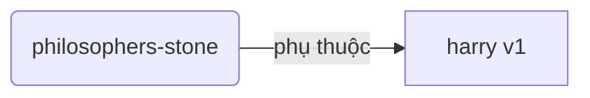
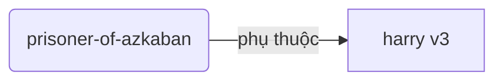
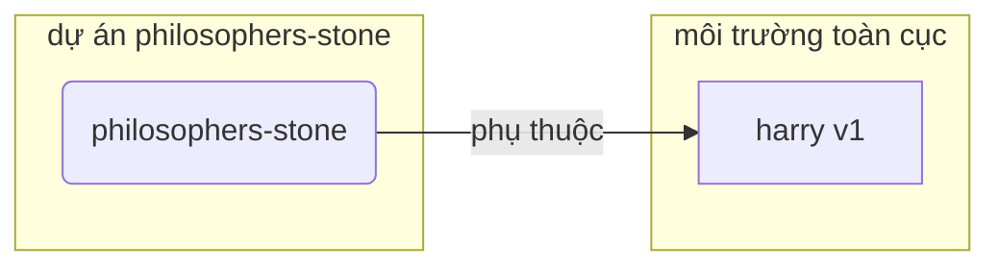
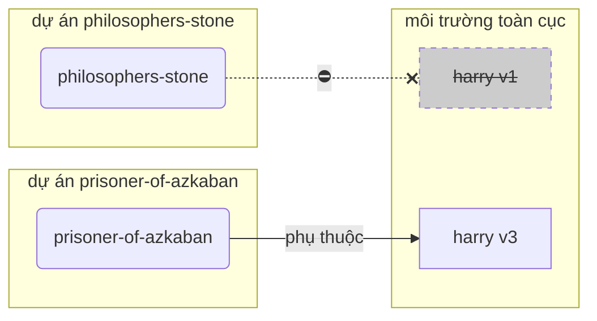
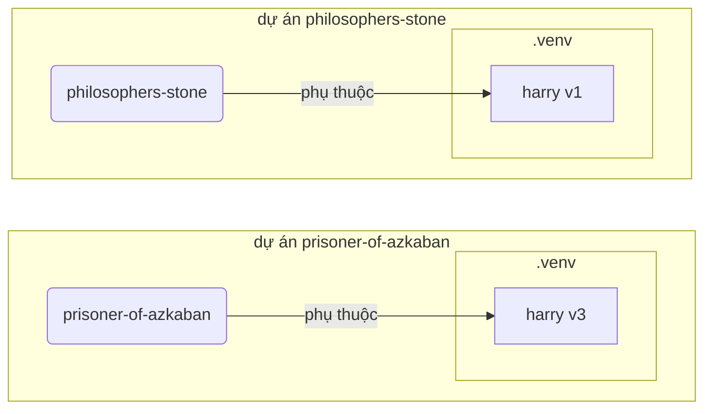

# Môi trường ảo (Virtual Environments)

Khi bạn làm việc trong các dự án Python, bạn có thể sử dụng một **môi trường ảo** (hoặc một cơ chế tương tự) để cách ly các gói bạn cài đặt cho mỗi dự án.

/// info
Nếu bạn đã biết về các môi trường ảo, cách tạo chúng và sử dụng chúng, bạn có thể bỏ qua phần này. 🤓

///

/// tip

Một **môi trường ảo** khác với một **biến môi trường (environment variable)**.

Một **biến môi trường** là một biến trong hệ thống có thể được sử dụng bởi các chương trình.

Một **môi trường ảo** là một thư mục với một số tệp trong đó.

///

/// info

Trang này sẽ hướng dẫn bạn cách sử dụng các **môi trường ảo** và cách chúng hoạt động.

Nếu bạn đã sẵn sàng sử dụng một **công cụ có thể quản lý tất cả mọi thứ** cho bạn (bao gồm cả việc cài đặt Python), hãy thử <a href="https://github.com/astral-sh/uv" class="external-link" target="_blank">uv</a>.

///

## Tạo một Dự án

Đầu tiên, tạo một thư mục cho dự án của bạn.

Cách tôi thường làm là tạo một thư mục có tên `code` trong thư mục `home/user`.

Và trong thư mục đó, tôi tạo một thư mục cho mỗi dự án.

<div class="termy">

```console
// Đi đến thư mục home
$ cd
// Tạo một thư mục cho tất cả các dự án của bạn
$ mkdir code
// Vào thư mục code
$ cd code
// Tạo một thư mục cho dự án này
$ mkdir awesome-project
// Vào thư mục dự án
$ cd awesome-project
```

</div>

## Tạo một Môi trường ảo

Khi bạn bắt đầu làm việc với một dự án Python **trong lần đầu**, hãy tạo một môi trường ảo **<abbr title="có nhiều cách thực hiện khác nhau, đây là một hướng dẫn đơn giản">trong thư mục dự án của bạn</abbr>**.

/// tip

Bạn cần làm điều này **một lần cho mỗi dự án**, không phải mỗi khi bạn làm việc.
///

//// tab | `venv`

Để tạo một môi trường ảo, bạn có thể sử dụng module `venv` có sẵn của Python.

<div class="termy">

```console
$ python -m venv .venv
```

</div>

/// details | Cách các lệnh hoạt động

* `python`: sử dụng chương trình `python`
* `-m`: gọi một module như một script, chúng ta sẽ nói về module đó sau
* `venv`: sử dụng module `venv` được cài đặt sẵn của Python
* `.venv`: tạo môi trường ảo trong thư mục mới `.venv`

///

////

//// tab | `uv`

Nếu bạn có <a href="https://github.com/astral-sh/uv" class="external-link" target="_blank">`uv`</a> được cài đặt, bạn có thể sử dụng nó để tạo một môi trường ảo.

<div class="termy">

```console
$ uv venv
```

</div>

/// tip

Mặc định, `uv` sẽ tạo một môi trường ảo trong một thư mục có tên `.venv`.

Nhưng bạn có thể tùy chỉnh nó bằng cách thêm một đối số với tên thư mục.

///

////

Lệnh này tạo một môi trường ảo mới trong một thư mục có tên `.venv`.

/// details | `.venv` hoặc tên khác

Bạn có thể tạo môi trường ảo trong một thư mục khác, nhưng thường người ta quy ước đặt nó là `.venv`.

///

## Kích hoạt Môi trường ảo

Kích hoạt môi trường ảo mới để bất kỳ lệnh Python nào bạn chạy hoặc gói nào bạn cài đặt sẽ sử dụng nó.

/// tip

Làm điều này **mỗi khi** bạn bắt đầu một **phiên terminal mới** để làm việc trên dự án.

///

//// tab | Linux, macOS

<div class="termy">

```console
$ source .venv/bin/activate
```

</div>

////

//// tab | Windows PowerShell

<div class="termy">

```console
$ .venv\Scripts\Activate.ps1
```

</div>

////

//// tab | Windows Bash

Nếu bạn sử dụng Bash cho Windows (ví dụ: <a href="https://gitforwindows.org/" class="external-link" target="_blank">Git Bash</a>):

<div class="termy">

```console
$ source .venv/Scripts/activate
```

</div>

////

/// tip

Mỗi khi bạn cài đặt thêm một **package mới** trong môi trường đó, hãy **kích hoạt** môi trường đó lại.

Điều này đảm bảo rằng khi bạn sử dụng một **chương trình dòng lệnh (<abbr title="command line interface">CLI</abbr>)** được cài đặt từ gói đó, bạn sẽ dùng bản cài đặt từ môi trường ảo của mình thay vì bản được cài đặt toàn cục khác có thể có phiên bản khác với phiên bản bạn cần.

///

## Kiểm tra xem Môi trường ảo đã được Kích hoạt chưa

Kiểm tra xem môi trường ảo đã được kích hoạt chưa (lệnh trước đó đã hoạt động).

/// tip

Điều này là **không bắt buộc**, nhưng nó là một cách tốt để **kiểm tra** rằng mọi thứ đang hoạt động như mong đợi và bạn đang sử dụng đúng môi trường ảo mà bạn đã định.

///

//// tab | Linux, macOS, Windows Bash

<div class="termy">

```console
$ which python

/home/user/code/awesome-project/.venv/bin/python
```

</div>

Nếu nó hiển thị `python` binary tại `.venv/bin/python`, trong dự án của bạn (trong trường hợp `awesome-project`), thì tức là nó hoạt động. 🎉

////

//// tab | Windows PowerShell

<div class="termy">

```console
$ Get-Command python

C:\Users\user\code\awesome-project\.venv\Scripts\python
```

</div>

Nếu nó hiển thị `python` binary tại `.venv\Scripts\python`, trong dự án của bạn (trong trường hợp `awesome-project`), thì tức là nó hoạt động. 🎉

////

## Nâng cấp `pip`

/// tip

Nếu bạn sử dụng <a href="https://github.com/astral-sh/uv" class="external-link" target="_blank">`uv`</a> bạn sử dụng nó để cài đặt thay vì `pip`, thì bạn không cần cập nhật `pip`. 😎

///

Nếu bạn sử dụng `pip` để cài đặt gói (nó được cài đặt mặc định với Python), bạn nên **nâng cấp** nó lên phiên bản mới nhất.

Nhiều lỗi khác nhau trong khi cài đặt gói được giải quyết chỉ bằng cách nâng cấp `pip` trước.

/// tip

Bạn thường làm điều này **một lần**, ngay sau khi bạn tạo môi trường ảo.

///

Đảm bảo rằng môi trường ảo đã được kích hoạt (với lệnh trên) và sau đó chạy:

<div class="termy">

```console
$ python -m pip install --upgrade pip

---> 100%
```

</div>

## Thêm `.gitignore`

Nếu bạn sử dụng **Git** (nên làm), hãy thêm một file `.gitignore` để Git bỏ qua mọi thứ trong `.venv`.

/// tip

Nếu bạn sử dụng <a href="https://github.com/astral-sh/uv" class="external-link" target="_blank">`uv`</a> để tạo môi trường ảo, nó đã tự động làm điều này cho bạn, bạn có thể bỏ qua bước này. 😎

///

/// tip

Làm điều này **một lần**, ngay sau khi bạn tạo môi trường ảo.

///

<div class="termy">

```console
$ echo "*" > .venv/.gitignore
```

</div>

/// details | Cách lệnh hoạt động

* `echo "*"`: sẽ "in" văn bản `*` trong terminal (phần tiếp theo sẽ thay đổi điều đó một chút)
* `>`: bất kỳ văn bản nào được in ra terminal bởi lệnh trước `>` không được in ra mà thay vào đó được viết vào file ở phía bên phải của `>`
* `.gitignore`: tên của file mà văn bản sẽ được viết vào

Và `*` với Git có nghĩa là "mọi thứ". Vì vậy, nó sẽ bỏ qua mọi thứ trong thư mục `.venv`.

Lệnh này sẽ tạo một file `.gitignore` với nội dung:

```gitignore
*
```

///

## Cài đặt gói (packages)

Sau khi kích hoạt môi trường, bạn có thể cài đặt các gói trong đó.

/// tip

Thực hiện điều này **một lần** khi cài đặt hoặc cập nhật gói cần thiết cho dự án của bạn.

Nếu bạn cần cập nhật phiên bản hoặc thêm một gói mới, bạn sẽ **thực hiện điều này lại**.

///

### Cài đặt gói trực tiếp

Nếu bạn cần cập nhật phiên bản hoặc thêm một gói mới, bạn sẽ **thực hiện điều này lại**.

/// tip
Để quản lý dự án tốt hơn, hãy liệt kê tất cả các gói và phiên bản cần thiết trong một file (ví dụ `requirements.txt` hoặc `pyproject.toml`).

///

//// tab | `pip`

<div class="termy">

```console
$ pip install "fastapi[standard]"

---> 100%
```

</div>

////

//// tab | `uv`

Nếu bạn có <a href="https://github.com/astral-sh/uv" class="external-link" target="_blank">`uv`</a>:

<div class="termy">

```console
$ uv pip install "fastapi[standard]"
---> 100%
```

</div>

////

### Cài đặt từ `requirements.txt`

Nếu bạn có một tệp `requirements.txt`, bạn có thể sử dụng nó để cài đặt các gói.

//// tab | `pip`

<div class="termy">

```console
$ pip install -r requirements.txt
---> 100%
```

</div>

////

//// tab | `uv`

Nếu bạn có <a href="https://github.com/astral-sh/uv" class="external-link" target="_blank">`uv`</a>:

<div class="termy">

```console
$ uv pip install -r requirements.txt
---> 100%
```

</div>

////

/// details | `requirements.txt`

Một tệp `requirements.txt` với một số gói sẽ trông như thế này:

```requirements.txt
fastapi[standard]==0.113.0
pydantic==2.8.0
```

///

## Chạy Chương trình của bạn

Sau khi kích hoạt môi trường ảo, bạn có thể chạy chương trình của mình, nó sẽ sử dụng Python trong môi trường ảo của bạn với các gói bạn đã cài đặt.

<div class="termy">

```console
$ python main.py

Hello World
```

</div>

## Cấu hình Trình soạn thảo của bạn

Nếu bạn sử dụng một trình soạn thảo, hãy đảm bảo bạn cấu hình nó để sử dụng cùng môi trường ảo mà bạn đã tạo (trình soạn thảo sẽ tự động phát hiện môi trường ảo) để bạn có thể nhận được tính năng tự động hoàn thành câu lệnh (autocomplete) và in lỗi trực tiếp trong trình soạn thảo (inline errors).

Ví dụ:

* <a href="https://code.visualstudio.com/docs/python/environments#_select-and-activate-an-environment" class="external-link" target="_blank">VS Code</a>
* <a href="https://www.jetbrains.com/help/pycharm/creating-virtual-environment.html" class="external-link" target="_blank">PyCharm</a>

/// tip

Bạn thường chỉ cần làm điều này **một lần**, khi bạn tạo môi trường ảo.

///

## Huỷ kích hoạt Môi trường ảo

Khi bạn hoàn tất việc làm trên dự án của bạn, bạn có thể **huỷ kích hoạt** môi trường ảo.

<div class="termy">

```console
$ deactivate
```

</div>

Như vậy, khi bạn chạy `python`, nó sẽ không chạy từ môi trường ảo đó với các gói đã cài đặt.

## Sẵn sàng để Làm việc

Bây giờ bạn đã sẵn sàng để làm việc trên dự án của mình rồi đấy.

/// tip

Bạn muốn hiểu tất cả những gì ở trên?

Tiếp tục đọc. 👇🤓

///

## Tại sao cần Môi trường ảo

Để làm việc với FastAPI, bạn cần cài đặt <a href="https://www.python.org/" class="external-link" target="_blank">Python</a>.

Sau đó, bạn sẽ cần **cài đặt** FastAPI và bất kỳ **gói** nào mà bạn muốn sử dụng.

Để cài đặt gói, bạn thường sử dụng lệnh `pip` có sẵn với Python (hoặc các phiên bản tương tự).

Tuy nhiên, nếu bạn sử dụng `pip` trực tiếp, các gói sẽ được cài đặt trong **môi trường Python toàn cục** của bạn (phần cài đặt toàn cục của Python).

### Vấn đề

Vậy, vấn đề gì khi cài đặt gói trong môi trường Python toàn cục?

Trong một vài thời điểm, bạn sẽ phải viết nhiều chương trình khác nhau phụ thuộc vào **các gói khác nhau**. Và một số dự án bạn thực hiện lại phụ thuộc vào **các phiên bản khác nhau** của cùng một gói. 😱

Ví dụ, bạn có thể tạo một dự án được gọi là `philosophers-stone`, chương trình này phụ thuộc vào một gói khác được gọi là **`harry`, sử dụng phiên bản `1`**. Vì vậy, bạn cần cài đặt `harry`.



Sau đó, vào một vài thời điểm sau, bạn tạo một dự án khác được gọi là `prisoner-of-azkaban`, và dự án này cũng phụ thuộc vào `harry`, nhưng dự án này cần **`harry` phiên bản `3`**.



Bây giờ, vấn đề là, nếu bạn cài đặt các gói toàn cục (trong môi trường toàn cục) thay vì trong một **môi trường ảo cục bộ**, bạn sẽ phải chọn phiên bản `harry` nào để cài đặt.

Nếu bạn muốn chạy `philosophers-stone` bạn sẽ cần phải cài đặt `harry` phiên bản `1`, ví dụ với:

<div class="termy">

```console
$ pip install "harry==1"
```

</div>

Và sau đó bạn sẽ có `harry` phiên bản `1` được cài đặt trong môi trường Python toàn cục của bạn.



Nhưng sau đó, nếu bạn muốn chạy `prisoner-of-azkaban`, bạn sẽ cần phải gỡ bỏ `harry` phiên bản `1` và cài đặt `harry` phiên bản `3` (hoặc chỉ cần cài đặt phiên bản `3` sẽ tự động gỡ bỏ phiên bản `1`).

<div class="termy">

```console
$ pip install "harry==3"
```

</div>

Và sau đó bạn sẽ có `harry` phiên bản `3` được cài đặt trong môi trường Python toàn cục của bạn.

Và nếu bạn cố gắng chạy `philosophers-stone` lại, có khả năng nó sẽ **không hoạt động** vì nó cần `harry` phiên bản `1`.



/// tip

Mặc dù các gói Python thường cố gắng **tránh các thay đổi làm hỏng code** trong **phiên bản mới**, nhưng để đảm bảo an toàn, bạn nên chủ động cài đặt phiên bản mới và chạy kiểm thử để xác nhận mọi thứ vẫn hoạt động đúng.

///

Bây giờ, hãy hình dung về **nhiều** gói khác nhau mà tất cả các dự án của bạn phụ thuộc vào. Rõ ràng rất khó để quản lý. Điều này dẫn tới việc là bạn sẽ có nhiều dự án với **các phiên bản không tương thích** của các gói, và bạn có thể không biết tại sao một số thứ không hoạt động.

Hơn nữa, tuỳ vào hệ điều hành của bạn (vd Linux, Windows, macOS), có thể đã có Python được cài đặt sẵn. Trong trường hợp ấy, một vài gói nhiều khả năng đã được cài đặt trước với các phiên bản **cần thiết cho hệ thống của bạn**. Nếu bạn cài đặt các gói trong môi trường Python toàn cục, bạn có thể sẽ **phá vỡ** một số chương trình đã được cài đặt sẵn cùng hệ thống.

## Nơi các Gói được Cài đặt

Khi bạn cài đặt Python, nó sẽ tạo ra một vài thư mục và tệp trong máy tính của bạn.

Một vài thư mục này là những thư mục chịu trách nhiệm có tất cả các gói bạn cài đặt.

Khi bạn chạy:

<div class="termy">

```console
// Đừng chạy lệnh này ngay, đây chỉ là một ví dụ 🤓
$ pip install "fastapi[standard]"
---> 100%
```

</div>

Lệnh này sẽ tải xuống một tệp nén với mã nguồn FastAPI, thường là từ <a href="https://pypi.org/project/fastapi/" class="external-link" target="_blank">PyPI</a>.

Nó cũng sẽ **tải xuống** các tệp cho các gói khác mà FastAPI phụ thuộc vào.

Sau đó, nó sẽ **giải nén** tất cả các tệp đó và đưa chúng vào một thư mục trong máy tính của bạn.

Mặc định, nó sẽ đưa các tệp đã tải xuống và giải nén vào thư mục được cài đặt cùng Python của bạn, đó là **môi trường toàn cục**.

## Những Môi trường ảo là gì?

Cách giải quyết cho vấn đề có tất cả các gói trong môi trường toàn cục là sử dụng một **môi trường ảo cho mỗi dự án** bạn làm việc.

Một môi trường ảo là một **thư mục**, rất giống với môi trường toàn cục, trong đó bạn có thể cài đặt các gói cho một dự án.

Vì vậy, mỗi dự án sẽ có một môi trường ảo riêng của nó (thư mục `.venv`) với các gói riêng của nó.



## Kích hoạt Môi trường ảo nghĩa là gì

Khi bạn kích hoạt một môi trường ảo, ví dụ với:

//// tab | Linux, macOS

<div class="termy">

```console
$ source .venv/bin/activate
```

</div>

////

//// tab | Windows PowerShell

<div class="termy">

```console
$ .venv\Scripts\Activate.ps1
```

</div>

////

//// tab | Windows Bash

Nếu bạn sử dụng Bash cho Windows (ví dụ <a href="https://gitforwindows.org/" class="external-link" target="_blank">Git Bash</a>):

<div class="termy">

```console
$ source .venv/Scripts/activate
```

</div>

////

Lệnh này sẽ tạo hoặc sửa đổi một số [biến môi trường](environment-variables.md){.internal-link target=_blank} mà sẽ được sử dụng cho các lệnh tiếp theo.

Một trong số đó là biến `PATH`.

/// tip

Bạn có thể tìm hiểu thêm về biến `PATH` trong [Biến môi trường](environment-variables.md#path-environment-variable){.internal-link target=_blank} section.

///

Kích hoạt môi trường ảo thêm đường dẫn `.venv/bin` (trên Linux và macOS) hoặc `.venv\Scripts` (trên Windows) vào biến `PATH`.

Giả sử rằng trước khi kích hoạt môi trường, biến `PATH` như sau:

//// tab | Linux, macOS

```plaintext
/usr/bin:/bin:/usr/sbin:/sbin
```

Nghĩa là hệ thống sẽ tìm kiếm chương trình trong:

* `/usr/bin`
* `/bin`
* `/usr/sbin`
* `/sbin`

////

//// tab | Windows

```plaintext
C:\Windows\System32
```

Nghĩa là hệ thống sẽ tìm kiếm chương trình trong:

* `C:\Windows\System32`

////

Sau khi kích hoạt môi trường ảo, biến `PATH` sẽ như sau:

//// tab | Linux, macOS

```plaintext
/home/user/code/awesome-project/.venv/bin:/usr/bin:/bin:/usr/sbin:/sbin
```

Nghĩa là hệ thống sẽ bắt đầu tìm kiếm chương trình trong:

```plaintext
/home/user/code/awesome-project/.venv/bin
```

trước khi tìm kiếm trong các thư mục khác.

Vì vậy, khi bạn gõ `python` trong terminal, hệ thống sẽ tìm thấy chương trình Python trong:

```plaintext
/home/user/code/awesome-project/.venv/bin/python
```

và sử dụng chương trình đó.

////

//// tab | Windows

```plaintext
C:\Users\user\code\awesome-project\.venv\Scripts;C:\Windows\System32
```

Nghĩa là hệ thống sẽ bắt đầu tìm kiếm chương trình trong:

```plaintext
C:\Users\user\code\awesome-project\.venv\Scripts
```

trước khi tìm kiếm trong các thư mục khác.

Vì vậy, khi bạn gõ `python` trong terminal, hệ thống sẽ tìm thấy chương trình Python trong:

```plaintext
C:\Users\user\code\awesome-project\.venv\Scripts\python
```

và sử dụng chương trình đó.

////

Một chi tiết quan trọng là nó sẽ đưa địa chỉ của môi trường ảo vào **đầu** của biến `PATH`. Hệ thống sẽ tìm kiếm nó **trước** khi tìm kiếm bất kỳ Python nào khác có sẵn. Vì vậy, khi bạn chạy `python`, nó sẽ sử dụng Python **từ môi trường ảo** thay vì bất kỳ Python nào khác (ví dụ, Python từ môi trường toàn cục).

Kích hoạt một môi trường ảo cũng thay đổi một vài thứ khác, nhưng đây là một trong những điều quan trọng nhất mà nó thực hiện.

## Kiểm tra một Môi trường ảo

Khi bạn kiểm tra một môi trường ảo đã được kích hoạt chưa, ví dụ với:

//// tab | Linux, macOS, Windows Bash

<div class="termy">

```console
$ which python

/home/user/code/awesome-project/.venv/bin/python
```

</div>

////

//// tab | Windows PowerShell

<div class="termy">

```console
$ Get-Command python

C:\Users\user\code\awesome-project\.venv\Scripts\python
```

</div>

////


Điều đó có nghĩa là chương trình `python` sẽ được sử dụng là chương trình **trong môi trường ảo**.

Bạn sử dụng `which` trên Linux và macOS và `Get-Command` trên Windows PowerShell.

Cách hoạt động của lệnh này là nó sẽ đi và kiểm tra biến `PATH`, đi qua **mỗi đường dẫn theo thứ tự**, tìm kiếm chương trình được gọi là `python`. Khi nó tìm thấy nó, nó sẽ **hiển thị cho bạn đường dẫn** đến chương trình đó.

Điều quan trọng nhất là khi bạn gọi `python`, đó chính là chương trình `python` được thực thi.

Vì vậy, bạn có thể xác nhận nếu bạn đang ở trong môi trường ảo đúng.

/// tip

Dễ dàng kích hoạt một môi trường ảo, cài đặt Python, và sau đó **chuyển đến một dự án khác**.

Và dự án thứ hai **sẽ không hoạt động** vì bạn đang sử dụng **Python không đúng**, từ một môi trường ảo cho một dự án khác.

Thật tiện lợi khi có thể kiểm tra `python` nào đang được sử dụng 🤓

///

## Tại sao lại Huỷ kích hoạt một Môi trường ảo

Ví dụ, bạn có thể làm việc trên một dự án `philosophers-stone`, **kích hoạt môi trường ảo**, cài đặt các gói và làm việc với môi trường ảo đó.

Sau đó, bạn muốn làm việc trên **dự án khác** `prisoner-of-azkaban`.

Bạn đi đến dự án đó:

<div class="termy">

```console
$ cd ~/code/prisoner-of-azkaban
```

</div>

Nếu bạn không tắt môi trường ảo cho `philosophers-stone`, khi bạn chạy `python` trong terminal, nó sẽ cố gắng sử dụng Python từ `philosophers-stone`.

<div class="termy">

```console
$ cd ~/code/prisoner-of-azkaban

$ python main.py

// Lỗi khi import sirius, nó không được cài đặt 😱
Traceback (most recent call last):
    File "main.py", line 1, in <module>
        import sirius
```

</div>

Nếu bạn huỷ kích hoạt môi trường ảo hiện tại và kích hoạt môi trường ảo mới cho `prisoner-of-azkaban`, khi bạn chạy `python`, nó sẽ sử dụng Python từ môi trường ảo trong `prisoner-of-azkaban`.

<div class="termy">

```console
$ cd ~/code/prisoner-of-azkaban

// Bạn không cần phải ở trong thư mục trước để huỷ kích hoạt, bạn có thể làm điều đó ở bất kỳ đâu, ngay cả sau khi đi đến dự án khác 😎
$ deactivate

// Kích hoạt môi trường ảo trong prisoner-of-azkaban/.venv 🚀
$ source .venv/bin/activate

// Bây giờ khi bạn chạy python, nó sẽ tìm thấy gói sirius được cài đặt trong môi trường ảo này ✨
$ python main.py

I solemnly swear 🐺

(Tôi long trọng thề 🐺 - câu này được lấy từ Harry Potter, chú thích của người dịch)
```

</div>

## Các cách làm tương tự

Đây là một hướng dẫn đơn giản để bạn có thể bắt đầu và hiểu cách mọi thứ hoạt động **bên trong**.

Có nhiều **cách khác nhau** để quản lí các môi trường ảo, các gói phụ thuộc (requirements), và các dự án.

Một khi bạn đã sẵn sàng và muốn sử dụng một công cụ để **quản lí cả dự án**, các gói phụ thuộc, các môi trường ảo, v.v. Tôi sẽ khuyên bạn nên thử <a href="https://github.com/astral-sh/uv" class="external-link" target="_blank">uv</a>.

`uv` có thể làm nhiều thứ, chẳng hạn:

* **Cài đặt Python** cho bạn, bao gồm nhiều phiên bản khác nhau
* Quản lí **các môi trường ảo** cho các dự án của bạn
* Cài đặt **các gói (packages)**
* Quản lí **các thành phần phụ thuộc và phiên bản** của các gói cho dự án của bạn
* Đảm bảo rằng bạn có một **tập hợp chính xác** các gói và phiên bản để cài đặt, bao gồm các thành phần phụ thuộc của chúng, để bạn có thể đảm bảo rằng bạn có thể chạy dự án của bạn trong sản xuất chính xác như trong máy tính của bạn trong khi phát triển, điều này được gọi là **locking**
* Và còn nhiều thứ khác nữa

## Kết luận

Nếu bạn đã đọc và hiểu hết những điều này, khá chắc là bây giờ bạn đã **biết nhiều hơn** về môi trường ảo so với kha khá lập trình viên khác đấy. 🤓

Những hiểu biết chi tiết này có thể sẽ hữu ích với bạn trong tương lai khi mà bạn cần gỡ lỗi một vài thứ phức tạp, và bạn đã có những hiểu biết về **ngọn ngành gốc rễ cách nó hoạt động**. 😎
