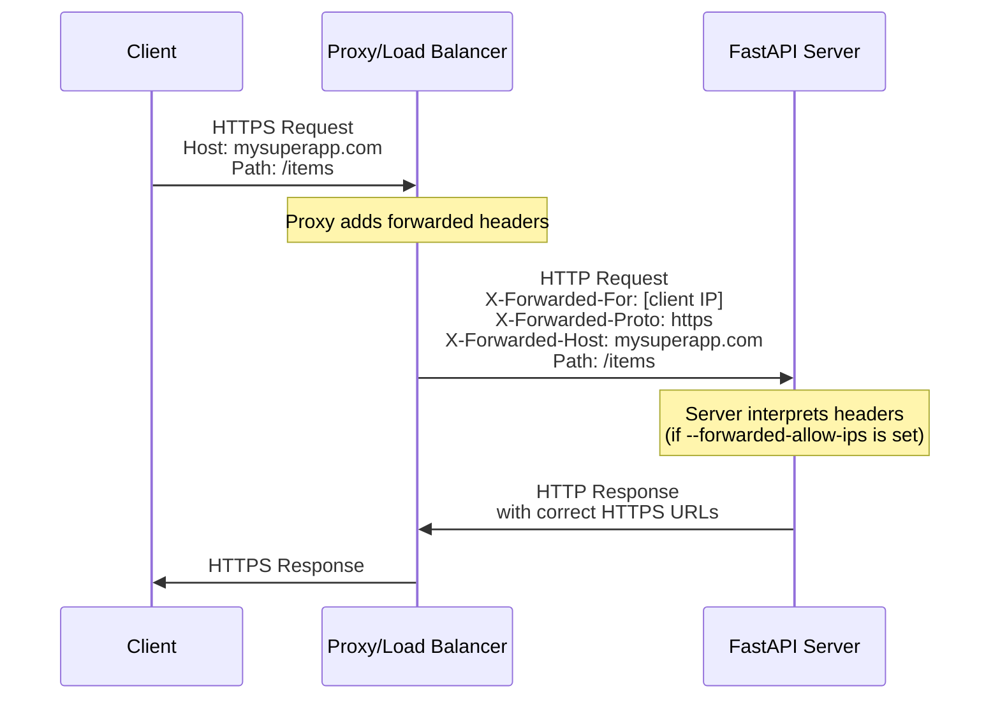
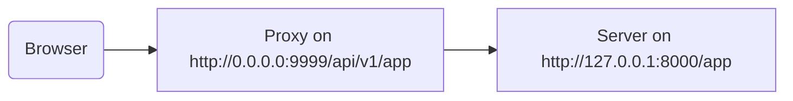

# 在代理之後 { #behind-a-proxy }

在許多情況下，你會在 FastAPI 應用前面放一個「代理」（proxy），例如 Traefik 或 Nginx。

這些代理可以處理 HTTPS 憑證等事務。

## 代理轉發標頭 { #proxy-forwarded-headers }

在你的應用前方的「代理」通常會在將請求送給你的「伺服器」之前，臨時加入一些標頭，讓伺服器知道這個請求是由代理「轉發」過來的，並告訴它原始（公開）的 URL，包括網域、是否使用 HTTPS 等。

「伺服器」程式（例如透過 FastAPI CLI 啟動的 Uvicorn）能夠解讀這些標頭，然後把該資訊傳遞給你的應用。

但出於安全考量，因為伺服器並不知道自己位於受信任的代理之後，所以它不會解讀那些標頭。

/// note | 技術細節

代理相關的標頭有：

* <a href="https://developer.mozilla.org/en-US/docs/Web/HTTP/Reference/Headers/X-Forwarded-For" class="external-link" target="_blank">X-Forwarded-For</a>
* <a href="https://developer.mozilla.org/en-US/docs/Web/HTTP/Reference/Headers/X-Forwarded-Proto" class="external-link" target="_blank">X-Forwarded-Proto</a>
* <a href="https://developer.mozilla.org/en-US/docs/Web/HTTP/Reference/Headers/X-Forwarded-Host" class="external-link" target="_blank">X-Forwarded-Host</a>

///

### 啟用代理轉發標頭 { #enable-proxy-forwarded-headers }

你可以在啟動 FastAPI CLI 時使用「CLI 選項」`--forwarded-allow-ips`，並傳入允許解析這些轉發標頭的受信任 IP 位址。

如果將其設為 `--forwarded-allow-ips="*"`，就會信任所有進來的 IP。

如果你的「伺服器」位於受信任的「代理」之後，且只有代理會與它通訊，這樣會讓它接受該「代理」的任何 IP。

<div class="termy">

```console
$ fastapi run --forwarded-allow-ips="*"

<span style="color: green;">INFO</span>:     Uvicorn running on http://127.0.0.1:8000 (Press CTRL+C to quit)
```

</div>

### 使用 HTTPS 的重新導向 { #redirects-with-https }

例如，假設你定義了一個「路徑操作（path operation）」`/items/`：

{* ../../docs_src/behind_a_proxy/tutorial001_01_py310.py hl[6] *}

如果用戶端嘗試前往 `/items`，預設會被重新導向到 `/items/`。

但在設定「CLI 選項」`--forwarded-allow-ips` 之前，它可能會被重新導向到 `http://localhost:8000/items/`。

不過，也許你的應用實際部署在 `https://mysuperapp.com`，那重新導向就應該是 `https://mysuperapp.com/items/`。

設定 `--proxy-headers` 之後，FastAPI 就能重新導向到正確的位置。😎

```
https://mysuperapp.com/items/
```

/// tip

如果你想了解更多 HTTPS 的內容，請參考指南［[關於 HTTPS](../deployment/https.md){.internal-link target=_blank}］。

///

### 代理轉發標頭如何運作 { #how-proxy-forwarded-headers-work }

以下是「代理」在用戶端與「應用伺服器」之間加入轉發標頭的視覺化示意：



「代理」會攔截原始用戶端請求，並在將其轉交給「應用伺服器」之前加入特殊的「轉發」標頭（`X-Forwarded-*`）。

這些標頭會保留原始請求中原本會遺失的資訊：

* X-Forwarded-For：原始用戶端的 IP 位址
* X-Forwarded-Proto：原始協定（`https`）
* X-Forwarded-Host：原始主機（`mysuperapp.com`）

當以 `--forwarded-allow-ips` 設定好 FastAPI CLI 後，它會信任並使用這些標頭，例如在重新導向時產生正確的 URL。

## 具有移除路徑前綴的代理 { #proxy-with-a-stripped-path-prefix }

你可能會有一個會為你的應用加入路徑前綴的代理。

在這些情況下，你可以使用 `root_path` 來設定你的應用。

`root_path` 是 ASGI 規格（FastAPI 透過 Starlette 所遵循的規格）所提供的機制。

`root_path` 用來處理這些特定情境。

在掛載子應用時，內部也會使用它。

這種「具有移除路徑前綴的代理」情況，代表你在程式碼中宣告了 `/app` 的路徑，但你在上面又加了一層（代理），把你的 FastAPI 應用放在像是 `/api/v1` 這樣的路徑底下。

在這種情況下，原本的 `/app` 路徑實際上會以 `/api/v1/app` 對外提供服務。

即使你的程式碼都是以只有 `/app` 為前提撰寫的。

{* ../../docs_src/behind_a_proxy/tutorial001_py310.py hl[6] *}

而代理會在把請求轉交給應用伺服器（多半是透過 FastAPI CLI 啟動的 Uvicorn）之前，動態地「移除」這個「路徑前綴」，讓你的應用仍然以為自己是在 `/app` 底下被提供，這樣你就不需要把整個程式碼都改成包含 `/api/v1` 這個前綴。

到目前為止，一切都會如常運作。

但是，當你打開整合的文件 UI（前端）時，它會預期在 `/openapi.json` 取得 OpenAPI 模式，而不是在 `/api/v1/openapi.json`。

因此，前端（在瀏覽器中執行）會嘗試存取 `/openapi.json`，但無法取得 OpenAPI 模式。

因為我們的應用前面有一個將路徑前綴設定為 `/api/v1` 的代理，所以前端需要從 `/api/v1/openapi.json` 取得 OpenAPI 模式。



/// tip

IP `0.0.0.0` 通常用來表示程式在該機器／伺服器上的所有可用 IP 上監聽。

///

文件 UI 也需要 OpenAPI 模式宣告此 API 的 `server` 位在 `/api/v1`（代理之後）。例如：

```JSON hl_lines="4-8"
{
    "openapi": "3.1.0",
    // 其他內容
    "servers": [
        {
            "url": "/api/v1"
        }
    ],
    "paths": {
            // 其他內容
    }
}
```

在這個例子中，「Proxy」可以是 **Traefik**。而伺服器可以是以 **Uvicorn** 啟動的 FastAPI CLI，運行你的 FastAPI 應用。

### 提供 `root_path` { #providing-the-root-path }

要達成這一點，你可以像這樣使用命令列選項 `--root-path`：

<div class="termy">

```console
$ fastapi run main.py --forwarded-allow-ips="*" --root-path /api/v1

<span style="color: green;">INFO</span>:     Uvicorn running on http://127.0.0.1:8000 (Press CTRL+C to quit)
```

</div>

如果你使用 Hypercorn，它也有 `--root-path` 這個選項。

/// note | 技術細節

ASGI 規格針對這種用例定義了 `root_path`。

而命令列選項 `--root-path` 就是提供該 `root_path`。

///

### 檢視目前的 `root_path` { #checking-the-current-root-path }

你可以在每個請求中取得應用使用的 `root_path`，它是 `scope` 字典的一部分（ASGI 規格的一部分）。

這裡我們把它放到回傳訊息中只是為了示範。

{* ../../docs_src/behind_a_proxy/tutorial001_py310.py hl[8] *}

接著，如果你用下列方式啟動 Uvicorn：

<div class="termy">

```console
$ fastapi run main.py --forwarded-allow-ips="*" --root-path /api/v1

<span style="color: green;">INFO</span>:     Uvicorn running on http://127.0.0.1:8000 (Press CTRL+C to quit)
```

</div>

回應會像是：

```JSON
{
    "message": "Hello World",
    "root_path": "/api/v1"
}
```

### 在 FastAPI 應用中設定 `root_path` { #setting-the-root-path-in-the-fastapi-app }

或者，如果你無法提供像 `--root-path` 這樣的命令列選項（或等效方式），你可以在建立 FastAPI 應用時設定 `root_path` 參數：

{* ../../docs_src/behind_a_proxy/tutorial002_py310.py hl[3] *}

把 `root_path` 傳給 `FastAPI` 等同於在 Uvicorn 或 Hypercorn 上使用命令列選項 `--root-path`。

### 關於 `root_path` { #about-root-path }

請記住，伺服器（Uvicorn）除了把 `root_path` 傳給應用之外，不會拿它做其他用途。

但如果你用瀏覽器前往 <a href="http://127.0.0.1:8000/app" class="external-link" target="_blank">http://127.0.0.1:8000/app</a>，你會看到一般的回應：

```JSON
{
    "message": "Hello World",
    "root_path": "/api/v1"
}
```

因此，它不會預期被以 `http://127.0.0.1:8000/api/v1/app` 的方式存取。

Uvicorn 會預期代理以 `http://127.0.0.1:8000/app` 來存取 Uvicorn，而由代理負責在上層加上額外的 `/api/v1` 前綴。

## 關於「移除路徑前綴」的代理 { #about-proxies-with-a-stripped-path-prefix }

請記住，具有「移除路徑前綴」的代理只是其中一種設定方式。

在許多情況下，預設可能是不移除路徑前綴。

在那種情況（沒有移除路徑前綴）下，代理會監聽像是 `https://myawesomeapp.com`，然後當瀏覽器前往 `https://myawesomeapp.com/api/v1/app`，而你的伺服器（例如 Uvicorn）在 `http://127.0.0.1:8000` 監聽時，該代理（不移除路徑前綴）就會以同樣的路徑去存取 Uvicorn：`http://127.0.0.1:8000/api/v1/app`。

## 在本機使用 Traefik 測試 { #testing-locally-with-traefik }

你可以很容易地用 <a href="https://docs.traefik.io/" class="external-link" target="_blank">Traefik</a> 在本機跑一個「移除路徑前綴」的測試。

<a href="https://github.com/containous/traefik/releases" class="external-link" target="_blank">下載 Traefik</a>，它是一個單一的執行檔，你可以解壓縮後直接在終端機執行。

然後建立一個 `traefik.toml` 檔案，內容如下：

```TOML hl_lines="3"
[entryPoints]
  [entryPoints.http]
    address = ":9999"

[providers]
  [providers.file]
    filename = "routes.toml"
```

這告訴 Traefik 監聽 9999 埠，並使用另一個檔案 `routes.toml`。

/// tip

我們使用 9999 埠而不是標準的 HTTP 80 埠，這樣你就不需要以管理員（`sudo`）權限來執行。

///

接著建立另一個 `routes.toml` 檔案：

```TOML hl_lines="5  12  20"
[http]
  [http.middlewares]

    [http.middlewares.api-stripprefix.stripPrefix]
      prefixes = ["/api/v1"]

  [http.routers]

    [http.routers.app-http]
      entryPoints = ["http"]
      service = "app"
      rule = "PathPrefix(`/api/v1`)"
      middlewares = ["api-stripprefix"]

  [http.services]

    [http.services.app]
      [http.services.app.loadBalancer]
        [[http.services.app.loadBalancer.servers]]
          url = "http://127.0.0.1:8000"
```

這個檔案把 Traefik 設定為使用 `/api/v1` 的路徑前綴。

然後 Traefik 會把它的請求轉發到在 `http://127.0.0.1:8000` 上運行的 Uvicorn。

現在啟動 Traefik：

<div class="termy">

```console
$ ./traefik --configFile=traefik.toml

INFO[0000] Configuration loaded from file: /home/user/awesomeapi/traefik.toml
```

</div>

然後啟動你的應用，使用 `--root-path` 選項：

<div class="termy">

```console
$ fastapi run main.py --forwarded-allow-ips="*" --root-path /api/v1

<span style="color: green;">INFO</span>:     Uvicorn running on http://127.0.0.1:8000 (Press CTRL+C to quit)
```

</div>

### 檢查回應 { #check-the-responses }

現在，如果你前往 Uvicorn 的埠：<a href="http://127.0.0.1:8000/app" class="external-link" target="_blank">http://127.0.0.1:8000/app</a>，你會看到一般的回應：

```JSON
{
    "message": "Hello World",
    "root_path": "/api/v1"
}
```

/// tip

注意，儘管你是用 `http://127.0.0.1:8000/app` 存取，它仍然顯示從 `--root-path` 選項取得的 `root_path` 為 `/api/v1`。

///

接著打開使用 Traefik 埠且包含路徑前綴的 URL：<a href="http://127.0.0.1:9999/api/v1/app" class="external-link" target="_blank">http://127.0.0.1:9999/api/v1/app</a>。

我們會得到相同的回應：

```JSON
{
    "message": "Hello World",
    "root_path": "/api/v1"
}
```

但這次是在由代理提供的、帶有前綴路徑的 URL：`/api/v1`。

當然，這裡的重點是大家都會透過代理來存取應用，所以帶有 `/api/v1` 路徑前綴的版本才是「正確」的。

而沒有路徑前綴的版本（`http://127.0.0.1:8000/app`），也就是直接由 Uvicorn 提供的，應該只給「代理」（Traefik）來存取。

這展示了代理（Traefik）如何使用路徑前綴，以及伺服器（Uvicorn）如何使用 `--root-path` 選項提供的 `root_path`。

### 檢查文件 UI { #check-the-docs-ui }

接下來是有趣的部分。✨

「正式」的存取方式應該是透過我們定義了路徑前綴的代理。因此，如我們預期，如果你直接透過 Uvicorn 供應的文件 UI、而 URL 中沒有該路徑前綴，那它不會運作，因為它預期要透過代理來存取。

你可以在 <a href="http://127.0.0.1:8000/docs" class="external-link" target="_blank">http://127.0.0.1:8000/docs</a> 檢查：


但如果我們改用「正式」的 URL，也就是使用埠號 `9999` 的代理、並在 `/api/v1/docs`，它就能正確運作了！🎉

你可以在 <a href="http://127.0.0.1:9999/api/v1/docs" class="external-link" target="_blank">http://127.0.0.1:9999/api/v1/docs</a> 檢查：


正如我們所希望的那樣。✔️

這是因為 FastAPI 使用這個 `root_path` 來在 OpenAPI 中建立預設的 `server`，其 URL 就是 `root_path` 所提供的值。

## 其他 servers { #additional-servers }

/// warning

這是更進階的用法。你可以選擇略過。

///

預設情況下，FastAPI 會在 OpenAPI 模式中建立一個 `server`，其 URL 為 `root_path`。

但你也可以另外提供其他 `servers`，例如你想要用「同一份」文件 UI 來與測試（staging）與正式（production）環境互動。

如果你傳入自訂的 `servers` 清單，且同時存在 `root_path`（因為你的 API 位於代理之後），FastAPI 會在清單開頭插入一個 `server`，其 URL 為該 `root_path`。

例如：

{* ../../docs_src/behind_a_proxy/tutorial003_py310.py hl[4:7] *}

將會產生如下的 OpenAPI 模式：

```JSON hl_lines="5-7"
{
    "openapi": "3.1.0",
    // 其他內容
    "servers": [
        {
            "url": "/api/v1"
        },
        {
            "url": "https://stag.example.com",
            "description": "Staging environment"
        },
        {
            "url": "https://prod.example.com",
            "description": "Production environment"
        }
    ],
    "paths": {
            // 其他內容
    }
}
```

/// tip

注意自動產生的 server，其 `url` 值為 `/api/v1`，取自 `root_path`。

///

在位於 <a href="http://127.0.0.1:9999/api/v1/docs" class="external-link" target="_blank">http://127.0.0.1:9999/api/v1/docs</a> 的文件 UI 中看起來會像這樣：


/// tip

文件 UI 會與你所選擇的 server 互動。

///

/// note | 技術細節

OpenAPI 規格中的 `servers` 屬性是可選的。

如果你沒有指定 `servers` 參數，且 `root_path` 等於 `/`，則在產生的 OpenAPI 模式中會完全省略 `servers` 屬性（預設行為），這等同於只有一個 `url` 值為 `/` 的 server。

///

### 停用從 `root_path` 自動加入的 server { #disable-automatic-server-from-root-path }

如果你不希望 FastAPI 使用 `root_path` 自動加入一個 server，你可以使用參數 `root_path_in_servers=False`：

{* ../../docs_src/behind_a_proxy/tutorial004_py310.py hl[9] *}

這樣它就不會被包含在 OpenAPI 模式中。

## 掛載子應用 { #mounting-a-sub-application }

如果你需要在同時使用具有 `root_path` 的代理時，掛載一個子應用（如［[子應用 - 掛載](sub-applications.md){.internal-link target=_blank}］中所述），可以像平常一樣操作，正如你所預期的那樣。

FastAPI 會在內部智慧地使用 `root_path`，所以一切都能順利運作。✨
