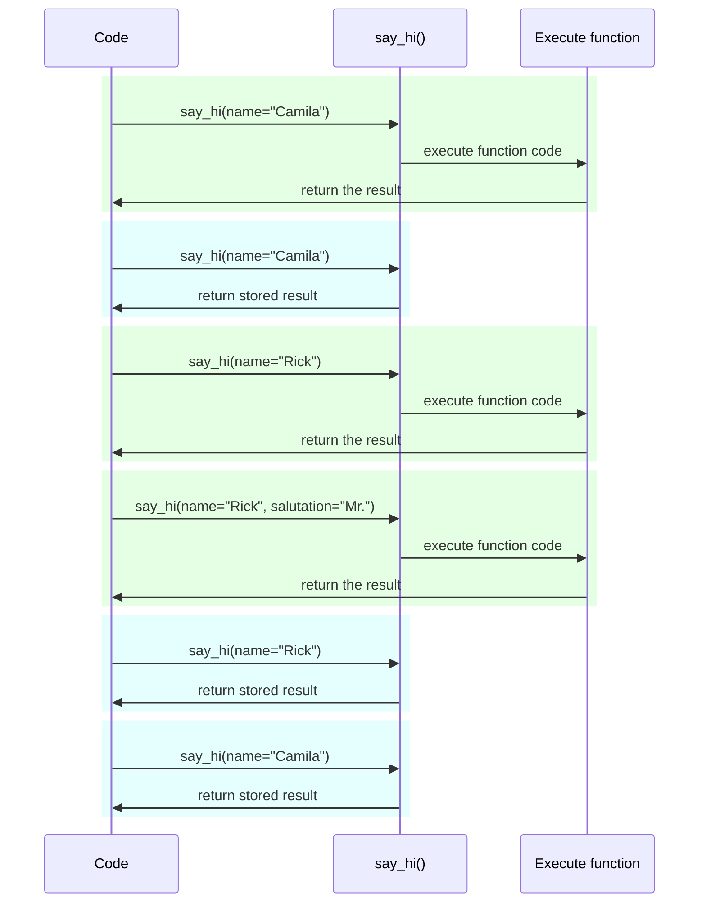

# 設定與環境變數 { #settings-and-environment-variables }

在許多情況下，你的應用程式可能需要一些外部設定或組態，例如密鑰、資料庫憑證、電子郵件服務的憑證等。

這些設定大多是可變的（可能會改變），像是資料庫 URL。也有許多可能是敏感資訊，例如密鑰。

因此，通常會透過環境變數提供這些設定，讓應用程式去讀取。

/// tip

若想了解環境變數，你可以閱讀[環境變數](../environment-variables.md){.internal-link target=_blank}。

///

## 型別與驗證 { #types-and-validation }

這些環境變數只能處理文字字串，因為它們在 Python 之外，必須與其他程式與系統的其餘部分相容（甚至跨作業系統，如 Linux、Windows、macOS）。

這表示在 Python 中自環境變數讀取到的任何值都會是 `str`，而任何轉型成其他型別或驗證都必須在程式碼中完成。

## Pydantic `Settings` { #pydantic-settings }

幸好，Pydantic 提供了很好的工具，可用來處理由環境變數而來的設定：<a href="https://docs.pydantic.dev/latest/concepts/pydantic_settings/" class="external-link" target="_blank">Pydantic：設定管理</a>。

### 安裝 `pydantic-settings` { #install-pydantic-settings }

首先，請先建立你的[虛擬環境](../virtual-environments.md){.internal-link target=_blank}，啟用它，然後安裝 `pydantic-settings` 套件：

<div class="termy">

```console
$ pip install pydantic-settings
---> 100%
```

</div>

當你用 `all` extras 安裝時，它也會一併包含在內：

<div class="termy">

```console
$ pip install "fastapi[all]"
---> 100%
```

</div>

### 建立 `Settings` 物件 { #create-the-settings-object }

從 Pydantic 匯入 `BaseSettings` 並建立子類別，與建立 Pydantic model 的方式非常類似。

就像使用 Pydantic model 一樣，你用型別註解宣告類別屬性，並可選擇性地提供預設值。

你可以使用與 Pydantic model 相同的所有驗證功能與工具，例如不同的資料型別與透過 `Field()` 進行額外驗證。

{* ../../docs_src/settings/tutorial001_py310.py hl[2,5:8,11] *}

/// tip

如果你想要可以直接複製貼上的範例，先別用這個，請改用本文最後一個範例。

///

接著，當你建立該 `Settings` 類別的實例（此處為 `settings` 物件）時，Pydantic 會以不區分大小寫的方式讀取環境變數，因此，即使環境變數是大寫的 `APP_NAME`，也會被讀入屬性 `app_name`。

然後它會轉換並驗證資料。因此，當你使用該 `settings` 物件時，你會得到你宣告的型別的資料（例如 `items_per_user` 會是 `int`）。

### 使用 `settings` { #use-the-settings }

接著你可以在應用程式中使用新的 `settings` 物件：

{* ../../docs_src/settings/tutorial001_py310.py hl[18:20] *}

### 執行伺服器 { #run-the-server }

接下來，你可以在啟動伺服器時，將設定以環境變數傳入。舉例來說，你可以設定 `ADMIN_EMAIL` 與 `APP_NAME`：

<div class="termy">

```console
$ ADMIN_EMAIL="deadpool@example.com" APP_NAME="ChimichangApp" fastapi run main.py

<span style="color: green;">INFO</span>:     Uvicorn running on http://127.0.0.1:8000 (Press CTRL+C to quit)
```

</div>

/// tip

要為單一指令設定多個環境變數，只要用空白分隔它們，並全部放在指令前面即可。

///

如此一來，`admin_email` 設定會被設為 `"deadpool@example.com"`。

`app_name` 會是 `"ChimichangApp"`。

而 `items_per_user` 則會保留其預設值 `50`。

## 在另一個模組中的設定 { #settings-in-another-module }

你也可以把這些設定放在另一個模組檔案中，就像在[更大的應用程式 - 多個檔案](../tutorial/bigger-applications.md){.internal-link target=_blank}所示。

例如，你可以有一個 `config.py` 檔案如下：

{* ../../docs_src/settings/app01_py310/config.py *}

然後在 `main.py` 檔案中使用它：

{* ../../docs_src/settings/app01_py310/main.py hl[3,11:13] *}

/// tip

你也需要一個 `__init__.py` 檔案，詳見[更大的應用程式 - 多個檔案](../tutorial/bigger-applications.md){.internal-link target=_blank}。

///

## 在相依中的設定 { #settings-in-a-dependency }

在某些情境中，從相依（dependency）提供設定，會比在各處使用一個全域的 `settings` 物件更有用。

這在測試時特別實用，因為你可以很容易用自訂的設定來覆寫一個相依。

### 設定檔 { #the-config-file }

延續前一個範例，你的 `config.py` 可以像這樣：

{* ../../docs_src/settings/app02_an_py310/config.py hl[10] *}

注意現在我們不再建立預設實例 `settings = Settings()`。

### 主應用程式檔案 { #the-main-app-file }

現在我們建立一個相依，回傳新的 `config.Settings()`。

{* ../../docs_src/settings/app02_an_py310/main.py hl[6,12:13] *}

/// tip

我們稍後會討論 `@lru_cache`。

現在你可以先把 `get_settings()` 視為一般函式。

///

接著我們可以在*路徑操作函式 (path operation function)* 中將它宣告為相依，並在需要的地方使用它。

{* ../../docs_src/settings/app02_an_py310/main.py hl[17,19:21] *}

### 設定與測試 { #settings-and-testing }

接著，在測試時要提供不同的設定物件會非常容易，只要為 `get_settings` 建立相依覆寫（dependency override）即可：

{* ../../docs_src/settings/app02_an_py310/test_main.py hl[9:10,13,21] *}

在相依覆寫中，我們在建立新的 `Settings` 物件時設定 `admin_email` 的新值，然後回傳該新物件。

接著我們就可以測試它是否被使用。

## 讀取 `.env` 檔 { #reading-a-env-file }

如果你有許多設定，而且在不同環境中可能常常變動，將它們放在一個檔案中，然後像讀取環境變數一樣自該檔案讀取，可能會很實用。

這種作法很常見，這些環境變數通常放在 `.env` 檔中，而該檔案被稱為「dotenv」。

/// tip

在類 Unix 系統（如 Linux 與 macOS）中，以點（`.`）開頭的檔案是隱藏檔。

但 dotenv 檔並不一定必須使用這個確切的檔名。

///

Pydantic 透過外部函式庫支援讀取這類型的檔案。你可以閱讀更多：<a href="https://docs.pydantic.dev/latest/concepts/pydantic_settings/#dotenv-env-support" class="external-link" target="_blank">Pydantic Settings：Dotenv (.env) 支援</a>。

/// tip

要讓這個功能運作，你需要 `pip install python-dotenv`。

///

### `.env` 檔 { #the-env-file }

你可以有一個 `.env` 檔如下：

```bash
ADMIN_EMAIL="deadpool@example.com"
APP_NAME="ChimichangApp"
```

### 從 `.env` 讀取設定 { #read-settings-from-env }

然後更新你的 `config.py`：

{* ../../docs_src/settings/app03_an_py310/config.py hl[9] *}

/// tip

`model_config` 屬性僅用於 Pydantic 的設定。你可以閱讀更多：<a href="https://docs.pydantic.dev/latest/concepts/config/" class="external-link" target="_blank">Pydantic：概念：設定</a>。

///

在這裡我們在 Pydantic 的 `Settings` 類別中定義設定 `env_file`，並將其值設為要使用的 dotenv 檔名。

### 使用 `lru_cache` 只建立一次 `Settings` { #creating-the-settings-only-once-with-lru-cache }

從磁碟讀取檔案通常是昂貴（慢）的操作，所以你可能希望只做一次，然後重複使用同一個設定物件，而不是在每個請求都讀取。

但每次我們這樣做：

```Python
Settings()
```

都會建立一個新的 `Settings` 物件，而且在建立時會再次讀取 `.env` 檔。

如果相依函式只是像這樣：

```Python
def get_settings():
    return Settings()
```

我們就會為每個請求建立該物件，並在每個請求都讀取 `.env` 檔。⚠️

但由於我們在上方使用了 `@lru_cache` 裝飾器，`Settings` 物件只會在第一次呼叫時建立一次。✔️

{* ../../docs_src/settings/app03_an_py310/main.py hl[1,11] *}

之後在下一批請求的相依中任何對 `get_settings()` 的呼叫，都不會再執行 `get_settings()` 的內部程式碼與建立新的 `Settings` 物件，而是會一再回傳第一次呼叫時回傳的同一個物件。

#### `lru_cache` 技術細節 { #lru-cache-technical-details }

`@lru_cache` 會修改它所裝飾的函式，使其回傳第一次回傳的相同值，而不是每次都重新計算、執行函式碼。

因此，被裝飾的函式對於每組參數組合只會執行一次。之後，凡是以完全相同參數組合呼叫時，都會重複使用先前對應的回傳值。

例如，如果你有一個函式：

```Python
@lru_cache
def say_hi(name: str, salutation: str = "Ms."):
    return f"Hello {salutation} {name}"
```

你的程式可能會這樣執行：



在我們的相依 `get_settings()` 這個案例中，該函式甚至不帶任何參數，因此它總是回傳相同的值。

如此一來，它的行為幾乎就像全域變數。但因為它使用相依函式，因此我們可以在測試時輕鬆將其覆寫。

`@lru_cache` 是 `functools` 的一部分，而 `functools` 是 Python 標準程式庫的一部分。你可以在<a href="https://docs.python.org/3/library/functools.html#functools.lru_cache" class="external-link" target="_blank">Python 文件中閱讀 `@lru_cache`</a> 以了解更多。

## 回顧 { #recap }

你可以使用 Pydantic Settings 來處理應用程式的設定或組態，並享有 Pydantic model 的全部能力。

- 透過相依可以讓測試更容易。
- 你可以搭配 `.env` 檔使用。
- 使用 `@lru_cache` 可以避免每個請求都重複讀取 dotenv 檔，同時仍可在測試時覆寫設定。
